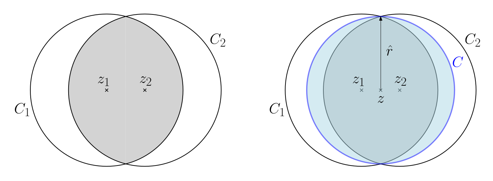

## Problemstellung und Grundlagen

- **SmallEnclDisk-Problem**:
    - Gegeben: Endliche Punktemenge $P \subset \mathbb{R}^2$ ($|P| \ge 3$).
    - Gesucht: **Kleinster umschliessender Kreis** $C(P)$ mit minimalem Radius.
- **Terminologie**:
    - **Umschliessen**: Alle Punkte von $P$ liegen innerhalb oder auf dem Rand der abgeschlossenen Kreisscheibe $C^\bullet$ (Formell: $P \subseteq C^\bullet$).
- **Existenz**: Mathematischer Fakt (ohne Beweis in Vorlesung).
- **Eindeutigkeit** [^lemma3.25]:
  
    - Der kleinste Kreis ist **strikt eindeutig**.
    - **Widerspruchsbeweis-Idee**:
        - Annahme: Zwei verschiedene kleinste Kreise $C_1, C_2$ mit gleichem Radius $r$ und Mittelpunkten $z_1 \neq z_2$.
        - Konstruktion eines neuen Kreises mit Mittelpunkt exakt zwischen $z_1$ und $z_2$.
        - Neuer Radius via Pythagoras: $\hat{r} = \sqrt{r^2 - (\frac{|z_1 z_2|}{2})^2}$.
        - Subtrahend strikt positiv $\implies \hat{r} < r$ (Widerspruch zur Minimalität von $C_1, C_2$).

## Das Zertifikat (Bestimmende Menge)

- **Zertifikat** [^lemma3.26]:
    - Für jede Menge $P$ definieren **exakt 3 Punkte** $Q \subseteq P$ den Kreis vollständig ($C(Q) = C(P)$).
- **Geometrische Intuition**:
    - 0 oder 1 Punkt auf Rand: Radius verkleinerbar (Mittelpunkt verschiebbar).
    - 2 Punkte auf Rand: Radius verkleinerbar, **ausser** exakt diagonal gegenüber.
    - 2 gegenüberliegende Punkte definieren Kreis: Ergänzung durch **beliebigen dritten Punkt** aus $P \implies$ konstant $|Q| = 3$.

## Deterministische Algorithmen

- **Zentrale Eigenschaft**: Radius von $C(Q)$ für $Q \subseteq P$ stets $\le$ Radius von $C(P)$.
- **Naiver Ansatz** ($O(n^4)$):
    - Iteration über alle $\binom{n}{3}$ Tripel ($O(n^3)$).
    - Berechnung $C(Q)$ in $O(1)$.
    - Inklusions-Prüfung aller $n$ Punkte aus $P$ ($O(n)$).
- **Smarter Ansatz** ($O(n^3)$):
    - Verzicht auf langsamen Inklusions-Check.
    - Speicherung des **Kreises mit global maximalem Radius**.
    - Echtes Zertifikat $Q^*$ zwingend enthalten und maximiert Radius $\implies$ Resultat automatisch $C(P)$.

## Randomisierte Algorithmen & Multiplicative Weights

- **Primitiver Randomisierter Algorithmus**:
    - Zufälliges $Q$ ($|Q|=3$) ziehen, Inklusion prüfen.
    - Erfolgswahrscheinlichkeit $\approx 1/n^3 \implies$ Erwartete Versuche $n^3 \implies$ Laufzeit $O(n^4)$.
    - **Erkenntnis**: Innere Punkte nutzlos. Punkte **ausserhalb** eines Fehlversuchs extrem wichtig.
- **Cleverer Algorithmus & Multiplicative Weights**:
    - **Multiplicative Weights (Zentrale Technik)**: Algorithmus fokussiert Fehlerquellen durch multiplikative Gewichtserhöhung.
    - **Ablauf**:
        1. $P$ als Multimenge $P'$ (Startgewicht 1 pro Punkt).
        2. Zufälliges $Q \subseteq P'$ ($|Q| = 11$) ziehen (Konstante für Wachstums-Balance).
        3. Falls $P \subseteq C^\bullet(Q) \implies$ Terminierung.
        4. Sonst: **Gewicht (Multiplizität) verdoppeln** für alle Punkte ausserhalb $C^\bullet(Q)$. Wiederholung.
- **Effiziente $O(n)$ Implementierung**:
    - Verbot: Explizite Liste (Laufzeit-/Speicherexplosion).
    - Erlaubt: Array der Originalpunkte plus **Gewichts-Array**.
    - **Gleichverteiltes Ziehen** [^lemma3.27]: Generierung einer Zufallszahl im Gesamtsummen-Bereich. Element-Identifikation via **Präfix-Summen** (Prefix Sums) in $O(n)$.
    - **Verdoppeln**: Multiplikation des Array-Eintrags mit 2 bei "ausserhalb".

## Theoretische Analyse

Rundenanzahl $k$ beschränkt durch gegensätzliche Entwicklung des Gesamtgewichts $N$ von $P'$:

- **Kraft 1: Starkes Wachstum (Zertifikat-Fokus)**:
    - Pro Nicht-Terminierungs-Runde zwingend **mindestens einer** der 3 wahren Zertifikatspunkte ausserhalb.
    - Nach $k$ Runden mindestens ein Zertifikatspunkt minimal $k/3$ Mal verdoppelt.
    - Minimales Elementgewicht (und damit Gesamtgewicht $|P'|$) zwingend **$\ge 2^{k/3}$** (bzw. $\approx 1.2599^k$).
- **Kraft 2: Gedämpftes Gesamtwachstum**:
    - Nach Sampling Lemma [^lemma3.28] ($r=11$) erwartetes Gesamt-Wachstum max. Faktor $\frac{5}{4}$ ($1 + \frac{3}{12}$).
    - Erwartete Gesamtgrösse nach $k$ Runden: **$\mathbb{E}[|P'|] \le (\frac{5}{4})^k \cdot n = 1.25^k \cdot n$**.
- **Der Konflikt (Terminierung)**:
    - Obergrenze $(1.25^k \cdot n)$ tritt gegen Untergrenze $(\sqrt[3]{2}^k \approx 1.2599^k)$ an.
    - Minimalwachstum der Ausreisser (Faktor $1.2599$) übersteigt erwartetes Gesamtwachstum (Faktor $1.25$) $\implies$ Algorithmus **muss** rasch terminieren.

## Das Sampling Lemma

- **Konzept**: Formelle Analyse erwarteter Fehler bei zufälligen Stichproben.
- **Element-Typen** [^def3.30]:
    - **Verletzer** (Violators) $V(R)$: Hinzunahme zu Stichprobe ändert Resultat (Bsp: Punkte ausserhalb des Kreises).
    - **Extreme Elemente** $X(R)$: Weglassen aus Stichprobe ändert Resultat (Bsp: Zertifikatspunkte).
- **Allgemeines Lemma** [^lemma3.31]:
    - Relation zwischen erwarteten Verletzern $v_r$ und extremen Elementen $x_{r+1}$: **$\frac{v_r}{n-r} = \frac{x_{r+1}}{r+1}$**.
    - **Beweis-Idee**: Konstruktion eines bipartiten Graphen zwischen Stichproben der Grösse $r$ und $r+1$. Kanten bei Resultatsänderung durch Hinzufügen. Doppeltes Zählen der Kanten (via Durchschnittsgrad) beweist Identität.
- **Anwendungen**:
    - **Auf Kreise** [^lemma3.28]: Max. 3 Zertifikatspunkte ($|X(R)| \le 3$) $\implies$ Erwartete Verletzer (Punkte ausserhalb) $\le 3 \frac{n-r}{r+1}$.
    - **Auf Minimumsuche** [^cor3.32]: $r$ aus $n$ Zahlen ziehen. Exakt 1 absolutes Minimum definiert Resultat ($|X(R)| = 1$). Erwartete Verletzer (Zahlen strikt kleiner als Stichproben-Minimum) $\implies 1 \cdot \frac{n-r}{r+1}$. Erwarteter Rang in sortierter Liste ist Verletzer $+ 1 \implies \frac{n+1}{r+1}$.

## Laufzeit und Verallgemeinerung

- **Erwartete Laufzeit** [^thm3.29]:
    - Gesamtlaufzeit erwartet **$O(n \log n)$**.
    - **Beweis-Trick via Wahrscheinlichkeits-Schwellenwert**:
        - Aus Kräfte-Konflikt ($1.25 / \sqrt[3]{2}$) folgt exponentieller Wahrscheinlichkeits-Abfall für späte Runden: $P[T \ge k] \le 0.993^k \cdot n$.
        - Aufteilen der erwarteten Runden $\mathbb{E}[T] = \sum P[T \ge k]$ bei Schwelle $k_0 = \lfloor -\log_{0.993} n \rfloor$.
        - Bis $k_0$ (entspricht $O(\log n)$): Abschätzung mit trivialer Wahrscheinlichkeit $1 \implies$ liefert $O(\log n)$.
        - Ab $k_0$: Geometrische Reihe $0.993^k$ konvergiert $\implies$ liefert $O(1)$.
        - Total $O(\log n)$ Runden à $O(n)$ Implementierungsaufwand $\implies O(n \log n)$.
- **Verallgemeinerung (Bootstrapping / Höhere Dimensionen)**:
    - Algorithmus (Clarkson '95) funktioniert für kleinste Kugeln/Ellipsoide in **jeder festen Dimension $d$**.
    - Stichprobengrösse (hier $r=11$) muss entsprechend der Dimension $d$ erhöht werden.
    - Laufzeit für fixes $d$ bleibt $O(n \log n)$.

[^lemma3.25]: Lemma 3.25. Für jede (endliche) Punktemenge $P$ im $\mathbb{R}^2$ gibt es einen eindeutigen kleinsten umschliessenden Kreis $C(P)$.
[^lemma3.26]: Lemma 3.26. Für jede (endliche) Punktemenge $P$ im $\mathbb{R}^2$ mit $|P| \ge 3$ gibt es eine Teilmenge $Q \subseteq P$, so dass $|Q| = 3$ und $C(Q) = C(P)$.
[^lemma3.27]: Lemma 3.27. Seien $n_1, \dots, n_t$ natürliche Zahlen und $N := \sum_{i=1}^t n_i$. Wir erzeugen $X \in \{1, \dots, t\}$ zufällig wie folgt: $k \leftarrow \text{UniformInt}(1, N)$, $x \leftarrow 1$, $\text{while } \sum_{i=1}^x n_i < k \text{ do } x \leftarrow x + 1$, $\text{return } x$. Dann gilt $\Pr[X = i] = n_i/N$ für alle $i = 1, \dots, t$.
[^lemma3.28]: Lemma 3.28. Sei $P$ eine Menge von $n$ (nicht unbedingt verschiedenen) Punkten und für $r \in \mathbb{N}$, $R$ zufällig gleichverteilt aus $\binom{P}{r}$. Dann ist die erwartete Anzahl Punkte von $P$, die ausserhalb von $C(R)$ liegen, höchstens $3\frac{n-r}{r+1} \le 3\frac{n}{r+1}$.
[^def3.30]: Definition 3.30. Gegeben sei eine endliche Menge $S$, $n := |S|$, und $\phi$ eine beliebige Funktion auf $2^S$ in einen beliebigen Wertebereich. Wir definieren $V(R) = V_\phi(R) := \{s \in S \mid \phi(R \cup \{s\}) \neq \phi(R)\}$ und $X(R) = X_\phi(R) := \{s \in R \mid \phi(R \setminus \{s\}) \neq \phi(R)\}$. Elemente in $V(R)$ nennen wir Verletzer von $R$, Elemente in $X(R)$ nennen wir extrem in $R$.
[^lemma3.31]: Lemma 3.31 (Sampling Lemma). Sei $k \in \mathbb{N}$, $0 \le k \le n$. Wir setzen $v_k := \mathbb{E}[|V(R)|]$ und $x_k := \mathbb{E}[|X(R)|]$, wobei $R$ eine $k$-elementige Teilmenge von $S$ ist, zufällig gleichverteilt aus $\binom{S}{k}$. Dann gilt für $r \in \mathbb{N}$, $0 \le r < n$, $\frac{v_r}{n - r} = \frac{x_{r+1}}{r + 1}$.
[^cor3.32]: Korollar 3.32. Wählen wir $r$ Elemente $R$ aus einer Menge $A$ von $n$ Zahlen zufällig, dann ist der erwartete Rang des Minimums von $R$ in $A$ genau $\frac{n-r}{r+1} + 1 = \frac{n+1}{r+1}$. Wählen wir $r$ Punkte $R$ aus einer Menge $P$ von $n$ Punkten in der Ebene zufällig, dann ist die erwartete Anzahl von Punkten aus $P$ ausserhalb von $C(R)$ höchstens $3\frac{n-r}{r+1}$.
[^thm3.29]: Satz 3.29. Algorithmus Randomized_CleverVersion berechnet den kleinsten umschliessenden Kreis von $P$ in erwarteter Zeit $O(n \log n)$.
