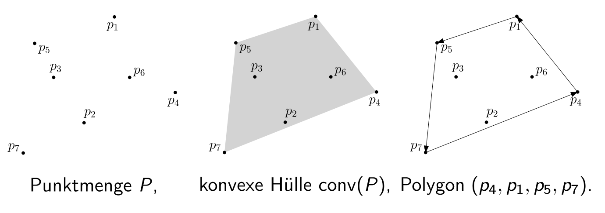
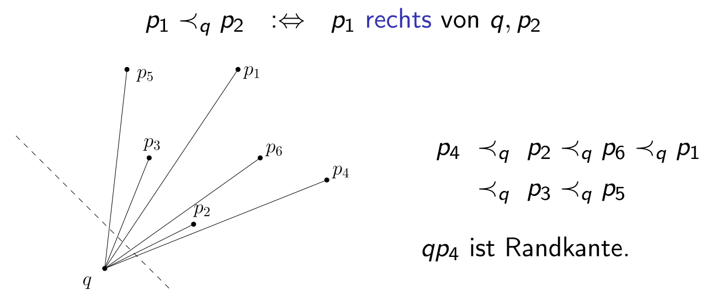
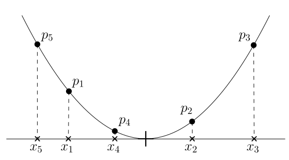
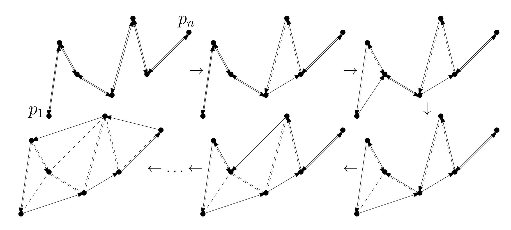

## Grundkonzepte der Algorithmischen Geometrie

- **Bedeutung in der Informatik**: **Konvexe Lösungsmenge** $\implies$ Problem in der Regel effizient lösbar.
- **Konvexe Menge** (Convex Set): Menge $C$, die für jedes Punktepaar das komplette verbindende Liniensegment beinhaltet.
    - Mathematisch: Für Vektoren $v_0, v_1 \in C$ liegt Segment $\overline{v_0 v_1} = \{(1-\lambda)v_0 + \lambda v_1 \mid \lambda \in [0, 1]\}$ komplett in $C$.
- **Konvexe Hülle** (Convex Hull) $\text{conv}(S)$: Kleinste konvexe Menge um Punktemenge $S$ [^def3.33].
    - **Anschauliche Analogie**: Wie ein **Gummiband**, das sich um eingeschlagene Nägel spannt.
    - Äquivalent: Schnitt aller $S$ enthaltenden Halbebenen.
- **Allgemeine Lage** (General Position): Vereinfachende Standardannahme für theoretische Beweise.
    - Keine drei Punkte auf gemeinsamer Geraden.
    - Keine zwei Punkte mit gleicher x-Koordinate.

## Darstellung und Orientierungstest

- **Polygondarstellung**: Konvexe Hülle von $P$ in $\mathbb{R}^2$ als **Eckenfolge** $(q_0, q_1, \dots, q_{h-1})$ gegen den Uhrzeigersinn (CCW) repräsentiert. (Startpunkt beliebig wählbar).
- **Randkante** (Boundary Edge): Gerichtetes Kantenpaar $qr$, falls alle restlichen Punkte $P \setminus \{q, r\}$ strikt **links** liegen [^lemma3.34].
- **Orientierungstest**: Prüfung via **Determinante**, ob Punkt $p$ links von gerichteter Kante $qr$ liegt [^lemma3.35].
    - Berechnet vorzeichenbehaftete Fläche des aufgespannten Parallelogramms.
    - **Ursprungsverschiebung**: Wäre $q$ der Ursprung $o=(0,0)$, berechnet sich die Fläche aus $r$ und $p$ als $\det(r,p) = r_x p_y - p_x r_y$.
    - **Allgemein**: Verschiebung des Punktes $q$ in den Ursprung ($p \to p-q$, $r \to r-q$).
    - Formel: $\det(p, q, r) > 0 \iff (q_x - p_x)(r_y - p_y) > (q_y - p_y)(r_x - p_x)$ $\implies$ "$p$ liegt links".
    - Laufzeit pro Test: $\mathcal{O}(1)$.

## Jarvis Wrap (Einwicklungs-Algorithmus)

- **Grundidee**: Geometrisches "Einwickeln" der Punkte.
    - Startpunkt $q_0$: Punkt mit **kleinster x-Koordinate** (liegt zwingend auf Hülle).
    - Iteration: Nächsten Punkt $q_{next}$ finden, sodass alle anderen Punkte links der Kante $q_{aktuell} \to q_{next}$ liegen.
- **Totale Ordnung $\prec_q$**: Relation "liegt rechts von" erzeugt totale Ordnung um Eckpunkt $q$ [^lemma3.36].
    - **Zyklenfreiheit**: Gilt ausschliesslich, weil $q$ ein Eckpunkt der Hülle ist. Alle restlichen Punkte liegen dadurch zwingend in derselben Halbebene bezüglich $q$ (verhindert Zyklen).
    - Algorithmus sucht als $q_{next}$ schlicht das "Minimum" dieser Ordnung (den am weitesten rechts liegenden Punkt).
- **Laufzeit & Eigenschaften** [^satz3.37]:
    - Laufzeit: $\mathcal{O}(nh)$ ($h$ = tatsächliche Anzahl Hüllen-Ecken).
    - **Output-sensitive Laufzeit**: Sehr schnell bei wenig Ecken ($\mathcal{O}(n)$ bei z.B. Dreieck), maximal $\mathcal{O}(n^2)$ im Worst-Case ($h = n$).
- **Erwartete Ecken $h$** (bei zufälligen Punkten):
    - Gleichverteilt in Quadrat: $\mathcal{O}(\log n)$.
    - Gleichverteilt in Kreisscheibe: $\mathcal{O}(\sqrt[3]{n})$.

## Implementierungsdetails in der Praxis

- Theoretische "Allgemeine Lage" muss in realer Software zwingend abgefangen werden.
- **Behandlung von Degeneriertheiten**:
    - **Gleiche Koordinaten**: Startpunkt lexikographisch wählen (zuerst nach kleinstem $x$, bei Gleichheit nach kleinstem $y$).
    - **Kollinearitäten**: Testbedingung anpassen. Punkt akzeptieren, falls er links liegt *oder* auf der gleichen Geraden, aber weiter entfernt liegt ($|qp| > |qq_{next}|$).
- **Numerische Probleme**:
    - **Floats** (Fliesskommazahlen) erzeugen beim Determinanten-Test Rundungsfehler.
    - **Katastrophaler Fehler**: Algorithmus verfehlt Startpunkt und läuft endlos weiter (**Endlosschleife**).
    - **Lösung**: Zwingende Nutzung exakter Datentypen (Integer, rationale Zahlen) für Test.

## Untere Schranke für das ConvexHull-Problem

- **Erkenntnis**: Konvexe Hülle berechnen ist mindestens so schwer wie Elemente sortieren $\implies \Omega(n \log n)$.
- **Reduktionsbeweis** (via **Einheitsparabel**):
    - Zahlenfolge $x_1, \dots, x_n$ als 2D-Punkte abbilden: $p_i = (x_i, x_i^2)$.
    - Parabel ist streng konvex $\implies$ **alle** Punkte liegen zwingend auf konvexer Hülle.
    - Hüllen-Berechnung liefert Punkte in linearer Zeit in geometrischer Folge $\implies$ entspricht exakt der sortierten Folge der $x$-Werte.
    - Widerspruch: Wäre ConvexHull schneller als $\mathcal{O}(n \log n)$, wäre auch Sortieren schneller.

## Ebene Graphen und Triangulierungen

- **Ebene Graphen** (Planar Graphs): Graph $G=(P, E)$, kreuzungsfrei gezeichnet (Kanten berühren sich nur in Endpunkten).
    - Kanten unterteilen die $\mathbb{R}^2$-Ebene in zusammenhängende Flächen, genannt **Gebiete** (Faces) [^def3.38].
    - Exakt ein unbeschränktes **äusseres Gebiet** (alles ausserhalb der Graphen-Hülle).
- **Euler Relation** (Eulersche Polyederformel): Gilt für jeden ebenen Graphen [^lemma3.40]:
    - Formel: $v - e + f = 1 + c$ (Knoten $v$ - Kanten $e$ + Gebiete $f$ = $1$ + Komponenten $c$).
    - **Intuition**: Bei einem konvexen 3D-Körper (z.B. Würfel, $c=1$) gilt immer $v - e + f = 2$. Das Entfernen einer Kante verschmilzt entweder zwei Gebiete oder spaltet eine Komponente auf $\implies$ Gleichung bleibt stets im Gleichgewicht.
- **Triangulierung**: Maximaler ebener Graph (keine weitere Kante kreuzungsfrei hinzufügbar).
    - Alle inneren Gebiete sind strikt **Dreiecke** [^def3.38].
    - Besitzt exakt $3n - 3 - h$ Kanten und $2n - 2 - h$ innere Gebiete ($h$ = Hüllen-Ecken) [^kor3.41].
    - **Beweismethode**: Jedes innere Gebiet hat 3 Kanten, das äussere Gebiet $h$ Kanten. Da jede Kante an exakt 2 Gebiete grenzt, gilt $2e = 3(f_{innen}) + h$. Einsetzen in umgeformte Euler Relation ($f = 2 - v + e$) löst Gleichungssystem nach $e$ und $f$ auf.
    - Triangulierungen sind folglich **dünne Graphen** ($\mathcal{O}(n)$ Kanten).

## LocalRepair (Lokales Verbessern Algorithmus)

- **Motivation**: Optimaler $\mathcal{O}(n \log n)$ Algorithmus, numerisch robuster als JarvisWrap.
- **Lokale Bedingung**:
    - Behebt Defizite (Selbstüberschneidung, ausgelassene Punkte) durch reine Winkelprüfung.
    - Polygon ist konvexe Hülle $\iff$ für jedes Triplet liegt $q_{i+1}$ strikt links von Kante $q_{i-1}q_i$.
- **Algorithmus Ablauf** (Sweep-Ansatz):
    1. **Vorsortieren**: Punkte nach x-Koordinate sortieren ($\mathcal{O}(n \log n)$).
    2. **Startpolygon**: Impliziter Zick-Zack-Pfad ("links-rechts-links") von $p_1$ bis $p_n$ und zurück.
    3. **Untere Hülle (Sweep vorwärts)**: Von links nach rechts. Neuen Punkt anfügen. Rückwärts prüfen: Falls lokale Bedingung verletzt (Rechtskurve) $\implies$ vorherigen Punkt löschen (**Shortcut** bilden). Schleife rückwärts wiederholen, bis Bedingung erfüllt (Linkskurve).
    4. **Obere Hülle (Sweep rückwärts)**: Analog von $p_n$ zurück zu $p_1$.
- **Zentrale Invarianten** während Sweep:
    - Polygonzüge bleiben strikt x-monoton.
    - Kein Punkt liegt "ausserhalb" des aufgespannten Teilpolygons.
    - Polygon kreuzt sich niemals selbst.
- **Leistungsanalyse** [^satz3.42]:
    - Pro Punkt maximal ein Hinzufügen und ein permanentes Löschen.
    - Exakt $2n - 2 - h$ erfolgreiche Löschungen ("Shortcuts"). Jede spaltet ein neues inneres Dreieck ab [^lemma3.39].
    - Aufwand Sweep-Phase: $\mathcal{O}(n)$.
    - Gesamtlaufzeit dominiert durch Sortieren $\implies \mathcal{O}(n \log n)$ (asymptotisch optimal).
    - **Zusatznutzen**: Produziert automatisch eine Triangulierung als "Abfallprodukt" der Löschvorgänge.

[^def3.33]: Definition 3.33. Sei $S \subseteq \mathbb{R}^d, d \in \mathbb{N}$. Die konvexe Hülle, $\text{conv}(S)$, von $S$ ist der Schnitt aller konvexen Mengen, die $S$ enthalten, d.h. $\text{conv}(S) := \bigcap_{S \subseteq C \subseteq \mathbb{R}^d, C \text{ konvex}} C$.
[^lemma3.34]: Lemma 3.34. $(q_0, q_1, \dots, q_{h-1})$ ist die Eckenfolge des $\text{conv}(P)$ umschliessenden Polygons gegen den Uhrzeigersinn genau dann, wenn alle Paare $(q_{i-1}, q_i), i = 1, 2, \dots, h$, Randkanten von $P$ sind.
[^lemma3.35]: Lemma 3.35. Seien $p = (p_x, p_y), q = (q_x, q_y)$, und $r = (r_x, r_y)$ Punkte in $\mathbb{R}^2$. Es gilt $q \neq r$ und $p$ liegt links von $qr$ genau dann, wenn $\det(p, q, r) := \begin{vmatrix} p_x & p_y & 1 \\ q_x & q_y & 1 \\ r_x & r_y & 1 \end{vmatrix} = \begin{vmatrix} q_x - p_x & q_y - p_y \\ r_x - p_x & r_y - p_y \end{vmatrix} > 0 \iff (q_x - p_x)(r_y - p_y) > (q_y - p_y)(r_x - p_x)$.
[^lemma3.36]: Lemma 3.36. Ist $q$ eine Ecke der konvexen Hülle von $P$, so ist die Relation $\prec_q$ eine totale Ordnung auf $P \setminus \{q\}$. Für das Minimum $p_{\min}$ dieser Ordnung gilt, dass $q p_{\min}$ eine Randkante ist.
[^satz3.37]: Satz 3.37. Gegeben eine Menge $P$ von $n$ Punkten in allgemeiner Lage in $\mathbb{R}^2$, berechnet der Algorithmus $\text{JARVISWRAP}$ die konvexe Hülle in Zeit $\mathcal{O}(nh)$, wobei $h$ die Anzahl der Ecken der konvexen Hülle von $P$ ist.
[^def3.38]: Definition 3.38. Ein Graph $G = (P, E)$ auf $P$ heisst eben, wenn sich die Segmente $pq := \text{conv}(\{p, q\})$ der Kanten $\{p, q\} \in E$ höchstens in ihren jeweils gemeinsamen Endpunkten schneiden. Entfernen wir die Segmente $pq, \{p, q\} \in E$, aus $\mathbb{R}^2$, so nennen wir die entstehenden zusammenhängenden Gebiete die Gebiete von $G$. Die beschränkten Gebiete nennen wir innere Gebiete, das unbeschränkte (unendliche) Gebiet das äussere Gebiet. Ein Graph $T = (P, E)$ auf $P$ heisst Triangulierung von $P$, falls $T$ eben ist und maximal mit dieser Eigenschaft ist, d.h. das Hinzufügen jeder Kante $\binom{P}{2} \setminus E$ zu $T$ verletzt die Eigenschaft "eben".
[^lemma3.40]: Lemma 3.40. (Euler Relation) Sei $G = (P, E)$ ein ebener Graph auf $P$ mit $v := |P|$ Knoten, $e := |E|$ Kanten, $f$ Gebieten (inkl. des äusseren Gebiets), und $c$ Zusammenhangskomponenten. Dann gilt $v - e + f = 1 + c$.
[^kor3.41]: Korollar 3.41. Sei $P$ eine Menge von $n \ge 3$ Punkten in allgemeiner Lage in $\mathbb{R}^2$ und sei $h$ die Anzahl der Kanten von $\text{conv}(P)$. (i) Jede Triangulierung $T$ von $P$ hat genau $3n - 3 - h$ Kanten und genau $2n - 2 - h$ innere Gebiete. (ii) Jeder ebene Graph $G$ auf $P$ hat höchstens $3n - 3 - h \le 3n - 6$ Kanten und höchstens $2n - 2 - h \le 2n - 5$ innere Gebiete.
[^satz3.42]: Satz 3.42. Gegeben eine Folge $p_1, p_2, \dots, p_n$ nach x-Koordinate sortierter Punkte in allgemeiner Lage in $\mathbb{R}^2$, berechnet der Algorithmus $\text{LOCALREPAIR}$ die konvexe Hülle von $\{p_1, p_2, \dots, p_n\}$ in Zeit $\mathcal{O}(n)$.
[^lemma3.39]: Lemma 3.39. Sei $h$ die Anzahl der Ecken der konvexen Hülle von $P$. Der lokale Verbesserungsprozess macht genau $2n - 2 - h$ Verbesserungsschritte und erzeugt eine Triangulierung mit $2n - 2 - h$ inneren Dreiecken und $3n - 3 - h$ Kanten.
