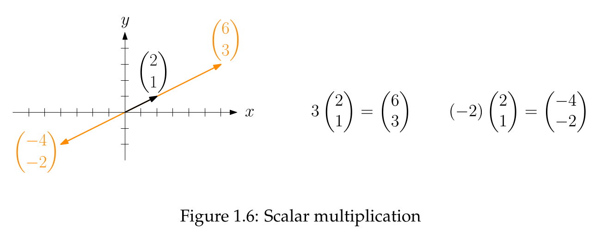
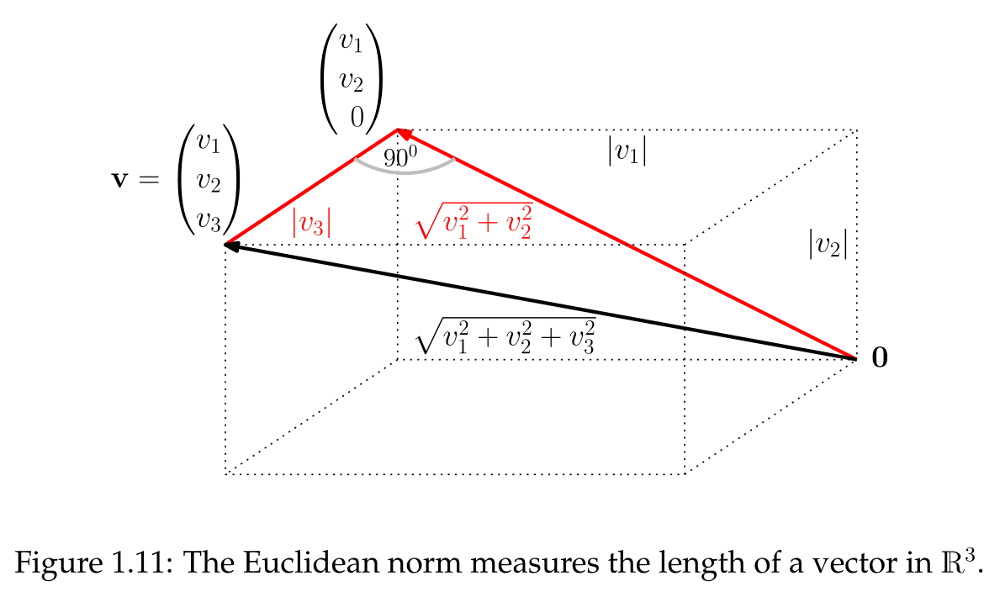
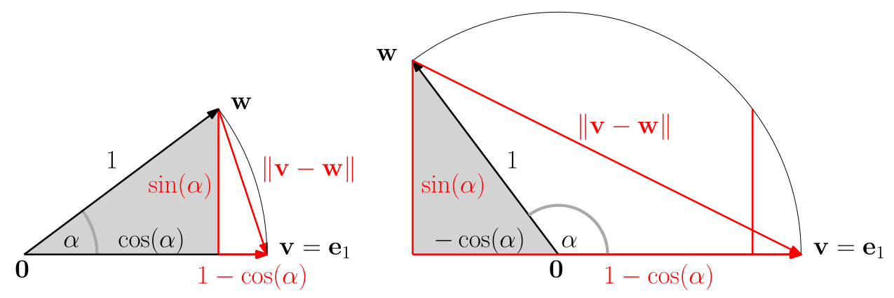
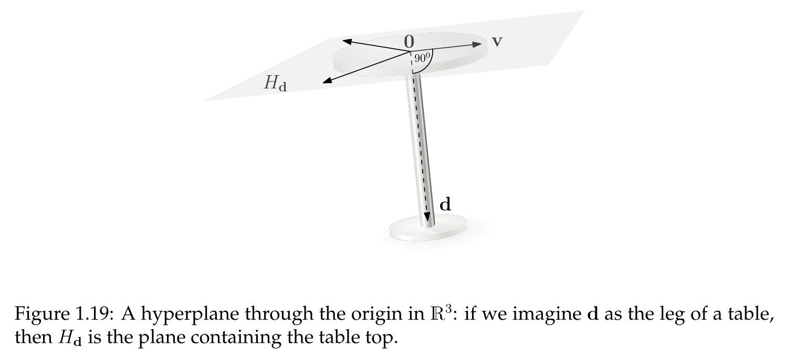
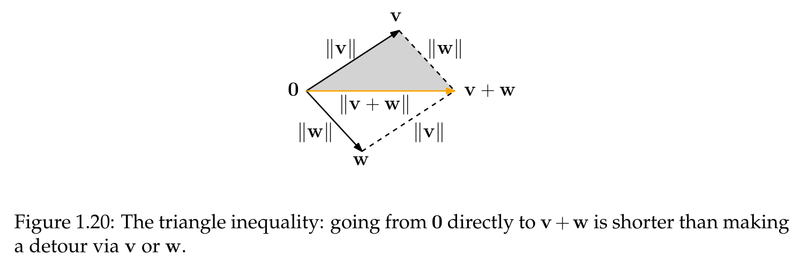

## Core Definition

- **Intuitive vs. Formal Definition**
    - Intuitive idea: A **vector** has **magnitude (length)** and **direction**.
    - Visualization: An **arrow**.
    - Limitation: Intuition fails in dimensions $> 3$.
    - Necessity: A formal, algebraic definition is required for higher dimensions.
- **Geometric Representation**
    - **As an Arrow**: Represents a "movement" (e.g., "go 4 steps right, 1 up"). Can be placed anywhere, but tail is at the origin by default.
    - **As a Point**: Represented by the point at its coordinates. Useful for visualizing large sets of vectors without clutter.
- **Formal Definition and Notation**
    - Formally an element of an m-dimensional space $\mathbb{R}^m$.
    - $\mathbb{R}^m$: The set of all ordered m-tuples of real numbers $(v_1, v_2, ..., v_m)$.
    - A vector in $\mathbb{R}^m$ is formally a **sequence** of $m$ real numbers, written as $(v_i)_{i=1}^m$.
    - **Notation**:
        - **Column vector notation**: e.g., $v = \begin{pmatrix} v_1 \\ \vdots \\ v_m \end{pmatrix}$.
        - In text: **bold lowercase letters** (e.g., **v**, **w**).
        - Natural numbers $\mathbb{N}$: Defined as $\{0, 1, 2, ...\}$ (includes 0).
        - **Zero vector**: All coordinates are 0, denoted by **0**. Dimension is inferred from context (*abuse of notation*).

> **Definition 1.1 (Vector)**
> Let $m \geq 0$ be a natural number. An *m-dimensional coordinate vector* (simply called vector in the following) is an element of $\mathbb{R}^m$, written in column vector notation.

## Vector Addition

- **Geometric View**: Combines movements. The sum **v** + **w** is the diagonal of the **parallelogram** formed by **v** and **w**.
- **Algebraic View**: Performed **coordinate-wise**.
- Properties: **Associative** ($(u+v)+w = u+(v+w)$) and **commutative** ($v+w = w+v$).

> **Definition 1.2 (Vector addition)**
> Let $v = \begin{pmatrix} v_1 \\ \vdots \\ v_m \end{pmatrix}, w = \begin{pmatrix} w_1 \\ \vdots \\ w_m \end{pmatrix} \in \mathbb{R}^m$. The vector $v+w := \begin{pmatrix} v_1+w_1 \\ \vdots \\ v_m+w_m \end{pmatrix} \in \mathbb{R}^m$ is the sum of v and w.

## Scalar Multiplication

- **Geometric View**: Scales the length of vector **v** by a factor of $|\lambda|$ (where $\lambda$ is a **scalar**).
	- $\lambda > 0$: Same direction.
	- $\lambda < 0$: Reversed direction.
	- $\lambda = 0$: Results in the zero vector **0**.
- **Algebraic View**: Multiplies each coordinate by the scalar.

> **Definition 1.3 (Scalar multiplication)**
> Let $v = \begin{pmatrix} v_1 \\ \vdots \\ v_m \end{pmatrix} \in \mathbb{R}^m, \lambda \in \mathbb{R}$. The vector $\lambda v := \begin{pmatrix} \lambda v_1 \\ \vdots \\ \lambda v_m \end{pmatrix} \in \mathbb{R}^m$ is a scalar multiple of v.

## Scalar Product

- **Scalar product** (dot product): Multiplies two vectors, results in a **scalar** (a number).
- **Calculation**: Multiply component-wise, then sum.
- Example: $\begin{pmatrix} 1 \\ 2 \end{pmatrix} \cdot \begin{pmatrix} 3 \\ 4 \end{pmatrix} = 1 \cdot 3 + 2 \cdot 4 = 11$.

> **Definition 1.9 (Scalar product).** Let
> $v = \begin{pmatrix} v_1 \\ v_2 \\ \vdots \\ v_m \end{pmatrix}, w = \begin{pmatrix} w_1 \\ w_2 \\ \vdots \\ w_m \end{pmatrix} \in \mathbb{R}^m$.
> The scalar product of $v$ and $w$ is the number
> $v \cdot w := v_1 w_1 + v_2 w_2 + \dots + v_m w_m = \sum_{i=1}^m v_i w_i$.

- **Properties** (see **Observation 1.10**):
    - **Symmetric**: $v \cdot w = w \cdot v$.
    - **Scalars factor out**: $(\lambda v) \cdot w = \lambda(v \cdot w)$.
    - **Distributive**: $u \cdot (v+w) = u \cdot v + u \cdot w$.
    - **Positive-definite**: $v \cdot v \geq 0$, with $v \cdot v = 0$ if and only if $v=0$.

> **Observation 1.10.** Let $u, v, w \in \mathbb{R}^m$ be vectors and $\lambda \in \mathbb{R}$ a scalar. Then
> (i) $v \cdot w = w \cdot v$; (symmetry)
> (ii) $(\lambda v) \cdot w = \lambda(v \cdot w) = v \cdot (\lambda w)$; (taking out scalars)
> (iii) $u \cdot (v+w) = u \cdot v + u \cdot w$ and $(u+v) \cdot w = u \cdot w + v \cdot w$; (distributivity)
> (iv) $v \cdot v \geq 0$, with equality exactly if $v=0$. (positive-definiteness)

- **Alternative notation**: $v^T w$.
    - **Transpose**: Turns a column vector $v$ into a row vector $v^T$ (a **covector**).
    - Example: If $v = \begin{pmatrix} 1 \\ 2 \end{pmatrix}$, then $v^T = (1 \ 2)$.
    - Multiplication $v^T w$ is identical to the scalar product $v \cdot w$ (**Definition 1.19**).

> **Definition 1.19 (Scalar product as covector-vector multiplication).** Let $v, w \in \mathbb{R}^m$. Then
> $v^T w = (v_1 \ v_2 \ \dots \ v_m) \begin{pmatrix} w_1 \\ w_2 \\ \vdots \\ w_m \end{pmatrix} := \sum_{i=1}^m v_i w_i = v \cdot w$.

> **Definition 1.20 (Covector).** Let $v \in \mathbb{R}^m$ be a vector. The covector $v^T$ (also called the transpose of $v$) is the function $v^T: \mathbb{R}^m \to \mathbb{R}$,
> $v^T: x \mapsto \sum_{i=1}^m v_i x_i$.
> We also define $(v^T)^T := v$ and call the vector $v$ the transpose of the covector $v^T$.
> In row vector notation, $v^T$ is written as
> $v^T = (v_1 \ v_2 \ \dots \ v_m)$.

## Vector Length (Euclidean Norm)

- **Euclidean norm** ($||v||$): Defines vector **length**.
- **Definition**: Square root of the scalar product with itself, $||v|| := \sqrt{v \cdot v}$ (**Definition 1.11**).
    - Possible since $v \cdot v \ge 0$ (**Observation 1.10 (iv)**).
- The formula $||v|| = \sqrt{v_1^2 + v_2^2 + \dots + v_m^2}$ generalizes the **Pythagorean theorem**.
- **Other Norms**: The Euclidean norm is standard, but other ways to measure vector length exist (e.g., **1-norm** and **∞-norm**).

> **Definition 1.11 (Euclidean norm).** Let $v \in \mathbb{R}^m$. The Euclidean norm of $v$ is the number
> $||v|| := \sqrt{v \cdot v}$.

- **Unit vector**: Vector with length 1 ($||u||=1$).
    - In $\mathbb{R}^2$, all unit vectors lie on the **unit circle**.
- **Normalization**: Creating a unit vector from $v \ne 0$ by dividing by its length: $u = \frac{v}{||v||}$.
- **Standard unit vectors** ($e_i$): Have a 1 at the $i$-th coordinate, zeros elsewhere.
    - Point along the coordinate axes.
    - Example in $\mathbb{R}^3$: $e_1 = \begin{pmatrix} 1 \\ 0 \\ 0 \end{pmatrix}, e_2 = \begin{pmatrix} 0 \\ 1 \\ 0 \end{pmatrix}, e_3 = \begin{pmatrix} 0 \\ 0 \\ 1 \end{pmatrix}$.

## Angles & Orthogonality

- **Angle** $\alpha$ (between non-zero vectors): Defined via cosine (**Definition 1.14**).
- The expression for $\cos(\alpha)$ is in $[-1, 1]$ due to the **Cauchy-Schwarz inequality (Lemma 1.12)**.

> **Definition 1.14 (Angle).** Let $v, w \in \mathbb{R}^m$ be two nonzero vectors. The angle between them is the unique $\alpha$ between 0 and $\pi$ (180 degrees) such that
> $\cos(\alpha) = \frac{v \cdot w}{||v|| ||w||} \in [-1, 1]$.

- **Orthogonal** (perpendicular) vectors: Scalar product is 0 (**Definition 1.15**).
    - Corresponds to an angle of 90° ($\cos(90°) = 0$).
    - The **zero vector** is orthogonal to every vector.
- **Hyperplane through the origin**: Set of all vectors orthogonal to a direction vector $d \neq 0$ (**Definition 1.16**).
    - Examples: A plane in $\mathbb{R}^3$, a line in $\mathbb{R}^2$.

> **Definition 1.15 (Orthogonal vectors).** Two vectors $v, w \in \mathbb{R}^m$ are orthogonal if $v \cdot w = 0$; in other words, if the cosine of the angle between them is 0 and the angle itself is 90 degrees.

> **Definition 1.16 (Hyperplane through the origin).** Let $d \in \mathbb{R}^m, d \neq 0$. The set
> $H_d = \{ v \in \mathbb{R}^m : v \cdot d = 0 \}$
> is called a hyperplane through the origin.

## Fundamental Inequalities

- **Cauchy-Schwarz inequality**: Provides an upper bound on the absolute value of the scalar product. A highly versatile tool ("Swiss army knife of lemmas").

> **Lemma 1.12 (Cauchy-Schwarz inequality).** For any two vectors $v, w \in \mathbb{R}^m$,
> $|v \cdot w| \le ||v|| ||w||$.
> Moreover, equality holds exactly if one vector is a scalar multiple of the other.

- **Triangle inequality**: The length of a vector sum is less than or equal to the sum of the individual vector lengths.
    - **Geometric Interpretation**: The direct path ($v+w$) is shorter than or equal to a detour (via $v$ and then $w$).

> **Lemma 1.17 (Triangle inequality).** Let $v, w \in \mathbb{R}^m$. Then
> $||v+w|| \le ||v|| + ||w||$.

