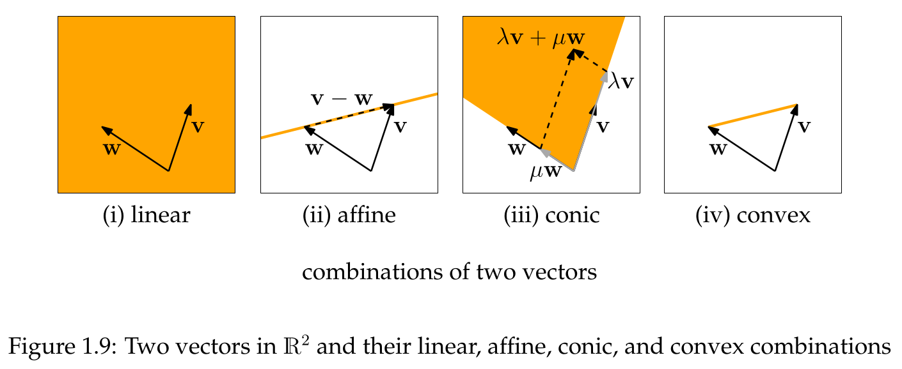
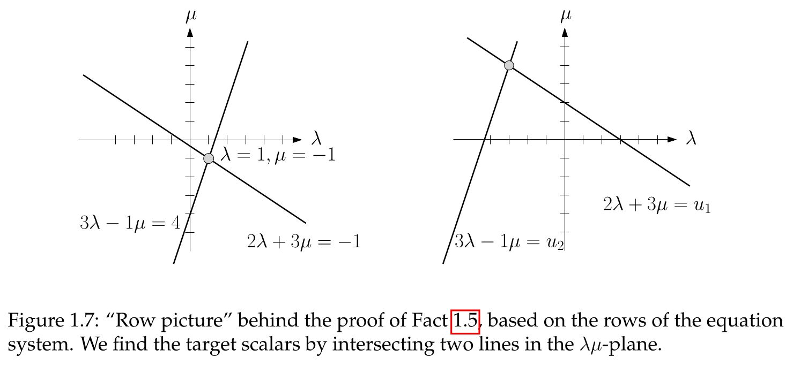
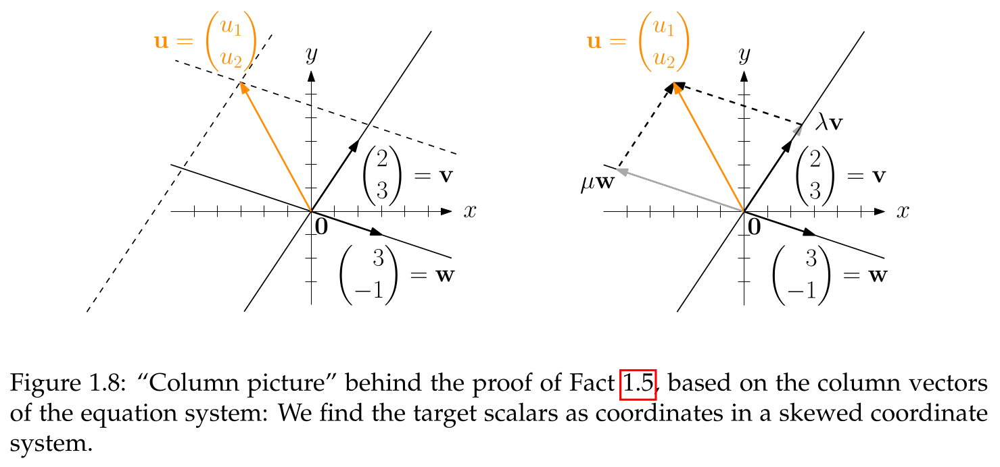
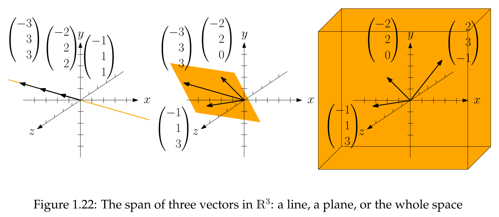

## Linear Combinations

- **Definition**
    - A sum of scaled vectors, combining scalar multiplication and vector addition.

> **Definition 1.4 (Linear combination)**
> Let $v, w \in \mathbb{R}^m, \lambda, \mu \in \mathbb{R}$. The vector $\lambda v + \mu w \in \mathbb{R}^m$ is a *linear combination* of $v$ and $w$. In general, if $v_1, v_2, ..., v_n \in \mathbb{R}^m$ and $\lambda_1, \lambda_2, ..., \lambda_n \in \mathbb{R}$, then $\lambda_1 v_1 + \lambda_2 v_2 + \dots + \lambda_n v_n$ is a linear combination of $v_1, v_2, ..., v_n$.

- **Special Linear Combinations**: Defined by adding constraints to the scalars $\lambda_1, ..., \lambda_n$.
	- **Geometric Interpretation (for two non-collinear vectors v, w in $\mathbb{R}^2$)**
	    - **Affine**: Forms the **line** passing through the endpoints of **v** and **w**.
	    - **Conic**: Forms the **cone** spanned by **v** and **w**.
	    - **Convex**: Forms the **line segment** between the endpoints of **v** and **w**.

> **Definition 1.7 (Affine, conic, convex combination)**
> A linear combination $\lambda_1 v_1 + \lambda_2 v_2 + \dots + \lambda_n v_n$ of vectors $v_1, v_2, ..., v_n$ is called
> (i) an **affine combination** if $\lambda_1 + \lambda_2 + \dots + \lambda_n = 1$,
> (ii) a **conic combination** if $\lambda_j \ge 0$ for $j=1, 2, ..., n$, and
> (iii) a **convex combination** if it is both an affine and a conic combination.

### Proof: Spanning $\mathbb{R}^2$ with Two Vectors

> **Fact 1.5**
> Every vector in $\mathbb{R}^2$ is a linear combination of the two vectors $v = \begin{pmatrix} 2 \\ 3 \end{pmatrix}, w = \begin{pmatrix} 3 \\ -1 \end{pmatrix}$.

- **Proof Strategy**
    - **Goal**: Show that for an **arbitrary** target vector $u = \begin{pmatrix} u_1 \\ u_2 \end{pmatrix}$, scalars $\lambda, \mu$ can always be found such that $\lambda v + \mu w = u$.
    - **Method**: The vector equation becomes a **system of linear equations**.
        - $2\lambda + 3\mu = u_1$
        - $3\lambda - \mu = u_2$
    - **Proof vs. Calculation**: A **proof** solves for unknowns ($\lambda, \mu$) in terms of arbitrary parameters ($u_1, u_2$), covering all cases simultaneously. A **calculation** uses specific numbers.
    - **Solution**:
        - $\lambda = \frac{u_1 + 3u_2}{11}$
        - $\mu = \frac{3u_1 - 2u_2}{11}$
- **Geometric Interpretations**
    - **Row Picture** (Fig. 1.7):
        - Each equation is a **line** in the $\lambda\mu$-plane. The solution is their **intersection point**.
        - Changing vector **u** causes a **parallel shift** of the lines. Non-parallel lines guarantee a unique intersection.
        
    - **Column Picture** (Fig. 1.8):
        - Vectors **v** and **w** define a **skewed coordinate system**.
        - The target vector **u** is the diagonal of the **parallelogram** formed by the scaled vectors $\lambda v$ and $\mu w$.
        

## Linear (In)dependence

- A core concept describing the relationship between vectors in a sequence.
- **Linearly dependent**: At least one vector is a **linear combination** of the others (**Definition 1.21**).
- **Linearly independent**: If not linearly dependent.

> **Definition 1.21 (Linear (in)dependence).** Vectors $v_1, v_2, \dots, v_n \in \mathbb{R}^m$ are linearly dependent if at least one of them is a linear combination of the others, i.e. there is an index $k \in [n]$ and scalars $\lambda_j$ such that
> $v_k = \sum_{\substack{j=1 \\ j \neq k}}^n \lambda_j v_j$.
> Otherwise, $v_1, v_2, \dots, v_n$ are linearly independent.

- **Alternative Definitions** (**Lemma 1.22**, **Corollary 1.23**):
    - **Linear Dependence**: Equivalent to a **non-trivial linear combination of the zero vector** (i.e., $\sum \lambda_j v_j = 0$ where not all $\lambda_j$ are zero).
    - **Linear Independence**: Equivalent to the zero vector only having a **trivial linear combination** (all $\lambda_j$ must be zero).
- Crucial implication: A linear combination of linearly independent vectors is **unique** (**Lemma 1.24**).

> **Lemma 1.22 (Alternative definitions of linear dependence).** Let $v_1, v_2, \dots, v_n \in \mathbb{R}^m$. The following statements are equivalent (meaning that they are either all true, or all false).
> (i) At least one of the vectors is a linear combination of the other ones. (This means, the vectors are linearly dependent according to Definition 1.21.)
> (ii) There are scalars $\lambda_1, \lambda_2, \dots, \lambda_n$ besides $0, 0, \dots, 0$ such that $\sum_{j=1}^n \lambda_j v_j = 0$. We also say that 0 is a nontrivial linear combination of the vectors.
> (iii) At least one of the vectors is a linear combination of the previous ones.

> **Corollary 1.23 (Alternative definitions of linear independence).** Let $v_1, v_2, \dots, v_n \in \mathbb{R}^m$. The following statements are equivalent (meaning that they are either all true, or all false).
> (i) None of the vectors is a linear combination of the other ones. (This means, the vectors are linearly independent according to Definition 1.21.)
> (ii) There are no scalars $\lambda_1, \lambda_2, \dots, \lambda_n$ besides $0, 0, \dots, 0$ such that $\sum_{j=1}^n \lambda_j v_j = 0$. We also say that 0 can only be written as a trivial linear combination of the vectors.
> (iii) None of the vectors is a linear combination of the previous ones.

> **Lemma 1.24.** Let $v_1, v_2, \dots, v_n \in \mathbb{R}^m$ be linearly independent, $v \in \mathbb{R}^m$. Let
> $v = \sum_{j=1}^n \lambda_j v_j = \sum_{j=1}^n \mu_j v_j$
> be two ways of writing $v$ as a linear combination of $v_1, v_2, \dots, v_n$. Then $\lambda_j = \mu_j$ for all $j \in [n]$.

- **Special Cases**:
    - A sequence containing the **zero vector** is **linearly dependent**.
    - A sequence with a **repeated vector** is **linearly dependent**.
    - In $\mathbb{R}^m$, more than $m$ vectors are always **linearly dependent**.
    - The **empty sequence** is **linearly independent**.
    - A single non-zero vector $v \neq 0$ is **linearly independent**.

## Span of Vectors

- **Span**: The set of **all possible linear combinations** of a vector sequence (**Definition 1.25**).

> **Definition 1.25 (Span).** Let $v_1, v_2, \dots, v_n \in \mathbb{R}^m$. Their span is the set of all linear combinations. In formulas,
> $Span(v_1, v_2, \dots, v_n) := \{ \sum_{j=1}^n \lambda_j v_j : \lambda_j \in \mathbb{R} \text{ for all } j \in [n] \}$.

- **Geometric Interpretation**:
    - Span of one non-zero vector: A **line** through the origin.
    - Span of two non-collinear vectors: A **plane** through the origin.
    - Span of the empty sequence: The **point** at the origin, $\{0\}$.
- **Properties of the Span**:
    - Adding a vector that is already a linear combination of the others **does not change the span** (**Lemma 1.26**).
    - Removing a vector that is a linear combination of the others **does not change the span** (**Corollary 1.27**).
    - $m$ linearly independent vectors in $\mathbb{R}^m$ **span the entire space** $\mathbb{R}^m$ (**Lemma 1.28**).

> **Lemma 1.26.** Let $v_1, v_2, \dots, v_n \in \mathbb{R}^m$, and let $v \in \mathbb{R}^m$ be a linear combination of $v_1, v_2, \dots, v_n$. Then
> $Span(v_1, v_2, \dots, v_n) = Span(v_1, v_2, \dots, v_n, v)$.

> **Corollary 1.27.** Let $v_1, v_2, \dots, v_n \in \mathbb{R}^m$ and suppose that for some $k \in [n]$, $v_k$ is a linear combination of the other vectors. Then
> $Span(v_1, v_2, \dots, v_n) = Span(v_1, v_2, \dots, v_{k-1}, v_{k+1}, v_{k+2}, \dots, v_n)$.

> **Lemma 1.28 (The span of m linearly independent vectors is $\mathbb{R}^m$).** Let $v_1, v_2, \dots, v_m \in \mathbb{R}^m$ be linearly independent. Then $Span(v_1, v_2, \dots, v_m) = \mathbb{R}^m$.

