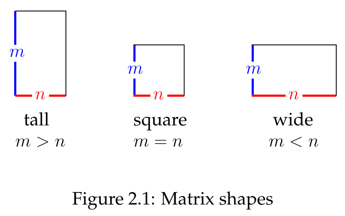
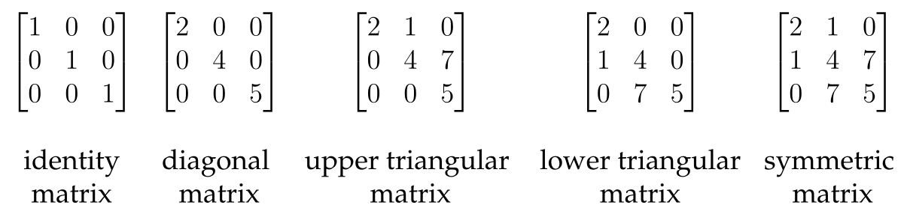
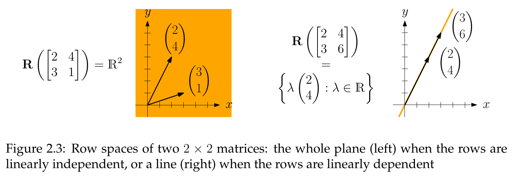
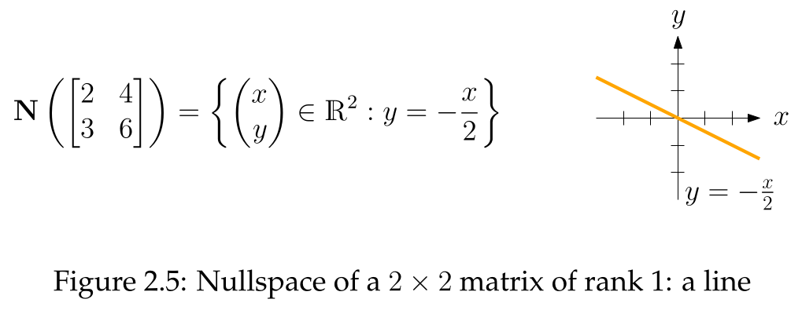

## The Matrix as an Object and Tool

- **Matrix**: Rectangular table of real numbers; a distinct mathematical object. [^2.1]
- **Fundamental Distinction**: Vectors are "raw material," matrices are "tools."
- An $m \times n$ matrix has $m$ rows, $n$ columns. Set of all such matrices is $\mathbb{R}^{m \times n}$. [^2.1]
- **Notations**:
    - **Entry-wise**: $A = [a_{ij}]$, with row index $i$ and column index $j$. [^2.1]
    - **Column**: $A = \begin{bmatrix} v_1 & v_2 & \dots & v_n \end{bmatrix}$, a sequence of column vectors $v_j \in \mathbb{R}^m$.
    - **Row**: $A = \begin{bmatrix} u_1^T \\ u_2^T \\ \vdots \\ u_m^T \end{bmatrix}$, a sequence of row vectors (covectors) $u_i^T$.
- **Basic Operations**: **Matrix addition** and **scalar multiplication** are **element-wise**. [^2.2]

## Special Matrix Types & Operations

- **Matrix Shapes**:
    - **Tall matrix**: More rows than columns ($m>n$).
    - **Wide matrix**: More columns than rows ($m<n$).
    - **Square matrix**: Equal rows and columns ($m=n$). [^2.2]
	
- **Transpose**:
    - The **transpose** $A^T$ of a matrix $A$ results from mirroring along its main diagonal. [^2.12]
    - Rows of $A$ become columns of $A^T$. [^2.12]
    - Key property: $(A^T)^T = A$. [^2.13]
- **Special Square Matrices**:
    - **Identity matrix ($I$)**: 1s on the main diagonal, 0s elsewhere. Entries are the **Kronecker delta**, $a_{ij} = \delta_{ij}$. [^2.3]
    - **Diagonal matrix**: Non-diagonal entries are zero ($a_{ij} = 0$ for $i \neq j$). [^2.3]
    - **Upper triangular**: Entries below the diagonal are zero ($a_{ij}=0$ for $i > j$). [^2.3]
    - **Lower triangular**: Entries above the diagonal are zero ($a_{ij}=0$ for $i < j$). [^2.3]
    - **Symmetric matrix**: Matrix equals its transpose ($A = A^T$, or $a_{ij} = a_{ji}$). [^2.3][^2.13]
    

## Subspaces

- **Column Space ($C(A)$)**: Set of all possible outputs $\{Ax\}$; equivalent to the **span of the columns** of $A$. [^2.9]
    - The zero vector is always in $C(A)$ since $A0=0$.
- **Row Space ($R(A)$)**: Formally defined as the **column space of the transpose**, $R(A) := C(A^T)$. [^2.14]
    - Equivalent to the span of the row vectors of $A$.
    
- **Nullspace ($N(A)$)**: Set of all input vectors $x$ mapped to the zero vector; the solution set to $Ax=0$. [^2.17]
    - **Intuition**: Represents the "redundancy" among columns. A larger nullspace implies more linear dependencies.
    - If $N(A) = \{0\}$, the columns of $A$ are linearly independent. [^2.5]
    
- **Example Question**: For $A = \begin{bmatrix} 0 & 1 \\ 0 & 0 \end{bmatrix}$, show $C(A) = N(A)$.
    - **Column Space**: $C(A) = \text{span}(\begin{pmatrix} 0 \\ 0 \end{pmatrix}, \begin{pmatrix} 1 \\ 0 \end{pmatrix}) = \{ \begin{pmatrix} c \\ 0 \end{pmatrix} | c \in \mathbb{R} \}$ (the x-axis).
    - **Nullspace**: $Ax=0 \implies \begin{bmatrix} 0 & 1 \\ 0 & 0 \end{bmatrix} \begin{pmatrix} x_1 \\ x_2 \end{pmatrix} = \begin{pmatrix} 0 \\ 0 \end{pmatrix} \implies x_2=0$. The solutions are $\{ \begin{pmatrix} x_1 \\ 0 \end{pmatrix} | x_1 \in \mathbb{R} \}$ (the x-axis).
    - Thus, $C(A) = N(A)$.

## Rank

- **Independent Column**: **Crucial definition**: A column $v_j$ is **independent** if not a linear combination of **preceding columns** ($v_1, \dots, v_{j-1}$). Depends on column order. [^2.10]
- **Rank**: $rank(A)$ is the number of independent columns. [^2.10]
- **Key Properties**:
    - $rank(A)=n \iff$ all columns of $A$ are linearly independent.
    - $rank(A)=0 \iff A$ is the zero matrix.
    - A **rank-1 matrix** is a non-zero matrix expressible as the outer product $vw^T$ of two non-zero vectors. [^2.15]
    - **Independent columns alone span the entire column space**. Dependent columns are redundant for the span. [^2.11]
- **Fundamental Result**: **column rank = row rank**. A simple case is shown for rank-1 matrices. [^2.16]

[^2.1]: **Definition 2.1 (Matrix).** An $m \times n$ matrix is a table of real numbers with $m$ rows and $n$ columns. We use upper-case letters ($A$, $B$, . . .) to denote matrices, and write their entries with the corresponding lower case letters and two indices, as in
$A = \begin{bmatrix} a_{11} & a_{12} & \dots & a_{1n} \\ a_{21} & a_{22} & \dots & a_{2n} \\ \vdots & \vdots & & \vdots \\ a_{m1} & a_{m2} & \dots & a_{mn} \end{bmatrix}$
Hence, $a_{ij}$ is the entry in row $i$ and column $j$ of matrix $A$. The "dot-free" notation (see also Section 1.1.5) is $A = [a_{ij}]_{i=1,j=1}^{m,n}$.
[^2.2]: **Definition 2.2 (Matrix addition, scalar multiplication, zero matrix, square matrix).** Let $A = [a_{ij}]_{i=1,j=1}^{m,n}$ and $B = [b_{ij}]_{i=1,j=1}^{m,n}$ be $m \times n$ matrices, $\lambda \in \mathbb{R}$ a scalar.
(i) The matrix $A + B := [a_{ij} + b_{ij}]_{i=1,j=1}^{m,n}$ is the sum of $A$ and $B$.
(ii) The matrix $\lambda A := [\lambda a_{ij}]_{i=1,j=1}^{m,n}$ is a scalar multiple of $A$.
(iii) The matrix $_{i=1,j=1}^{m,n}$ is the $m \times n$ zero matrix, written as $0$.
(iv) If $m = n$ (number of rows equals number of columns), then $A$ is a square matrix.
[^2.12]: **Definition 2.12 (Transpose).** Let $A = [a_{ij}]_{i=1,j=1}^{m,n}$ be an $m \times n$ matrix. The transpose of $A$ is the $n \times m$ matrix $A^T := B = [b_{ij}]_{i=1,j=1}^{n,m}$ where $b_{ij} = a_{ji}$ for all $i, j$.
[^2.13]: **Observation 2.13 (Transposing twice, and transposing symmetric matrices).** Let $A$ be an $m \times n$ matrix. Then $(A^T)^T = A$. Moreover, a square matrix $A$ is symmetric (Definition 2.3) if and only if $A = A^T$.
[^2.3]: **Definition 2.3 (Square matrix classes).** Let $A = [a_{ij}]_{i=1,j=1}^{m,m}$ be an $m \times m$ square matrix.
(i) If $a_{ii} = 1$ for all $i$ (entries on the diagonal are 1) and $a_{ij} = 0$ for all $i \neq j$ (entries not on the diagonal are 0), then $A$ is the identity matrix, denoted (in abuse of notation) by $I$ for every $m$. A different way of defining $I$ is as $I := [\delta_{ij}]_{i=1,j=1}^{m,m}$. Here, $\delta_{ij}$ is the Kronecker delta, defined as 1 if $i=j$ and 0 otherwise.
(ii) If $a_{ij} = 0$ for all $i \neq j$ (entries not on the diagonal are 0), then $A$ is a diagonal matrix.
(iii) If $a_{ij} = 0$ for all $i > j$ (entries below the diagonal are 0), then $A$ is an upper triangular matrix.
(iv) If $a_{ij} = 0$ for all $i < j$ (entries above the diagonal are 0), then $A$ is a lower triangular matrix.
(v) If $a_{ij} = a_{ji}$ for all $i,j$, then $A$ is a symmetric matrix.
[^2.9]: **Definition 2.9 (Column space).** Let $A$ be an $m \times n$ matrix. The column space $C(A)$ of $A$ is the span (set of all linear combinations) of the columns, $C(A) := \{Ax : x \in \mathbb{R}^n\} \subseteq \mathbb{R}^m$.
[^2.14]: **Definition 2.14 (Row space, independent row, row rank).** Let $A$ be an $m \times n$ matrix. The row space $R(A)$ of $A$ is the column space of the transpose, $R(A) := C(A^T)$. For every $i$, the $i$-th row of $A$ is called independent if the $i$-th column of $A^T$ is independent. The row rank of $A$ is the (column) rank of $A^T$.
[^2.17]: **Definition 2.17 (Nullspace).** Let $A$ be an $m \times n$ matrix. The nullspace of $A$ is the set $N(A) = \{x \in \mathbb{R}^n : Ax = 0\} \subseteq \mathbb{R}^n$.
[^2.10]: **Definition 2.10 ((In)dependent column and (column) rank of a matrix).** Let $A = \begin{bmatrix} v_1 & v_2 & \dots & v_n \end{bmatrix}$ be an $m \times n$ matrix with columns $v_1, v_2, \dots, v_n \in \mathbb{R}^m$. Column $v_j$ is called independent if $v_j$ is not a linear combination of $v_1, v_2, \dots, v_{j-1}$. Otherwise, $v_j$ is called dependent. The rank of $A$, written as $rank(A)$, is the number of independent columns of $A$.
[^2.15]: **Lemma 2.15 (Rank-1 matrices).** Let $A$ be an $m \times n$ matrix. The following two statements are equivalent.
(i) $rank(A) = 1$.
(ii) There are nonzero vectors $v \in \mathbb{R}^m, w \in \mathbb{R}^n$ such that $A = [v_i w_j]_{i=1,j=1}^{m,n}$.
[^2.11]: **Lemma 2.11 (The independent columns span the column space).** Let $A$ be an $m \times n$ matrix with $r$ independent columns, and let $C$ be the $m \times r$ submatrix containing the independent columns. Then $C(A) = C(C)$.
[^2.16]: **Corollary 2.16 (Transpose of a rank-1 matrix).** Let $A$ be an $m \times n$ matrix with $rank(A) = 1$. Then also $rank(A^T) = 1$.
