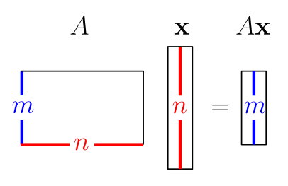
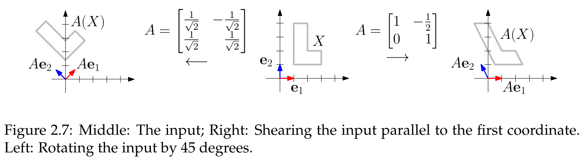
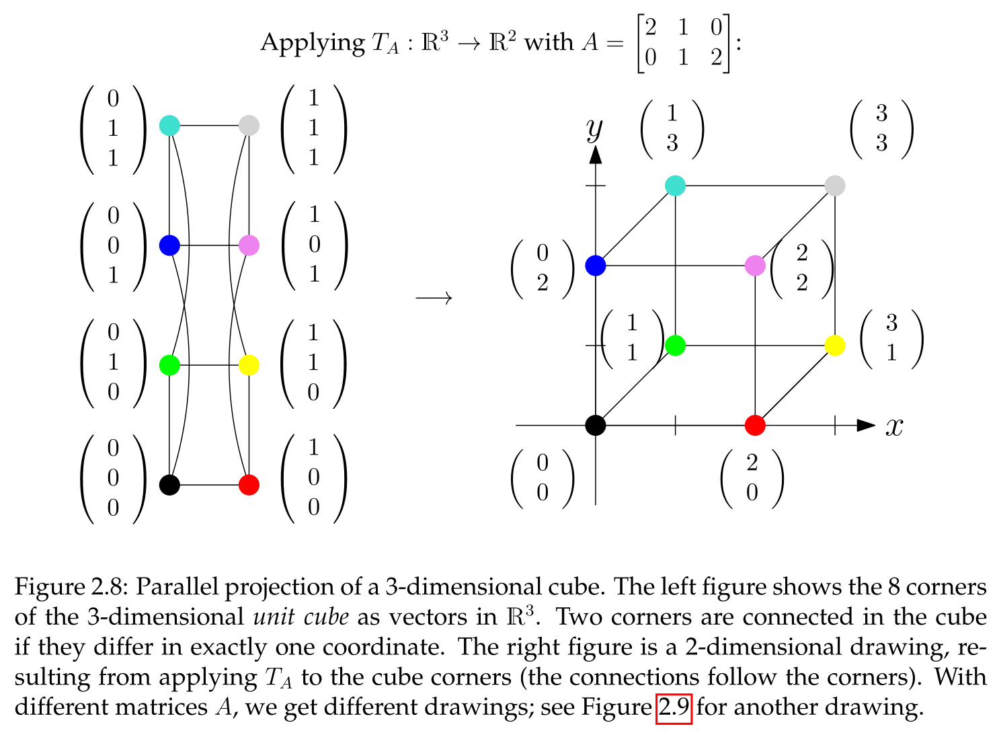

## The Core Operation: Matrix-Vector Multiplication

The product $Ax$ of an $m \times n$ matrix $A$ and a vector $x \in \mathbb{R}^n$ yields an output vector in $\mathbb{R}^m$.

**Three crucial interpretations**:

1. **As a Linear Combination of Columns**:
    - **Most fundamental definition**: $Ax$ is the linear combination of the columns of $A$ with coefficients from $x$. [^2.4]
    - Essential for understanding column space and rank.
2. **As a Series of Scalar Products**:
    - Most common method for manual calculation.
    - The $i$-th entry of $Ax$ is the **scalar product** of the $i$-th row of $A$ with $x$. [^2.8]
3. **As a Table Calculation**:
    - Direct formula for each entry: $(Ax)_i = \sum_{j=1}^n a_{ij} x_j$. [^2.6]
- **Core Implications (Observation 2.5)**: Rephrases concepts in matrix language. [^2.5]
    - $b$ is a linear combination of columns of $A \iff Ax=b$ has a solution. [^2.5]
    - Columns of $A$ are linearly independent $\iff Ax=0$ has only the trivial solution $x=0$. [^2.5]
- **Identity Matrix Property**: $Ix = x$. [^2.7]

## Matrices as Linear Transformations

- An $m \times n$ matrix $A$ defines a **matrix transformation** $T_A: \mathbb{R}^n \to \mathbb{R}^m$ via $T_A(x) = Ax$. [^2.18]
- **Linearity**: The defining property. Transformation of a linear combination equals the linear combination of transformed vectors. [^2.19]
- A **linear transformation** is any function $T$ satisfying the linearity axiom. [^2.21]
    - Can be stated as one combined axiom or two simpler ones (additivity and homogeneity). [^2.23]
    - Consequence: $T(0)=0$. [^2.24]
    - This property extends to any number of vectors and scalars. [^2.25]
- **The Fundamental Connection**: Every matrix transformation is linear. [^2.22] **Every linear transformation from $\mathbb{R}^n$ to $\mathbb{R}^m$ can be represented by a unique $m \times n$ matrix**. [^2.26]
- **Geometric Interpretation**:
    - **Columns of matrix $A$ are the images of the standard unit vectors** ($e_j$) under $T$. [^2.26]
    - **Examples**:
        - **Rotation**: $A=\begin{bmatrix} 0 & -1 \\ 1 & 0 \end{bmatrix}$ rotates vectors in $\mathbb{R}^2$ by 90 degrees counter-clockwise. For any vector $v$, $Av$ is orthogonal to $v$.
        - **Shear/Stretch**: Matrices can scale coordinates or skew shapes.
        
        - **Parallel Projection**: An $m \times n$ matrix with $m < n$ projects vectors into a lower-dimensional space. Parallel lines remain parallel.
          
    - **Non-Example**: **Perspective projection** (like a photograph) is **not** linear because it does not preserve parallelism.

## Kernel and Image of Linear Transformations

- These concepts generalize nullspace and column space to any linear transformation $T$.
- **Kernel** $Ker(T)$: Set of vectors mapped to zero. [^2.27]
- **Image** $Im(T)$: Set of all possible outputs. [^2.27]
- For a matrix transformation $T_A$:
    - **Image** of $T_A$ = **Column Space** of $A$ ($Im(T_A) = C(A)$). [^2.28]
    - **Kernel** of $T_A$ = **Nullspace** of $A$ ($Ker(T_A) = N(A)$). [^2.29]

[^2.4]: **Definition 2.4 (Matrix-vector multiplication with A in column notation).** Let $A = \begin{bmatrix} v_1 & v_2 & \dots & v_n \end{bmatrix} \in \mathbb{R}^{m \times n}$, $x = \begin{pmatrix} x_1 \\ x_2 \\ \vdots \\ x_n \end{pmatrix} \in \mathbb{R}^n$. The vector $Ax := \sum_{j=1}^n x_j v_j \in \mathbb{R}^m$ is the product of $A$ and $x$.
[^2.8]: **Observation 2.8 (Matrix-vector multiplication with A in row notation).** Let $A = \begin{bmatrix} u_1^T \\ u_2^T \\ \vdots \\ u_m^T \end{bmatrix} \in \mathbb{R}^{m \times n}$, $x \in \mathbb{R}^n$. Then $Ax = \begin{pmatrix} u_1^T x \\ u_2^T x \\ \vdots \\ u_m^T x \end{pmatrix}$.
[^2.6]: **Observation 2.6 (Matrix-vector multiplication with A in table notation).** Let $A = [a_{ij}]_{i=1,j=1}^{m,n} \in \mathbb{R}^{m \times n}$, $x = (x_j)_{j=1}^n \in \mathbb{R}^n$. Then $Ax = \left(\sum_{j=1}^n a_{ij}x_j\right)_{i=1}^m \in \mathbb{R}^m$.
[^2.5]: **Observation 2.5.** Let $A$ be an $m \times n$ matrix.
(i) A vector $b \in \mathbb{R}^m$ is a linear combination of the columns of $A$ if and only if there is a vector $x \in \mathbb{R}^n$ (of suitable scalars) such that $Ax = b$.
(ii) The columns of $A$ are linearly independent if and only if $x = 0$ is the only vector such that $Ax = 0$.
[^2.7]: **Corollary 2.7 (Identity-vector multiplication).** Let $I$ be the $m \times m$ identity matrix (Definition 2.3). Then $Ix = x$ for all $x \in \mathbb{R}^m$.
[^2.18]: **Definition 2.18 (Matrix transformation).** Let $A$ be an $m \times n$ matrix. The function $T_A: \mathbb{R}^n \to \mathbb{R}^m$ defined by $T_A: x \mapsto Ax$ is the matrix transformation with matrix $A$.
[^2.19]: **Lemma 2.19 (Linearity of matrix transformations).** Let $A$ be an $m \times n$ matrix, $x_1, x_2 \in \mathbb{R}^n$ and $\lambda_1, \lambda_2 \in \mathbb{R}$. Then $A(\lambda_1 x_1 + \lambda_2 x_2) = \lambda_1 Ax_1 + \lambda_2 Ax_2$.
[^2.21]: **Definition 2.21 (Linear transformation, linear functional).** A function $T : \mathbb{R}^n \to \mathbb{R}^m$ / $T : \mathbb{R}^n \to \mathbb{R}$ is called a linear transformation / linear functional if the following linearity axiom holds for all $x_1, x_2 \in \mathbb{R}^n$ and all $\lambda_1, \lambda_2 \in \mathbb{R}$.
$T(\lambda_1 x_1 + \lambda_2 x_2) = \lambda_1 T(x_1) + \lambda_2 T(x_2)$.
[^2.23]: **Lemma 2.23.** A function $T : \mathbb{R}^n \to \mathbb{R}^m$ / $T : \mathbb{R}^n \to \mathbb{R}$ is a linear transformation / linear functional if and only if the following two linearity axioms hold for all $x, x' \in \mathbb{R}^n$ and all $\lambda \in \mathbb{R}$.
(i) $T(x+x') = T(x) + T(x')$, and
(ii) $T(\lambda x) = \lambda T(x)$.
[^2.24]: **Lemma 2.24.** Let $T : \mathbb{R}^n \to \mathbb{R}^m$ / $T : \mathbb{R}^n \to \mathbb{R}$ be a linear transformation / linear functional. Then $T(0) = 0$ / $T(0)=0$.
[^2.25]: **Lemma 2.25.** Let $T : \mathbb{R}^n \to \mathbb{R}^m$ / $T : \mathbb{R}^n \to \mathbb{R}$ be a linear transformation / linear functional, let $x_1, x_2, \dots, x_l \in \mathbb{R}^n$ and $\lambda_1, \lambda_2, \dots, \lambda_l \in \mathbb{R}$. Then
$T\left(\sum_{j=1}^l \lambda_j x_j\right) = \sum_{j=1}^l \lambda_j T(x_j)$.
[^2.22]: **Observation 2.22.** Every matrix transformation is a linear transformation.
[^2.26]: **Theorem 2.26.** Let $T : \mathbb{R}^n \to \mathbb{R}^m$ be a linear transformation. There is a unique $m \times n$ matrix $A$ such that $T = T_A$ (meaning that $T(x) = T_A(x)$ for all $x \in \mathbb{R}^n$). This matrix is $A = \begin{bmatrix} T(e_1) & T(e_2) & \dots & T(e_n) \end{bmatrix}$.
[^2.27]: **Definition 2.27 (Kernel and image).** Let $T: \mathbb{R}^n \to \mathbb{R}^m$ be a linear transformation. The set
$Ker(T) := \{x \in \mathbb{R}^n : T(x) = 0\} \subseteq \mathbb{R}^n$
is the kernel of $T$. The set
$Im(T) := \{T(x) : x \in \mathbb{R}^n\} \subseteq \mathbb{R}^m$
is the image of $T$.
[^2.28]: **Observation 2.28.** Let $T: \mathbb{R}^n \to \mathbb{R}^m$ be a linear transformation and $A$ the unique $m \times n$ matrix (that exists by Theorem 2.26) such that $T = T_A$. Then $Im(T) = C(A)$, the column space of $A$.
[^2.29]: **Observation 2.29.** Let $T: \mathbb{R}^n \to \mathbb{R}^m$ be a linear transformation and $A$ the unique $m \times n$ matrix (that exists by Theorem 2.26) such that $T = T_A$. Then $Ker(T) = N(A)$, the nullspace of $A$.
