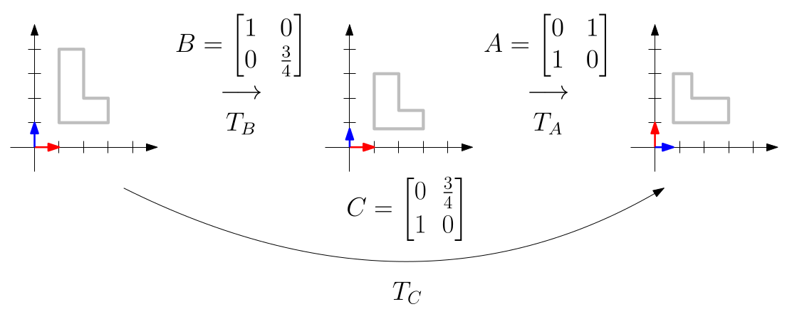
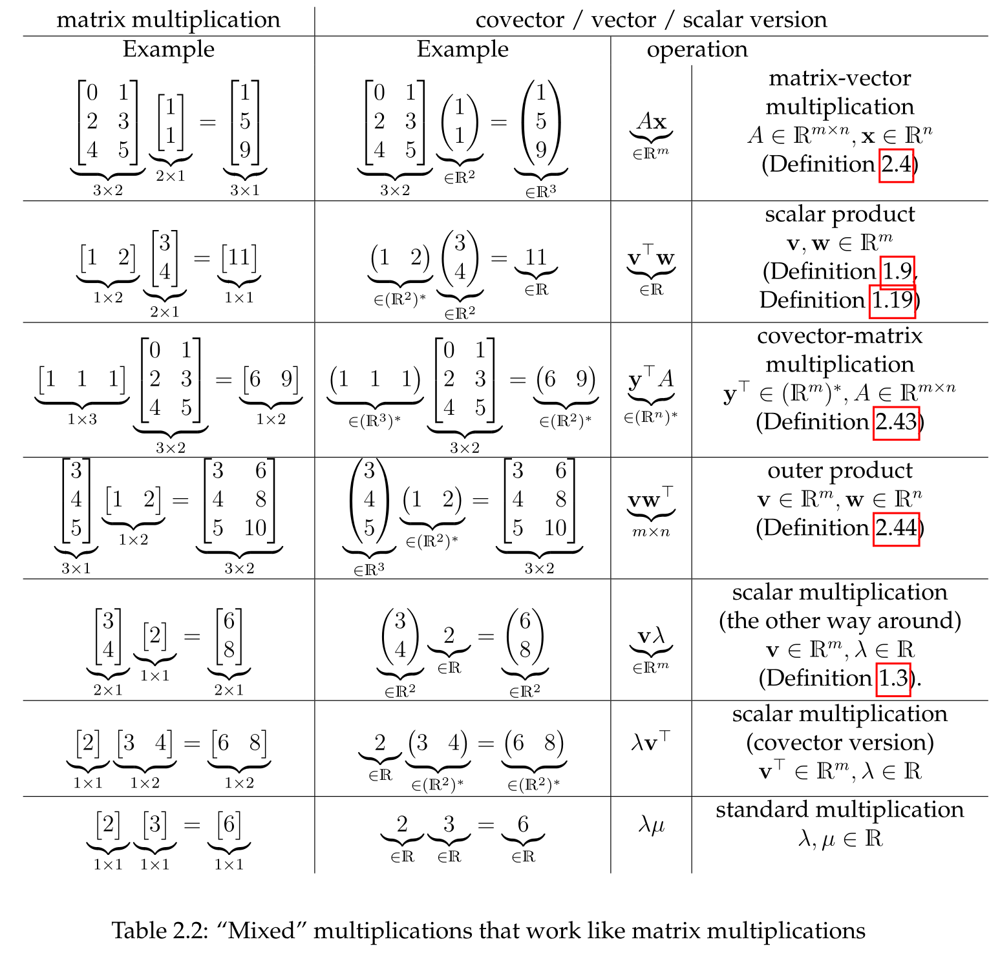
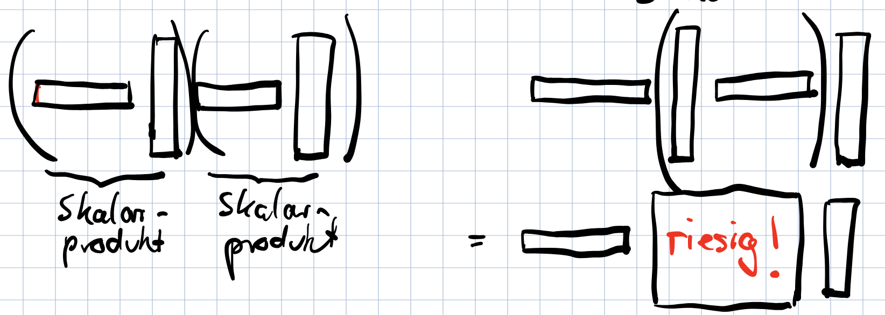
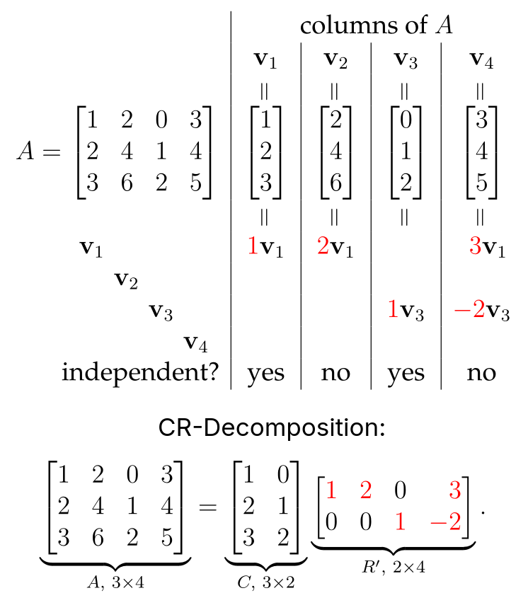

## Matrix Multiplication

- **Core Concept**: Product of matrices $A, B$ represents the **composition of their linear transformations**. [^2.33] [^2.34]
    - $T_{AB} = T_A \circ T_B$: first apply $T_B$, then $T_A$. [^2.37]
    
- **Definition**: For an $a \times n$ matrix $A$ and an $n \times b$ matrix $B$.
    - **Requirement**: Columns of $A$ = Rows of $B$.
    1. **Column Notation**: $j$-th column of $AB$ is $A$ times the $j$-th column of $B$. [^2.35] [^2.36]
        - $AB = A \begin{bmatrix} x_1 & \cdots & x_b \end{bmatrix} = \begin{bmatrix} Ax_1 & \cdots & Ax_b \end{bmatrix}$
    2. **Row Notation**: $i$-th row of $AB$ is the $i$-th row of $A$ times $B$. [^2.45]
        - $AB = \begin{bmatrix} u_1^T \\ \vdots \\ u_a^T \end{bmatrix} B = \begin{bmatrix} u_1^T B \\ \vdots \\ u_a^T B \end{bmatrix}$
    3. **Scalar Product Notation**: Entry $(i, j)$ of $AB$ is the scalar product of row $i$ of $A$ and column $j$ of $B$. [^2.38] [^2.39]
- **Fundamental Properties**:
    - **Associativity**: $(AB)C = A(BC)$. Result is independent of evaluation order, but **computational efficiency** is not. [^2.42]
    - **Distributivity**: $A(B+C) = AB+AC$ and $(A+B)C = AC+BC$. [^2.42]
    - **Non-commutative**: Generally, $AB \neq BA$.
    - **Identity Matrix**: Neutral element: $IA = A$ and $AI=A$. [^2.41]
    - **Transpose of a Product**: Reversed order: $(AB)^T = B^T A^T$. [^2.40]

## The "Zoo" of Multiplications

- **Unifying View**: Multiplications with vectors, covectors, and scalars are computationally equivalent to matrix multiplication.
    - Treat vectors as $m \times 1$ matrices, covectors as $1 \times n$ matrices.

- **"Mixed" Multiplications**:
    - **Covector-Matrix**: $y^T A$ results in a new covector. [^2.43]
    - **Outer Product**: $vw^T$ (column vector $\times$ row vector) creates a matrix. Expresses all rank-1 matrices. [^2.44]
- **Computational Efficiency**:
    - **Associativity** holds, but evaluation order impacts performance.
    - **Efficient**: $x^T A^T A x$ as $(Ax)^T(Ax) = \|Ax\|^2$ (avoids matrix-matrix product).
    - **Inefficient**: $v^T w v^T w$ as $v^T(wv^T)w$ for large vectors.
        - Intermediate step $wv^T$ creates a huge matrix.
        - Efficient way: $(v^T w)(v^T w) = (v^T w)^2$ (scalar product first).
    - Optimal order for long products found via **dynamic programming**.

## CR-Decomposition

- **Matrix Decompositions**: Reveal structural properties, like prime factorization for numbers.
- **Theorem**: An $m \times n$ matrix $A$ of **rank $r$** has a unique decomposition $A = CR'$. [^2.46]
    - $C$: $m \times r$ submatrix with the $r$ **independent columns** of $A$.
    - $R'$: Unique $r \times n$ matrix of coefficients for expressing columns of $A$ as linear combinations of columns of $C$.
- **Application: Matrix Compression**:
    - Useful for matrices with **low rank $r$**.
    - Store $C$ and $R'$ with $(m+n)r$ entries instead of $A$ with $mn$ entries.
    - **Example**: A $1000 \times 1000$ matrix ($10^6$ entries) of rank $r=10$ needs only $(1000+1000) \cdot 10 = 20,000$ entries (50x reduction).
    - Allows for more efficient computations, e.g., $Ax$ as $C(R'x)$.

[^2.33]: **Definition 2.33 (Composition of functions).** Let $g : X \to Y$ and $f : Y \to Z$ be two functions where $X, Y, Z$ are arbitrary sets. The function $h : X \to Z$, $h : x \mapsto f(g(x))$ is the composition of $f$ and $g$, written as $f \circ g$ ("first apply $g$, then $f$").
[^2.34]: **Lemma 2.34 (Composition of matrix transformations).** Let $T_B : \mathbb{R}^b \to \mathbb{R}^n$ and $T_A : \mathbb{R}^n \to \mathbb{R}^a$ be two matrix transformations. The composition $T_A \circ T_B : \mathbb{R}^b \to \mathbb{R}^a$ ("first do $T_B$, then $T_A$") is another matrix transformation.
[^2.37]: **Corollary 2.37 (Matrix of the composition).** Let $A$ be an $a \times n$ matrix and $B$ be an $n \times b$ matrix. Then $T_A \circ T_B = T_{AB}$.
[^2.35]: **Lemma 2.35 (Matrix of the composition).** Let $A$ be an $a \times n$ matrix and $B = \begin{bmatrix} x_1 & x_2 & \dots & x_b \end{bmatrix}$ an $n \times b$ matrix. The $a \times b$ matrix $C = \begin{bmatrix} Ax_1 & Ax_2 & \dots & Ax_b \end{bmatrix}$ is the unique matrix that satisfies $T_C = T_A \circ T_B$.
[^2.36]: **Definition 2.36 (Matrix multiplication in column notation).** Let $A$ be an $a \times n$ matrix and $B = \begin{bmatrix} x_1 & x_2 & \dots & x_b \end{bmatrix}$ an $n \times b$ matrix. The $a \times b$ matrix $AB := \begin{bmatrix} Ax_1 & Ax_2 & \dots & Ax_b \end{bmatrix}$ is the product of $A$ and $B$.
[^2.45]: **Observation 2.45 (Matrix multiplication in row notation).** Let $A = \begin{bmatrix} u_1^T \\ \vdots \\ u_a^T \end{bmatrix}$ be an $a \times n$ matrix and $B$ an $n \times b$ matrix. The product $AB$ is the $a \times b$ matrix $\begin{bmatrix} u_1^T B \\ \vdots \\ u_a^T B \end{bmatrix}$.
[^2.38]: **Observation 2.38.** Let $A = \begin{bmatrix} u_1^T \\ u_2^T \\ \vdots \\ u_a^T \end{bmatrix} \in \mathbb{R}^{a \times n}$, $B = \begin{bmatrix} x_1 & x_2 & \dots & x_b \end{bmatrix} \in \mathbb{R}^{n \times b}$. Then $AB = \begin{bmatrix} u_1^T x_1 & u_1^T x_2 & \dots & u_1^T x_b \\ u_2^T x_1 & u_2^T x_2 & \dots & u_2^T x_b \\ \vdots & \vdots & & \vdots \\ u_a^T x_1 & u_a^T x_2 & \dots & u_a^T x_b \end{bmatrix} = [u_i^T x_j]_{i=1,j=1}^{a,b} \in \mathbb{R}^{a \times b}$.
[^2.39]: **Observation 2.39.** Let $A = [a_{ij}]_{i=1,j=1}^{a,n}$, $B = [b_{ij}]_{i=1,j=1}^{n,b}$. Then $AB = \left[ \sum_{l=1}^n a_{il}b_{lj} \right]_{i=1,j=1}^{a,b}$.
[^2.42]: **Lemma 2.42.** Let $A, B, C$ be three matrices. Whenever the respective sums and products in the following are defined, we have
    (i) $A(B+C) = AB+AC$ and $(A+B)C = AC+BC$; (distributivity)
    (ii) $(AB)C=A(BC)$. (associativity)
[^2.41]: **Corollary 2.41.** Let $I$ be the $m \times m$ identity matrix. Then $IA = A$ for all $m \times n$ matrices, and $AI = A$ for all $n \times m$ matrices.
[^2.40]: **Lemma 2.40.** Let $A$ be an $a \times n$ matrix and $B$ an $n \times b$ matrix. Then $(AB)^T = B^T A^T$.
[^2.43]: **Definition 2.43 (Covector-matrix multiplication).** Let $y^T = (y_1 \ y_2 \ \dots \ y_m) \in (\mathbb{R}^m)^*$, $A = \begin{bmatrix} v_1 & v_2 & \dots & v_n \end{bmatrix} \in \mathbb{R}^{m \times n}$. The covector $y^T A = (y^T v_1 \ y^T v_2 \ \dots \ y^T v_n) \in (\mathbb{R}^n)^*$.
[^2.44]: **Definition 2.44.** Let $v \in \mathbb{R}^m, w \in \mathbb{R}^n$. The outer product $vw^T$ of $v$ and $w$ is the $m \times n$ matrix $vw^T := \begin{bmatrix} v_1 w_1 & v_1 w_2 & \dots & v_1 w_n \\ v_2 w_1 & v_2 w_2 & \dots & v_2 w_n \\ \vdots & \vdots & & \vdots \\ v_m w_1 & v_m w_2 & \dots & v_m w_n \end{bmatrix} = [v_i w_j]_{i=1,j=1}^{m,n}$.
[^2.46]: **Theorem 2.46 (CR decomposition).** Let $A$ be an $m \times n$ matrix of rank $r$ (Definition 2.10). Let $C$ be the $m \times r$ submatrix of $A$ containing the independent columns. Then there is a unique $r \times n$ matrix $R'$ such that $A = CR'$.
