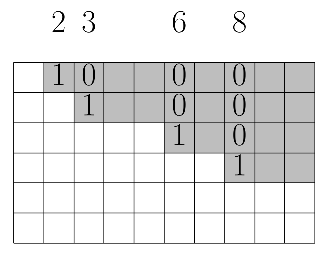
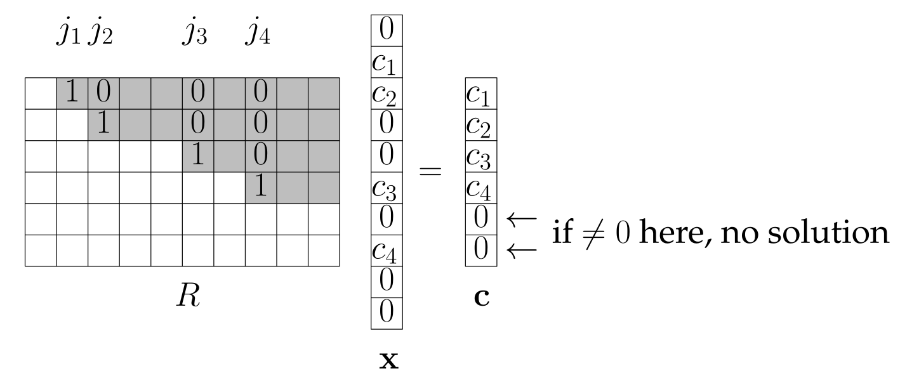

## Gauss-Jordan Elimination

- **Goal**: Solve any system of linear equations $Ax=b$.
- **Method**: Transforms any matrix $A$ into a unique standard form called **Reduced Row Echelon Form (RREF)** using row operations.
- **Row Operations**: Row subtraction, row exchange, and **row division** (to create pivots of value 1).

## Reduced Row Echelon Form (RREF)

- A matrix with a "staircase" structure. [^3.13]
- **Properties**:
    - **Pivot Columns**: Columns with "downward steps" are **standard unit vectors** (e.g., $e_1, e_2, ...$). [^3.13]
    - **Zero Entries**: All entries below the staircase are zero. This includes any all-zero rows at the bottom. [^3.13]
    - **Notation**: `RREF(j_1, ..., j_r)` denotes a matrix with `r` pivots in columns $j_1, ..., j_r$.
    - **Examples**: The identity matrix $I_m$ is in `RREF(1, ..., m)`. The zero matrix is in `RREF()`.
- **Information from RREF**:
    - The **rank** of the matrix is `r`, the number of pivots. [^3.14]
    - The **independent columns** are the pivot columns ($j_1, ..., j_r$). [^3.14]

## The Gauss-Jordan Algorithm

- **Process**: Transforms an augmented matrix $(A|B)$ into $(R|C)$, where $R$ is the RREF of $A$. Proceeds column by column.
- **Elimination Steps**:
    1. **Normalize Pivot**: Divide the pivot row by the pivot's value to make the pivot **1**.
    2. **Eliminate**: Use row subtraction to create zeros both **above and below** the pivot.
    3. **Skip Columns**: If a column cannot form a pivot (pivot position and below are all zero), it is skipped. This is a "good case that saves work".
- **Direct Solution (for Rx=c)**:
    - **Consistency**: No solution exists if $c_i \neq 0$ for any all-zero row $i$ in $R$.
    - **Canonical Solution**: A standard solution is found by setting $x_{j_i} = c_i$ for each pivot column $j_i$ and all other variables to 0.
    
- **Runtime**:
    - **Elimination**: For an $m \times n$ matrix $A$ and $m$ right-hand sides, the cost is $O(m^2(m+n))$. [^3.16]
    - **Direct Solution**: Solving $Rx=c$ takes $O(m+n)$. [^3.15]

## Theoretical Results & Applications

- **Standard Form**: Any matrix $A$ has a **unique** RREF matrix $R$ such that $R=MA$ for an invertible matrix $M$. [^3.18]
    - $M$ is the product of all row operation matrices. Found by running the algorithm on $(A|I)$ to get $(R|M)$. [^3.17]
- **CR-Decomposition**: The algorithm reveals the decomposition $A=CR'$.
    - The pivot column indices ($j_1, ..., j_r$) identify the columns of $A$ that form $C$. [^3.18]
    - The top $r$ non-zero rows of $R$ form $R'$. [^3.18]
- **Matrix Inversion**:
    - An $m \times m$ matrix $A$ is **invertible** if and only if its RREF is the identity matrix ($R=I$). [^3.19]
    - If so, running the algorithm on $(A|I)$ yields $(I|A^{-1})$. [^3.19]
- **Efficiently Solving Ax=b for multiple b's**:
    1. **Preprocessing**: Run Gauss-Jordan on $(A|I)$ once to get $(R, M)$. Cost: $O(m^2(m+n))$. [^3.20]
    2. **For each new b**: Compute $c = Mb$, then solve $Rx=c$ via direct solution. Cost: $O(m^2+n)$. [^3.20]

[^3.13]: **Definition 3.13 (Reduced row echelon form).** Let $R = [r_{ij}]_{i=1,j=1}^{m,n}$ be an $m \times n$ matrix. $R$ is in reduced row echelon form (RREF) if there is some natural number $r \le m$ and column indices $1 \le j_1 < j_2 < \dots < j_r \le n$ (the indices of the "downward step" columns) such that the following two conditions hold.
(i) For every $i \in [r]$, column $j_i$ of $R$ is the standard unit vector $e_i$.
(ii) All entries $r_{ij}$ "below the staircase" are 0. Formally, an entry $r_{ij}$ is below the staircase if
(a) $i > r$ (the entry is below row $r$), or
(b) $i \le r$ and $j < j_i$ (the entry is in the part of row $i$ to the left of column $j_i$).
[^3.14]: **Lemma 3.14.** A matrix R in RREF($j_1, j_2, \dots, j_r$) has independent columns $j_1, j_2, \dots, j_r$ and therefore rank $r$.
[^3.16]: **Theorem 3.16 (Runtime of Gauss-Jordan elimination with m right-hand sides).** Let $Ax = b_j, j \in [m]$, be m systems of m linear equations in n variables, where the $b_j$'s are the columns of the input matrix B. In time O($m^2(m+n)$), Gauss-Jordan elimination (Algorithm 6) returns equivalent systems $Rx = c_j, j \in [m]$, where the $c_j$'s are the columns of the output matrix $C$, and $R$ is in RREF($j_1, j_2, \dots, j_r$).
[^3.15]: **Theorem 3.15 (Runtime of Direct solution).** Let $Rx = c$ be a system of $m$ linear equations in $n$ variables, where $R$ is in RREF ($j_1, j_2, \dots, j_r$). In time O($m+n$), direct solution (Algorithm 5) returns a solution $x$ or reports that there is no solution.
[^3.18]: **Theorem 3.18 (Uniqueness of RREF, and relation to the CR decomposition).** Let $A$ be an $m \times n$ matrix. There is a unique $m \times n$ matrix $R$ (the one resulting from Gauss-Jordan elimination on $A$ according to Theorem 3.17), with the following two properties.
(i) $R = MA$ for some invertible $m \times m$ matrix $M$.
(ii) $R$ is in RREF.
More precisely, R is in RREF($j_1, j_2, \dots, j_r$), where $j_1, j_2, \dots, j_r$ are the indices of the independent columns in A, and $R = \begin{bmatrix} R' \\ 0 \end{bmatrix}$ where $R'$ is a $r \times n$ matrix and $0$ is a $(m-r) \times n$ matrix, with $R'$ the unique matrix such that $A = CR'$ in Theorem 2.46 (CR decomposition).
[^3.17]: **Theorem 3.17 (Output of Gauss-Jordan elimination).** Let $A$ be an $m \times n$ matrix, and let $(R, j_1, j_2, \dots, j_r, M)$ be the output of Algorithm 6 with input $(A, I)$, where $I$ is the $m \times m$ identity matrix. Then $M$ is invertible, $R = MA$, and $R$ is in RREF($j_1, j_2, \dots, j_r$).
[^3.19]: **Theorem 3.19 (Computing inverses with Gauss-Jordan elimination).** Let $A$ be an $m \times m$ matrix, and let $(R, j_1, j_2, \dots, j_r, M)$ be the output of running Algorithm 6 with input $(A, I)$. Then $A$ is invertible if and only if $R = I$, and in this case, $A^{-1} = M$.
[^3.20]: **Theorem 3.20 (Solving Ax = b with Gauss-Jordan elimination).** Let $A$ be an $m \times n$ matrix, and let $(R, j_1, j_2, \dots, j_r, M)$ be the output of Algorithm 6 with input $(A, I)$. According to Theorem 3.16, this output is produced in time O($m^2(m+n)$). Given any right-hand side $b \in \mathbb{R}^m$, we can compute a solution $x$ of the system $Ax = b$ (or report that there is no solution) in time O($m^2+n$).
