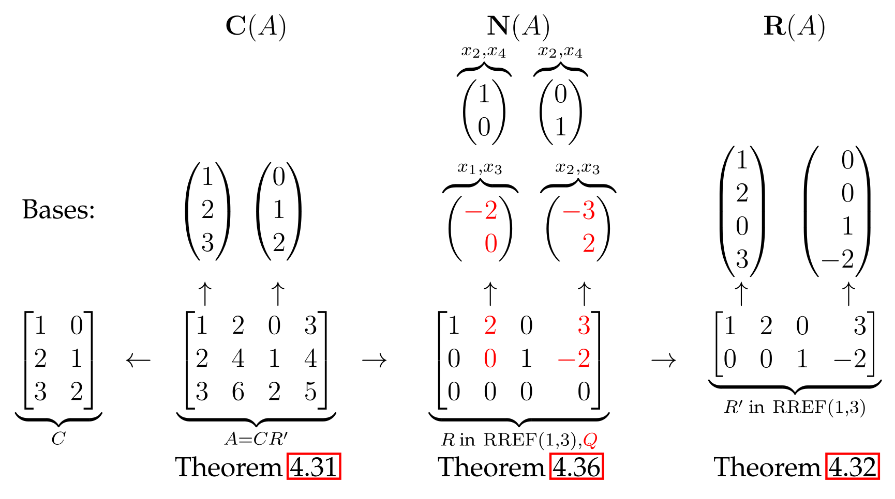

## The Three Fundamental Subspaces & Their Computation

- Three **fundamental subspaces** for any $m \times n$ matrix $A$: **Column Space** $C(A)$, **Row Space** $R(A)$, and **Nullspace** $N(A)$.
- **Basis**: A minimal, finite description of these (often infinite) vector spaces.
- Key computation tool: **Gauss-Jordan elimination** to find the unique **Reduced Row Echelon Form (RREF)**, denoted $R$.

### Finding a Basis for the Column Space C(A)

- **Theorem 4.31**: Basis is formed by columns of the **original matrix A** that correspond to the **pivot columns** in $R$.[^4.31]
- **Dimension**: The number of pivot columns, which equals the **rank** of the matrix.[^4.31]
    - $dim(C(A)) = rank(A) = r$.
- **Example**:
    - If $A = \begin{bmatrix} 1 & 2 & 0 & 3 \\ 2 & 4 & 1 & 4 \\ 3 & 6 & 2 & 5 \end{bmatrix}$ is reduced to $R = \begin{bmatrix} 1 & 2 & 0 & 3 \\ 0 & 0 & 1 & -2 \\ 0 & 0 & 0 & 0 \end{bmatrix}$, the pivots are in columns 1 and 3.
    - A basis for $C(A)$ is the 1st and 3rd columns of $A$: $\{ \begin{pmatrix} 1 \\ 2 \\ 3 \end{pmatrix}, \begin{pmatrix} 0 \\ 1 \\ 2 \end{pmatrix} \}$.
    - $dim(C(A)) = 2$.

### Finding a Basis for the Row Space R(A)

- **Theorem 4.32**: Basis is formed by the non-zero rows of the **RREF matrix R**.[^4.32]
- **Key Idea**: Row operations don't change the row space ($R(A) = R(R)$). The non-zero rows of $R$ are linearly independent by construction.
- **Dimension**: The number of non-zero rows in $R$, which also equals the **rank**.[^4.32]
    - $dim(R(A)) = rank(A) = r$.
- **Example**:
    - For the same $R$ as above, a basis for $R(A)$ is $\{ \begin{pmatrix} 1 \\ 2 \\ 0 \\ 3 \end{pmatrix}, \begin{pmatrix} 0 \\ 0 \\ 1 \\ -2 \end{pmatrix} \}$.
    - $dim(R(A)) = 2$.

### Equality of Ranks

- **Theorem 4.33**: For any matrix $A$, **column rank** equals **row rank**.
    - $rank(A) = rank(A^T)$.[^4.33]
- Non-obvious result, proven by showing $dim(C(A)) = r$ and $dim(R(A)) = r$.
- **Corollary 4.34**: The rank $r$ of an $m \times n$ matrix satisfies $r \le min(m, n)$.[^4.34]

### Finding a Basis for the Nullspace N(A)

- **Key Idea**: The nullspace is invariant under row operations: $N(A) = N(R)$.
- Variables are classified as **dependent** (pivot columns) or **free** (non-pivot columns).
- $N(A)$ is **isomorphic** to $R^{n-r}$ ($n$ = columns, $r$ = rank).[^4.35]
    - Isomorphism $T$: maps $x \in N(A)$ to the vector of its free variables.
- **Dimension**: The number of free variables.
    - $dim(N(A)) = n - r$.[^4.36]
- **Theorem 4.36 (Basis Construction)**: Basis via **special solutions**: For each free variable, set it to 1 and others to 0, then solve for dependent variables.[^4.36]
- **Example**:
    - For $R = \begin{bmatrix} 1 & 2 & 0 & 3 \\ 0 & 0 & 1 & -2 \\ 0 & 0 & 0 & 0 \end{bmatrix}$, variables $x_1, x_3$ are dependent; $x_2, x_4$ are free. System $Rx=0$:
        - $x_1 + 2x_2 + 3x_4 = 0 \implies x_1 = -2x_2 - 3x_4$
        - $x_3 - 2x_4 = 0 \implies x_3 = 2x_4$
    - **Special Solution 1** (set $x_2=1, x_4=0$): $x_1=-2, x_3=0 \implies v_1 = \begin{pmatrix} -2 \\ 1 \\ 0 \\ 0 \end{pmatrix}$.
    - **Special Solution 2** (set $x_2=0, x_4=1$): $x_1=-3, x_3=2 \implies v_2 = \begin{pmatrix} -3 \\ 0 \\ 2 \\ 1 \end{pmatrix}$.
    - Basis for $N(A)$ is $\{ \begin{pmatrix} -2 \\ 1 \\ 0 \\ 0 \end{pmatrix}, \begin{pmatrix} -3 \\ 0 \\ 2 \\ 1 \end{pmatrix} \}$, and $dim(N(A)) = 4 - 2 = 2$.

## The General Solution of Ax = b

### Structure and Computation of the Solution Space

- The **solution space** $Sol(A,b)$ is the set of all solutions to $Ax=b$.[^4.37]
- For $b \ne 0$, this is **not a vector subspace** as it does not contain the zero vector.
- It is an **affine subspace**: the nullspace shifted by a particular solution $s$.
    - **Theorem 4.38**: $Sol(A,b) = \{ s + x \mid x \in N(A) \}$.[^4.38]
    - The choice of the particular solution $s$ does not change the resulting set.
- **Theorem 4.39**: The **dimension** of the solution space is defined as the dimension of the nullspace.[^4.39]
    - $dim(Sol(A,b)) := dim(N(A)) = n - r$.
- **General Solution Procedure**:
    1. Find **one particular solution** $s$ for $Ax=b$.
    2. Find a **basis** $\{v_1, \dots, v_{n-r}\}$ for the nullspace $N(A)$.
    3. The complete solution set is $s + \lambda_1 v_1 + \dots + \lambda_{n-r} v_{n-r}$ for any scalars $\lambda_i$.

### Existence of Solutions & System Classification

- **Existence Condition**: A solution to $Ax=b$ exists if and only if $b \in C(A)$.
- **Theorem 4.40**: If a matrix has **full row rank** ($r=m$), the system $Ax=b$ is **always solvable** for any $b \in R^m$.[^4.40]
    - Reason: If $dim(C(A)) = m$, then $C(A)$ must be the entire space $R^m$.
- **Informal Theorem 4.41**: If rank is less than the number of rows ($r<m$), the system is **typically unsolvable** for a random vector $b$.[^4.41]
- **System Types (Definition 4.42)**:[^4.42]
    - **Square** ($m=n$): Typically solvable with a unique solution (if full rank).
    - **Underdetermined** ($m<n$, wide matrix): If solvable, has **infinitely many solutions** as $dim(N(A)) = n-r \ge n-m > 0$. **Typically solvable** for a "typical" matrix A.[^4.44]
    - **Overdetermined** ($m>n$, tall matrix): **Typically unsolvable** as $r \le n < m$.[^4.43]

[^4.31]: **Theorem 4.31.** Let A be an m × n matrix, and let R in RREF(j1, j2, ..., jr) be the result of Gauss-Jordan elimination on A according to Theorem 3.17. Then A has its independent columns at indices j1, j2, . . ., jr, and these columns form a basis of the column space C(A). In particular, dim(C(A)) = rank(A) = r.
[^4.32]: **Theorem 4.32.** Let A be an m × n matrix, and let R in RREF(j1, j2, . . ., jr) be the result of Gauss-Jordan elimination on A, according to Theorem 3.17. Then the first r rows of R form a basis of the row space R(A). In particular, dim(R(A)) = r.
[^4.33]: **Theorem 4.33.** Let A be an m × n matrix. Then rank(A) = rank(A^T).
[^4.34]: **Corollary 4.34 (The rank ist at most the smaller of the two matrix dimensions).** Let A be an m × n matrix of rank r. Then r ≤ min(n, m).
[^4.35]: **Lemma 4.35 (Nullspace isomorphism).** Let R be an m × n matrix in RREF(j1, j2, . . ., jr), and let k1, k2, . . . , kn−r be the column indices not in {j1, j2, . . . , jr}. Then T : N(R) → R^(n−r), T: x -> (xk1, xk2, ..., xk(n-r))^T is an isomorphism (bijective linear transformation) between N(R) and R^(n−r). In particular, we get dim(N(R)) = n − r from Lemma 4.27.
[^4.36]: **Theorem 4.36.** Let A be an m × n matrix, and let R in RREF(j1, j2, . . . , jr) be the result of Gauss-Jordan elimination on A according to Theorem 3.17. Let k1, k2, . . . , kn−r be the column indices not in {j1, j2, . . . , jr}, and let Q be the r × (n − r) submatrix of R containing the first r rows and columns k1, k2, . . . , kn−r. A basis of the nullspace N(A) is given by the n − r vectors v1, v2, . . . , vn−r, where vi is the vector x ∈ N(R) with (xk1, xk2, ..., xk(n-r))^T = ei, (xj1, xj2, ..., xjr)^T = -Qei. We note that Qei is the i-th column of Q. In particular, dim(N(A)) = n − r.
[^4.37]: **Definition 4.37 (Solution space of a system of linear equations).** Let A be an m × n matrix and b ∈ R^m. The set Sol(A, b) := {x ∈ R^n : Ax = b} ⊆ R^n is the solution space of Ax = b.
[^4.38]: **Theorem 4.38 (Solution space from shifting the nullspace).** Let A be an m × n matrix, b ∈ R^m. Let s be some solution of Ax = b. Then Sol(A, b) = {s + x : x ∈ N(A)}.
[^4.39]: **Theorem 4.39 (Dimension of the solution space).** Let A be an m × n matrix of rank r. If Ax = b has a solution, then Sol(A, b) has dimension n−r, where dim(Sol(A, b)) := dim(N(A)).
[^4.40]: **Theorem 4.40 (Systems of rank m are solvable).** Let A be an m × n matrix of rank r = m. Then Ax = b has a solution for every b ∈ R^m.
[^4.41]: **Informal Theorem 4.41 (Systems of rank less than m are typically unsolvable).** Let A be an m × n matrix of rank r < m. For a "typical" b, the system Ax = b has no solution.
[^4.42]: **Definition 4.42 (Square, underdetermined, overdetermined system).** Let A be an m × n matrix, b ∈ R^m.
(i) If m = n (A is a square matrix), the system Ax = b is called square.
(ii) If m < n (A is a wide matrix), the system Ax = b is called underdetermined.
(iii) If m > n (A is a tall matrix), the system Ax = b is called overdetermined.
[^4.44]: **Informal Theorem 4.44 (Square and Underdetermined systems are typically solvable).** Let b ∈ R^m, m ≤ n. For a "typical" matrix A ∈ R^(m×n), the square or underdetermined system Ax = b has a solution.
[^4.43]: **Informal Theorem 4.43 (Overdetermined systems are typically unsolvable).** Let A be a tall matrix. For a "typical" b, the overdetermined system Ax = b has no solution.
