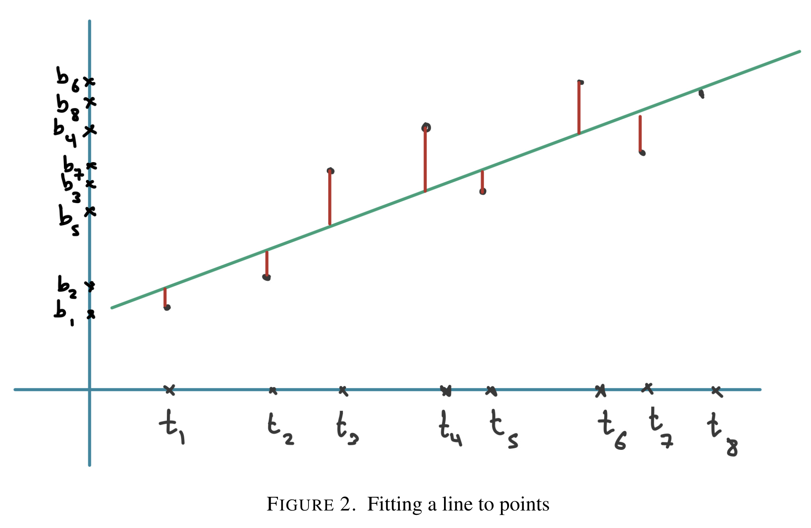

- **Goal:** Find "best" $\hat{x}$ for unsolvable $Ax=b$ (typically $m > n$).
- **Problem:** $\hat{x} = \operatorname{argmin}_{x \in \mathbb{R}^n} \|Ax - b\|^2$.
    - **Note:** Square irrelevant for solution location (monotonic function).
    - Name "Least Squares" derives from minimizing squared Euclidean norm ($L_2$) of error vector.
- **Geometry:** $A\hat{x}$ is **projection** of $b$ onto $C(A)$.
- **Normal Equations:** Error orthogonal to $C(A) \implies A^\top(b - A\hat{x}) = 0$.
    - **Formula:** $A^\top A \hat{x} = A^\top b$ .[^fact6.1.1]
    - Always solvable since $C(A^\top) = C(A^\top A)$.
    - **Full Column Rank:** Columns linearly independent $\implies A^\top A$ invertible $\implies \hat{x} = (A^\top A)^{-1}A^\top b$ .[^fact6.1.1]

## Applications: Data Fitting

- **Linear Regression:** Fit $b \approx \alpha_0 + \alpha_1 t$ to points $(t_k, b_k)$.
    - **Setup:** $A = [\mathbf{1}, \mathbf{t}]$ (Column of 1s, column of $t_k$) .[^eq6]
    - **Independence:** Guaranteed if $\ge 2$ distinct $t_k$ values .[^lem6.1.2]
    - **Orthogonal Trick:** Shift variable to center (e.g., $t^{new}_k = t_k - \text{mean}(t)$) so $\sum t^{new}_k = 0$ .[^rem6.1.3]
        - **Result:** Columns orthogonal $\implies A^\top A$ diagonal $\implies$ trivial inversion/independent coefficient calculation.
- **Polynomial Fitting:** Fit curves (e.g., parabolas).
    - **Matrix:** Vandermonde-style (Cols: $1, t, t^2, \dots$) .[^ex6.1.4]
    - **Key:** Problem **linear** in coefficients $\alpha$, not features $t$.

[^fact6.1.1]: **Fact 6.1.1.** A minimizer of (3) is also a solution of (4). When $A$ has independent columns the unique minimizer $\hat{x}$ of (3) is given by $$\hat{x} = (A^\top A)^{-1}A^\top b$$
[^eq6]: **(6)** $$\min_{\alpha_0, \alpha_1} \left\| b - A \begin{pmatrix} \alpha_0 \\ \alpha_1 \end{pmatrix} \right\|^2,$$ where $$b = \begin{pmatrix} b_1 \\ \vdots \\ b_m \end{pmatrix} \text{ and } A = \begin{bmatrix} 1 & t_1 \\ \vdots & \vdots \\ 1 & t_m \end{bmatrix}.$$
[^lem6.1.2]: **Lemma 6.1.2.** The columns of the $m \times 2$ matrix $A$ defined before are linearly dependent if and only if $t_i = t_j$ for all $i \neq j$.
[^rem6.1.3]: **Remark 6.1.3.** If the columns of $A$ are pairwise orthogonal, then $A^\top A$ is a diagonal matrix, which is easy to invert. In this example, the columns of $A$ being orthogonal corresponds to $\sum_{k=1}^m t_k = 0$. We could simply do a change of variables to a new time $t_k^{new} = t_k - \frac{1}{m} \sum_{i=1}^m t_i$ to achieve this. If indeed $\sum_{k=1}^m t_k = 0$ then the equation above could be easily simplified: $$ \begin{pmatrix} \alpha_0 \\ \alpha_1 \end{pmatrix} = \begin{bmatrix} m & 0 \\ 0 & \sum_{k=1}^m t_k^2 \end{bmatrix}^{-1} \begin{pmatrix} \sum_{k=1}^m b_k \\ \sum_{k=1}^m t_k b_k \end{pmatrix} = \begin{bmatrix} \frac{1}{m} & 0 \\ 0 & \frac{1}{\sum_{k=1}^m t_k^2} \end{bmatrix} \begin{pmatrix} \sum_{k=1}^m b_k \\ \sum_{k=1}^m t_k b_k \end{pmatrix} = \begin{pmatrix} \frac{1}{m} \sum_{k=1}^m b_k \\ (\sum_{k=1}^m t_k b_k) / (\sum_{k=1}^m t_k^2) \end{pmatrix}. $$
[^ex6.1.4]: **Example 6.1.4 (Fitting a Parabola).** [...] Similarly as with linear regression, it is natural to attempt to minimze $$(7) \quad \min_{\alpha_0, \alpha_1, \alpha_2} \left\| b - A \begin{pmatrix} \alpha_0 \\ \alpha_1 \\ \alpha_2 \end{pmatrix} \right\|^2,$$ where $$b = \begin{pmatrix} b_1 \\ b_2 \\ \vdots \\ b_{m-1} \\ b_m \end{pmatrix} \text{ and } A = \begin{bmatrix} 1 & t_1 & t_1^2 \\ 1 & t_2 & t_2^2 \\ \vdots & \vdots & \vdots \\ 1 & t_{m-1} & t_{m-1}^2 \\ 1 & t_m & t_m^2 \end{bmatrix},$$
