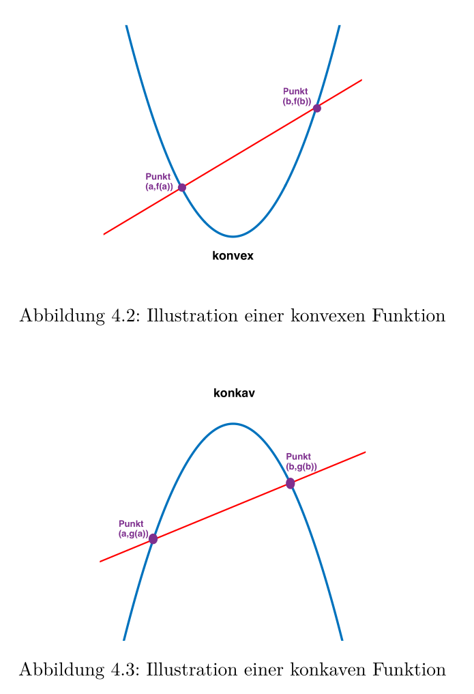
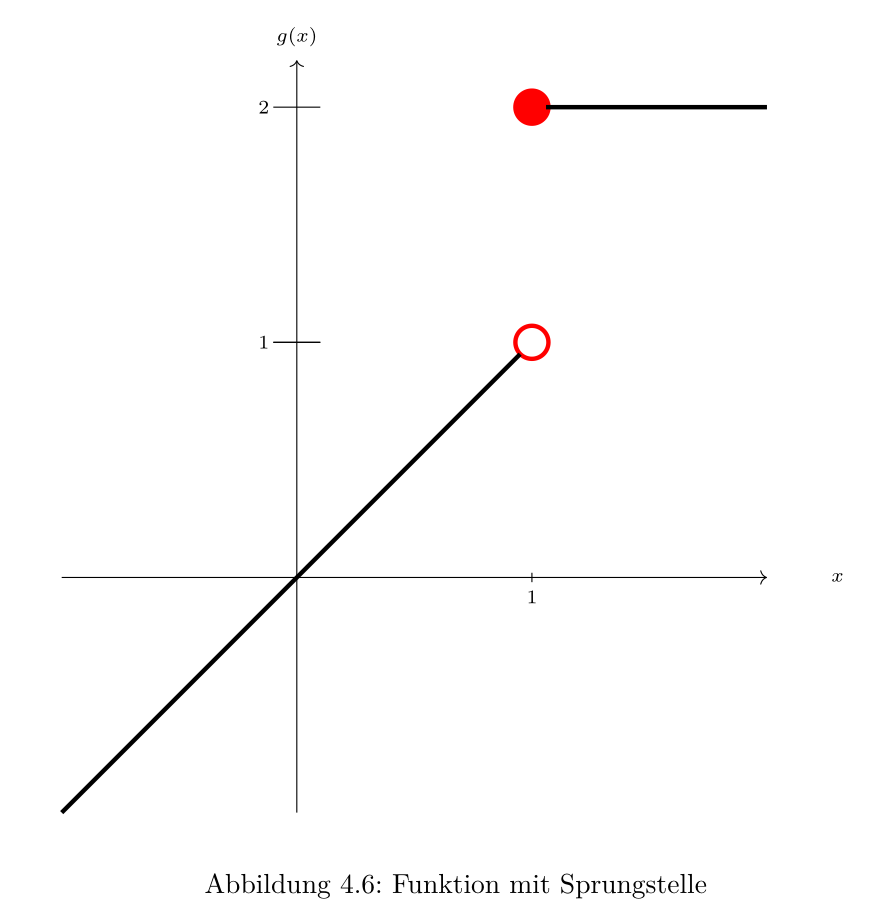

## Grundlagen der Funktionen

- **Definition & Variablen**
    - **Funktion / Abbildung** (function / map): Zuordnungsvorschrift, jedem zulässigen Input **genau ein** Output zugeordnet [^def4.1].
    - **Definitionsbereich** ($\mathbb{D}(f)$, domain): Menge zulässiger Inputs.
    - **Zielbereich** (codomain): Zielmenge der Abbildung (meist $\mathbb{R}$).
    - **Wertebereich / Bildmenge** ($\mathbb{W}(f)$, image / range): Menge *tatsächlich* angenommener Outputs.
    - **Variablen**: **Unabhängig** ($x$, Input/Argument) vs. **Abhängig** ($y = f(x)$, Output).
- **Mengenoperationen**
    - **Bild** ($f(I)$): Output-Menge einer Teilmenge $I \subset \mathbb{D}(f)$ [^def4.1].
    - **Urbild** ($f^{-1}(J)$): Input-Menge, die Outputs in $J$ generiert (keine Umkehrfunktion!).
- **Konstruktion neuer Funktionen**
    - **Restriktion / Einschränkung** ($f|_{D'}$): Funktion beschränkt auf Teilmenge $D' \subset \mathbb{D}(f)$ [^def4.6]. Formal eine **neue Funktion** (Zweck: Erzwingung von Bijektivität, z.B. $x^2$ auf $\mathbb{R}_0^+$ für Wurzel).
    - **Verknüpfung / Komposition** ($g \circ f$): Einsetzen einer Funktion in eine andere ($g(f(x))$) [^def4.7].
        - $f$ = **innere**, $g$ = **äussere** Funktion.
        - Assoziativ: $h \circ (g \circ f) = (h \circ g) \circ f$.
        - Bedingung: Output $f$ liegt in Input-Menge $g$.
    - **Identitätsfunktion** ($id_X$): Input unverändert als Output ($id_X(x) = x$) [^def4.8].
    - **Inverse / Umkehrfunktion** ($f^{-1}$): Existiert **nur bei Bijektivität** [^def4.8].
        - Eigenschaften: $f^{-1} \circ f = id_X$ und $f \circ f^{-1} = id_Y$.
        - Graphisch: Spiegelung an Winkelhalbierender ($y = x$).

## Eigenschaften von Funktionen

- **Abbildungsverhalten**
    - **Injektiv** (injective): Verschiedene Inputs $\Rightarrow$ verschiedene Outputs ($f(x_1) = f(x_2) \Rightarrow x_1 = x_2$) [^def4.4]. Graph: Horizontale schneidet max. einmal.
    - **Surjektiv** (surjective): Jedes Element im Zielbereich getroffen (Zielbereich = Wertebereich).
    - **Bijektiv** (bijective): Injektiv **und** surjektiv.
- **Werte & Symmetrie**
    - **Beschränktheit** [^def4.2]:
        - **Nach oben**: $f(x) \le M$.
        - **Nach unten**: $f(x) \ge M$.
        - **Beschränkt**: $|f(x)| \le M$ (Beispiel: Sinus, Cosinus).
    - **Gerade / Ungerade** [^def4.9]:
        - **Gerade** (even): $f(-x) = f(x)$. y-Achsensymmetrie (z.B. $x^2$, Cosinus).
        - **Ungerade** (odd): $f(-x) = -f(x)$. Punktspiegelung am Ursprung (z.B. $x^3$, Sinus).
- **Kurvenverlauf**
    - **Monotonie** [^def4.10]:
        - **Wachsend** ($x_1 < x_2 \Rightarrow f(x_1) \le f(x_2)$, Plateaus erlaubt).
        - **Streng wachsend** ($x_1 < x_2 \Rightarrow f(x_1) < f(x_2)$, keine Plateaus).
        - Analog: fallend ($\ge$) und streng fallend ($>$).
    - **Satz Monotonie $\Rightarrow$ Injektivität**: Jede streng monotone Funktion ist zwingend injektiv [^sat4.12].
        - *Beweisidee (Widerspruch)*: Annahme $x_1 < x_2$ mit $f(x_1) = f(x_2)$ verletzt zwingende Ungleichung ($<$ oder $>$) der strengen Monotonie.
    - **Graphenkrümmung** [^def4.13]:
      
        - **Konvex** (linksgekrümmt): Linkskurve, verläuft **unterhalb** Sekante (Beispiel: $x^2$).
        - **Konkav** (rechtsgekrümmt): Rechtskurve, verläuft **oberhalb** Sekante (Beispiel: $-x^2$).

## Grenzwerte von Funktionen

- **Konzept & Existenz**
    - **Grenzwert / Limes** ($L$): Annäherung Funktionswerte an $L$ für Argumente $x \to x_0$ [^def4.16].
    - **$\epsilon$-$\delta$-Kriterium**: Zu vorgegebener y-Abweichung $\epsilon > 0$ existiert x-Distanz $\delta > 0$ $\Rightarrow$ Graph in Box eingesperrt.
    - **Definiertheit**: Funktion muss bei $x_0$ **nicht definiert** sein.
    - **Hebbare Definitionslücke**: Limes existiert, Funktion unbestimmt. Stetige Fortsetzung durch Setzen von $\tilde{f}(x_0) = L$ möglich.
    - **Sprungstelle**: Unterschiedliche Annäherungswerte $\to$ allgemeiner Grenzwert existiert nicht.
      
- **Spezifische Annäherungen**
    - **Einseitige Grenzwerte** [^def4.18]:
        - **Rechtsseitig**: Annäherung von oben ($x > x_0$ bzw. $x \ge x_0$).
        - **Linksseitig**: Annäherung von unten ($x < x_0$ bzw. $x \le x_0$).
        - *Hinweis*: Ausschluss von $x_0$ in der Definition erlaubt mehr Flexibilität (sonst muss Grenzwert dem Funktionswert entsprechen).
    - **Folgenkriterium**: $\lim_{x \to x_0} f(x) = L \iff \lim_{n \to \infty} f(x_n) = L$ für jede Folge $x_n \to x_0$ (Slides 2614a).
- **Globales & Unbeschränktes Verhalten**
    - **Im Unendlichen**: Verhalten für beliebig grosse/kleine Argumente ($x \to \pm \infty$) [^def4.19].
    - **Uneigentliche Grenzwerte**: Funktionswerte über-/unterbieten jede Schranke $N$, streben gegen $\pm \infty$ (Divergenz) [^def4.20].
- **Rechenregeln**
    - Grenzwerte aufteilbar bei Addition, Subtraktion, Multiplikation, Skalierung, Division ($L \neq 0$) [^sat4.21].
    - **Warnung**: Gelten **nur für endliche Werte**. Operationen mit $\pm \infty$ zwingen zu Einzelfallprüfungen wegen pathologischer Fälle.

[^def4.1]: Definition 4.1. Eine Funktion (Abbildung) (englisch function or map) ist eine Zuordnungsvorschrift, welche jedem zulässigen Input genau einen Output aus dem Zielbereich (englisch range or codomain) zuordnet.
	Die Menge aller möglichen Inputs heisst Definitionsbereich (englisch domain), bezeichnet mit $\text{domain}(f)$ oder $\mathbb{D}(f)$.
	Die Menge aller tatsächlich angenommener/realisierter Outputs heisst Wertebereich (Bildmenge oder kurz Bild) (englisch image) , bezeichnet mit $\text{image}(f)$ oder $\mathbb{W}(f)$.
	$f : \mathbb{D}(f) \to \text{Zielbereich}$
	$x \mapsto y = f(x)$
	Der Input heisst unabhängige Variable (Argument) (englisch argument or variable).
	Der Output heisst abhängige Variable (englisch dependent variable).
	Bemerkung:
	Wir können auch eine (strikte) Teilmenge des Definitionsbereichs einer Funktion betrachten, und die Frage stellen, welche Outputs von den Elementen dieser Teilmenge unter der Funktion $f : X \to Y$ erzeugt werden.
	Dies ergibt das Bild der (Teil-)Menge $I \subset \mathbb{D}(f)$, bezeichnet mit $f(I)$, welches wie folgt definiert ist:
	$f(I) := \{y = f(x) \in Y \mid x \in I \subset \mathbb{D}(f) \subset X\}$
	Analog können wir auch die Frage stellen, ob und von welchen Argumenten Elemente in $Y$ "erzeugt" werden. Dazu betrachten wir eine (Teil-)Menge $J \subset Y$. Das soganennte Urbild (englisch preimage) von $J$ unter $f$, bezeichnet mit $f^{-1}(J)$, ist dann die folgende Menge
	$f^{-1}(J) := \{x \in X \mid f(x) \in J \subset Y \}$
	Man beachte, dass hier keine Umkehrfunktion gemeint ist!
[^def4.6]: Definition 4.6. Es sei $f : \mathbb{D}(f) \to \mathbb{R}$ mit $\mathbb{D}(f) \neq \emptyset$ und es sei weiters $D' \subset \mathbb{D}(f)$. Dann kann man die Einschränkung/Restriktion (englisch restriction) von $f$ auf $D'$ betrachten, nämlich die Funktion $f|_{D'} : D' \to \mathbb{R}$ mit $f|_{D'}(x) = f(x) \quad \forall x \in D'$
[^def4.7]: Definition 4.7. Es seien $f : X \to Y$ und $g : Y \to Z$ zwei Funktionen.
	Dann ist die Verknüpfung/Komposition (englisch composition) von $f$ und $g$ die Funktion
	$g \circ f : X \to Z \text{ mit } g \circ f(x) = g(f(x)) \quad \forall x \in X$
	Die Funktion $f$ nennt man innere Funktion (englisch inner function) und $g$ nennt man die äussere Funktion (englisch outer function).
[^def4.8]: Definition 4.8. Es sein $X$ eine beliebige (nicht leere) Menge,
	Dann ist die Identitätsfunktion $id_X$, oder kurz Identität (englisch identity function or identity), definiert als $id_X(x) = x \quad \forall x \in X$
	Falls eine Funktion $f : X \to Y$ bijektiv ist, gibt es eine eindeutige Funktion (Abbildung) $g : Y \to X$ mit den Eigenschaften $g \circ f = id_X \text{ und } f \circ g = id_Y$
	Dies Funktion $g$ nennt man die Inverse (auch Umkehrfunktion, Inverse Funktion oder inverse Abbildung)(englisch inverse function) und wird meist mit $f^{-1}$ bezeichnet.
[^def4.4]: Definition 4.4. Wir betrachten eine Funktion $f : X \to Y$.
	Diese Funktion nennen wir
	- injektiv (englisch injective), falls gilt: $\forall x_1, x_2 \in X \ (f(x_1) = f(x_2) \Rightarrow x_1 = x_2)$
	- surjektiv (englisch surjective), falls gilt: $\forall y \in Y \exists x \in X : f(x) = y$
	- bijektiv (englisch bijective), falls sie injektiv und surjektiv ist.
[^def4.2]: Definition 4.2. Es sei nun $f : \mathbb{D}(f) \to \mathbb{R}$ mit $\mathbb{D}(f) \neq \emptyset$. Dann
	- nennen wir $f$ nach oben beschränkt (englisch bounded from above), falls $M \in \mathbb{R}$ existiert mit $f(x) \le M \quad \forall x \in \mathbb{D}(f)$
	- nennen wir $f$ nach unten beschränkt (englisch bounded from below), falls alls $M \in \mathbb{R}$ existiert mit $f(x) \ge M \quad \forall x \in \mathbb{D}(f)$
	- nennen wir $f$ beschränkt (englisch bounded), falls alls $M \in \mathbb{R}$ existiert mit $|f(x)| \le M \quad \forall x \in \mathbb{D}(f)$
[^def4.9]: Definition 4.9. Wiederum betrachten wir eine Funktion $f : \mathbb{R} \to \mathbb{R}$.
	Diese Funktion nennen wir
	- ungerade (englisch odd function), falls gilt: $\forall x \in \mathbb{R} \ f(-x) = -f(x)$
	- gerade (englisch even function), falls gilt: $\forall x \in \mathbb{R} \ f(-x) = f(x)$
[^def4.10]: Definition 4.10. Wir betrachten eine Funktion $f : X = \mathbb{D}(f) \subset \mathbb{R} \to \mathbb{R}$.
	Diese Funktion nennen wir
	- monoton wachsend (englisch monotonically increasing or non-decreasing), falls gilt: $\forall x_1, x_2 \in X \ (x_1 < x_2 \Rightarrow f(x_1) \le f(x_2))$
	- streng monoton wachsend (englisch strictly increasing), falls gilt: $\forall x_1, x_2 \in X \ (x_1 < x_2 \Rightarrow f(x_1) < f(x_2))$
	- monoton fallend (englisch monotonically decreasing or non-increasing), falls gilt: $\forall x_1, x_2 \in X \ (x_1 < x_2 \Rightarrow f(x_1) \ge f(x_2))$
	- streng monoton fallend (englisch strictly decreasing), falls gilt: $\forall x_1, x_2 \in X \ (x_1 < x_2 \Rightarrow f(x_1) > f(x_2))$
	- monoton (englisch monotone or monotonic), falls $f$ monoton wachsend oder monoton fallend ist
	- streng monoton (englisch stricitly monotone or strictly monotonic), falls $f$ streng monoton wachsend oder streng monoton fallend ist
[^sat4.12]: Satz 4.12. Es gilt: Jede streng monotone Funktion ist injektiv.
[^def4.13]: Definition 4.13. Der Graph einer Funktion (die Menge aller Punkte der Form $(x, f(x))$) heisst linksgekrümmt (konvex) (englisch convex), falls der Graph beim Durchlaufen von links nach rechts eine Linkskurve vollführt.
	Der Graph einer Funktion heisst rechtsgekrümmt (konkav) (englisch concave), falls der Graph beim Durchlaufen von links nach rechts eine Rechtskurve vollführt.
[^def4.16]: Definition 4.16. Es sei $f : \mathbb{D}(f) \to \mathbb{R}$, es sei $x_0 \in \mathbb{R}$ und es gelte $\mathbb{D}(f) \cap (x_0 - \delta, x_0 + \delta) \neq \emptyset \quad \forall \delta > 0$.
	Dann ist $L \in \mathbb{R}$ der Grenzwert/Limes (englisch limit) von $f(x)$ an der Stelle $x_0$, falls gilt $\forall \varepsilon > 0 \exists \delta > 0 \text{ so dass } x \in \mathbb{D}(f) \cap (x_0 - \delta, x_0 + \delta) \Rightarrow |f(x) - L| < \varepsilon$
[^def4.18]: Definition 4.18. Einseitige Grenzwerte
	Wir nehmen analog zum obigen Fall an, es gelte $\mathbb{D}(f) \cap [x_0, x_0 + \delta) \neq \emptyset \quad \forall \delta > 0$.
	- Falls gilt $\forall \varepsilon > 0 \exists \delta > 0 \text{ so dass } x \in \mathbb{D}(f) \cap [x_0, x_0 + \delta) \Rightarrow |f(x) - L| < \varepsilon$ hat $f$ in $x_0$ den rechtsseitigen Grenzwert (englisch right-sided limit) $L$, d.h. $\lim_{x \ge x_0, x \to x_0} f(x) = L$
	- Falls gilt $\forall \varepsilon > 0 \exists \delta > 0 \text{ so dass } x \in \mathbb{D}(f) \cap (x_0 - \delta, x_0] \Rightarrow |f(x) - L| < \varepsilon$ hat $f$ in $x_0$ den linksseitigen Grenzwert (englisch left-sided limit) $L$, d.h. $\lim_{x \le x_0, x \to x_0} f(x) = L$
[^def4.19]: Definition 4.19. Grenzwerte im Unendlichen
	- Falls gilt $\forall \varepsilon > 0 \exists M > 0 \text{ s.d. } \forall x \in X \ (x > M \Rightarrow |f(x) - L| < \varepsilon)$ hat $f$ für $x$ gegen unendlich (englisch at infinity) den Grenzwert $L$, d.h. $\lim_{x \to \infty} f(x) = L$
	- Falls gilt $\forall \varepsilon > 0 \exists M > 0 \text{ s.d. } \forall x \in X \ (x < -M \Rightarrow |f(x) - L| < \varepsilon)$ hat $f$ für $x$ gegen $-\infty$ (englisch at minus infinity) den Grenzwert $L$, d.h. $\lim_{x \to -\infty} f(x) = L$
[^def4.20]: Definition 4.20. Uneigentliche Grenzwerte
	- Falls gilt $\forall N > 0 \exists \delta > 0 \text{ s.d. } \forall x \in X \ (0 < |x - c| < \delta \Rightarrow f(x) > N)$ hat $f$ in $c$ den uneigentlichen Grenzwert (englisch improper limit) $\infty$, d.h. $\lim_{x \to c} f(x) = \infty$
	- Falls gilt $\forall N > 0 \exists \delta > 0 \text{ s.d. } \forall x \in X \ (0 < |x - c| < \delta \Rightarrow f(x) < -N)$ hat $f$ in $c$ den uneigentlichen Grenzwert (englisch improper limit) $-\infty$, d.h. $\lim_{x \to c} f(x) = -\infty$
[^sat4.21]: Satz 4.21. Wir nehmen an, es gelte $\lim_{x \to c} f(x) = K (\neq \pm \infty), \lim_{x \to c} g(x) = L (\neq \pm \infty)$ und $A$ sei eine beliebige feste Zahl.
	Dann gilt:
	i) $\lim_{x \to c}(f(x) + g(x)) = K + L$
	ii) $\lim_{x \to c}(f(x) - g(x)) = K - L$
	iii) $\lim_{x \to c}(f(x) \cdot g(x)) = K \cdot L$
	iv) $\lim_{x \to c}(A \cdot f(x)) = A \cdot K$
	v) Falls $L \neq 0$, haben wir $\lim_{x \to c}(f(x)/g(x)) = K/L$
