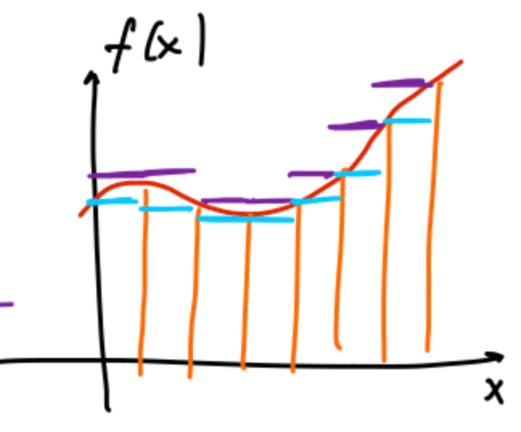

## Unbestimmte Integration

- **Stammfunktion** (Antiderivative) $F$: Ableitung entspricht **Integrand** $f$ ($F'(x) = f(x)$) [^def_stammfunktion].
    - Immer nur auf festgelegtes Intervall bezogen.
- **Unbestimmtes Integral** (Indefinite integral): **Ganze Familie** aller Stammfunktionen, Notation: $\int f(x) dx = F(x) + C$ [^def_stammfunktion].
    - **Wichtig:** Integrationskonstante $+C$ zwingend nötig (Anpassung an Anfangsbedingungen).
- **Rechenregeln:** Linearität (Faktoren ausklammern, Summen trennen).
- **Spezielle Standardintegrale:**
    - Konstante: $\int k dx = kx + C$.
    - Potenzregel: $\int x^n dx = \frac{1}{n+1}x^{n+1} + C$ ($n \neq -1$).
    - Ausnahmefall $n = -1$: $\int \frac{1}{x} dx = \ln|x| + C$.
        - **Kritische Falle:** **Absolutbetrag** zwingend, sonst bei $x < 0$ mathematischer Nonsens.
    - Exponentialfunktion: $\int e^x dx = e^x + C$.
    - Trigonometrie: Vorzeichen beachten ($\int \sin(x) dx = -\cos(x) + C$, $\int \cos(x) dx = \sin(x) + C$).
    - Hyperbelfunktionen: Kein Vorzeichenwechsel ($\int \sinh(x) dx = \cosh(x) + C$, $\int \cosh(x) dx = \sinh(x) + C$).

## Bestimmtes Integral (Riemann-Integral)

- **Motivation:** Flächenberechnung unter Kurven (z.B. Geschwindigkeitsgraph $v(t)$).
    - **Positionsänderung:** Vorzeichenbehaftet $\to \int v(t)dt$.
    - **Zurückgelegte Strecke:** Absolutbetrag (Motor läuft immer) $\to \int |v(t)|dt$.
- **Konstruktion & Riemann-Integrierbarkeit:**
  
    - **Zerlegung** (Partition): Intervall-Unterteilung in (nicht zwingend gleiche) Teilintervalle [^def_zerlegung].
    - **Treppenfunktion** (Step function): Konstante Werte auf Teilintervallen (Randpunkte irrelevant) [^def_treppenfunktion].
    - Integral der Treppenfunktion: Summe der Rechteckflächen (Breite $\cdot$ Höhe) [^def_integral_treppenfunktion].
    - **Obersummen / Untersummen** (Upper/Lower sums): Approximation der Funktion von oben (Treppe $\ge f$) und unten (Treppe $\le f$) [^def_ober_untersumme].
    - Funktion ist **Riemann-integrierbar**, wenn Supremum der Untersummen = Infimum der Obersummen [^def_riemann_int].
- **Eigenschaften des Integrals** [^satz_eig_riemann]:
    - **Linearität & Monotonie** (erhalten Ordnungsrelation $f \le g \Rightarrow \int f \le \int g$).
    - **Dreiecksungleichung:** $|\int f| \le \int |f|$.
    - **Umkehrung der Integrationsgrenzen:** Erzeugt **zusätzliches Minuszeichen** ($\int_b^a f = -\int_a^b f$).
    - **Aufteilung:** Integrationsbereich beliebig zerlegbar (nützlich bei Symmetrien).
- **Integrierbare Funktionsklassen:**
    - **Stetige** [^satz_stetig_int] und **monotone** [^satz_monoton_int] Funktionen stets Riemann-integrierbar.
    - **Wichtig:** Differenzierbarkeit **keine** Voraussetzung (Knickstellen/endliche Sprünge problemlos).
    - Einzelne, isolierte Punkte ohne Einfluss auf Integralwert (Fläche 0).
- **Funktionenfolgen (Sequence of functions):**
    - Bei **gleichmässiger Konvergenz** (Uniform convergence, globaler Fehler $\epsilon$ [^def_gleichmaessig]) integrierbarer Funktionen: Grenzfunktion integrierbar, Integral/Limes vertauschbar [^satz_int_gleichm].
    - *Hinweis:* Analoge Vererbung der Stetigkeit [^satz_stetig_gleichm] (Punktweise Konvergenz [^def_punktweise] reicht nicht aus).

## Hauptsatz der Integralrechnung

- **Mittelwertsatz der Integralrechnung:**
    - Durchschnittswert (Mean value) $f(c)$ eines stetigen $f$ auf $[a,b]$ an Stelle $c$ angenommen: $f(c) = \frac{1}{b-a} \int_a^b f(x)dx$ [^satz_mws_int].
- **Der Hauptsatz (Fundamental Theorem of Calculus - FTC)** [^satz_hauptsatz]:
    - Verknüpft Flächenberechnung mit Stammfunktionen.
    - $F(x) = \int_a^x f(y)dy + C$ **ist** eine Stammfunktion von $f$.
    - **Eindeutigkeit:** *Jede* Stammfunktion hat exakt diese Form.
    - *Beweisidee:* Differenzenquotient von $F$ via Integral-Dreiecksungleichung und Stetigkeit ($\varepsilon$-$\delta$) abschätzen $\to f(x_0)$.
- **Eindeutigkeits Beweis:**
    - Angenommen, es gibt alternative Stammfunktion $G(x)$.
    - Hilfsfunktion: $H(x) := G(x) - \int_a^x f(y)dy$.
    - Ableiten: $H'(x) = f(x) - f(x) = 0$.
    - Einzige Funktion mit Ableitung $0$ ist eine Konstante $C$.
    - Zwingende Folgerung: $G(x) = \int_a^x f(y)dy + C$. (Keine andere Struktur möglich).
- **Folgerungen (Korollare) für die Praxis:**
    - **Numerisches Grundprinzip:** Zustand = Startwert + aufsummierte Änderungen $\Rightarrow F(x) = F(a) + \int_a^x F'(t)dt$ [^korollar_hauptsatz1].
    - **Direktberechnung:** Bestimmtes Integral via $\int_a^b f(t)dt = F(b) - F(a)$ (Notation: $F(x)|_a^b$) [^korollar_hauptsatz2]. Obersummen unnötig.

## Integrationstechniken

### Partielle Integration (Integration by parts)

- **Konzept:** Umkehrung der Produktregel [^satz_partiell].
- **Formel:** $\int_a^b f(x)g'(x) dx = \left[ f(x)g(x) \right]_a^b - \int_a^b f'(x)g(x) dx$.
- **Anwendungstaktik:**
    - Ein Faktor zum **Ableiten** ($f \to f'$), einer zum **Integrieren** ($g' \to g$).
    - Ziel: Einfacheres Rest-Integral (z.B. Polynom-Grad verringern).
- **Algebraischer Lösungstrick:** Bei Rekursion des Ursprungsintegrals auf der rechten Seite dieses als Variable behandeln, umformen und dividieren.
    - *Beispiel $I = \int e^x \cos(x)dx$:*
    - Zweimal partiell integrieren $\Rightarrow I = e^x \cos(x) + e^x \sin(x) - \int e^x \cos(x)dx$.
    - Auf linke Seite addieren ($2I$) und halbieren $\Rightarrow I = \frac{1}{2} e^x (\cos(x) + \sin(x)) + C$.

### Substitution

- **Konzept:** Umkehrung der Kettenregel [^satz_subst1] [^satz_subst2].
- **Lösungsschritte (Bsp: $\int x^2 \sqrt{x-2} dx$):**
    1. Hässlichen Term als neue Variable setzen: $w = \sqrt{x-2}$.
    2. Nach $x$ auflösen: $x = w^2 + 2$ (ersetzt alte $x$-Terme).
    3. Ableiten zur Findung des Differentials: $\frac{dx}{dw} = 2w \Rightarrow dx = 2w dw$.
    4. Einsetzen, vereinfachtes Polynom integrieren.
- **Kritische Fehlerquellen:**
    - **Bestimmtes Integral:** Alte $x$-Grenzen **zwingend** in Substitutionsgleichung einsetzen (neue $w$-Grenzen). Oben/Unten-Reihenfolge stur beibehalten.
    - **Unbestimmtes Integral:** Resultat nie in Hilfsvariable belassen. **Zwingend Rücksubstitution** in $x$!

[^def_stammfunktion]: Definition (Stammfunktion, unbestimmtes Integral): Es sei $I \subset \mathbb{R}$ ein Intervall und $f(x) : I \to \mathbb{R}$ eine Funktion. Eine differenzierbare Funktion $F : I \to \mathbb{R}$ mit der Eigenschaft $F'(x) = f(x), \quad x \in I$ nennt man Stammfunktion von $f$ auf dem Intervall $I$. Das Bestimmen von $F(x)$ aus $f(x)$ nennt man (unbestimmte) Integration.
[^def_zerlegung]: Definition: Eine Zerlegung von $[a, b]$ ist eine endliche Menge von Punkten $a = x_0 < x_1 < x_2 < \dots < x_{n-1} < x_n = b$ mit $n \in \mathbb{N}$. Die auftretenden Punkte $x_i$ nennen wir Unterteilungspunkte. Eine solche Zerlegung führt automatisch zu einer Partition des Intervalls $[a, b]$: $[a, b] = \{x_0\} \cup (x_0, x_1) \cup \{x_1\} \cup (x_1, x_2) \cup \dots \cup (x_{n-1}, x_n) \cup \{x_n\}$. Eine Zerlegung $a = y_0 < y_1 < \dots < y_{m-1} < y_m = b$ ist eine Verfeinerung der Zerlegung $a = x_0 < x_1 < x_2 < \dots < x_{n-1} < x_n = b$, falls gilt $\{x_0, x_1, \dots, x_n\} \subseteq \{y_0, y_1, \dots, y_m\}$.
[^def_treppenfunktion]: Definition: Eine Funktion $f : [a, b] \to \mathbb{R}$ heisst Treppenfunktion, falls es eine Zerlegung $a = x_0 < x_1 < x_2 < \dots < x_{n-1} < x_n = b$ von $[a, b]$ gibt, sodass für $k = 1, 2, \dots n$ die Restriktionen von $f$ auf $(x_{k-1}, x_k)$, $f|_{(x_{k-1},x_k)}$ konstant sind. Wir sagen dann auch, dass $f$ eine Treppenfunktion bezüglich der Zerlegung $a = x_0 < x_1 < x_2 < \dots < x_{n-1} < x_n = b$ ist.
[^def_integral_treppenfunktion]: Definition: Es sei $f : [a, b] \to \mathbb{R}$ eine Treppenfunktion bezüglich der Zerlegung $a = x_0 < x_1 < x_2 < \dots < x_{n-1} < x_n = b$ von $[a, b]$. Dann ist das Integral der Treppenfunktion $f$ über $[a, b]$ die reelle Zahl $\int_a^b f(x) dx := \sum_{k=1}^n c_k (x_k - x_{k-1})$, wobei $c_k$ der Funktionswert von $f$ auf dem Intervall $(x_{k-1}, x_k)$ ist.
[^def_ober_untersumme]: Definition: Es sei $f : [a, b] \to \mathbb{R}$ eine Funktion. Dann ist die Menge der Obersummen $\mathcal{U}(f)$, respektive die Menge der Untersummen $\mathcal{L}(f)$ wie folgt definiert: $\mathcal{U}(f) := \left\{ \int_a^b s(x) dx \mid s \in \mathcal{TF}, s \ge f \right\}$ respektive $\mathcal{L}(f) := \left\{ \int_a^b s(x) dx \mid s \in \mathcal{TF}, s \le f \right\}$, wobei $\mathcal{TF}$ die Menge der Treppenfunktionen bezeichnet.
[^def_riemann_int]: Definition: Eine beschränkte Funktion $f : [a, b] \to \mathbb{R}$ nennt man Riemann-integrierbar, falls gilt $\sup \mathcal{L}(f) = \inf \mathcal{U}(f)$. In diesem Fall wird der gemeinsame Wert das Riemann-Integral von $f$ genannt, und geschrieben als $\int_a^b f dx := \sup \mathcal{L}(f) = \inf \mathcal{U}(f)$. $a$ nennt man untere Integrationsgrenze, $b$ obere Integrationsgrenze und $f$ den Integranden.
[^satz_eig_riemann]: Satz (Eigenschaften des Riemann-Integrals): i) (Linearität) Es seien $f, g : [a, b] \to \mathbb{R}$ zwei (Riemann-)integrierbare Funktionen, und es seien $\alpha, \beta \in \mathbb{R}$. Dann ist auch $\alpha f + \beta g$ integrierbar und es gilt $\int_a^b (\alpha f + \beta g)(x) dx = \alpha \int_a^b f(x) dx + \beta \int_a^b g(x) dx$. ii) (Monotonie) Es seien $f, g : [a, b] \to \mathbb{R}$ zwei (Riemann-)integrierbare Funktionen. Falls gilt $f \le g$, so gilt auch $\int_a^b f(x) dx \le \int_a^b g(x) dx$. iii) (Dreiecksungleichung) Es seien $f : [a, b] \to \mathbb{R}$ eine (Riemann-)integrierbare Funktion. Dann gilt $\left| \int_a^b f(x) dx \right| \le \int_a^b |f(x)| dx$. iv) (Umkehrung der Integrationsrichtung) Es seien $f : [a, b] \to \mathbb{R}$ eine (Riemann-)integrierbare Funktion. Dann gilt $\int_a^b f(x) dx = - \int_b^a f(x) dx$. v) (Aufteilung des Integrationsbereichs) Es seien $f : [a, b] \to \mathbb{R}$ eine (Riemann-)integrierbare Funktion. Dann gilt $\int_a^b f(x) dx = \int_a^c f(x) dx + \int_c^b f(x) dx, \quad a \le c \le b$.
[^satz_stetig_int]: Satz: Jede stetige Funktion $f : [a, b] \to \mathbb{R}$ ist Riemann-integrierbar.
[^satz_monoton_int]: Satz: Jede monotone Funktion $f : [a, b] \to \mathbb{R}$ ist Riemann-integrierbar.
[^def_gleichmaessig]: Definition: Es sei $D \subset \mathbb{R}, (f_n)_{n \in \mathbb{N}_0}$ eine Folge von Funktionen $f_n : D \subset \mathbb{R} \to \mathbb{R}$ und $f : D \subset \mathbb{R} \to \mathbb{R}$ eine weitere Funktion. Dann konvergiert die Folge $(f_n)_{n \in \mathbb{N}_0}$ gleichmässig gegen $f$, falls für jedes $\varepsilon > 0$ ein Index $N$ existiert, sodass für alle $n \ge N$ und für alle $x \in D$ gilt $|f_n(x) - f(x)| < \varepsilon$.
[^satz_int_gleichm]: Satz: Es sei $(f_n)_{n \in \mathbb{N}_0}$ eine Folge integrierbarer Funktionen $f_n : [a, b] \to \mathbb{R}$, welche gleichmässig gegen $f : [a, b] \to \mathbb{R}$ konvergiert. Dann ist auch $f$ integrierbar, und es gilt $\int_a^b f dx = \lim_{n \to \infty} \int_a^b f_n dx$.
[^satz_stetig_gleichm]: Satz: Es sei $D \subset \mathbb{R}$ und $(f_n)_{n \in \mathbb{N}_0}$ eine Folge stetiger Funktionen $f_n : D \subset \mathbb{R} \to \mathbb{R}$, welche gleichmässig gegen $f : D \subset \mathbb{R} \to \mathbb{R}$ konvergiert. Dann ist $f$ stetig.
[^def_punktweise]: Definition: Es sei $D \subset \mathbb{R}, (f_n)_{n \in \mathbb{N}_0}$ eine Folge von Funktionen $f_n : D \subset \mathbb{R} \to \mathbb{R}$ und $f : D \subset \mathbb{R} \to \mathbb{R}$ eine weitere Funktion. Dann konvergiert die Folge $(f_n)_{n \in \mathbb{N}_0}$ punktweise gegen $f$, falls für jedes $x \in D$ die reelle Folge $(f_n(x))_{n \in \mathbb{N}_0}$ gegen $f(x)$ konvergiert. $f$ heisst dann auch punktweiser Grenzwert der Folge $(f_n)_{n \in \mathbb{N}_0}$.
[^satz_mws_int]: Satz (Mittelwertsatz der Integralrechnung): Falls der Integrand $f(x)$ auf dem betrachteten Intervall $[a, b]$ stetig ist, gilt für ein $c \in [a, b]$: $f(c) = \frac{1}{b-a} \int_a^b f(x) dx$. Der Ausdruck $\frac{1}{b-a} \int_a^b f(x) dx$ ist der Mittelwert von $f$ über $[a, b]$.
[^satz_hauptsatz]: Satz (Hauptsatz der Integral- und Differentialrechnung): Es sei $f : [a, b] \to \mathbb{R}$ stetig. Dann ist für alle $C \in \mathbb{R}$ die folgende Funktion $F : [a, b] \to \mathbb{R}$ eine Stammfunktion von $f$: $F(x) := \int_a^x f(y) dy + C$. Ausserdem ist jede Stammfunktion von der obigen Form.
[^korollar_hauptsatz1]: Korollar: Es sei $F : [a, b] \to \mathbb{R}$ stetig differenzierbar. Dann gilt für alle $x \in [a, b]$: $F(x) = F(a) + \int_a^x F'(t) dt$.
[^korollar_hauptsatz2]: Korollar: Es sei $f : [a, b] \to \mathbb{R}$ stetig und $F : [a, b] \to \mathbb{R}$ eine Stammfunktion von $f$. Dann gilt $\int_a^b f(t) dt = \left. F(x) \right|_a^b = F(b) - F(a)$.
[^satz_partiell]: Satz (Partielle Integration): Es seien $f, g : [a, b] \to \mathbb{R}$ zwei stetig differenzierbare Funktionen. Dann gilt $\int_a^b f(x)g'(x) dx = \left. f(x)g(x) \right|_a^b - \int_a^b f'(x)g(x) dx$.
[^satz_subst1]: Satz (Substitution, Version 1): Es seien $I, J \subset \mathbb{R}$ zwei Intervalle, $f : I \to J$ stetig differenzierbare und $g : J \to \mathbb{R}$ stetig. Dann gilt für alle $[a, b] \subset I$: $\int_a^b g(f(x))f'(x) dx = \int_{f(a)}^{f(b)} g(y) dy$.
[^satz_subst2]: Satz (Substitution, Version 2): Es seien $I, J \subset \mathbb{R}$ zwei Intervalle, $f : I \to J$ stetig differenzierbar und $g : J \to \mathbb{R}$ stetig. Für $[a, b] \subset I$ gelte $f'(x) \neq 0$ für alle $x \in [a, b]$ und es sei $f^{-1} : [f(a), f(b)] \to \mathbb{R}$ die Inverse von $f|_{[a,b]}$. Dann gilt $\int_a^b g(f(x)) dx = \int_{f(a)}^{f(b)} g(y)(f^{-1})'(y) dy$.
