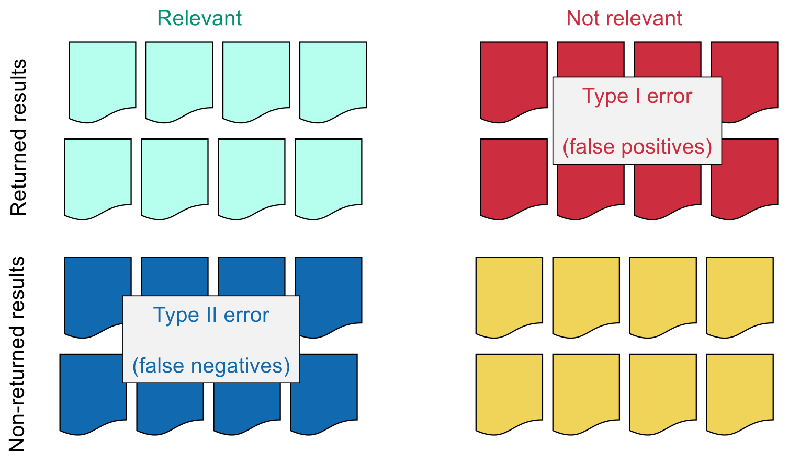
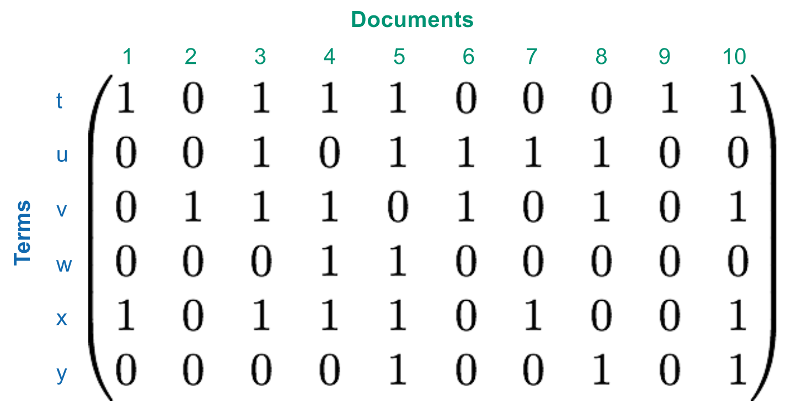
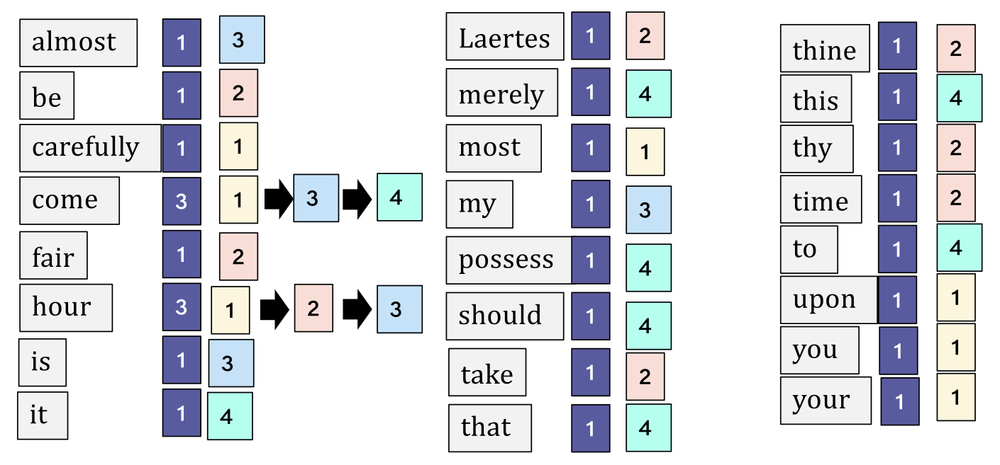

## Data Shapes

- **Data Shapes**: Structural models in database systems.
    - **Tables**: Relational model (SQL).
    - **Trees**: XML / JSON (denormalized tables).
    - **Graphs**: Graph databases (nodes and edges).
    - **Cubes**: Business Intelligence (multi-dimensional).
    - **Text Vectors**: Unstructured text data (IR focus).

## Text Data Models

- **Document**: Base unit of retrieval (e.g., book, email, web page).
- **Term**: Indexed unit / extracted word.
- **Term-Document Relationships**:
    - **Set of terms**: **Inclusion** only (presence/absence).
    - **Bag of terms / Multiset**: **Inclusion** and **occurrence** (frequency), no order.
    - **List of terms**: **Inclusion**, **occurrence**, and **order** (position).

## IR System Effectiveness

- **Information Need**: Actual intent inside user's brain (e.g., climate impact on butterflies).
- **Query**: Imperfect string representation of need; evaluation targets **need**, not **query**.
- **Result Classification**:
    - **True Positives (TP)**: Returned and relevant (desired).
    - **False Positives (FP)** / **Type I Error**: Returned but not relevant (waste).
    - **False Negatives (FN)** / **Type II Error**: Not returned but relevant (missed).
    - **True Negatives (TN)**: Not returned and not relevant.
- **Evaluation Metrics**:
    - **Precision**: Fraction of returned results being relevant ($TP / (TP + FP)$).
    - **Recall**: Fraction of existing relevant documents found ($TP / (TP + FN)$).
- **Compromise**: High precision and high recall simultaneously difficult; trade-off tuned based on acceptable error type.



## Naive Approach (Grepping)

- **Grepping**: Linear line-by-line file scanning (Unix `grep`).
- **Features**: **Regular expressions** (`[a-z]+`), **Wildcards** (`.*`), Piping (`|` for AND), Flags (`-v` for NOT).
- **Shortcomings**:
    - **No Ranking**: Output strictly by file order; no relevance sorting.
    - **No Proximity**: Cannot search physical closeness (e.g., "NEAR").
    - **Scaling**: Linear time $O(n)$; fails on massive collections (Web).

## Term-Document Incidence Matrix

- **Incidence Matrix**: 2D boolean representation of **Set of terms** model.
    - **Columns**: **Documents**.
    - **Rows**: **Terms**.
    - **Cells**: `1` if term present, `0` otherwise.
- **Query Execution**:
    - **Single term**: Read row vector ($O(n)$ complexity).
    - **NOT**: Bitwise NOT (flip `1`s/`0`s).
    - **AND**: **Hadamard product** (cell-wise multiplication).
    - **OR**: Bitwise OR addition.
- **Sparsity Problem**:
    - Matrices are gigantic (e.g., $10^6$ docs $\times$ $5 \cdot 10^5$ terms = $500$ billion Booleans).
    - Typical document has $\sim 1,000$ terms $\rightarrow$ **99.8% empty** (highly **space-inefficient**).



## The Inverted Index

- **Inverted Index**: Core IR structure; maps terms to documents (solves sparsity).
- **Components**:
    - **Dictionary**: All unique terms in memory (fast lookup, e.g., binary tree).
    - **Document ID (docID)**: Unique serial number per document.
    - **Postings list**: Sorted list of docIDs containing the term (on disk).
    - **Document Frequency**: Length of postings list; stored at list head.
- **Construction Steps**:
    1. **Tokenize** raw text.
    2. Apply **Linguistic pre-processing** (normalization, punctuation removal).
    3. Create `[term, docID]` pairs.
    4. **Sort** alphabetically by term.
    5. **Merge** duplicates into single **postings list** per term.
    6. Add **document frequency** to dictionary.



## Boolean Query Algorithms

- **Intersection Algorithm** (AND):
    - Initialize **two pointers** at list heads.
    - Compare values:
        - Equal: Output docID, advance both.
        - Not equal: Advance pointer of smaller docID.
    - Complexity: Linear **$O(x+y)$** (sum of list lengths).
- **Union Algorithm** (OR):
    - Initialize two pointers.
    - Compare values:
        - Equal: Output docID once, advance both.
        - Not equal: Output smaller docID, advance its pointer.
- **Negation** (NOT): Virtually walk negated list; output docID from positive list only if smaller than current negated docID.

## Query Optimization

- **Goal**: Minimize total work and memory usage.
- **Primary Heuristic**: Process terms by **increasing document frequency**.
    - Intersect smallest lists first.
    - Keeps intermediate memory results minimal.
    - Accelerates termination (result set shrinks faster).
- **OR size estimation**: Sum frequencies of component terms; process complex queries by sorting these sizes.

## Simple Boolean Language

- **Definition**: Formalized via **Context-Free Grammar (EBNF)**.

```
PrimaryExpr ::= Term | "(" Expr ")"
NotExpr ::= "NOT"? PrimaryExpr
AndExpr ::= NotExpr ("AND" NotExpr)*
Expr ::= AndExpr ("OR" AndExpr)*
```
