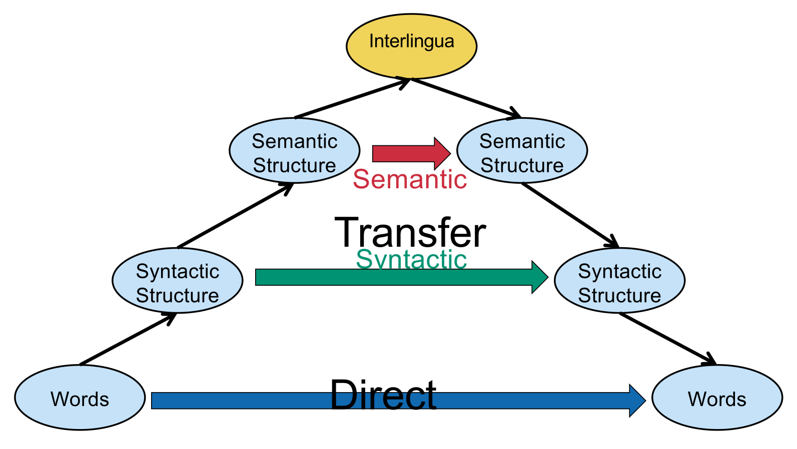
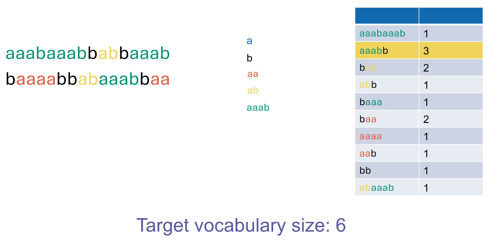
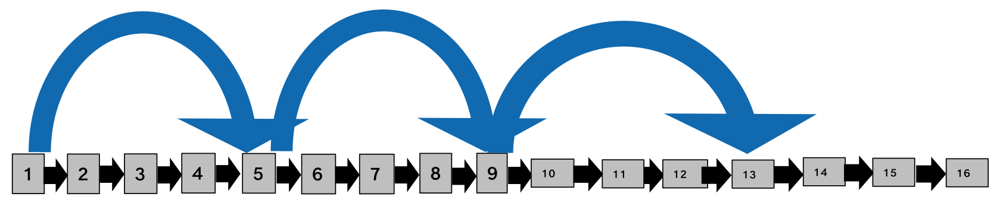

## Document Collection & Decoding

- **Character Sequence Decoding**:
    - **Byte Sequence**: Physical storage format (bits/bytes); requires conversion to characters.
    - **Encoding Detection**: Determining the correct mapping (often via heuristics or Machine Learning).
    - **ASCII**: 7-bit encoding (128 characters); limited to basic English.
    - **Unicode**: A **catalog** (map) of characters to integers (codepoints); **not** an encoding.
    - **UTF-8**: The standard variable-length **encoding** translating Unicode codepoints to bits (1-4 bytes).
- **Document Unit (Granularity)**:
    - **Fine-grained**: Small units (e.g., single emails, paragraphs). High precision, potential loss of context.
    - **Coarse-grained**: Large units (e.g., whole files, aggregated LaTeX sources). High recall, potential spurious matches (low precision).

## Tokenization & Vocabulary Determination

- **Terminology**:
    - **Positional Token** (Token): Raw text, tied to document, tied to position.
    - **Non-positional Token**: Raw text, tied to document, **no position**.
    - **Non-normalized Type** (Word): Raw text, **not tied** to document/position.
    - **Normalized Type** (**Term**): Processed text, not tied (Dictionary entry).
    - **Positional Posting**: Processed text, tied to document, tied to position.
    - **Non-positional Posting**: Processed text, tied to document, **no position** (Standard Index entry).
- **Language Challenges**:
    - **Compounds**: Must be split in languages like German (e.g., *Lebensversicherungs...*).
    - **Segmentation**: Required for languages without spaces (Chinese/Japanese).
    - **Morphology**: Complex grammar (e.g., Swiss German word ordering) or sentence merging (Polysynthetic languages like Siberian Yupik).
- **Specific Token Challenges**:
    - **Hyphens**: Inconsistent usage (e.g., *co-education* vs. *B-52*).
    - **Formats**: Dates (*3/12/91*), IPs, Email addresses require specific parsing.
    - **Apostrophes**: Splitting decisions (e.g., *aren't* $\rightarrow$ *are n't*?).
- **Stop Words**:
    - **Definition**: Extremely common words (*a, an, the*) traditionally excluded to save space.
    - **Modern Trend**: **Kept** in indices to allow precise phrase queries (e.g., "to be or not to be").

## Normalization & Equivalence Classing

- **Goal**: Create **Equivalence Classes** so variant forms match the same query.
- **Symmetric Expansion (Equivalence Classing)**:
    - Maps multiple variants to one single form (Many-to-one).
    - **Implicit**: Removing characters (e.g., deletion of hyphens).
    - **Explicit**: *anti-discriminatory* $\leftrightarrow$ *antidiscriminatory*.
- **Asymmetric Expansion**:
    - Maps one term to multiple variant lists (One-to-many).
    - **Indexing time**: Index *Windows* as *Windows* AND *windows*. (Result: Faster query, larger index).
    - **Querying time**: Query *window* searches for *window* OR *windows*. (Result: Slower query, smaller index).
- **Common Operations**:
    - **Case-folding**: Converting all text to lowercase.
    - **Truecasing**: Using ML to preserve meaning-bearing capitalization (e.g., *Apple* company vs. *apple* fruit).
    - **Accents**: Stripping diacritics (*cliché* $\rightarrow$ *cliche*). Risk of altering meaning (*peña* $\ne$ *pena* in Spanish).

## Stemming & Lemmatization

- **Goal**: Reduce inflectional/derivational forms to a common base.
- **Stemming**:
    - **Definition**: Crude, rule-based chopping of word ends.
    - **Characteristics**: Fast, deterministic, often produces non-words (*operate* $\rightarrow$ *oper*).
    - **Porter Stemmer**: Standard English algorithm (5 phases of reduction rules).
    - **Effect**: Increases recall, reduces precision.
- **Lemmatization**:
    - **Definition**: Uses vocabulary and morphological analysis to find the dictionary base (**Lemma**).
    - **Characteristics**: Context-dependent (distinguishes noun *saw* vs. verb *saw*).
    - **Utility**: Vital for **morphologically rich** languages (complex grammar/inflections like German, Spanish, Finnish); marginal gain for English.
- **Vauquois Triangle**:
    - Models depth of translation/analysis.
    - **Direct Transfer**: Surface level (Word-for-word).
    - **Stemming**: Operates near the Direct/Surface level.
    - **Syntactic/Semantic Transfer**: Deeper analysis; **Lemmatization** operates here.
    - **Interlingua**: Deepest semantic representation.

## LLM Tokenization (Byte Pair Encoding)

- **Context**: Large Language Models (LLMs) do not use space-based tokenization.
- **Byte Pair Encoding (BPE)**:
    - **Process**: Iteratively merges the most frequent adjacent pair of characters/tokens in training text.
    - **Spaces**: Treated as distinct characters; not automatic delimiters.
    - **Result**: Common words become single tokens; rare words/names split into sub-word chunks (e.g., "Strawberry" $\rightarrow$ "Straw" + "berry").
    - **Consequence**: explains LLM inability to perform character-level tasks (e.g., counting letters).

## Optimization: Skip Lists

- **Problem**: Intersecting postings lists (AND queries) is linear $O(m+n)$; inefficient for sparse matches.
- **Structure**: **Skip Pointers** added to postings lists to jump over non-matching docIDs.
- **Logic**: If `skip_target` $\le$ `current_docID_of_other_list`, take the shortcut.
- **Heuristic**: Optimal skip interval is $\approx \sqrt{P}$ ($P$ = list length).
    - **Too short**: High comparison overhead.
    - **Too long**: Missed skipping opportunities.

## Phrase Queries & Positional Indexes

- **Requirement**: Exact sequence ("Stanford University") or **Proximity Search** (Term A within $k$ words of Term B, denoted $/k$).
- **Approach 1: Biword Indexes**:
    - **Structure**: Index consecutive pairs as single terms (*friends romans*, *romans countrymen*).
    - **False Positives**: Query "A B C" (split into "A B" AND "B C") matches documents where "A B" and "B C" are present but separated.
    - **False Negatives**: None (never misses a valid match).
    - **Issues**: Vocabulary explosion.
- **Approach 2: Positional Indexes** (Standard):
    - **Structure**: `Term: docID: <pos1, pos2...>; docID...`
    - **Content**: Stores **Term Frequency** and **Positions** (offsets).
    - **Processing**:
        1. Intersect docIDs.
        2. Verify positional constraints (e.g., "ETH Zurich" $\rightarrow$ $pos(\text{Zurich}) - pos(\text{ETH}) = 1$).
    - **Trade-off**: 2-4x larger than non-positional indexes; complexity $\Theta(T)$ ($T$ = total tokens).
- **Combination**: Use Biword for common phrases, Positional for general queries.
