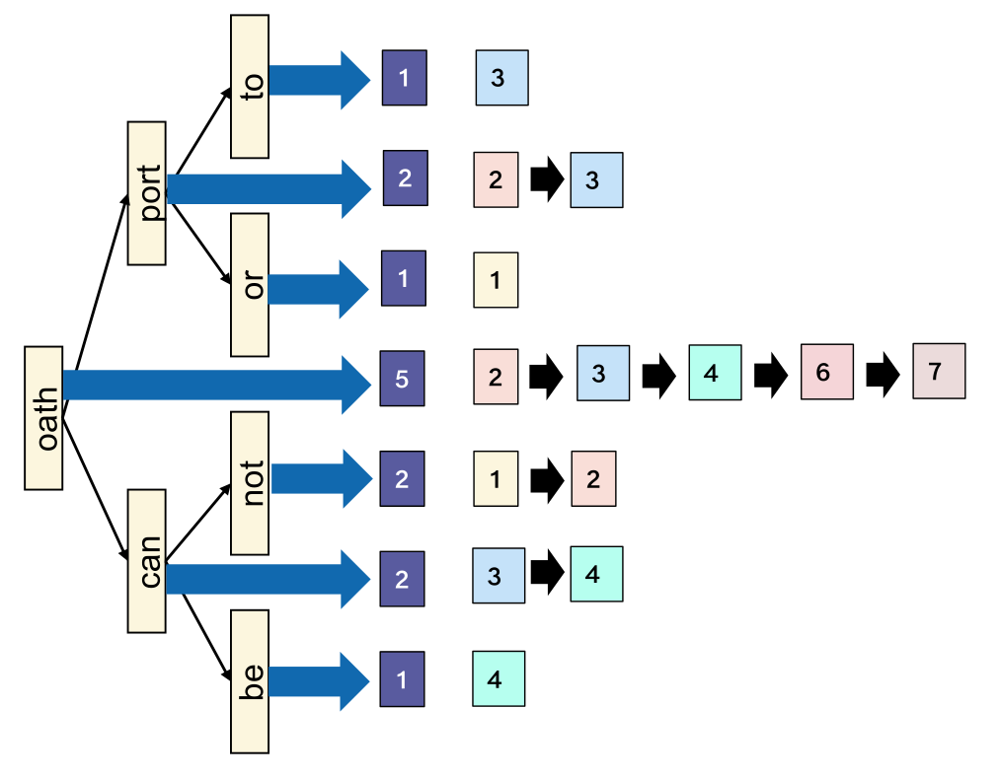
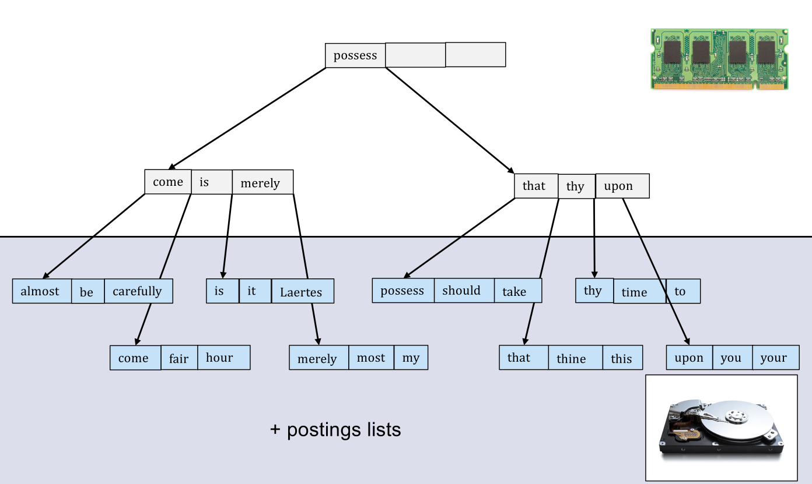
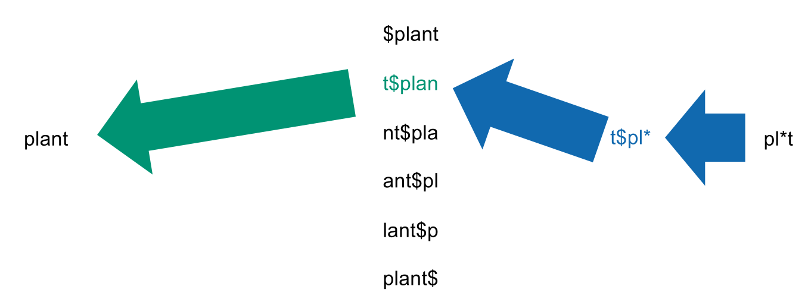
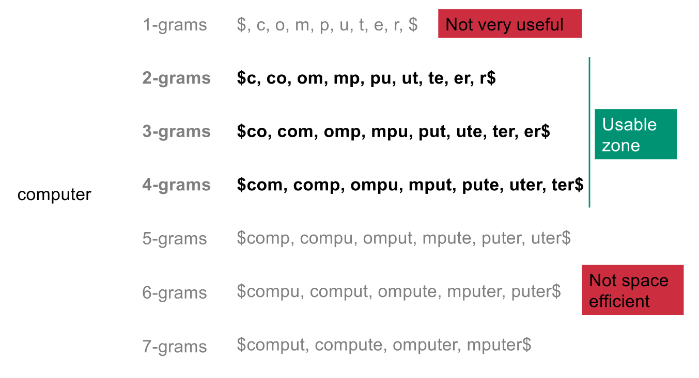
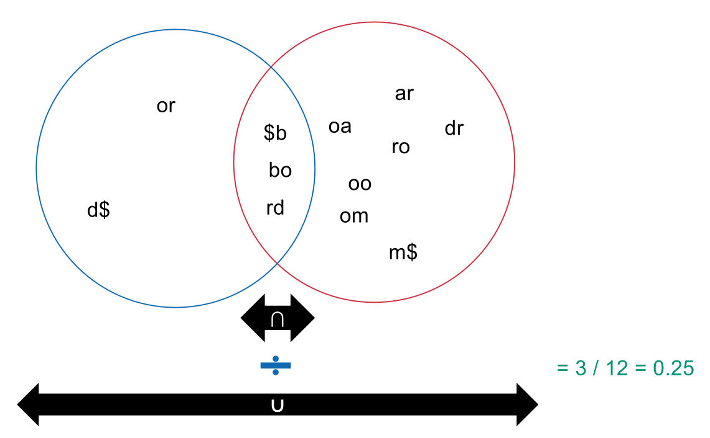
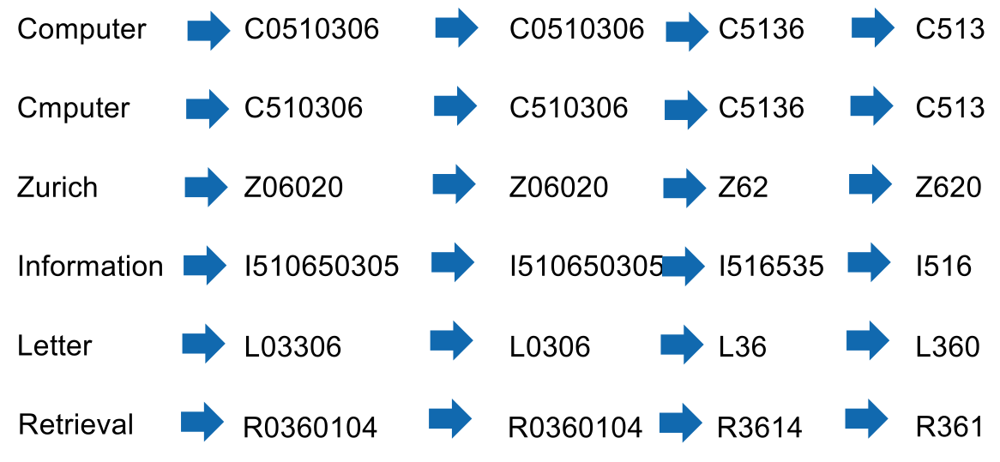

## Search Structures for Dictionaries

- **Dictionary Lookup**: Finding a term in the vocabulary to locate its postings list.
- **Hash Tables**:
    - Uses a **hash function** to map terms to integers.
    - Features **$O(1)$** instant lookup.
    - **Limitations**:
        - **No range queries**: Cannot query alphabetical intervals (e.g., `a` to `c`).
        - **Collisions**: Imperfect functions require linked lists; degrades performance.
        - **Space constraints**: High memory allocation needed to minimize collisions.
- **Binary Search Trees**:
  
    - Left branch strictly lower, right strictly greater.
    - Lookup time is **$O(\log n)$**.
    - **Disk Limitation**: Reads too little data per node; highly inefficient for disk blocks (e.g., 4KB).
- **B+-trees** (Standard Relational Database Tree):
  
    - **Structure**:
        - **Postings lists only on leaves**: Internal nodes act purely as routing pivots.
        - **Leaves at the same depth**: Ensures balanced lookup times.
        - **Extra leaf pointers**: **Doubly-linked list** connects leaves for bidirectional linear traversal (range queries).
    - **Degree Rules** (strictly for this course):
        - Defined by parameter **$d$**.
        - **Internal nodes** must have between **$d+1$** and **$2d+1$ children** (equals $d$ to $2d$ keys).
        - **Exception**: The **root node** may have fewer than $d+1$ children.
    - **Scaling**: Typically **101-201 B+ trees** ($d=100$) to align node size with physical disk blocks.
    - **Operations**:
        - **Insertion**: Splits and propagates upwards if exceeding $2d+1$ children.
        - **Deletion**: Merges with neighbors if falling below $d+1$ children.

## Wildcard Queries

- **Wildcard (`*`)**: Matches **any character sequence** (including empty). Used for spelling variations/word families.
- **Trailing** (e.g., `Math*`):
    - **Easiest to execute**.
    - Direct alphabetical range query (e.g., `Math` to `Mati`) on a standard **B+-tree**.
- **Leading** (e.g., `*ics`):
    - Fails on standard B+-tree.
    - **Solution**: Build a **Reverse B+-tree** (terms indexed backwards). Query becomes trailing (`sci*`).
- **Single/Middle** (e.g., `stati*tics`):
    - **Rewrite strategy**: Query `stati*` (standard) **AND** `*tics` (reverse).
    - Compute **Intersection**.
    - **Problem**: Generates **False positives** (e.g., `statics`). Requires expensive **Post-filtering**.
- **Multiple** (e.g., `foo*eth*bar`): Fails with basic intersection; requires advanced structures.

### The Permuterm Index

- **Goal**: Handle wildcards without post-filtering.
- **Construction**:
    - Append end-of-word symbol **`$`** to all terms (e.g., `plant$`).
    - Generate all **Rotations** (`$plant`, `t$plan`, `nt$pla`, etc.).
    - Store all rotations as keys in a single **B+-tree** pointing to the original term.
- **Query Execution**:
    - Rotate query until `*` is at the end (e.g., `pl*t` $\rightarrow$ `pl*t$` $\rightarrow$ `t$pl*`).
    - Execute standard trailing wildcard lookup.

### K-gram Indexes

- **k-gram**: Sliding window of $k$ characters. Includes `$` for boundaries (e.g., 3-grams for `computer`: `$co`, `com`, `omp`, ..., `er$`).
- **Optimal Sizes**: **2, 3, or 4-grams** are the "usable zone". 1-grams are useless; 6+ are not space-efficient.
- **k-gram Index**: B+-tree of unique k-grams pointing to terms containing them.
- **Wildcard Matching**:
    - Split query `co*ter` into `$co` AND `ter$`.
    - Intersect postings.
    - **Must Post-filter**: Matches terms like `computer` but also `copter`.

## Spelling Correction

- **Principles of Correction**:
    - Choose the "nearest" correct spelling.
    - Tie-breaker: Most common term (document frequency or user logs).
- **Implementation Strategies**:
    - **Always query** for corrected terms implicitly.
    - **Only query** corrected terms if original is missing or yields few results.
    - **Suggest** spelling ("Did you mean?").

### Minimum Edit Distance

- **Minimum Edit Distance (Levenshtein)**:
    - Minimum edits (**Insert**, **Delete**, **Substitute**, **Do nothing**) to transform string $A$ into string $B$.
    - Solved using a **Dynamic Programming** matrix in **$O(m \cdot n)$** polynomial time (evaluating insertion, deletion, and substitution paths).
- **Scaling Problem**:
    - Running $O(m \cdot n)$ edit distance against 500,000 dictionary terms is **not feasible**.
    - **Solution**: Pre-select a small candidate subset first.

### K-gram with Jaccard Coefficient

- **Assumption**: Terms with small edit distance share **many k-grams**.
- **Jaccard Coefficient**:
  
    - Measures set overlap: $|A \cap B| / |A \cup B|$. Range: $0$ to $1$.
- **Updated Search Method**:
    1. Extract k-grams from query.
    2. Look up in **k-gram index** for candidates.
    3. Compute **Jaccard coefficient** and keep terms above threshold.
    4. Compute expensive **Edit Distance** only on this pre-selected subset.
- **Computational Shortcut for Union**:
    - $|A \cup B| =$ **# query k-grams** $+$ **# found term k-grams** $-$ **# intersection**.
    - Found term count is pre-stored; intersection count is just the number of index hits.

### Context-Sensitive Spelling Correction

- **Purpose**: Fixes terms spelled correctly but contextually wrong (e.g., `graduate form ETH`).
- **Heuristic Strategy**: Look up surrounding **biwords** (2-word phrases) in logs/documents and select the statistically most frequent combination (e.g., `graduate from`).

### Phonetic Correction (Soundex Algorithm)

- **Purpose**: Corrections based on **sound** (English-specific, useful for names).
- **Soundex Rules**:
    1. **Retain** exact first letter.
    2. **Convert** remaining consonants to digits (0-6):
        - Vowels, H, W, Y $\rightarrow$ `0`
        - B, F, P, V $\rightarrow$ `1`
        - C, G, J, K, Q, S, X, Z $\rightarrow$ `2`
        - D, T $\rightarrow$ `3`
        - L $\rightarrow$ `4`
        - M, N $\rightarrow$ `5`
        - R $\rightarrow$ `6`
    3. **Remove duplicates**: Collapse consecutive identical digits.
    4. **Remove zeros**: Drops vowels/H/W/Y.
    5. **Pad and trim**: Result must be exactly **4 characters** (1 letter + 3 digits).
- **Phonetic Matching**: Identical fingerprints (e.g., `Computer` & `Cmputer` $\rightarrow$ `C513`) are phonetic matches.
- **Limitation**: Fails completely if the spelling mistake is on the **first letter**.

