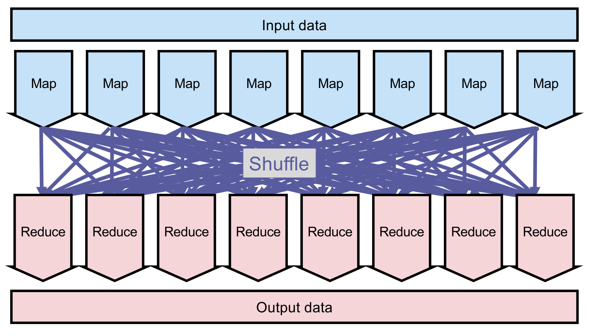

## Hardware Basics

- **Memory Hierarchy**: Trade-off between speed, cost and volatility.
    - **CPU Cache (L1/L2)**: Instant latency, extremely low capacity, highest cost, volatile.
    - **Main Memory (RAM)**: Fast access ($\sim 10-100$ ns), medium capacity (GBs to TBs), volatile.
    - **Secondary Storage (Disk)**: Slow access ($\sim 10$ ms seek time), massive capacity (TBs), non-volatile (ensures **ACID** durability).
    - **Tertiary Storage (Tapes/DVDs)**: Extremely slow (seconds to hours), practically infinite capacity, cheapest.
- **Performance Factors**:
    - **Capacity**: Storable data volume.
    - **Throughput**: Continuous data transmission rate (e.g., GB/s for RAM, MB/s for Disk).
    - **Latency**: Wait time before data reception starts.
- **Disk Access Characteristics**:
    - **Seek Time**: Moving disk head to data location takes significant time ($\sim 5$ ms).
    - **Block Transfers**: Data read/written in **blocks** ($\sim 4$ KB) for efficiency. Single byte read equals full block read time.
    - **Caching**: Keeping frequently used disk data in RAM buffers to minimize disk I/O.

## Blocked Sort-Based Indexing (BSBI)

- **Motivation**: Massive collections exceed RAM. **External sorting algorithms** (using disk) required.
- **Process**:
    1. **Shard** collection into equal-sized blocks.
    2. **Parse** documents into `[termID, docID]` pairs.
    3. **Sort** pairs in RAM by `termID` (primary) and `docID` (secondary).
    4. **Invert** and write sorted block to disk.
    5. **Merge** all disk blocks simultaneously into final inverted index.
- **Characteristics**:
    - Requires **two-pass approach** or on-the-fly dictionary for `term` $\rightarrow$ `termID` mapping.
    - **Complexity**: **$O(T \log T)$** ($T$ = total positional tokens). Bottleneck is sorting all tokens.

## Single-Pass In-Memory Indexing (SPIMI)

- **Motivation**: BSBI `term` $\rightarrow$ `termID` mapping exhausts RAM for massive vocabularies.
- **Process**:
    1. Read tokens sequentially. Use raw **terms** directly in a **hash map** (no `termID` translation).
    2. Build dictionary on the fly. Dynamically allocate new postings lists for new terms.
    3. Append `docID`s directly to postings list (no prior sorting).
    4. On full memory: **Sort dictionary terms alphabetically** (not `docID`s, inherently sorted by arrival).
    5. Write block's index to disk.
    6. **Stream** and merge all parallel, alphabetically sorted intermediate indices into final index.
- **Characteristics**:
    - **No term-termID mapping in RAM**, saving massive memory.
    - Postings lists are **dynamic** (double in size as needed).
    - **Complexity**: Often estimated as $O(T)$ (linear). Technically **$O(T \log M)$** ($T$ = tokens, $M$ = unique terms) since only unique dictionary terms are sorted per block, drastically improving speed over BSBI.

## Distributed Indexing (MapReduce)

- **Motivation**: Collections (e.g., the Web) exceed single-machine limits.
- **MapReduce Architecture**: Splits jobs across cheap commodity machine clusters.
    - **Master Node**: Directs process, assigns data **splits** to worker nodes, reassigns failed tasks.
    - **Map Phase (Parsers)**: Workers parse local data splits into intermediate `[term, docID]` pairs.
    - **Shuffle Phase**: Routes pairs sharing the same key (term) to the same node. **Quadratic complexity** ("spaghetti phase" due to heavy network routing).
    - **Reduce Phase (Inverters)**: Workers collect, sort, and write `docID`s for assigned terms.
- **Core Concept**: **Bring the Query to the Data**. Process data on local storage machines minimizing network traffic.

## Dynamic Indexing

- **Motivation**: Frequent updates cause **result staleness**. Complete periodic reconstruction causes system unavailability.
- **Auxiliary Index Strategy**:
    - Keep large, static **Main index** on disk.
    - Maintain small, dynamic **Auxiliary index** in RAM for new documents.
    - **Querying**: Query both indices simultaneously; return **union** of results.
    - **Periodic Merging**: Merge auxiliary index into main index when RAM is full.
- **Handling Deletions**:
    - Maintain in-memory **Invalidation bit vector** (flip to `0` on deletion).
    - Filter out invalidated documents dynamically during querying (instant $O(1)$ lookup).
    - Physically remove deleted documents during the periodic auxiliary-to-main merge.
- **Scaling Issues**:
    - **One file per posting list**: Makes auxiliary index merging trivial (simple file append operation), but completely **impracticable** due to OS limits on millions of tiny files.
    - **Decision spectrum**: Trade-off between fewer large files (hard to merge/update) vs. efficient appending (too many files).

## Logarithmic Merging

- **Motivation**: Standard auxiliary index merging requires reading/rewriting the entire main index. Yields inefficient **quadratic complexity** of **$O(T^2/n)$** ($T$ = total postings, $n$ = auxiliary index capacity).
- **Process**:
    - Accumulate $n$ postings in RAM index (**$Z_0$**).
    - On full $Z_0$: flush to disk as index **$I_0$** (size $n$).
    - On next full $Z_0$: if $I_0$ exists, merge $Z_0$ and $I_0$ into new disk index **$I_1$** (size $2n$).
    - Cascade indices in **base-2 (binary)** sizes ($n, 2n, 4n, 8n, 2^k n$).
- **Complexity**:
    - **Construction time**: **$O(T \log(T/n))$** (each posting merged exactly $\log(T/n)$ times).
    - **Query time**: **$O(\log(T/n))$** (search across $\log(T/n)$ separate disk indices and union results).
- **Compromise**: Exponentially faster construction at the cost of slightly slower querying.

## Other Indexes & Security

- **Adaptability**: BSBI, SPIMI, MapReduce easily adapted for **positional** or **biword** indices by adding positional offsets to `docID`s.
- **Ranked Retrieval**: Boolean systems sort by `docID`. Ranked systems sort indices by weight/impact, complicating insertions (cannot simply append new documents to the end).
- **Security (Access Control Lists - ACLs)**:
    - Enterprise search requires hiding unauthorized documents.
    - Represented as **User-Document Matrix** (1 if readable, 0 otherwise).
    - Inverted into per-user **Access List**.
    - Intersect query results with user access list. Heavily complicates dynamic indexing on permission changes.
