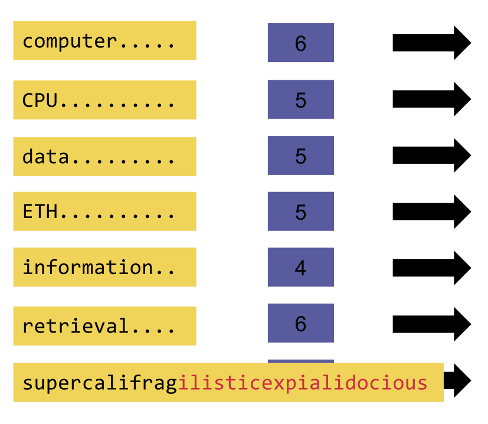
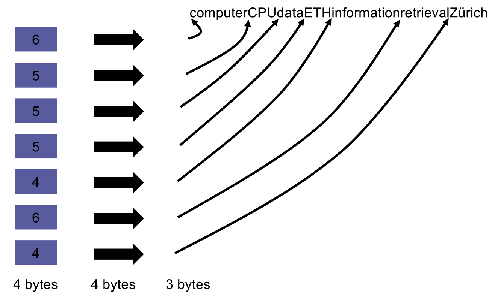
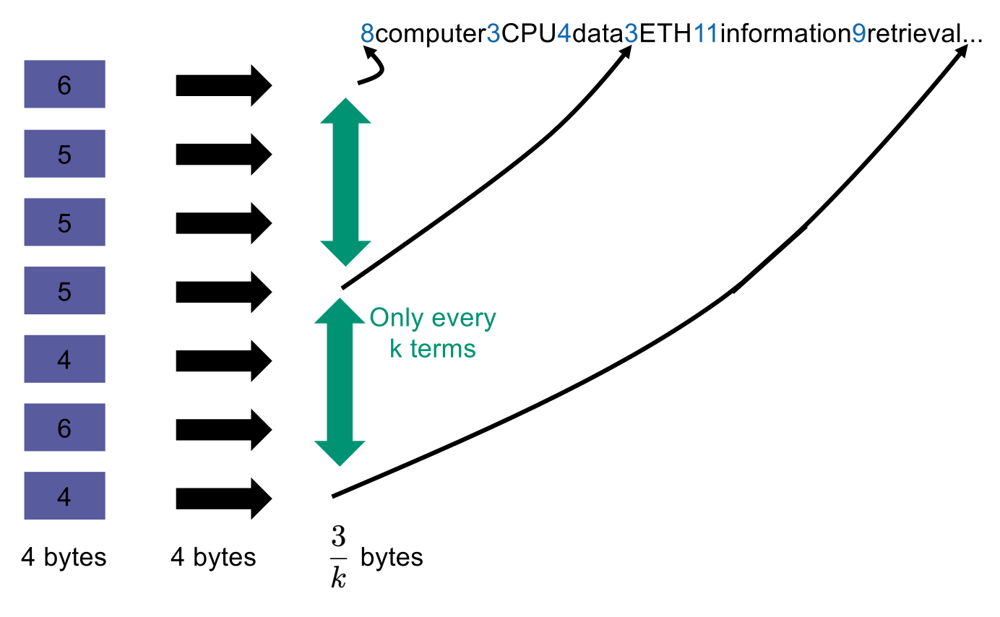
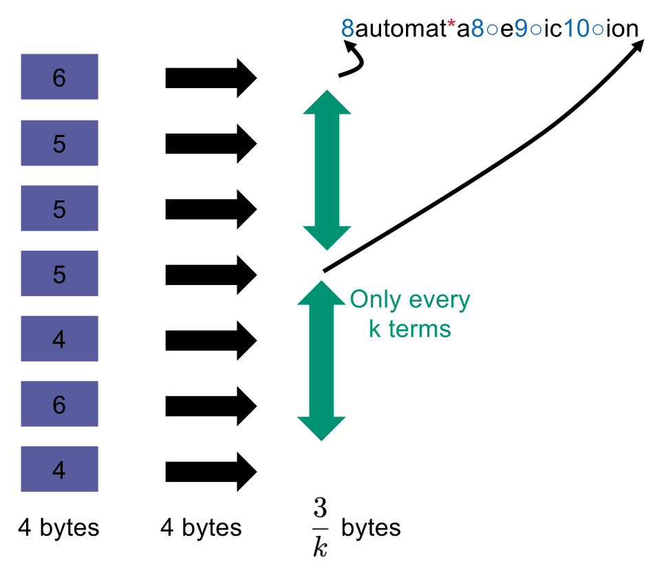
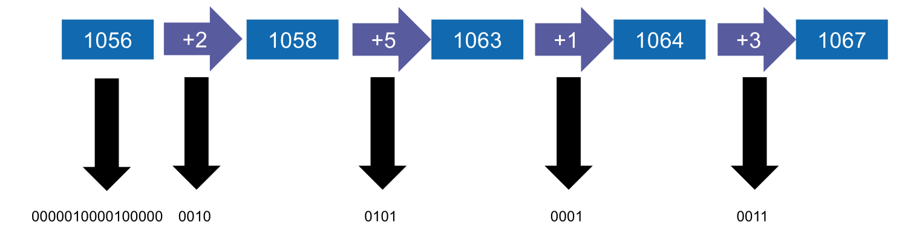
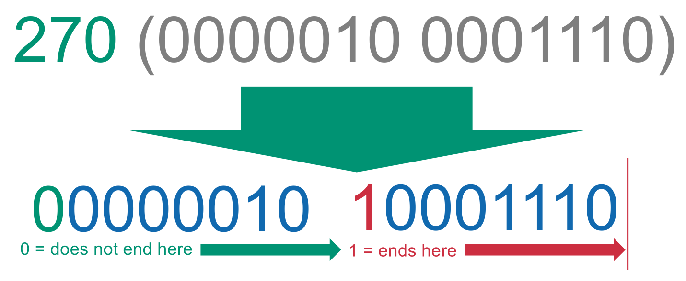
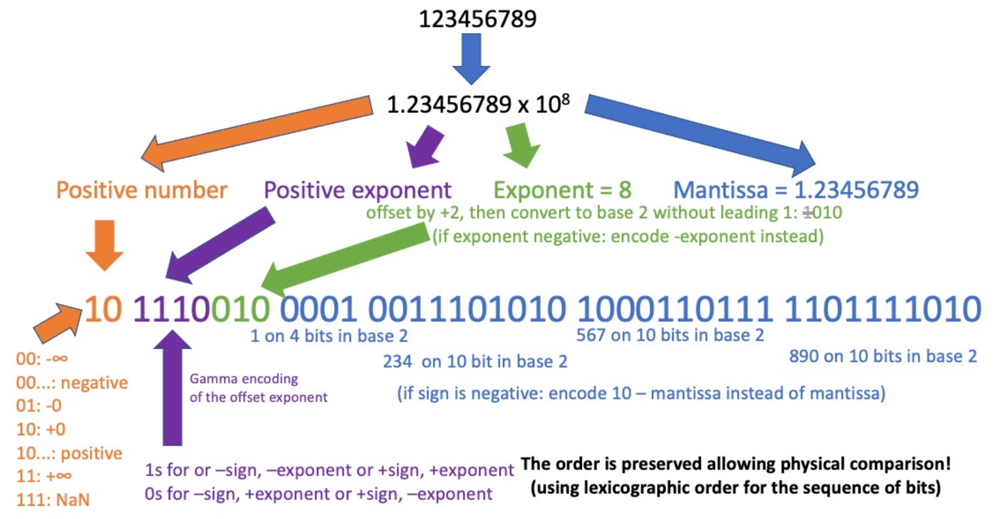

## Fundamentals of Index Compression

- **Goals and Benefits**:
    - **Disk space conservation**: Reduces physical storage needs.
    - **Increased caching**: Fits more data into RAM; minimizes costly disk seeks.
    - **Faster data transfer**: Compressed disk-to-RAM transfer + CPU decompression is generally faster than uncompressed transfer.
- **Types of Compression**:
    - **Lossless compression**: Preserves all info (e.g., standard index compression techniques).
    - **Lossy compression**: Discards unimportant info (e.g., removing stop words, stemming, case folding).
- **Impact of Pre-processing (Lossy)**:
    - **Remove numbers**: Minor impact ($\downarrow 2\%$ terms, $\downarrow 8\%$ non-positional postings, $\downarrow 9\%$ positional postings).
    - **Case folding**: High dictionary impact ($\downarrow 17\%$ terms, $\downarrow 3\%$ non-positional postings).
    - **Remove stop words**: Zero impact on dictionary ($\downarrow 0\%$ terms), massive impact on postings ($\downarrow 30\%$ non-positional, $\downarrow 47\%$ positional).
    - **Stemming**: High dictionary impact ($\downarrow 17\%$ terms), minor postings impact.
    - **Total typical reduction**: Dictionary ($\downarrow 33\%$), non-positional postings ($\downarrow 42\%$), positional postings ($\downarrow 52\%$).

## Term Statistics and Distribution Laws

- **Heaps' Law** (Estimating the number of terms):
  
    - Models vocabulary size as a function of collection size.
    - Formula: $M = kT^b$ ($M$ = distinct terms, $T$ = total tokens).
    - Parameters: $30 \le k \le 100$ and $b \approx 0.5$ (demonstrates **square root growth**).
    - Implies infinite vocabulary growth (never caps out) due to proper nouns, names, and new internet text.
- **Zipf's Law** (Modeling the distribution of terms):
  
    - Models collection frequency ($cf_i$) based on term rank ($i$).
    - Formula: $cf_i \propto 1/i$ or $cf_i = c/i$.
    - Frequency halves as rank doubles.
    - Produces a linear graph with slope $-1$ on a **log-log scale**.
    - **Rule of 30**: Top 30 words $\approx 30\%$ of all tokens in written text.

## Dictionary Compression Strategies

- **Approach 1: Fixed-width Array**:
  
    - Static size per term (e.g., 20 bytes string, 4 bytes frequency, 4 bytes pointer).
    - **Issue**: Highly wasteful for short words (avg English word = 8 chars); truncates long words (e.g., *supercalifragilisticexpialidocious*).
    - Size example (Reuters-RCV1): 11.2 MB.
- **Approach 2: Dictionary-as-a-string**:
  
    - Single concatenated string for all terms.
    - Array of pointers (e.g., 3 bytes each) marks term starts; length deduced from adjacent pointer.
    - Saves space (avg 11 bytes per term instead of 20).
    - Size example: 7.6 MB.
- **Approach 3: Blocked storage**:
  
    - Groups terms into blocks of size $k$ (e.g., $k=4$).
    - Single string pointer per block (for the first term).
    - 1-byte length prefix prepended to each string for internal block traversal.
    - **Space-time tradeoff**: Reduces pointer space by factor of $k$, but requires linear scan within block after initial binary search.
    - Size example ($k=4$): 7.1 MB.
- **Approach 4: Front coding**:
  
    - Shares common prefixes between consecutive alphabetically sorted terms (e.g., *automat*ion, *automat*ic).
    - Uses special delimiters to reference previous prefix.
    - Size example: 5.9 MB ($\approx 50\%$ reduction from fixed-width).

## Postings File Compression

- **Gap Encoding**:
  
    - Standard absolute `docID`s waste space (e.g., 32 bits per integer).
    - Sorted postings lists allow storing **gaps** (differences) between consecutive `docID`s.
    - Frequent terms = tiny gaps; rare terms = massive gaps. Requires **variable gap size** encodings.
- **Prefix Codes**:
    - No valid code word is a prefix of another valid code word.
    - Decoder deduces exactly **when to stop** reading bits without explicit separators (e.g., phone numbers, UTF-8).
- **Variable Byte (VB) Encoding**:
  
    - Uses integral number of bytes (or packets, like 4-bit nibbles) per gap.
    - **Structure** (8-bit packet): 1 **continuation bit** + 7 **payload bits**.
        - `1`: Ends here (last byte of gap).
        - `0`: Does not end here (more bytes follow).
    - **Example** ($x = 4$): 7-bit payload `100`, prepended with `1` $\rightarrow$ `10000100`.
    - **Example** ($x = 270$): Binary `1 0000 1110`. Payloads `0000010` and `0001110`. First byte gets `0`, last gets `1` $\rightarrow$ `00000010 10001110`.
    - **Tradeoff**: Parameterized packet size. Large packets = less overhead, less compression. Small packets = more overhead, more compression.
- **Unary Code** (Thermometer code):
    - Integer $x$ encoded as $x$ ones, followed by `0` to mark the stop.
    - Example: $4 \rightarrow$ `11110`.
- **Gamma ($\gamma$) Encoding** (Elias code):
    - Bit-level, parameter-free, prefix-free code optimal for small integers.
    - **Algorithm**:
        1. Convert gap to binary (e.g., $19 \rightarrow$ `10011`).
        2. Strip leading `1` (remaining `0011` = *offset*).
        3. Encode *length* of offset in **Unary** (4 bits $\rightarrow$ `11110`).
        4. Concatenate: `11110` + `0011` $\rightarrow$ `111100011`.
    - Gap of $1 \rightarrow$ `0`.

## Information Theory and Shannon Entropy

- **Amount of Information** (Surprise):
    - Information gained from a specific outcome $x$ of random variable $X$.
    - Formula: $I_X(x) = -\log_2(p_X(x))$.
    - $p_X(x)$ represents the **probability** of outcome $x$. Lower probability $\rightarrow$ higher surprise/information.
- **Shannon Entropy** ($H(X)$):
    - Expected value of the amount of information for a distribution.
    - Formula: $H(X) = \mathbb{E}[I_X(X)] = -\sum_x p_X(x)\log_2(p_X(x))$.
    - Theoretical **lower bound** for average bits per encoded value in lossless compression. Claims beating this bound are mathematically impossible (scams).
    - **Examples**:
        - **Deterministic distribution**: 100% probability for one outcome ($p=1$). Formula yields $-\log_2(1) = 0$. $H(X) = 0$ (no uncertainty).
        - **Uniform distribution**: 4 equiprobable options ($p=1/4$). Formula yields $-\log_2(1/4) = 2$. $H(X) = 2$ bits required on average.
- **Universal Encoding**:
    - Code whose expected length is bounded by a constant factor of $H(X)$ for *any* arbitrary distribution.
- **Theoretical bounds of Encodings**:
    - **Unary encoding**: Mathematically **optimal** (expected length exactly equals $H(X)$) *only* if the gap distribution is a **geometric distribution** with $p=1/2$.
    - **Gamma Encoding**: Is **universal** ($\mathbb{E}[L_\gamma(X)] \le 3H(X)$ for any distribution).

## Decimal Gamma Encoding

- **Concept**: Invented by the professor; extends Gamma encoding for decimal numbers (e.g., in databases).
- **Structure**:
    1. Convert to scientific notation ($1.23 \times 10^8$).
    2. 2 bits for sign combinations (+/+, +/-, -/+, -/-).
    3. Gamma encode the **offset exponent**.
    4. Encode the mantissa in binary chunks.
- **Key Advantage**: Preserves **lexicographical order**. Allows physical bit-sequence comparisons for range queries without decoding values.

