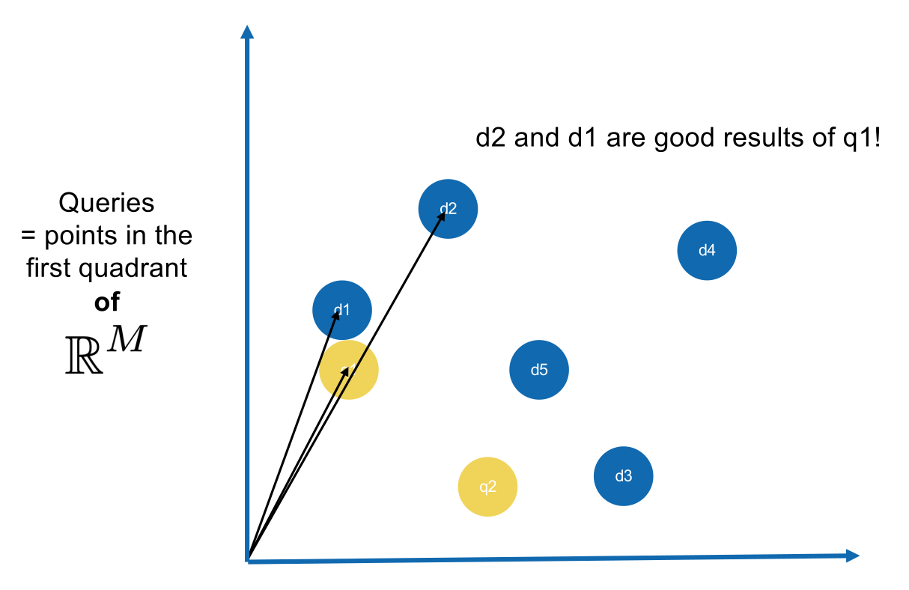
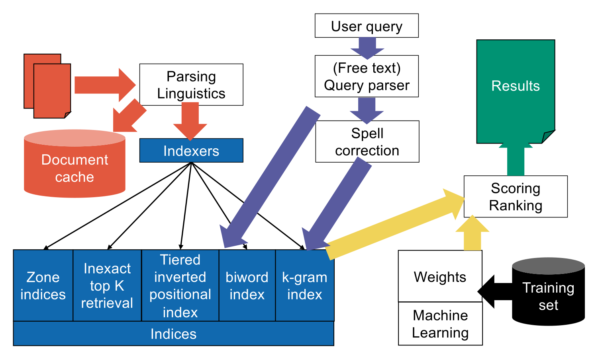

## Ranked Retrieval & Parametric Search

- **Ranked retrieval**: Returns a **Ranked subset of documents** based on relevance. Solves the issue of massive, unordered Boolean result sets.
- **Parametric Search**: Queries **Document Metadata** (e.g., Title, Author, Publication Date). Treated as a classical database problem using standard SQL structures (**Hash tables**, **Trees**).
- **Integration**: Modern systems combine parametric indices (metadata) with standard inverted indices (text).

## Zone Search

- **Zone Search**: Applies to free text within specific document sections (e.g., title vs. body).
- **Shared inverted index**: Stores zone data either in terms (**Zones in terms**, e.g., `albert.author`) or in postings (**Zones in postings**, e.g., `1.title`).
- **Scoring**:
    - Assigns **Zone weights** ($g_i$) to specific sections (e.g., Title 0.3, Body 0.5).
    - Checks **Boolean results** ($s_i$): 1 if term is in zone, 0 otherwise.
    - **Document score**: Computed as $\sum_{i=1}^{l} g_i s_i$. Evaluated as a **scalar product** (or **inner product**): $\vec{g} \cdot \vec{s}$.
    - Computed dynamically using the **Intersection algorithm** (advancing pointers simultaneously across sorted posting lists to find matches). **Accumulators** sum the scores on the fly.
- **Learning weights**:
    - Manual weight guessing is ineffective. Systems collect query **Samples** mapped to expert human **Relevance** ($r_j \in \{0, 1\}$).
    - Goal is **Predicting relevance** by matching calculated score to human judgment ($\vec{g}_j \cdot \vec{s}_j \approx r_j$).
    - **Machine Learning** minimizes the error function: $\text{error}_j(g) = (r_j - \vec{g}_j \cdot \vec{s}_j)^2$.

## Term Weighting & Vector Space Model (VSM)

- **Document as a bag of words**: Simplifies document representation from an ordered list to a **vector of numbers** (term counts). Order is ignored.
- **TF-IDF Weighting**:
    - **Term frequency** ($tf_{t,d}$): Count of term $t$ in doc $d$.
    - **Collection frequency** ($cf_t$): Total corpus occurrences (poor metric, ignores document concentration).
    - **Document frequency** ($df_t$): Count of documents containing the term.
    - **Inverse document frequency**: $idf_t = \log \frac{N}{df_t}$.
    - **TF-IDF weight**: $tf \times idf$. Boosts rare, highly discriminative terms.
- **Vector Space Model (VSM)**:
  
    - **Boolean mapping**: Terms form simplex vertices; documents form hypercube vertices.
    - **TF-IDF mapping**: Documents become vectors in the first quadrant of $\mathbb{R}^M$ ($M$ = vocabulary size).
    - **Renormalization**: Document vectors are divided by their **Euclidian norm** ($||x||$) to reach **unit length**.
    - **Vector Renormalization Property**: Duplicating document content does not change its semantic vector; renormalization scales it to the exact same unit point.
    - **Cosine similarity**: Calculated via normalized **Inner product** ($\cos \theta$). Excellent similarity quantification.
    - **Queries as vectors**: Plotted in the same vector space. Relevance equals the narrowness of the angle to document vectors.

## SMART Notation

- Represents weighting configurations using a 6-letter syntax: `ddd.qqq` (Document configuration . Query configuration).
- **Term frequency scaling** (First letter):
    - **Natural (n)**: Raw $tf$.
    - **Sublinear (l)**: $1 + \log(tf)$ to mitigate diminishing returns of repeated words.
    - **Augmented (a)**: $a + (1-a)\frac{tf}{tf_{max}}$ to prevent zero scores.
    - **Boolean (b)**: 1 if present, 0 otherwise.
    - **Log-average (L)**: $\frac{1 + \log(tf)}{1 + \log(\text{average } tf)}$.
- **Document frequency scaling** (Second letter):
    - **No scaling (n)**: 1.
    - **IDF (t)**: $\log \frac{N}{df_t}$.
    - **Probabilistic IDF (p)**: $\max(0, \log \frac{N - df_t}{df_t})$.
- **Normalization** (Third letter):
    - **None (n)**: 1.
    - **Cosine (c)**: Scales vector to unit length.
    - **Byte-size (b)**: Scales by $\frac{1}{\text{CharLength}^\alpha}$.
    - **Pivoted (p)**: Corrects document length bias.

## Efficient Scoring & Ranking

- **Storing Weights**: Precomputed floats waste space and compress poorly. Solution: Store raw $tf_{t,d}$ and vector lengths $||d||$ natively in postings. Term headers store $N$ and $df_t$.
- **Traversal Strategies**: An **Accumulator** per document stores the running sum of query-document scalar products.
    - **Term-at-a-time**: Processes one query term's posting list entirely, updating all relevant accumulators, before moving to the next term.
    - **Document-at-a-time**: Walks horizontally across all relevant posting lists simultaneously, finishing one document's final score completely before moving to the next.
- **Top-K Complexity**: Extracting top K results from millions of documents takes **$O(N)$** time (not $O(N \log N)$) using a **Priority queue**.
- **Scoring Optimizations**:
    - **Query length omission**: In the cosine formula $\frac{\vec{q} \cdot \vec{d}}{||q|| \times ||d||}$, the divisor $||q||$ is constant for all documents and does not alter the final ranking order.
    - **Late division**: Divide by document length $||d||$ only at the very end of the accumulation process.
    - **Sparse accumulators**: Only track accumulators for documents containing at least one query term.
    - **Binary query weights**: Assume query terms have weights of 1 or 0. Use an `*n*` SMART scheme for the query to drop query-side IDF, avoiding redundant double-IDF multiplication.

## Inexact Top-K Document Retrieval

- **General optimization**: Calculate exact scores only within a **Preselected** candidate sub-pool to save computations.
- **Index elimination**: Drop low-IDF terms (**Stop words**). Keep documents containing many/all query terms.
	- Risk: May eliminate too many documents.
- **Champion lists (Top docs)**: Pre-sort the index by decreasing term frequency. Keep only the top $r$ documents per term. Take the union of these top $r$ sets at query time.
	- Flaw: Term-dependent ordering breaks standard document-at-a-time union algorithms.
- **Impact ordering**: Sort globally by IDF (rare terms first), locally by TF (within postings).
	- **Limitation**: Strictly requires **term-at-a-time traversal** because TF-sorting destroys the global document ID ordering needed for document-at-a-time.
- **Tiered indices**: Fallback priority rings (**Tier I**, **Tier II**, **Tier III**). If Tier I yields fewer than K results, search drops down to Tier II.

## Clustering & Vector Databases

- **Clustering**: Select $\sqrt{N}$ random **leaders**. Assign documents to the nearest leader (**Cluster document space**). At search time, find the leader closest to the query and score only its local cluster.
- **Clustering Distance**: Relies exclusively on **cosine angle** from origin, ignoring **Euclidean (L2) distance**.
- **Vector Databases**: Native vector support (e.g., PostgreSQL `pgvector` with `VECTOR(10000)` column type) calculates distance directly in `WHERE`/`ORDER BY`.
    - **Operators**: `<->` (**L2/Euclidean**), `<=>` (**Cosine**), `<#>` (**Inner product**), `<+>` (**L1/Manhattan**), `<%>` (**Jaccard**), `<~>` (**Hamming**).
- **Specialized Indices**: e.g., `CREATE INDEX ON documents USING hnsw...`
    - **HNSW (Hierarchical Navigable Small Worlds)**: Functions like multi-layered skip lists in 2D/3D space. Traverses from a low-density top layer (fast, low recall) down to a high-density bottom layer (slow, high recall).
    - **IVFFlat (Inverted File with Flat Compression)**: Groups vectors into predefined clusters (similar to Tiered Indices).

## Overall IR System Architecture

- **Phase 1: Indexing (Data Ingestion)**
    - Raw documents pass through **Parsing & Linguistics** (tokenization, stemming).
    - **Indexers** map processed text and metadata into specialized structures: **Zone indices**, **Tiered inverted positional indices**, **Biword/k-gram indices**.
- **Phase 2: Querying (User Input)**
    - **User query** is processed by a **Query parser** (handles operators, free text translation) and **Spell correction**.
    - The parsed query is executed against the generated **Indices**.
- **Phase 3: Scoring & Results (Output)**
    - Index hits trigger **Evidence accumulation** (merging matches).
    - Documents are ranked via a **Scoring module** (often using **Machine Learning Weights**).
    - Top results fetch preview snippets from a **Document cache** and are returned as final **Results**.

