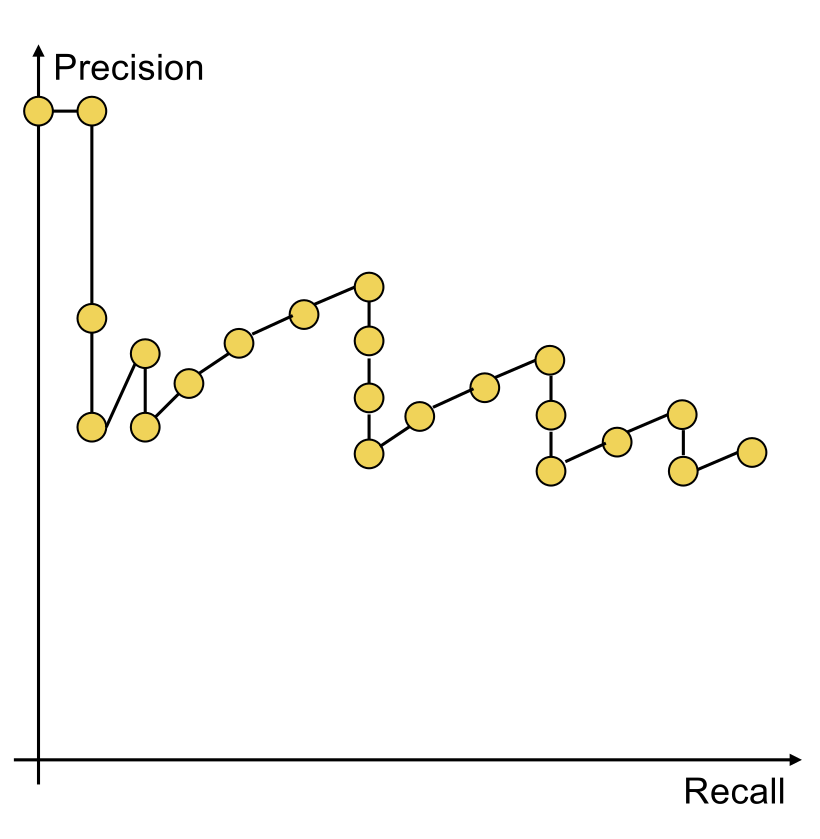
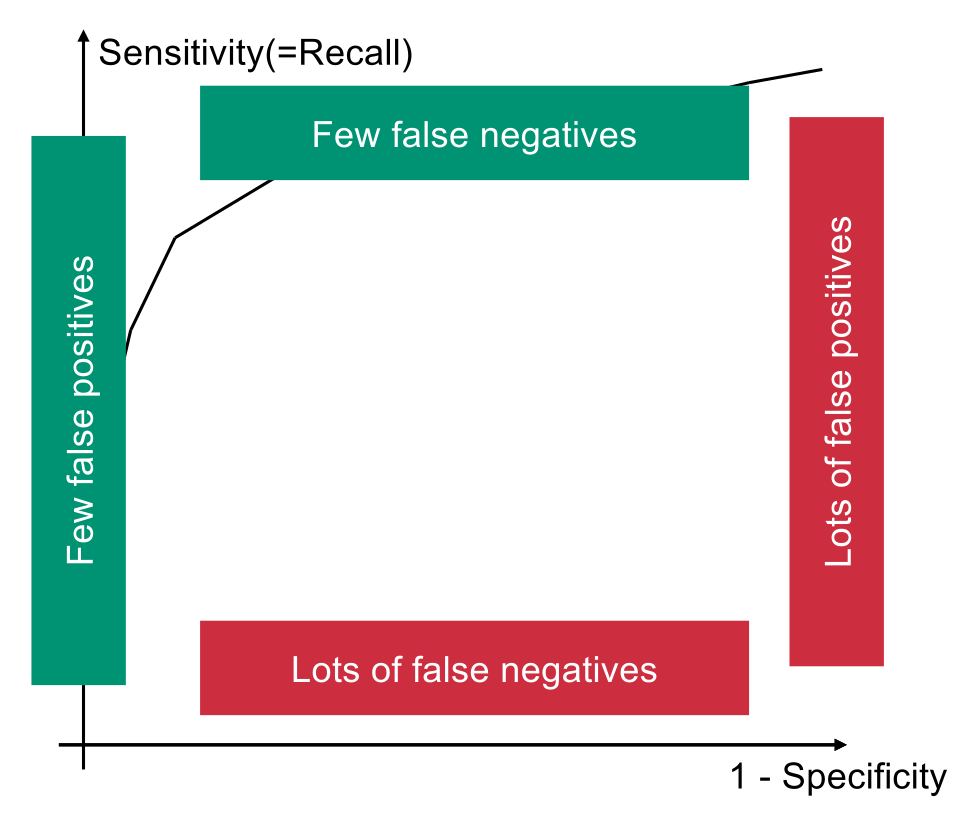

## Evaluation Foundations

- **Primary Goal**: Optimize **Relevance** / **Customer benefit** (Kundennutzen).
- **Information Need vs. Query**:
    - **Information Need**: Actual underlying user intent (e.g., finding a higher-education institution).
    - **Query**: Imperfect string representation entered by user (e.g., "ETH Zurich").
    - Evaluation targets **Information Need** (evaluating against queries trivially scores 100% for deterministic programs).
- **Test Collection Components**:
    1. Document collection.
    2. Test suite of information needs.
    3. **Relevance judgments** (binary relevant/non-relevant assessment) forming a **Gold standard** / **Ground truth**.

## Standard Test Collections & Relevance Assessment

- **Standard Datasets**: Range from small/early (**Cranfield**: 1,398 documents, exhaustive judgments) to large/modern (**TREC**: 1.89M documents by NIST; **GOV2**: 25M pages; **NTCIR** / **CLEF** for cross-language).
- **Pooling**: Feasible evaluation for massive collections. Domain experts manually assess only a pooled subset (top $k$ documents from multiple competing systems).
- **Kappa Statistic**: Measures agreement between human judges, correcting for expected chance agreement.

## Unranked Evaluation Metrics (Boolean)

- **Contingency Table**:
    - **True Positives (TP)**: Returned + relevant.
    - **False Positives (FP) / Type I Error**: Returned + not relevant.
    - **False Negatives (FN) / Type II Error**: Not returned + relevant.
    - **True Negatives (TN)**: Not returned + not relevant.
- **Precision (P)**: Fraction of retrieved documents being relevant ($TP / (TP + FP)$). "How much returned is useful?"
- **Recall (R)** / **Sensitivity**: Fraction of relevant documents retrieved ($TP / (TP + FN)$). "How much useful was found?"
    - **Hacking Recall**: Achieve 100% by returning everything.
- **Specificity**: Fraction of non-relevant documents properly ignored ($TN / (TN + FP)$).
- **Accuracy**: Fraction of all correct classifications ($(TP + TN) / (TP + FP + FN + TN)$).
    - **Flaw / Hacking**: Useless for IR due to massive data skew (>99.9% True Negatives). Achieve 99% simply by **returning nothing**.

## The F-Measure

- **F-Measure (F-Score)**: Single metric trading off Precision and Recall to prevent independent hacking (the "F" simply stands for a generic mathematical function, introduced by van Rijsbergen).
- **Harmonic Mean**: Used instead of arithmetic mean to heavily penalize extreme discrepancies (e.g., hacking Recall to 100% with ~0% Precision drops F-measure near 0).
- **Formulas and Weighting**:
    - **General Formula**: $F_\alpha = \frac{1}{\frac{\alpha}{P} + \frac{1-\alpha}{R}} = \frac{(\beta^2 + 1)PR}{\beta^2P + R}$ (where $\beta^2 = \frac{1-\alpha}{\alpha}$).
    - **Balanced ($F_1$)**: Equal weighting ($\alpha = 0.5$, $\beta = 1$). Formula: $\frac{2PR}{P+R}$.
    - **Precision-heavy**: $\beta < 1$ (or $\alpha > 0.5$).
    - **Recall-heavy**: $\beta > 1$ (or $\alpha < 0.5$).

## Ranked Evaluation Metrics

- **Precision-Recall Curve**: Evaluates ranked lists by plotting $P$ and $R$ iteratively down the list.
  
    - Retrieving **relevant**: Moves curve **up and right** ($P \uparrow, R \uparrow$).
    - Retrieving **irrelevant**: Moves curve **straight down** ($R$ stable, $P \downarrow$). Creates distinctive **saw-tooth shape**.
    - **Interpolated Precision**: Monotonically decreasing curve removing jiggles. $p_{interp}(r) = \max_{r' \ge r} p(r')$ (looks ahead to maximum precision at any future recall level).
- **Single-Figure / Aggregate Metrics** (condensing curves into single numbers):
    - **11-Point Interpolated Average Precision**: Averages interpolated precision across 11 fixed recall levels (0.0 to 1.0) across all queries.
    - **Mean Average Precision (MAP)**: Averages precision exactly at ranks containing relevant documents, macro-averaged across all queries (roughly equals area under un-interpolated curve).
    - **Precision at $k$**: Precision at fixed low depth (e.g., top 10). Applicable to web search but unstable (ignores total existing relevant documents).
    - **R-Precision**: Precision evaluated exactly at rank $k = |Rel|$ (total known relevant documents).
        - **Precision exactly equals Recall** at this rank.
        - Visualized as the **Break-even point** (intersection with $P=R$ ray from origin).

## ROC Curve

- **ROC Curve (Receiver Operating Characteristics)**:
    - **Y-axis**: **Sensitivity** (Recall / True Positive Rate).
    - **X-axis**: **1 - Specificity** (False Positive Rate).
    - **Sweet Spot**: Top-left corner (High sensitivity, low false positive rate).
    - **Hacking Awful Engines**: Completely inverted ROC curves (bottom-right edge) become awesome engines simply by reversing their boolean outputs.

## Advanced Metrics

- **Normalized Discounted Cumulative Gain (NDCG)**:
    - Handles **non-binary** (graded) relevance scores.
    - Discounts value of results further down the list (modeling user drop-off).
- **Other System Metrics**:
    - Speed (index construction, query processing).
    - Size (collection, index).
    - Query language expressiveness.
    - **Snippets**: High-quality document summaries impacting user utility (not captured by math models). Generated from fixed-size cached document prefixes for speed.
