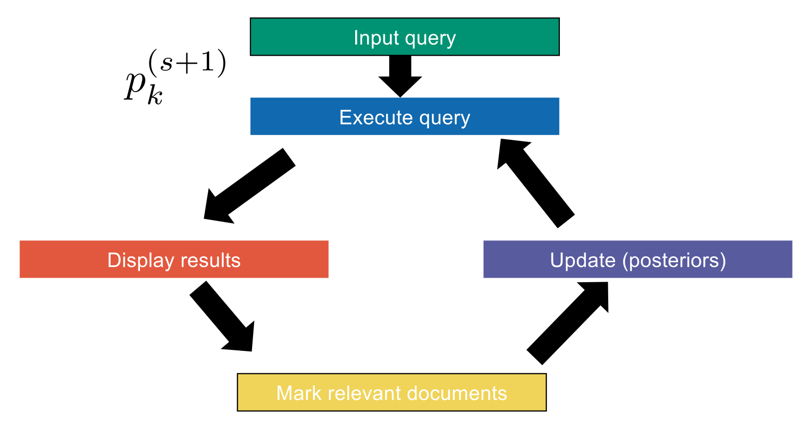

## Probability Theory Foundations

- **Basic Concepts**:
    - **Probability theory**: Mathematical framework modeling uncertainty.
    - **Universe** ($\Omega$): Set of all possible worlds/outcomes.
    - **Elementary event** ($\omega$): Specific outcome ($\omega \in \Omega$).
    - **Discrete probability distribution** ($P$): Function $P: \Omega \rightarrow [0, 1]$. Sum must equal exactly $1$ ($\sum_{\omega \in \Omega} P(\omega) = 1$). Cannot be negative.
    - **Event** ($E$): Subset of the universe ($E \subset \Omega$). $P(E)$ is the sum of its elementary probabilities.
    - **Complement** ($\bar{E}$): Non-occurrence of an event ($P(\bar{E}) = 1 - P(E)$).
    - **Odds** ($O_P(E)$): Ratio of occurrence vs. non-occurrence ($\frac{P(E)}{P(\bar{E})}$). Example: probability of $1/3$ yields odds of $0.5$.
- **Rules of Probability**:
    - **Union**: $P(E \cup F) = P(E) + P(F) - P(E \cap F)$.
    - **Partition rule**: $P(E) = P(E \cap F) + P(E \cap \bar{F})$.
    - **Conditional probability**: $P(E|F) = \frac{P(E \cap F)}{P(F)}$.
    - **Chain rule**: $P(E \cap F) = P(E|F) \times P(F)$.
- **Disjoint vs. Independent Events** (crucial distinction):
    - **Disjoint events**: No intersection ($P(E \cap F) = 0$). Union is strictly the sum.
    - **Independent events**: Occurrence of one does not affect the other ($P(E|F) = P(E)$). Intersection is the product ($P(E \cap F) = P(E) \times P(F)$).
- **Random Variables & Notation**:
    - **Random variable**: A strict **deterministic function** ($X: \Omega \rightarrow S$) mapping outcomes to a target set. Neither random nor variables.
    - **Notation Warning**: **Never write $P(x)$** or $P(x|y)$ (mathematically nonsensical). Always state the random variable explicitly (e.g., $P_X(x)$ or $P(X=x)$).
    - **Joint probabilities**: Evaluated over intersecting conditions ($P(X=x \land Y=y)$).
    - **Conditional probabilities**: $P(X=x | Y=y) = \frac{P(X=x \land Y=y)}{P(Y=y)}$.

## Bayes' Theorem

- **Bayes' Theorem** allows the inversion of conditional probabilities.
    - Formula: $P(A|B) = \frac{P(B|A) \times P(A)}{P(B)}$.
    - **Prior**: Initial probability before observing new evidence (e.g., $P(\text{rain})$).
    - **Posterior**: Updated probability after observing evidence (e.g., $P(\text{rain} | \text{umbrella})$).
- **Bertrand Paradox** (Example application):
    - Three boxes: Box A (2 Toblerones), Box B (1 Toblerone, 1 Luxembourgerli), Box C (2 Luxembourgerlis).
    - You blindly pick a candy from a random box and it is a Luxembourgerli ($L$). What is the probability the other candy is also $L$ (i.e., you picked Box C)?
    - Calculation: $P(C|L) = \frac{P(L|C) \times P(C)}{P(L)} = \frac{1 \times (1/3)}{1/2} = 2/3$.

## Probability Ranking Principle (PRP)

- **Document Retrieval Universe**: Modeled via random variables:
    - **Query** ($Q$): String input.
    - **Document** ($D$): Document object.
    - **Relevance** ($R$): Boolean (True/False).
- **Probability Ranking Principle (PRP)**: Optimal retrieval strategy ranks documents by decreasing estimated probability of relevance: $P(R=1 | D=d \land Q=q)$.
- **1/0 Loss Case**: Assumes binary relevance (lose a point for returning non-relevant or missing relevant). PRP mathematically minimizes **Bayes risk** (expected loss).
- **"Boolean Retrieval" Fallback**: Returns an unranked set where relevance probability is $> 1/2$ (odds $> 1$). Acts as a bridge, mapping continuous probabilistic scores to strict Boolean inclusion/exclusion sets.

## Binary Independence Model (BIM)

- **Binary Representation**: Documents/queries modeled as Boolean incidence vectors (sets of words, e.g., $0, 1, 0, 1, 1...$).
- **Variable Definitions**:
    - **$p_k$**: Probability a term is present in a relevant document ($P(D_k=1 | R=1)$).
    - **$u_k$**: Probability a term is present in a non-relevant document ($P(D_k=1 | R=0)$).
- **Simplifying Assumptions**:
    - **Naive Bayes Assumption**: Terms occur **independently** in documents, even conditioned on relevance/query ($P(D=d) = \prod_{k=1}^M P(D_k = d_k)$).
    - **Terms not in query**: Assumed equal in relevant/non-relevant docs ($q_k = 0 \implies p_k = u_k$). Ratio equals $1$, allowing removal of non-query terms.
    - **Non-contextuality**: Other query terms have no impact, dropping $q$ dependencies.
- **Odds Trick & Log Transformation** (Deriving the RSV):
    - Direct calculation of $P(R=1 | D=d \land Q=q)$ yields an impossible denominator.
    - **Solution**: Calculate **Odds** ($R=1$ divided by $R=0$) to mathematically cancel out the complex denominator.
    - Applying logarithms converts the resulting product into a linear sum, discarding constants independent of document $d$.
- **Retrieval Status Value (RSV)** formula:
    - $RSV_d = \sum_{k|d_k=1 \land q_k=1} c_k$
    - **Weight ($c_k$)**: $\log \frac{p_k}{1-p_k} - \log \frac{u_k}{1-u_k}$
    - First log: Odds of containing term $k$ in relevant documents.
    - Second log: Odds of containing term $k$ in non-relevant documents.
    - Matches Vector Space Model architecture, evaluated as a **scalar product**: $RSV_d = \vec{q} \cdot \vec{d}$.

## Weight Estimation & IDF Proof

- **Contingency Table**: Estimates $p_k$ and $u_k$ from actual corpus counts.
    - **$N$**: Total documents.
    - **$S_k$**: Total known relevant documents.
    - **$df_k$**: Documents containing term $k$.
    - **$s_k$**: Relevant documents containing term $k$.
- **Initial Probability Estimations**:
    - **$p_k$** (Probability term is present given document is relevant): $\frac{s_k}{S_k}$
    - **$u_k$** (Probability term is present given document is not relevant): $\frac{df_k - s_k}{N - S_k}$
- **Smoothing**: Adding $0.5$ (Maximum A Posteriori / MAP estimation) to all counts prevents mathematical errors (zero-division).
- **Mathematical Justification of IDF**:
    - Assumption 1 (**Croft and Harper**): Odds of query term appearing in a relevant document ($p_k$) are constant (e.g., $0.5$). The first log term ($\log \frac{p_k}{1-p_k}$) becomes $0$.
    - Assumption 2: Most documents are non-relevant ($S_k, s_k \ll df_k, N$).
    - The remaining second log term ($-\log \frac{u_k}{1-u_k}$) mathematically approximates to $\log \frac{N}{df_k}$.
    - **Conclusion**: The probabilistic model perfectly proves **Inverse Document Frequency (IDF)** weighting.
- **Final IDF Formula**:
    - $RSV_d = \sum_{k|d_k=1 \land q_k=1} \log \frac{N}{df_k}$

## Relevance Feedback (Okapi Base)

- **Relevance Feedback Loop**: Iterate to improve the $p_k$ estimate instead of assuming a constant.
    1. Input query $\rightarrow$ Execute query (initial base weights).
    2. Display results $\rightarrow$ User manually marks documents.
    3. Partition into **$VR$** (relevant set) and **$VNR$** (non-relevant set).
    4. Update posteriors and re-execute.
- **Updating Methods** for $p_k^{(s+1)}$:
    - **Raw estimation**: $\frac{|VR_k|}{|VR|}$ (Relevant docs with term $k$ divided by total relevant docs).
    - **Smoothed estimation**: $\frac{|VR_k| + 0.5}{|VR| + 1}$.
    - **Bayesian updating**: $\frac{|VR_k| + \kappa p_k^{(s)}}{|VR| + \kappa}$.
        - **Inertia ($\kappa$)**: A tuning parameter (pseudo-count, e.g., $\kappa=5$) reflecting confidence in the prior ($p_k^{(s)}$). Higher $\kappa$ prevents sudden, erratic weight shifts caused by small or noisy user feedback sets.

