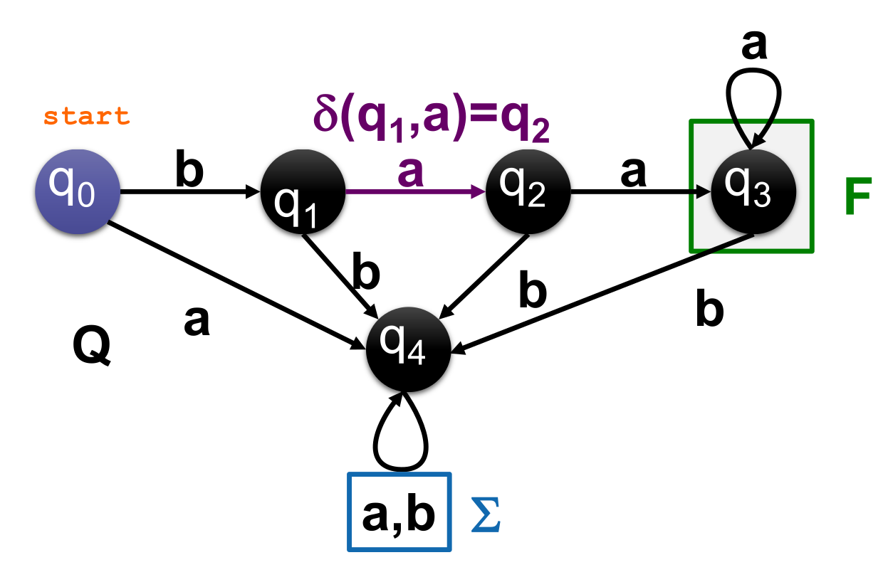
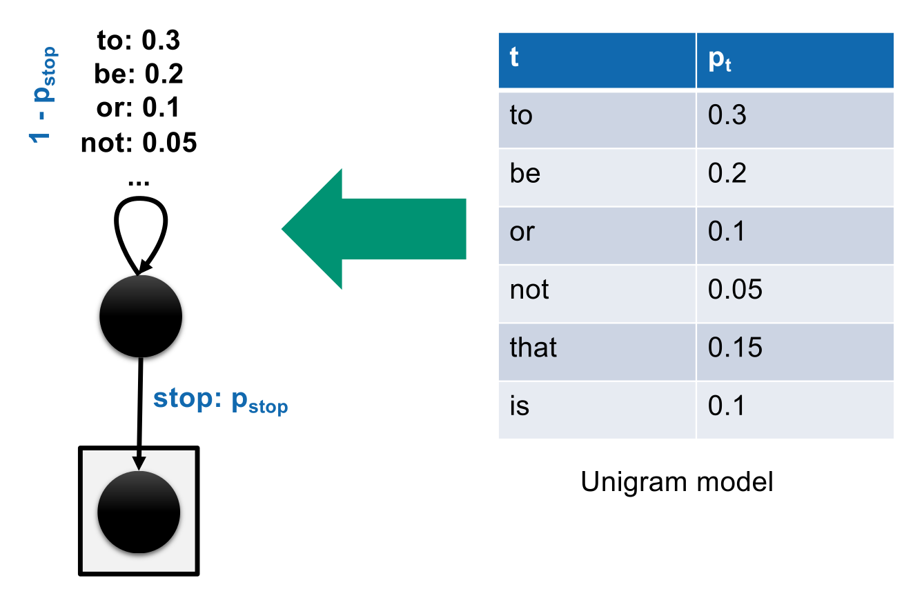
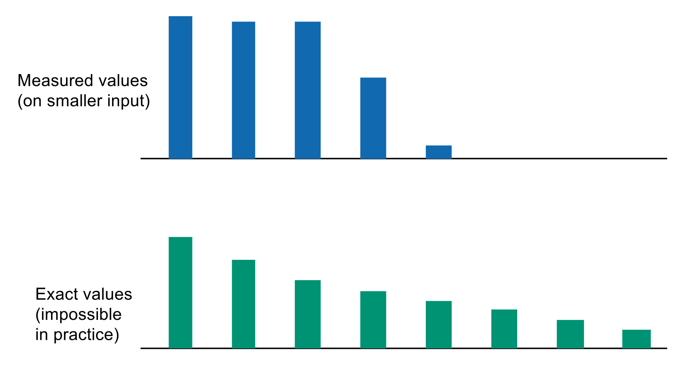
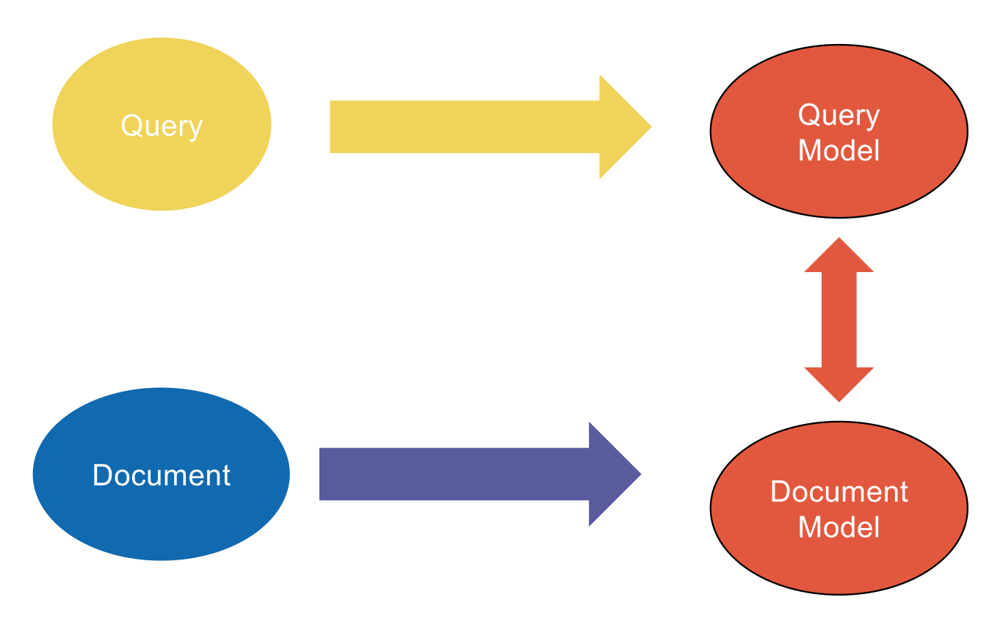

## Introduction to Language Models

- **Terminology Shift**: Theoretical Computer Science (TCS) concepts translate differently into Information Retrieval (IR).
    - **Letters / Characters** (TCS) $\rightarrow$ **Terms / Words** (IR).
    - **Words / Strings** (TCS) $\rightarrow$ **Documents** (IR).
- **Language Model (LM)**: Probabilistic function creating a distribution over vocabulary strings. Sum of all generated string probabilities $= 1$.
- **Finite State Automaton (FSA)**: Theoretical graph for recognizing/generating regular languages.
  
    - **Components**: **States** (nodes), **Transitions** (edges), **Start state**, and **Accept/Stop state**.
    - **FSA as a Generator**: Outgoing transition probabilities must sum to $1$ per node.
    - **Generation Probability**: Product of all transition probabilities along the path until the stop state.

## Generative Document Models

- **The Chain Rule**: Exact decomposition of sequence generation (no independence assumptions).
    - $P(D = (d_1, d_2, d_3)) = P(L_D \ge 1) \times P(D_1 = d_1 | L_D \ge 1) \times \dots$
    - Requires **stopping condition** ($p_{stop}$) to terminate.
- **Markov Assumption & K-Gram Models**: Limits memory to handle complexity. Assumes probability of a term depends *only* on the previous $k$ terms (**k-gram model**).
    - **Bigram Model**: Remembers $1$ previous term ($P(d_k | d_{k-1})$). FSA has one state per vocabulary word.
    - **Unigram Model**: Zero memory. Complete term independence ($P(d_k)$).
      
    - **Bias-Variance Tradeoff**: Higher-order models capture local structure better, but IR uses **Unigrams** due to severe **data sparseness** in individual documents.

## List vs. Bag of Words Semantics

- **List of Words Semantics**: Exact sequence and **order matter** ($D \in \Omega \rightarrow \mathcal{T}^*$).
    - **Unigram List Probability**: $P(D=d) = p_{stop} (1 - p_{stop})^{L_d} \prod_t p_t^{tf_{t,d}}$
    - *Insight*: Despite strict order, reliance on multiplication and **Term Frequency (TF)** powers means shuffled permutations yield the **exact same probability**.
- **Bag of Words Semantics**: Sequence and **order ignored** ($D' \in \Omega \rightarrow \mathbb{N}^\mathcal{W}$).
    - Documents treated as equivalence classes (shuffles grouped together).
    - **Multinomial Distribution**: Scales unigram list probability by number of possible permutations (combinatorics).
        - **Combinatorics formula**: $\frac{(\sum_t k_t)!}{\prod_t k_t!}$ (where $k_t$ is the frequency of term $t$).
    - Formula: $P(D=d | L_D = L_d) = \frac{L_d!}{\prod_t tf_{t,d}!} \prod_t p_t^{tf_{t,d}}$

## The Query Likelihood Model (QLM)

- **Core Concept**: Rank documents by probability of document's language model ($M_d$) generating user query ($q$).
- **Bayesian Derivation**: Inverts $P(D=d | Q=q)$ using Bayes' rule.
    - $P(D=d | Q=q) = \frac{P(Q=q | D=d) \times P(D=d)}{P(Q=q)}$
    - **Ignore Denominator**: $P(Q=q)$ is constant across documents.
    - **Prior Probability**: $P(D=d)$ usually a **uniform prior** (ignored). *Advanced systems use authority, length, or PageRank.*
    - **Result**: Ranking relies solely on **Query Likelihood** $P(Q=q | D=d)$.
- **Mathematical Connection to Vector Space**:
    - Logarithm of multinomial query likelihood converts product into a sum.
    - Result matches a **scalar product** involving query vs. document **Term Frequency (TF)**:
    - Formula: $\log P(Q=q | D=d) = C + \sum_t tf_{t,q}(\log tf_{t,d} - \log L_d)$
- **Major IR Insight**: **Language models** mathematically justify **Term Frequency (TF)**; **Probabilistic models** (like BIM) justify **Inverse Document Frequency (IDF)**.

## Estimation & Smoothing

- **Maximum Likelihood Estimate (MLE)**: Raw unigram probabilities from document text ($P_{mle}(t|M_d) = \frac{tf_{t,d}}{L_d}$).
    - $M_d$: Document language model.
    - $L_d$: Total document length (number of tokens).
- **The Zero Probability Problem**: Missing query terms yield $0$ probability.
    - Causes **strict conjunctive semantics** (one missing term forces total probability to $0$).
    - Overestimates probability of chance single-occurrence terms.
- **Smoothing Approaches**: Reassigns probability mass from observed to unseen words.
  
    - **Linear Interpolation (Jelinek-Mercer)**: Mixes document MLE with global **Collection Model** ($M_c$).
        - Formula: $P(t|d) = \lambda P_{mle}(t|M_d) + (1 - \lambda) P_{mle}(t|M_c)$
        - Controlled by parameter $\lambda \in (0, 1)$.
    - **Bayesian Smoothing (Dirichlet Prior)**: Uses collection model as prior distribution.
        - Formula: $P(t|d) = \frac{tf_{t,d} + \alpha P_{mle}(t|M_c)}{L_d + \alpha}$
- **Effect of Smoothing**: Doesn't just fix zeros; implements an **IDF-like effect** (rewards terms rare in collection but present in document).

## Extended Language Modeling Approaches

- **Document Likelihood Model**: Reverses QLM. Generates document from **Query Language Model** ($M_q$).
    - Hard to estimate due to short queries.
    - Useful for integrating **Relevance Feedback** (expanding $M_q$ via relevant docs).
- **Model Comparison**: Builds probabilistic models for query ($M_q$) and document ($M_d$), measuring distance between them.
  
    - **Kullback-Leibler (KL) Divergence**: Asymmetric information theory metric calculating how bad $M_q$ is at modeling $M_d$.
- **Translation Models**: Addresses vocabulary mismatches (synonymy / cross-language IR).
    - Translates document terms to query terms via conditional probability distribution $T(t|v)$.
    - Requires external resources (thesauri, bilingual dictionaries).
