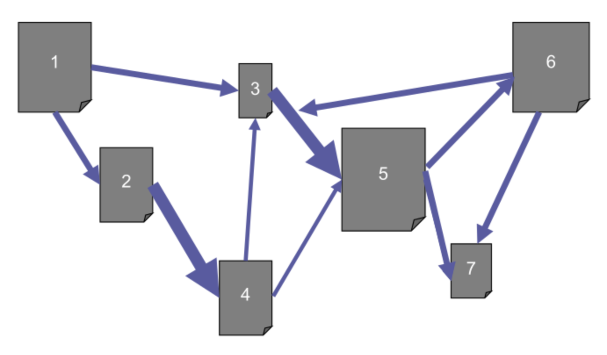
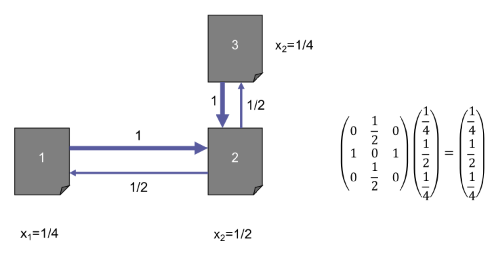

## Introduction to Web Search

- **Google's Innovation**: Success driven by the **PageRank** algorithm.
- **Ranking Concept**: Represents a **third way** of ranking (distinct from probabilistic IR and language models).
- **Core Idea**: **Ranking pages in order to display them** via inherent authority, not just query relevance.

## The Web as a Weighted Graph

- **Scale**: Billions of documents connected via **hypertext links**.
- **Page Impact**: Measure of page being **popular or relevant** (e.g., Wikipedia = high impact).
- **Impact Division**: Total impact split evenly across outgoing links.
    - 1 link: Target receives $1$ (full).
    - 2 links: Targets receive $1/2$ each.
    - 3 links: Targets receive $1/3$ each.
- **Weighted Graph**: Global network where edges carry fractional source impact.

## The Random Surfer Model

- **Thought Experiment**: User clicking links completely at random infinitely.
- **Resulting Metric**: Generates a **distribution over the pages** based on visit frequency (ranking foundation).
- **Mathematical Abstraction**:
    - **Probability Vector** ($X$): Column vector representing page visit probability/score ($x_1 \dots x_n$).
    - **Transition Matrix** ($M$): **Stochastic matrix** encoding graph edge weights.
    - **Matrix Property**: The **sum of every column is exactly one** ($100\%$ outgoing weights).
    - **State Calculation**: Step $k+1$ probability found by multiplying **stochastic matrix** with step $k$ vector.

## Convergence & Diagonalization

- **N-Steps Simulation**: Repeated multiplication by transition matrix ($M^k$).
- **Convergence**: Probabilities stabilizing over time; must **converge to a fixed point** (stationary distribution).
- **Mathematical Representation**: Fixed point equation $MX = X$.
- **Linear Algebra Application**:
    - Solved via **diagonalization problem**.
    - Fixed point = **eigenvector associated with the eigenvalue one**.
    - Google initially built on diagonalizing these massive matrices.

## Damping & Teleportation

- **The Issue**: Surfer can **get stuck** in dead-ends or loops.
- **The Solution (Damping)**: **Reset button** (smoothing) to prevent traps.
- **Random Teleportation**: Probability $p$ to **teleport uniformly at random** to any web page.
- **Standard Configuration**:
    - **85%** chance following standard links ($1-p = 0.85$).
    - **15%** chance teleporting randomly ($p = 0.15$).
- **Damping Formula**: Combines matrix $M$ with uniform matrix (ensuring non-zero visit probability everywhere).

$$X_{k+1} = \left( 0.85M + \frac{0.15}{n} \begin{pmatrix} 1 & \dots & 1 \\ \dots & \dots & \dots \\ 1 & \dots & 1 \end{pmatrix} \right) X_k$$
