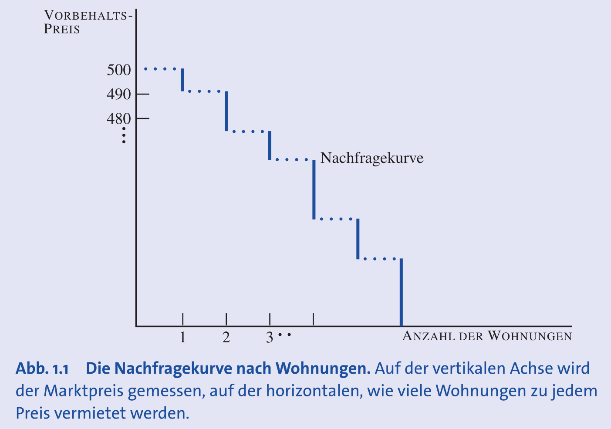
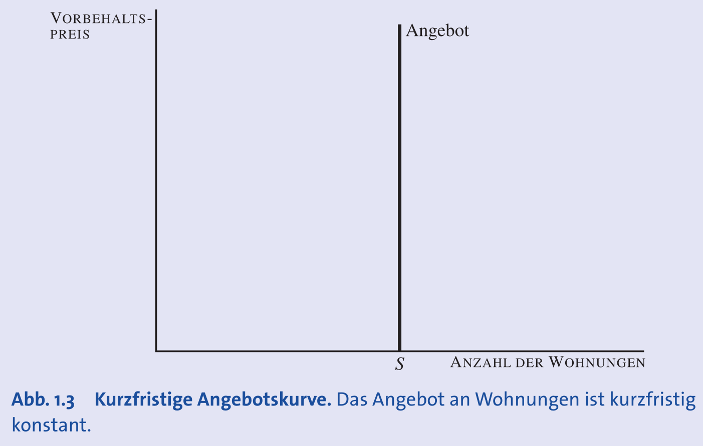
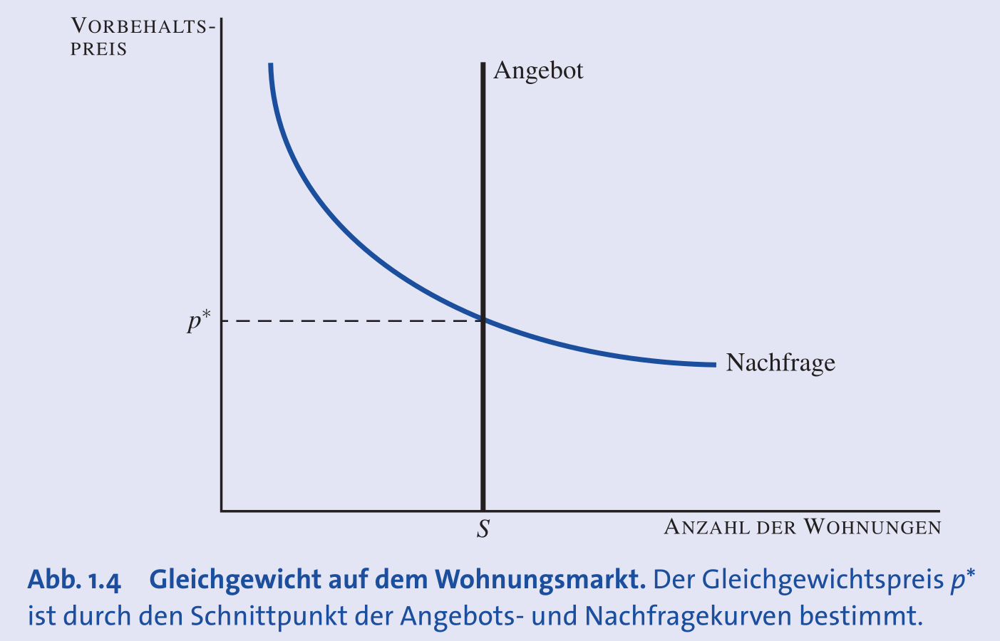
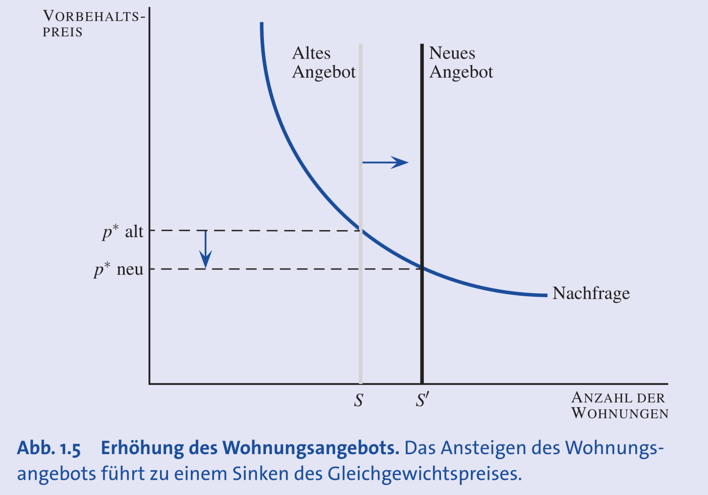
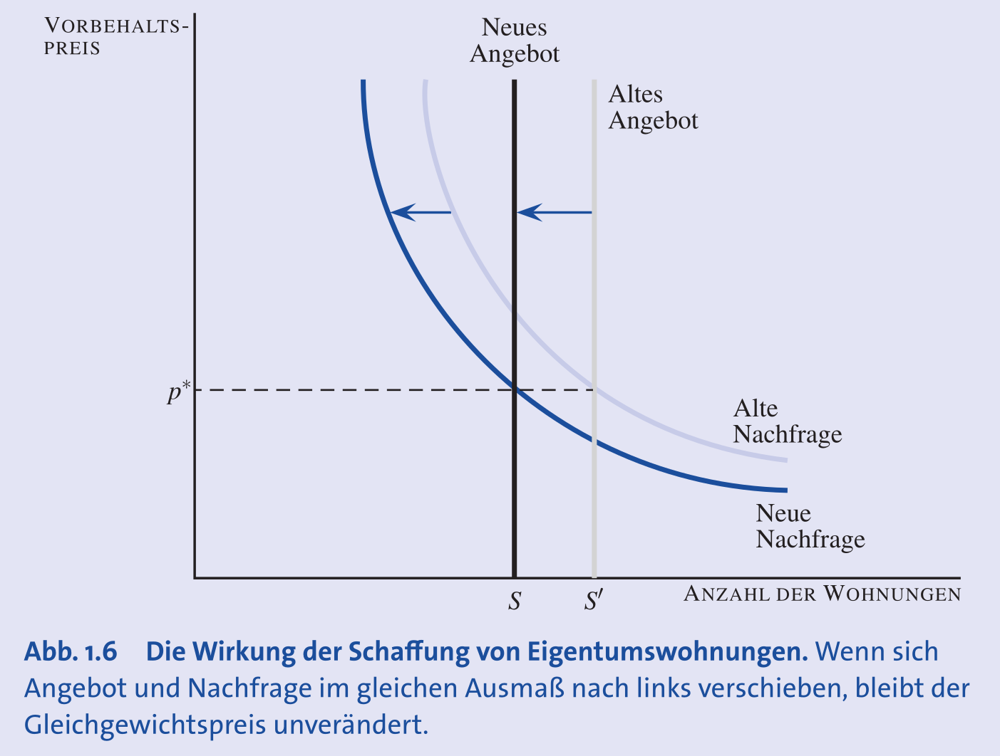
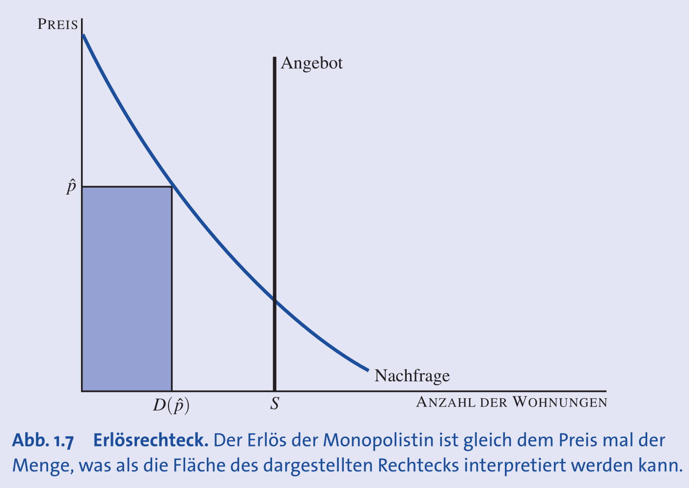
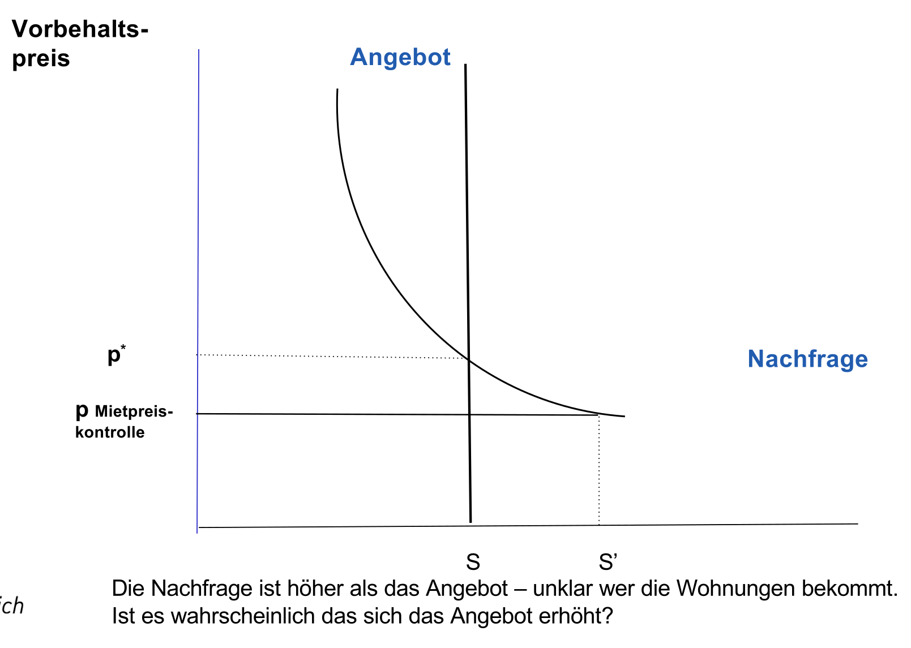

## Grundlagen der Mikroökonomie

- **Mikroökonomie**: Teilgebiet der Volkswirtschaftslehre.
- Analysiert **wirtschaftliche Entscheidungen** einzelner Akteure:
    - **Haushalte** (Konsum)
    - **Unternehmen** (Produktion)
    - **Märkte** (Interaktion)
- **Klassische Mikroökonomie**: Oft als **Preistheorie** bezeichnet.
- **Moderne Mikroökonomie**: Befasst sich zusätzlich mit **Koordination und Information**.
- Dient als **"Werkzeugkiste"** (Modelle) und **"Brille"** (Analysewerkzeug).
- **Kritikpunkte**:
	- Dient als **kapitalistische Ideologie** mit herrschaftsstabilisierender Funktion. (z.B. W. Hofmann)
	- Kapitalismus **fördert Ungleichheit** (z.B. Piketty: r > g, Rendite auf Kapital > Wirtschaftswachstum).
	- Basiert auf **Homo oeconomicus** welcher nur nach eigenem **individuellem Wohlbefinden** strebt.

## Ökonomische Modelle

- **Modell**: **Vereinfachte Darstellung der Wirklichkeit**.
    - Zweck: Konzentration auf das Wesentliche durch Weglassen irrelevanter Details.
- Sollen **kausale/logische Zusammenhänge** darstellen.
- **Marktmodell** als wichtigstes Modell; bestimmt zentrale Grössen:
    - **Preis** (z.B. Miete, Lohn)
    - **Menge** (produziert/konsumiert)
    - **Verteilung** (wer bekommt die Güter?)
- Anwendbarkeit des Modells hängt von der Gutart ab:
    - **Homogene Güter**: Identische Güter, bei denen der **Preis das Hauptkriterium** ist (Modell funktioniert gut).
    - **Heterogene Güter**: Unterschiedliche Güter (z.B. Autos), bei denen auch **Qualität, Marke etc.** eine Rolle spielen (einfaches Preismodell weniger genau).

## Der Wohnungsmarkt: Ein Modellbeispiel

- Modellannahmen für eine Universitätsstadt:
    - **Innerer Wohnkreis**: Nahe Uni, bevorzugt.
    - **Äusserer Wohnkreis**: Weiter entfernt. Preis ist **exogene Variable**.
        - **Exogene Variable**: von aussen bestimmt, nicht im Modell erklärt.
- Preis im inneren Ring ist **endogene Variable** (wird im Modell bestimmt).
- Zwei grundlegende Prinzipien:
    - **Optimierungsprinzip**: Menschen wählen das beste Konsummuster, das sie sich leisten können.
        - Berücksichtigt **Opportunitätskosten**: Der Wert der nächstbesten Alternative, auf die man verzichtet (z.B. Geld für andere Dinge ausgeben statt für hohe Miete).
    - **Gleichgewichtsprinzip**: Preise passen sich an, bis **Nachfrage = Angebot**.

## Die Nachfragekurve

- Zeigt nachgefragte Menge zu einem bestimmten Preis.
- Basiert auf **Vorbehaltspreis**: Maximale Zahlungsbereitschaft einer Person.
- **Fallender Verlauf**: niedrigerer Preis -> höhere Nachfrage.

## Die Angebotskurve

- Zeigt angebotene Menge zu einem bestimmten Preis.
- **Konkurrenzmarkt**: Markt mit vielen unabhängigen Anbietern.
    - Es bildet sich ein **einheitlicher Preis**.
    - **Beweis**: Gäbe es hohe und niedrige Preise, könnte ein Mieter einem "Niedrigpreis-Vermieter" etwas mehr bieten. Beide wären bessergestellt. Dieser Prozess führt zur Angleichung der Preise.
- **Kurzfristig**: Anzahl der Wohnungen ist **konstant**.
    - Angebotskurve ist eine **vertikale Linie**.

## Marktgleichgewicht

- **Marktgleichgewicht**: Schnittpunkt von Angebots- und Nachfragekurve.
- Preis an diesem Punkt: **Gleichgewichtspreis (p\*)**.
- Bei p\*: **nachgefragte Menge = angebotene Menge**.
- Preis **> p\***: **Angebotsüberschuss** (Leerstand) -> Preisdruck nach unten.
- Preis **< p\***: **Nachfrageüberschuss** (Warteschlangen) -> Preisdruck nach oben.

## Komparative Statik

- Vergleich von Gleichgewichtszuständen (vor/nach Änderung), ohne Analyse des Übergangs.
- **Beispiel 1: Angebotserhöhung**
    - Angebotskurve nach rechts -> **Gleichgewichtspreis sinkt**.
	
- **Beispiel 2: Umwandlung in Eigentumswohnungen**
    - Angebot sinkt. Wenn Käufer Ex-Mieter sind, sinkt auch die Nachfrage.
    - Bei gleicher Verschiebung beider Kurven nach links -> **Gleichgewichtspreis bleibt unverändert**.
	
- **Beispiel 3: Wohnungssteuer (kurzfristig)**
    - Angebot (Anzahl Wohnungen) und Nachfrage (Zahlungsbereitschaft) ändern sich nicht.
    - **Gleichgewichtspreis bleibt unverändert**; Vermieter tragen die Steuerlast.

## Andere Allokationsmechanismen

- **Diskriminierender Monopolist**:
    - Ein Anbieter, kennt alle Vorbehaltspreise und verlangt von jeder Person das Maximum.
    - Maximiert seinen Gewinn durch individuelle Preisgestaltung.
- **Gewöhnlicher Monopolist**:
    - Ein Anbieter, ein **einziger Preis** für alle.
    - Wählt Preis zur Maximierung des **Gesamterlöses (Preis x Menge)**.
    - Ergebnis: oft **weniger Angebot** zu **höherem Preis** als im Konkurrenzmarkt.
	
- **Mietenkontrolle**:
    - Staatlich festgelegter **Höchstpreis (p_max)** unter dem Gleichgewichtspreis.
    - Führt zu **Nachfrageüberschuss**.
    - Wer die Wohnungen bekommt, ist im Modell unklar.
	

## Bewertung von Allokationsmechanismen: Pareto-Effizienz

- Ein Kriterium zur Bewertung ökonomischer Ergebnisse.
- **Pareto-Verbesserung**: Mind. eine Person besserstellen, ohne jmd. anderen schlechter zu stellen.
- **Pareto-ineffizient**: Eine Pareto-Verbesserung ist noch möglich.
- **Pareto-effizient**: Keine Pareto-Verbesserung mehr möglich; alle **freiwilligen Tauschgewinne** sind ausgeschöpft.

## Vergleich der Allokationsmechanismen nach Pareto-Effizienz

- **Konkurrenzmarkt**: **Pareto-effizient**.
    - Wohnungen gehen an Personen mit höchsten Vorbehaltspreisen; kein Tauschgewinn mehr möglich.
- **Diskriminierender Monopolist**: **Pareto-effizient**.
    - Gleiche Allokation wie im Konkurrenzmarkt, aber andere Verteilung des Geldes (Vermieter erhält alles).
- **Gewöhnlicher Monopolist**: **Nicht Pareto-effizient**.
    - Wohnungen bleiben leer, obwohl Leute bereit wären, einen Preis über den Kosten zu zahlen. Eine Vermietung wäre eine Pareto-Verbesserung.
- **Mietenkontrolle**: **Nicht Pareto-effizient**.
    - Zufällige Zuteilung führt dazu, dass Tauschgeschäfte möglich sind (z.B. Untervermietung von Person mit niedrigem an Person mit hohem Vorbehaltspreis).
