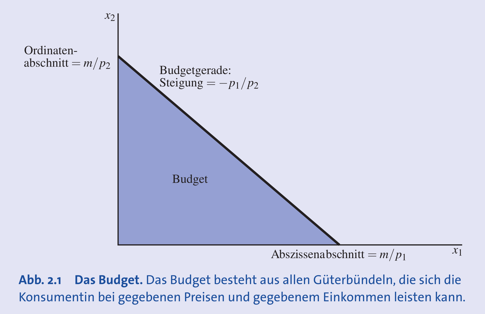
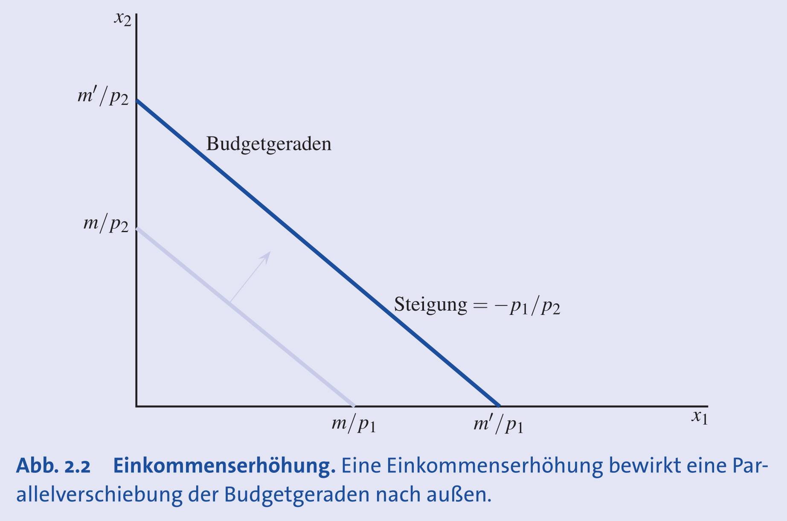
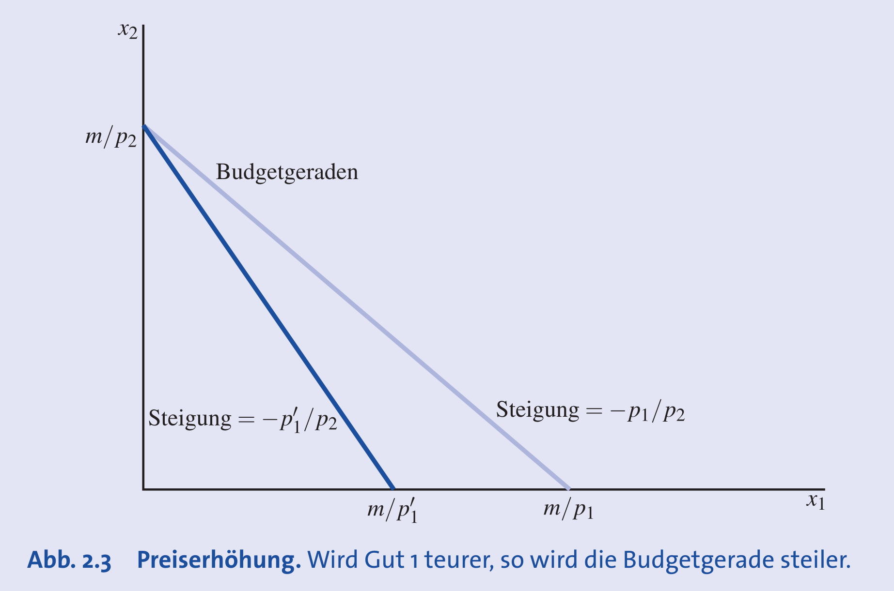
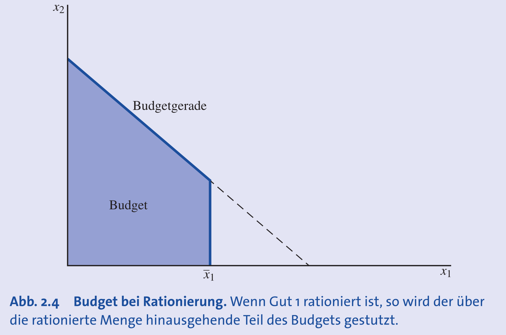
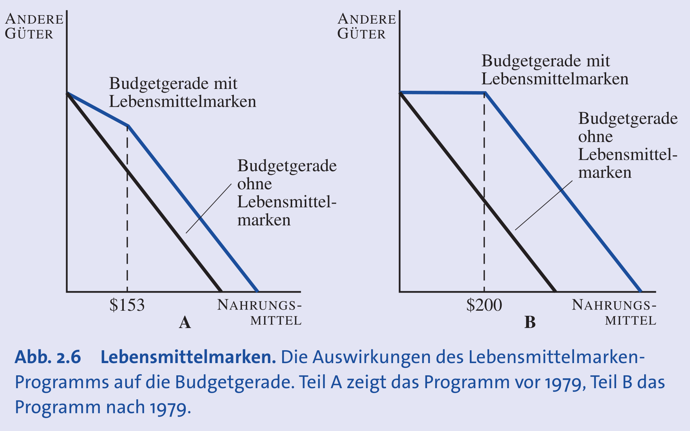

## Grundlagen der Konsumtheorie

- **Grundannahme**: Konsumenten wählen das **beste Güterbündel**, das sie sich **leisten können**.
- **Theorie des Konsumentenverhaltens**: Untersucht "leisten können" (**Budgetbeschränkung**) und "das Beste".
- **Darstellungsformen ökonomischer Modelle**:
    - **Grafisch**: Macht Komplexität sichtbar und hilft, das Wesentliche zu erkennen (z.B. Budgetgerade).
    - **Mathematisch**: Ermöglicht Quantifizierung; Voraussetzung für statistische Prüfung.

## Die Budgetbeschränkung

- **Budgetbeschränkung**: Alle Güterbündel, die sich ein Konsument bei gegebenen Preisen & Einkommen leisten kann.
    - Formel für zwei Güter: $p_1x_1 + p_2x_2 \le m$
        - $p$: **Preis** eines Gutes
        - $x$: **Menge** eines Gutes
        - $m$: **Einkommen** (Budget)
- **Budgetgerade**: Menge der Güterbündel, die genau das gesamte Einkommen $m$ kosten.
    - Formel für zwei Güter: $p_1x_1 + p_2x_2 = m$
- **Grafische Darstellung**: Gerade zwischen **Abszissenabschnitt** ($m/p_1$, max. Menge Gut 1) & **Ordinatenabschnitt** ($m/p_2$, max. Menge Gut 2).
    - **Steigung** der Geraden: $-p_1/p_2$.
- **Leistbarkeit von Güterbündeln**:
    - **Leistbar**: Alle Güterbündel unterhalb der Budgetgeraden.
    - **Gerade noch leistbar**: Alle Güterbündel auf der Budgetgeraden.
    - **Nicht leistbar**: Alle Güterbündel oberhalb der Budgetgeraden.
- **Unteilbare Güter** (z.B. Autos): Darstellung als einzelne Punkte, nicht als durchgehende Gerade.
- **Erweiterung auf mehrere Güter**:
    - **Drei Güter**: Grafisch darstellbar als Budgetebene im 3D-Raum.
    - **n Güter**: Grafisch nicht darstellbar; mathematisch mit Vektoren: $p' \cdot x \le m$.

## Spezialfälle und Interpretationen

- **Numéraire-Konzept**:
    - Ein Preis (z.B. $p_2$) wird als Referenz auf 1 gesetzt.
    - Alle anderen Preise & das Einkommen werden relativ zu diesem **Numéraire-Preis** gemessen.
    - Budgetgleichung wird durch Numéraire-Preis dividiert: $(p_1/p_2)x_1 + x_2 = m/p_2$.
    - Vorteil: Eine Variable (Preis) weniger zu beachten.
- **Zusammengesetztes Gut**:
    - Spezialfall des Numéraire bei Interesse an nur einem Gut (Gut 1).
    - Alle anderen Güter zusammengefasst zu Gut 2 ("Geld für andere Ausgaben").
    - Preis des zusammengesetzten Gutes per Definition auf 1 gesetzt: $p_2 = 1$.
    - Formel: $p_1x_1 + x_2 \le m$.
- **Opportunitätskosten**:
    - Verzicht auf Konsum eines Gutes zugunsten eines anderen.
    - Die **Steigung der Budgetgeraden ($-p_1/p_2$)** misst die Opportunitätskosten des Konsums von Gut 1 in Einheiten von Gut 2.
    - Gibt **Austauschverhältnis** an, zu dem der Markt Gut 2 für Gut 1 substituiert.
    - Beispiel: Wein 10 CHF, Bier 5 CHF -> Opportunitätskosten von 1 Glas Wein sind 2 Gläser Bier.

## Veränderungen der Budgetgeraden

- **Einkommensänderungen**:
    - **Erhöhung** des Einkommens ($m$): **Parallelverschiebung nach aussen**.
    - **Senkung** des Einkommens: **Parallelverschiebung nach innen**.
    - Steigung ($-p_1/p_2$) bleibt unverändert.
    
- **Preisänderungen**:
    - **Proportionale Preisänderung** (Faktor $t$, z.B. Inflation): Gleicher Effekt wie Division des Einkommens durch $t$.
        - Folge: **Parallelverschiebung nach innen**.
        - Steigen Einkommen & Preise um denselben Faktor: Budgetgerade **unverändert**, da **reales Einkommen** (Kaufkraft) gleich bleibt.
    - **Änderung eines Preises**:
        - Sinkt $p_1$, wird Budgetgerade **flacher** (Drehung nach aussen um Ordinatenabschnitt $m/p_2$).
        - Steigt $p_1$, wird sie **steiler** (Drehung nach innen).
        

## Staatliche Eingriffe und ihre Auswirkungen

- **Steuern**:
    - **Mengensteuer** ($t$): Fester Betrag pro Einheit. Neuer Preis $p_1 + t$. Budgetgerade wird **steiler**.
    - **Wertsteuer** (Ad-Valorem-Steuer, z.B. MwSt. $\tau$): Prozentualer Aufschlag. Neuer Preis $p_1 \cdot (1 + \tau)$. Budgetgerade wird **steiler**.
- **Subventionen**:
    - **Mengensubvention** ($s$): Fester Betrag pro Einheit. Neuer Preis $p_1 - s$. Budgetgerade wird **flacher**.
    - **Ad-Valorem-Subvention** ($\sigma$): Prozentualer Zuschuss. Neuer Preis $p_1 \cdot (1 - \sigma)$. Budgetgerade wird **flacher**.
- **Pauschalsteuer und -subvention**:
    - **Pauschalsteuer** ($u$): Fixer Abzug vom Einkommen ($m - u$), konsumunabhängig. Führt zu **Parallelverschiebung nach innen**.
    - **Pauschalsubvention**: Fixer Zuschuss zum Einkommen. Führt zu **Parallelverschiebung nach aussen**.
- **Rationierung**:
    - Begrenzung der max. konsumierbaren Menge (z.B. Gut 1 auf $\bar{x}_1$).
    - Budget am Punkt $\bar{x}_1$ **vertikal abgeschnitten**.
	
- **Kombinierte Eingriffe**:
    - **Steuer ab Menge $\bar{x}_1$**: Preis $p_1$ bis $\bar{x}_1$, danach $p_1 + t$. Führt zu **Knick in Budgetgerade** (wird steiler).
    - **Beispiel Food-Stamp-Programm (vor 1979)**: Kauf von Lebensmittelgutscheinen zum subventionierten Preis. Führt zu flacherer Budgetgerade bis zum Gutschein-Maximalwert, danach Knick zur ursprünglichen Steigung.
    

## Spezialfälle und Anwendungsbeispiele

- **Negativer Preis**:
    - Bezahlung für "Konsum" eines Gutes (z.B. Müllentsorgung, $p_1 = -2$).
    - Einnahmen aus Gut 1 erhöhen Budget für Gut 2.
    - Budgetgerade hat eine **positive Steigung**.
    - Beispiel-Formel: $x_2 = -(p_1/p_2)x_1 + m/p_2$, z.B. $x_2 = 2x_1 + 10$.
- **Bedingungsloses Grundeinkommen (BGE)**:
    - Auswirkung auf Budgetgerade **unklar**.
    - Einerseits **steigt Einkommen $m$** (Verschiebung nach aussen).
    - Andererseits mögliche **Änderung der relativen Preise** ($p_1/p_2$) durch verändertes Arbeitsangebot & Produktionskosten. Nettoeffekt ungewiss.
