## Grundlagen der Präferenzen

- **Güterbündel**: Vollständige Liste aller zur Wahl stehenden Waren & Dienstleistungen.
    - Darstellung als Vektor, z.B. $(x_1, x_2)$ für Mengen der Güter 1 & 2.
- **Präferenzrelationen**: Beschreibung der Rangordnung von Güterbündeln.
    - **Strenge Präferenz ($>$)**: X wird Y eindeutig vorgezogen ($X > Y$).
    - **Indifferenz ($\sim$)**: X und Y sind gleichwertig ($X \sim Y$).
    - **Schwache Präferenz ($\ge$)**: X ist mindestens so gut wie Y ($X \ge Y$).
- **Axiome der Rationalität**: Grundannahmen zur Konsistenz von Entscheidungen; Basis für Theoriebildung.
    1. **Vollständigkeit**: Ein Konsument kann beliebige Bündel X und Y immer ordnen (z.B. $X \ge Y$ oder $Y \ge X$).
    2. **Reflexivität**: Jedes Bündel ist mind. so gut wie es selbst ($X \ge X$). Wertigkeit bleibt im Prozess konstant.
    3. **Transitivität**: Wenn $X \ge Y$ und $Y \ge Z$, dann folgt $X \ge Z$.
        - **Zentrale Annahme**: Vermeidet Zirkelschlüsse (z.B. "X > Y, Y > Z, aber Z > X") und sichert konsistente Entscheidungen.

## Indifferenzkurven

- **Indifferenzkurve**: Grafische Darstellung aller Güterbündel, die **indifferent** sind (gleichen Nutzen stiften).
    - Alle Punkte auf einer Kurve sind **gleichwertig**.
- **Besserstellung**: **Höher liegende Kurven** bedeuten **streng bevorzugte** Bündel (höherer Nutzen).

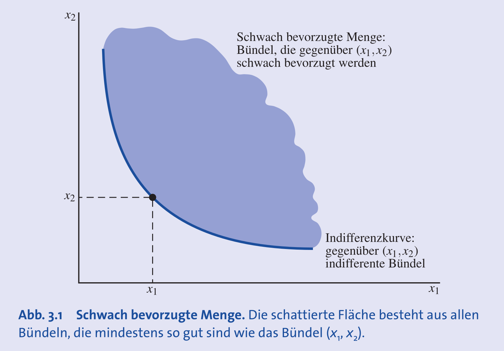

- **Eigenschaft**: Kurven unterschiedlicher Präferenzniveaus **können sich nicht schneiden**.
    - Ein Schnittpunkt würde die **Transitivitätsannahme** verletzen $\rightarrow$ widersprüchliche Präferenzordnung.
    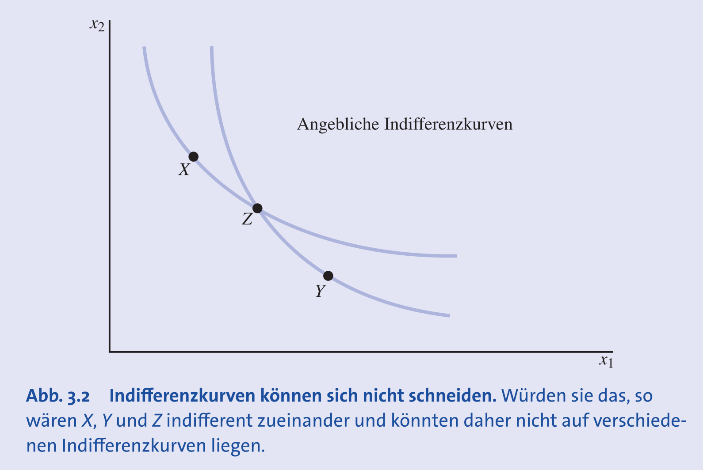

## Formen von Indifferenzkurven und Güterarten

- **Normale Güter**: Wenn beide Waren **"Güter"** sind ("mehr ist besser"), haben Indifferenzkurven eine **negative Steigung**.
- **Ungüter**: Eine Ware, von der man lieber weniger hat ("weniger ist besser", z.B. Luftverschmutzung).
    - Kombination aus Gut & Ungut: **positive Steigung**.
    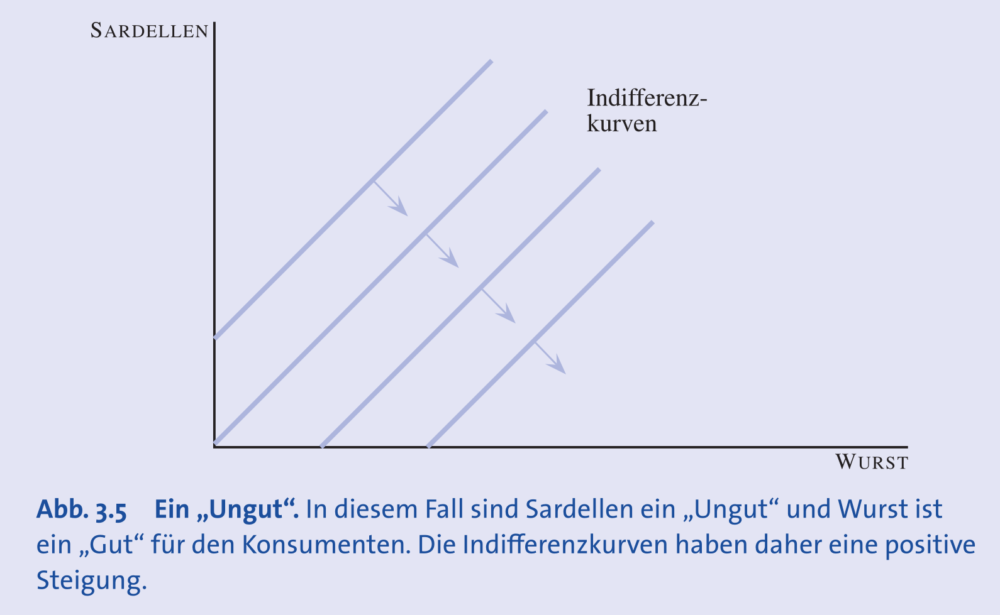
- **Perfekte Substitute**: Als gleichwertig erachtete Güter, tauschbar zu einem **konstanten Verhältnis**.
    - Beispiel: Rote und blaue Bleistifte bei Farbpräferenzlosigkeit.
    - Indifferenzkurven: **Geraden** mit konstanter negativer Steigung (z.B. -1 bei 1:1-Tausch).
    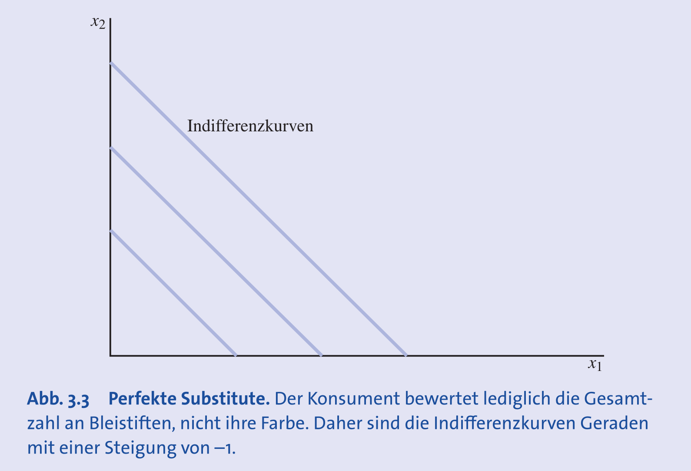
- **Perfekte Komplemente**: Güter, die immer in einem **konstanten Verhältnis** gemeinsam konsumiert werden.
    - Beispiel: Linker und rechter Schuh.
    - Indifferenzkurven: **L-förmig**; die Ecke markiert das erfüllte Konsumverhältnis.
    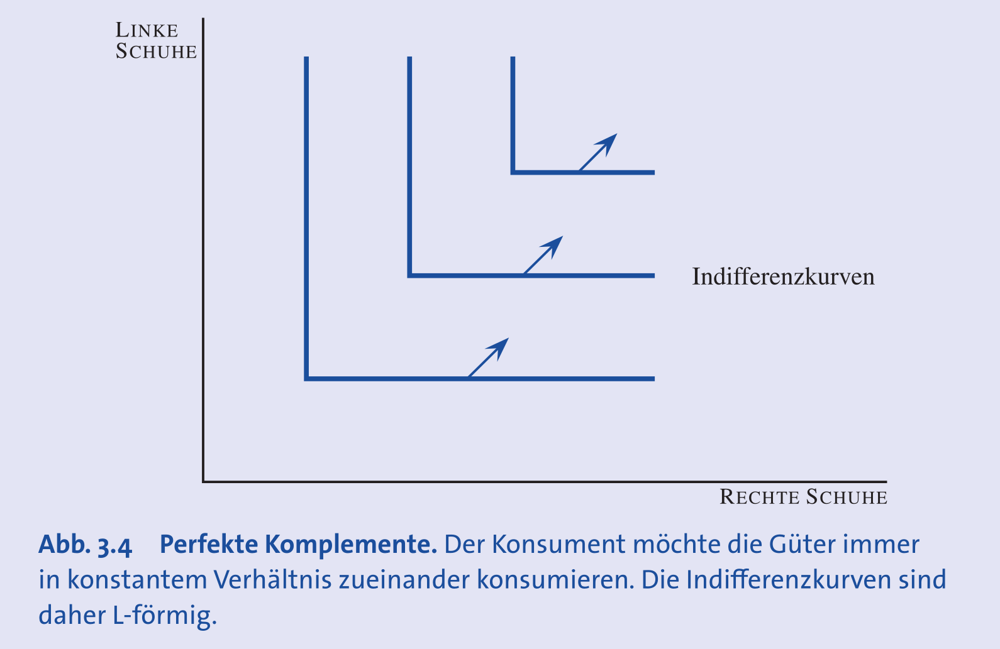
- **Neutrale Güter**: Eine für den Konsumenten irrelevante Ware, die den Nutzen nicht beeinflusst.
    - Indifferenzkurven: **vertikale** oder **horizontale Linien**.
    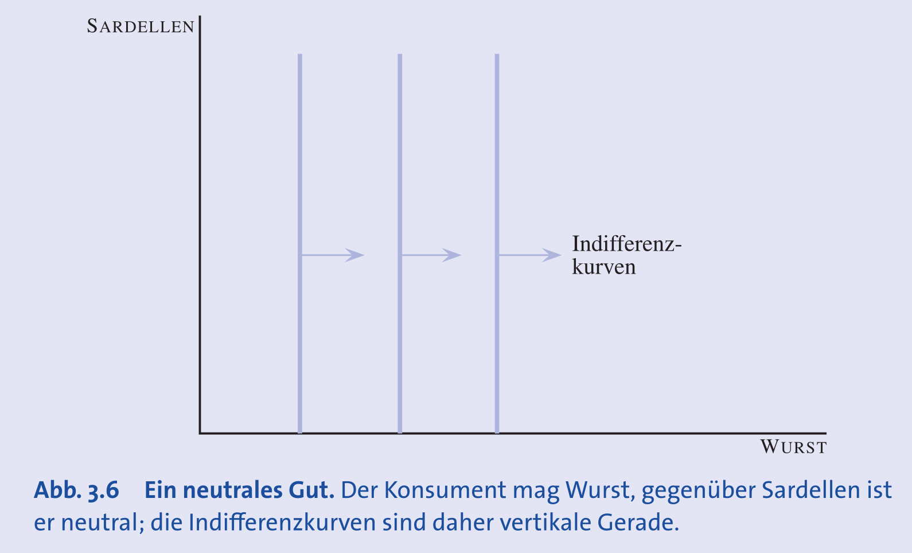
- **Sättigung (Blisspunkt)**: Ein optimales Güterbündel; eine Entfernung davon senkt den Nutzen.
    - Indifferenzkurven: **kreisförmig** um diesen Optimalpunkt.
    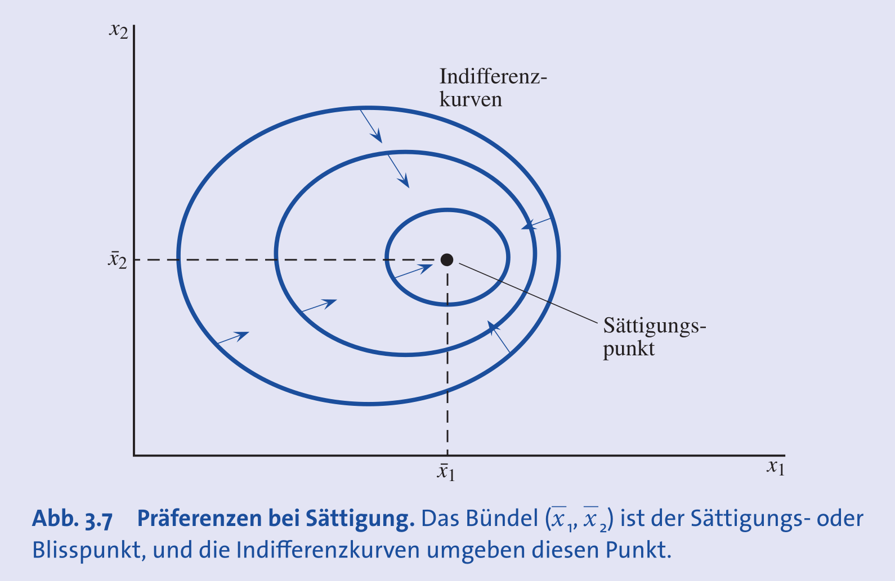
- **Unteilbare Güter**: Nur in ganzen Einheiten erhältlich (z.B. Autos).
    - Indifferenz"kurve": eine **Menge diskreter Punkte**.
    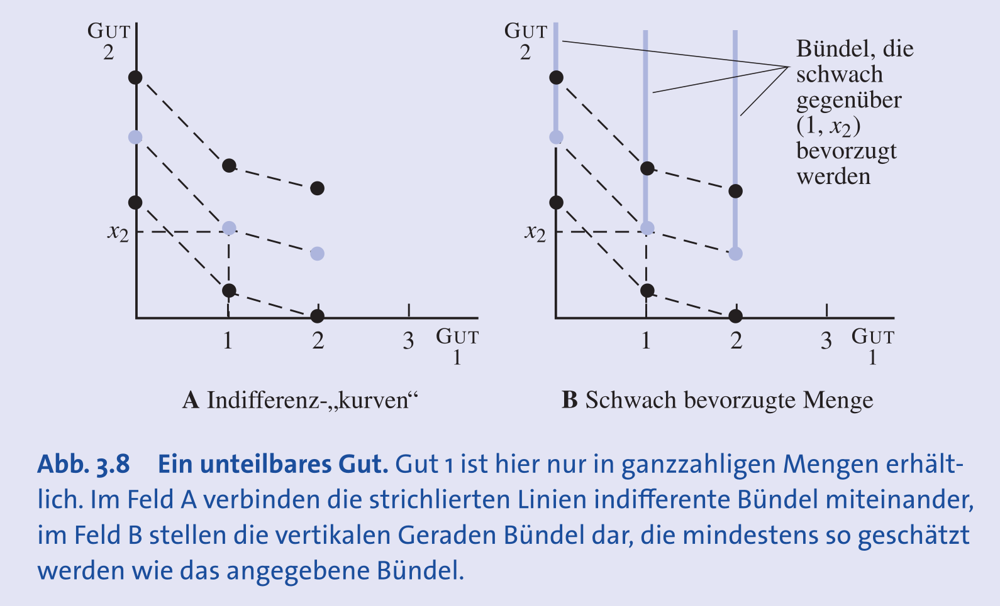

## Präferenzen im Normalfall ("Well-behaved")

- Zwei Annahmen für stetige und stabile Nachfragekurven:
1. **Monotonie ("Mehr ist besser")**: Annahme der Unersättlichkeit des Konsumenten.
    - Folge: Indifferenzkurven haben eine **negative Steigung**.
    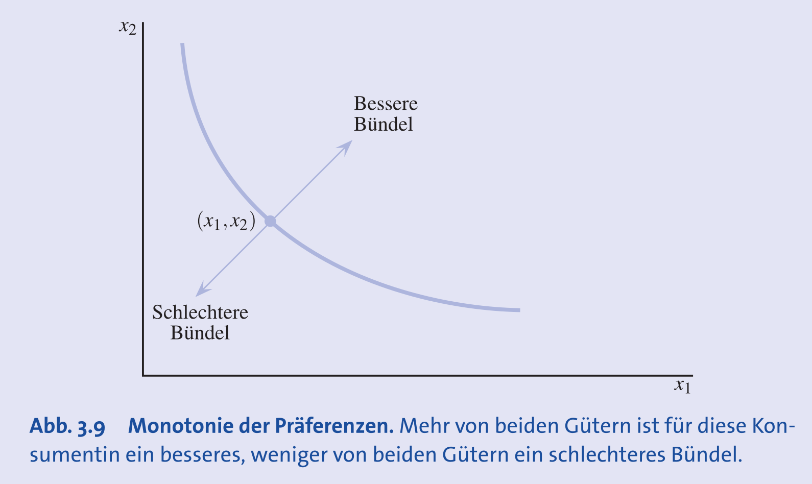
2. **Konvexität ("Durchschnitte sind besser als Extreme")**: Ein Durchschnitt zweier indifferenter Bündel wird den Extremen vorgezogen.
    - **Zentrale Annahme**: Sichert die typische, nach innen gekrümmte Form (**Konvexität**) der Indifferenzkurven.
    - Beispiel: (5 CDs, 5 Kinobesuche) > (2 CDs, 8 Kinobesuche).
    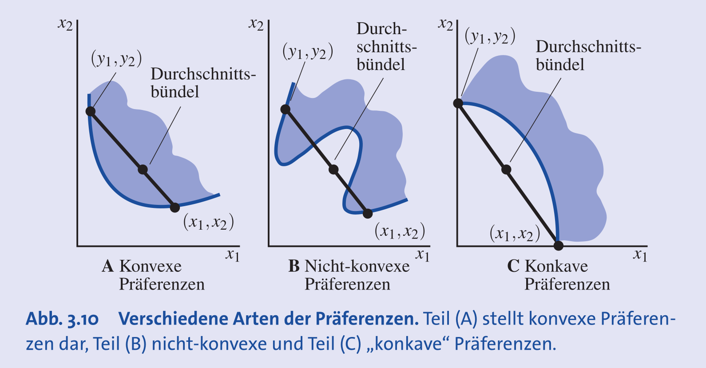
- **Strenge vs. schwache Konvexität**:
    - **Strenge Konvexität**: Durchschnitt **streng** bevorzugt ($>$); Kurve ist "rund" und hat **keine flachen Stellen**.
    - **Schwache Konvexität**: Durchschnitt **schwach** bevorzugt ($\ge$); Kurve kann **lineare Abschnitte** haben (z.B. bei perfekten Substituten).

## Grenzrate der Substitution (GRS)

- **Definition**: Die **GRS** (oder **MRS**) ist die **Steigung der Indifferenzkurve** in einem Punkt.
    - Formel: $GRS = \frac{\Delta x_2}{\Delta x_1}$
    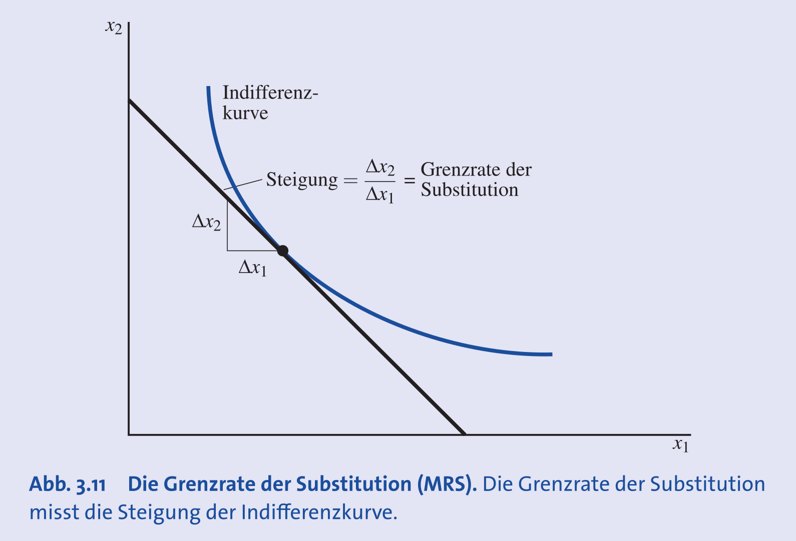
- **Interpretation**:
    1. **Tauschverhältnis**: Rate, zu der ein Konsument bereit ist, Gut 2 für eine marginale Einheit von Gut 1 zu tauschen (bei gleichem Nutzen).
    2. **Marginale Zahlungsbereitschaft**: Bereitschaft, für mehr Gut 1 mit einer bestimmten Menge von Gut 2 zu "zahlen".
- **Abnehmende GRS**: Bei **konvexen Kurven** sinkt der Betrag der GRS mit steigender Menge von Gut 1.
    - Je mehr man von Gut 1 hat, desto weniger ist man bereit, Gut 2 dafür aufzugeben.
- **GRS bei verschiedenen Güterarten**:
    - **Perfekte Substitute**: GRS ist **konstant** (z.B. -1).
    - **Perfekte Komplemente**: GRS ist entweder **Null** (horizontaler Teil) oder **unendlich** (vertikaler Teil).
    - **Neutrales Gut**: GRS ist **Null** oder **unendlich**.
    - **Ungut**: GRS ist **positiv**.
