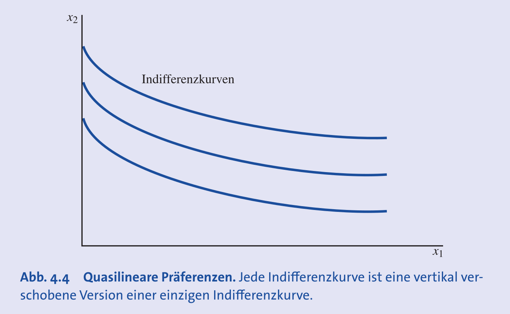
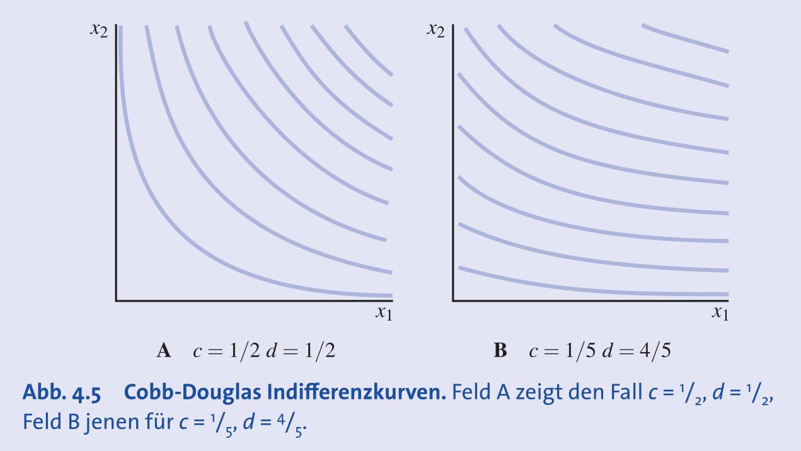
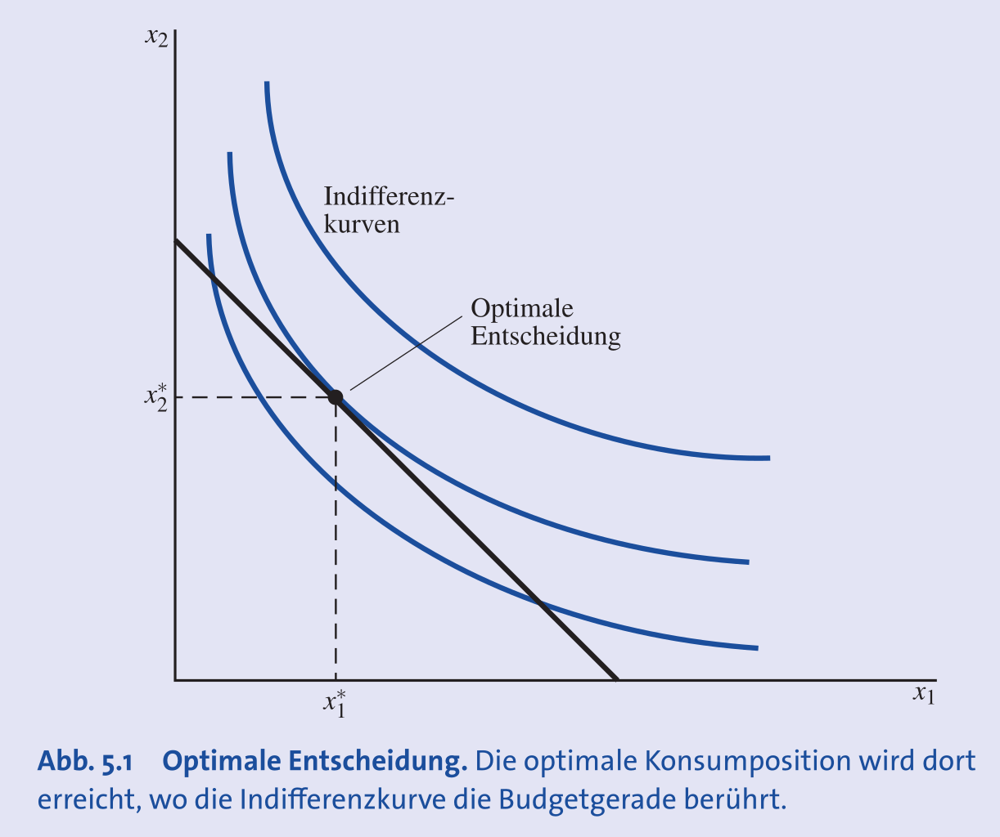
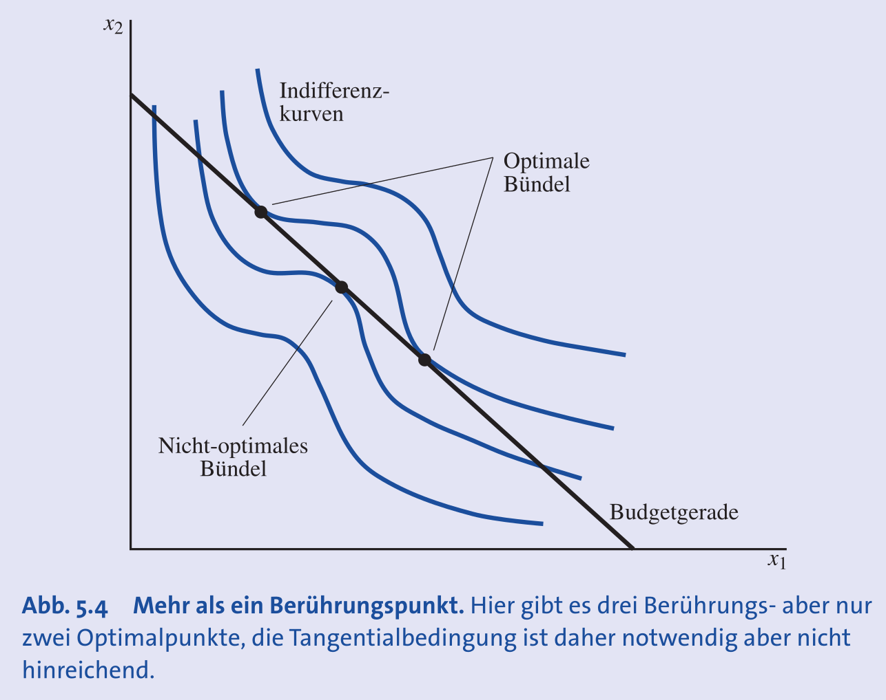
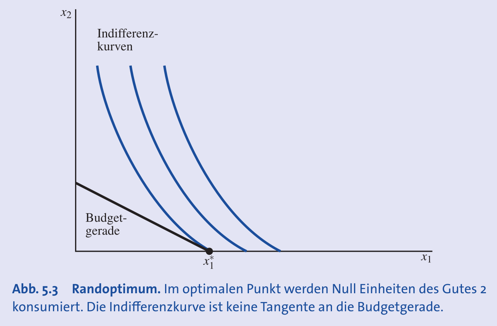
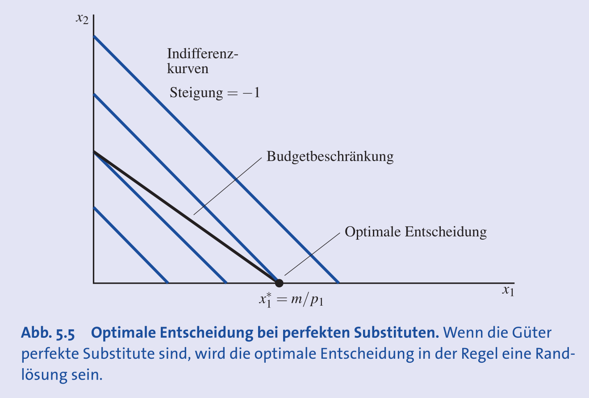
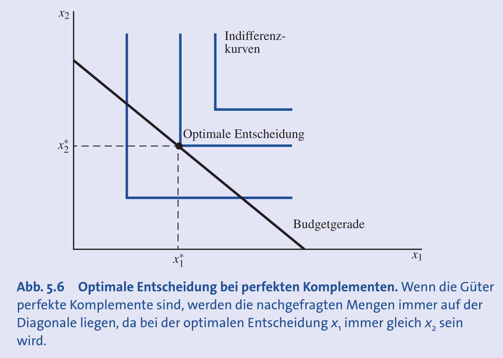
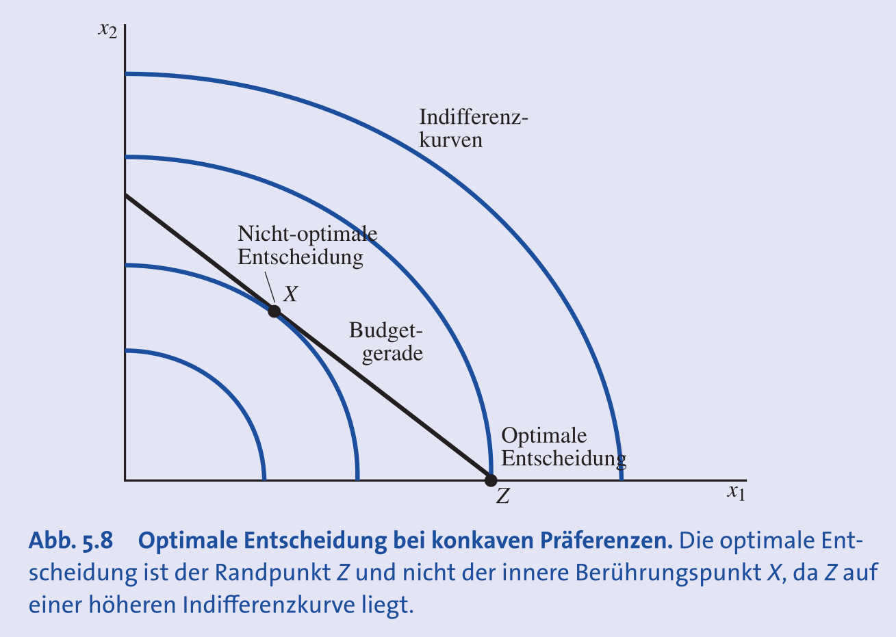

## Grundlagen des Nutzens

- **Nutzen**: Ursprünglich ein numerisches Mass für **Glück** oder **Wohlbefinden**.
- In der modernen Mikroökonomie: Ein Konzept zur Beschreibung von **Präferenzen**.
- **Messbarkeit**:
    - Nutzen ist **subjektiv** und schwer objektiv messbar.
    - **Zahlungsbereitschaft**: Ein möglicher, aber problematischer Indikator (abhängig von Finanzkraft).
- **Kardinaler vs. Ordinaler Nutzen**:
    - **Kardinaler Nutzen**: Annahme, dass das Ausmass der Nutzendifferenz bedeutsam ist (z.B. "doppelt so viel Nutzen"). Wird modern **nicht** verwendet.
    - **Ordinaler Nutzen**: Beschreibt nur die **Reihenfolge (Ranking)** der Güterbündel (besser, schlechter, gleich). Grundlage der Konsumententheorie.

## Die Nutzenfunktion

- **Nutzenfunktion**: Weist jedem Güterbündel eine Zahl zu, sodass bevorzugte Bündel höhere Zahlen erhalten.
- Dient der mathematischen Darstellung der **Präferenzordnung**.
- Symbolisch: Bündel $(x_1, x_2)$ > Bündel $(y_1, y_2)$ $\iff u(x_1, x_2) > u(y_1, y_2)$.
- **Monotone Transformation**:
    - Jede Transformation einer Nutzenfunktion $u$ (z.B. $f(u) = 2u+10$), welche die Rangordnung beibehält.
    - Beschreibt **exakt dieselben Präferenzen**.

## Beispiele für Nutzenfunktionen und Präferenzen

- **Perfekte Substitute**:
    - Güter, die in konstantem Verhältnis getauscht werden.
    - Nutzenfunktion: $U(x_1, x_2) = ax_1 + bx_2$.
    - Koeffizienten $a, b$ = relativer "Wert" der Güter.
    - Indifferenzkurven: **parallele Geraden**.
- **Perfekte Komplemente**:
    - Güter, die in festem Verhältnis konsumiert werden (z.B. linker & rechter Schuh).
    - Nutzenfunktion: **Minimum-Funktion**, $U(x_1, x_2) = \min\{ax_1, bx_2\}$.
    - Beispiel: 2 Löffel Zucker ($x_2$) pro Tasse Tee ($x_1$) $\rightarrow U(x_1, x_2) = \min\{x_1, 0.5x_2\}$.
    - Indifferenzkurven: **L-förmig**.
- **Quasilineare Präferenzen**:
    - Nutzen ist linear in einem Gut, nicht-linear im anderen.
    - Form: $U(x_1, x_2) = f(x_1) + x_2$.
    - Indifferenzkurven: **vertikal verschobene Kopien** voneinander.
    
- **Cobb-Douglas Nutzenfunktion**:
    - Standardform für "normale", konvexe Präferenzen.
    - Form: $U(x_1, x_2) = x_1^a x_2^b$, mit $a, b > 0$.
    - Exponenten $a, b$ = **Gewicht** der Güter im Nutzen.
    - Wichtige Eigenschaft: Führt dazu, dass ein **konstanter Einkommensanteil** für jedes Gut (bei Nutzenmaximierung) ausgegeben wird.
    

## Grenznutzen und Grenzrate der Substitution (GRS)

- **Grenznutzen (MU)**:
    - **Zusätzlicher Nutzen** durch eine zusätzliche Einheit eines Gutes (bei Konstanz des anderen).
    - Formel: $MU_1 = \frac{\Delta U}{\Delta x_1}$.
- **Zusammenhang GRS und MU**:
    - Entlang einer Indifferenzkurve ist die Nutzenänderung null ($\Delta U = 0$).
    - Die **GRS** (Steigung der Indifferenzkurve) ist das **negative Verhältnis der Grenznutzen**.
    - **$GRS = \frac{\Delta x_2}{\Delta x_1} = -\frac{MU_1}{MU_2}$**.

## Das optimale Konsumbündel

### Grundprinzip der Nutzenmaximierung

- **Ziel**: Wahl des **besten Güterbündels** (höchster Nutzen), das man sich **leisten kann** (Budgetrestriktion).
- **Grafische Lösung**: Der Punkt, an dem die **höchste erreichbare Indifferenzkurve** die Budgetgerade berührt.
- Dieser Berührungspunkt ist das **optimale Güterbündel** oder das **Nutzenmaximum**.

### Arten von Optima und ihre Bedingungen

Die Art der optimalen Entscheidung hängt von den Präferenzen ab. Man unterscheidet hauptsächlich zwei Fälle:

1. **Innere Lösung**:
    - Es werden von **beiden Gütern positive Mengen** konsumiert.
    - **Bedingung (für "glatte", konvexe Kurven)**: Die Indifferenzkurve **tangiert** die Budgetgerade. Die Steigungen sind identisch.
        - **$GRS = -\frac{p_1}{p_2}$** oder $\frac{MU_1}{MU_2} = \frac{p_1}{p_2}$
    - Diese Tangentialbedingung ist **notwendig**, aber nur **hinreichend** für ein Optimum, wenn die Präferenzen **konvex** sind.
    
2. **Randlösung (Corner Solution)**:
    - Der Konsum **eines Gutes ist null**.
    - Das Optimum liegt auf einer der Achsen.
    - Die Tangentialbedingung ($GRS = -p_1/p_2$) muss hier **nicht** gelten.
    

### Anwendung auf verschiedene Präferenztypen

- **Konvexe Präferenzen (z.B. Cobb-Douglas)**:
    - Führen typischerweise zu einer **inneren Lösung**, bei der die Tangentialbedingung gilt.
- **Perfekte Substitute**:
    - Führen typischerweise zu einer **Randlösung**.
    - Das gesamte Budget wird für das **günstigere** der beiden Güter ausgegeben.
    
- **Perfekte Komplemente**:
    - Ein Spezialfall einer **inneren Lösung**.
    - Das Optimum liegt immer im **Knickpunkt** der Indifferenzkurve, der auf der Budgetgeraden liegt.
    - Die Tangentialbedingung ist hier nicht anwendbar, da im Knick keine eindeutige Tangente existiert.
    
- **Konkave Präferenzen**:
    - Da Mischungen gegenüber Extremen benachteiligt werden, ist das Optimum immer eine **Randlösung**.
    - Dies gilt selbst dann, wenn ein mathematischer Tangentialpunkt im Inneren existiert.
    

### Ökonomische Implikation der Optimalbedingung

- Konsumenten passen ihren Konsum so an, bis ihre **interne, subjektive Tauschrate (GRS)** der **externen Tauschrate des Marktes (Preisverhältnis)** entspricht.
- **Folge**: Alle Konsumenten, die zu denselben Preisen eine **innere Lösung** wählen, haben im Optimum **dieselbe Grenzrate der Substitution**. Ihre marginale Bewertung der Güter ist identisch.

## Anwendung von Nutzenkonzepten

- **Glück** in der Ökonomie oft unterteilt:
    1. **Euphorie**: Kurzfristiges Glück (z.B. durch gute Nachrichten).
    2. **Grundstimmung**: Langfristiges Glück, ähnlich wie Gesundheit.
- Empirische Daten (2023) zeigen Korrelationen der Lebenszufriedenheit mit:
    - **Bildung**: Höhere Bildung $\rightarrow$ höhere Zufriedenheit.
    - **Einkommen**: Höheres Einkommen $\rightarrow$ höhere Zufriedenheit.
    - **Alter**: Je nach Land sind Jüngere oder Ältere zufriedener.
