## Grundlagen der Nachfrage

- **Nachfragefunktion**: Optimale Menge eines Gutes als Funktion von Preisen & Einkommen.
    - Formel: $x_1 = x_1(p_1, p_2, m)$.
- **Herleitung der Nachfragekurve**: Beziehung zwischen Preis ($p_1$) & nachgefragter Menge ($x_1$) bei konstanten anderen Faktoren (**ceteris paribus**).
    1. **Ausgangslage**: Optimales Bündel als Tangentialpunkt von Budgetgerade & Indifferenzkurve.
    2. **Preisänderung**: Preissenkung von $p_1$ dreht Budgetgerade nach aussen $\rightarrow$ neues Optimum auf höherer Indifferenzkurve.
    3. **Übertragung**: Resultierende Preis-Mengen-Paare ($(p_1, x_1)$) in Preis-Mengen-Diagramm eintragen.
    4. **Verbindung**: Verbindung der Punkte ergibt die **Nachfragekurve**.
- **Marktnachfrage**: **Horizontale Summe** der individuellen Nachfragekurven.
    - Beispiel: Bei $p=10$ CHF fragt A 2 Einheiten & B 3 Einheiten nach $\rightarrow$ Marktnachfrage = 5 Einheiten.
- **Inverse Nachfragefunktion**: Preis als Funktion der Menge ($p_1 = p_1(x_1)$).
    - **Ökonomische Interpretation**: Misst die **marginale Zahlungsbereitschaft** für eine zusätzliche Einheit.
    - Im Optimum gilt: **Preis = Grenznutzen**.
    - **Herleitung**: Optimalitätsbedingung $|GRS| = p_1/p_2$. Wenn Gut 2 "Geld" ist ($p_2=1$), dann ist $p_1 = |GRS|$. Da die GRS das Verhältnis der Grenznutzen abbildet, entspricht der Preis dem Grenznutzen.

## Nachfragereaktion auf Einkommensänderungen

- Einkommensänderung $\rightarrow$ **Parallelverschiebung der Budgetgeraden**.
- **Einkommens-Konsumkurve** (Einkommens-Expansionspfad): Verbindungslinie aller optimalen Bündel bei variierendem Einkommen (im Güterraum $x_1, x_2$).
- **Engelkurve**: Nachfrage nach **einem Gut** als Funktion des Einkommens (im Mengen-Einkommens-Diagramm $x_1, m$).

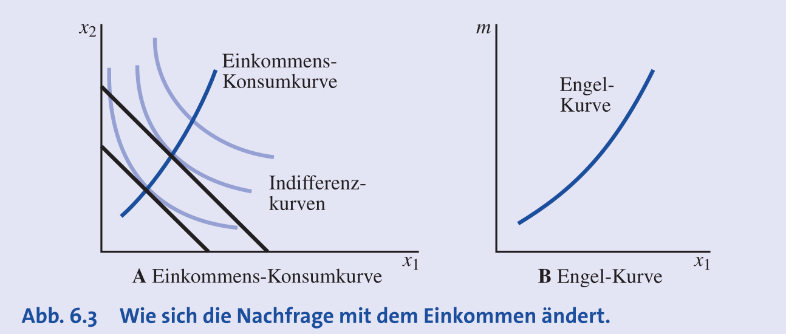

### Güterklassifikation nach Einkommen

- **Normale Güter**: Nachfrage **steigt** mit steigendem Einkommen ($\frac{\Delta x_1}{\Delta m} > 0$).
	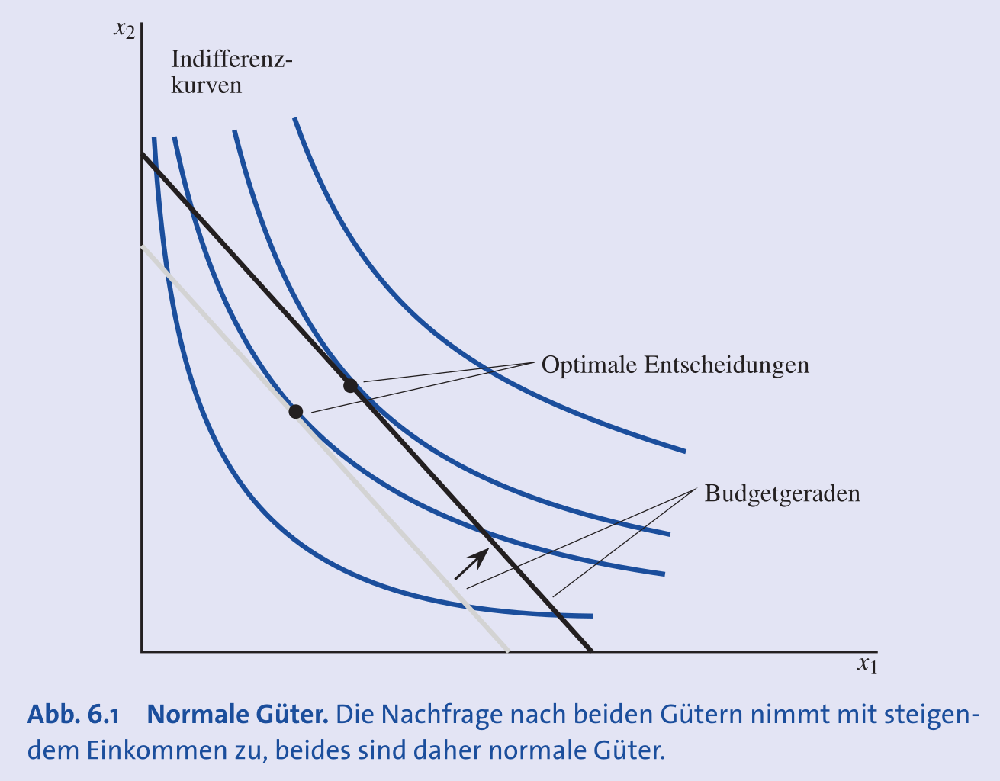
- **Inferiore Güter**: Nachfrage **sinkt** mit steigendem Einkommen.
    - Beispiele: Günstige Lebensmittel (M-Budget Spaghetti), Güter niedriger Qualität.
    - Oft nur in einem bestimmten Einkommensbereich inferior.
    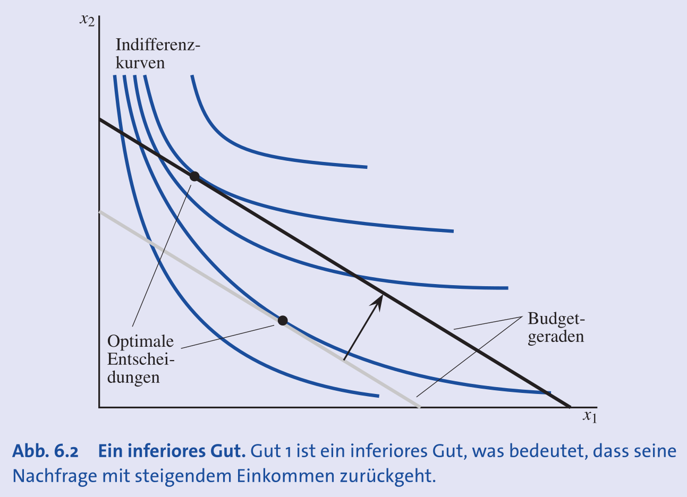
- **Superiore Güter** (Luxusgüter): Nachfrage steigt **mehr als proportional** zum Einkommen.
    - Beispiele: Golfclub-Mitgliedschaft, Business-Class-Flüge.
- **Einkommensneutrale Güter**: Nachfrage ist unabhängig vom Einkommen.

### Engelkurven bei verschiedenen Präferenzen

- **Perfekte Substitute**:
    - Wenn $p_1 < p_2$, wird nur Gut 1 konsumiert ($x_1 = m/p_1$). Die Engelkurve für Gut 1 ist eine **Gerade** mit Steigung $p_1$.
    - Die Engelkurve für Gut 2 liegt auf der vertikalen Achse (Einkommensachse), da die Nachfrage $x_2$ immer null ist.
    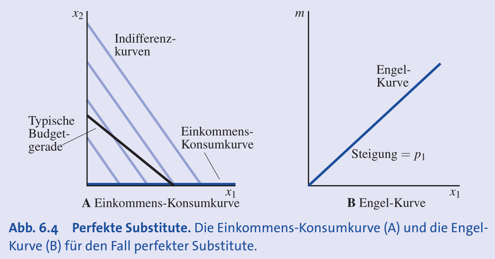
- **Perfekte Komplemente**: Fester Konsum im Verhältnis $\rightarrow$ Einkommens-Konsumkurve ist eine **Diagonale** durch den Ursprung, Engelkurve ist eine Gerade.
  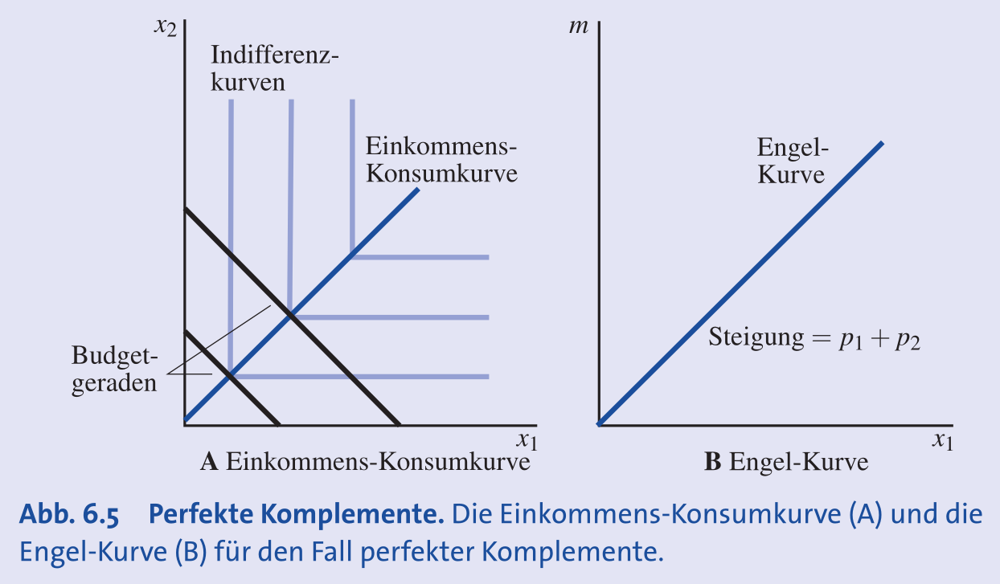
- **Cobb-Douglas**: Nachfrage ist linear im Einkommen ($x_1 = am/p_1$) $\rightarrow$ Einkommens-Konsumkurven sind **Geraden** durch den Ursprung.
  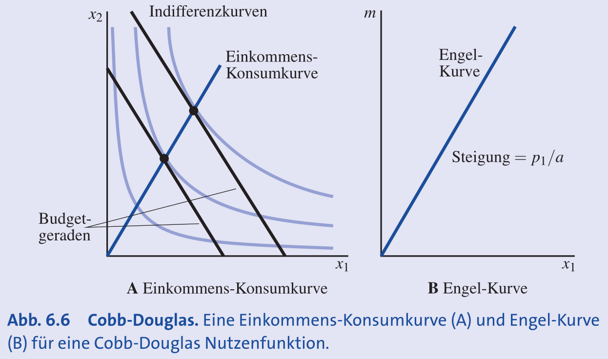
- **Homothetische Präferenzen**: Präferenzen, die nur vom Güterverhältnis abhängen. Führen immer zu **linearen Engelkurven** (Geraden durch den Ursprung).
    - Beispiele: Perfekte Substitute, perfekte Komplemente, Cobb-Douglas.
    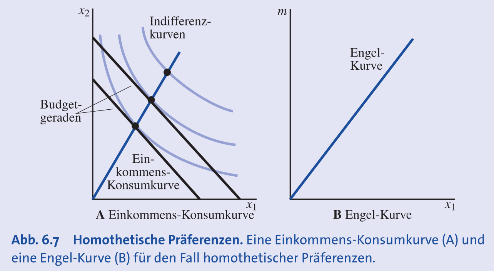
- **Quasilineare Präferenzen**: Einkommenserhöhung erhöht nur Nachfrage nach dem "linearen" Gut. Für das andere Gut gibt es einen **"Null-Einkommenseffekt"** $\rightarrow$ dessen Engelkurve ist eine **vertikale Linie** (ab einem gewissen Einkommen).
  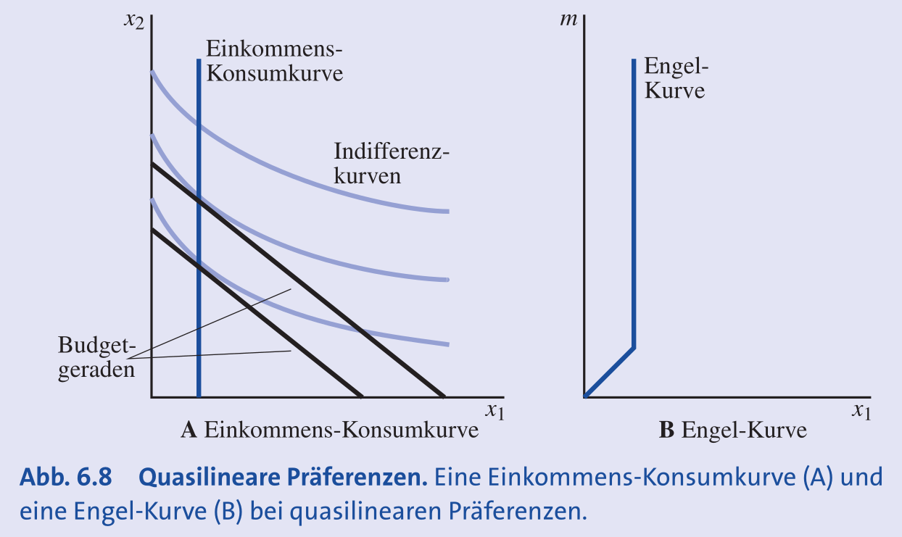

## Nachfragereaktion auf Preisänderungen des eigenen Gutes

- **Preis-Konsumkurve**: Verbindet optimale Bündel bei variierendem Preis für ein Gut (im Güterraum $x_1, x_2$).
- **Gesetz der Nachfrage**: Preissenkung $\rightarrow$ Nachfrageanstieg.
    - Führt zu **negativ geneigter** Nachfragekurve.
    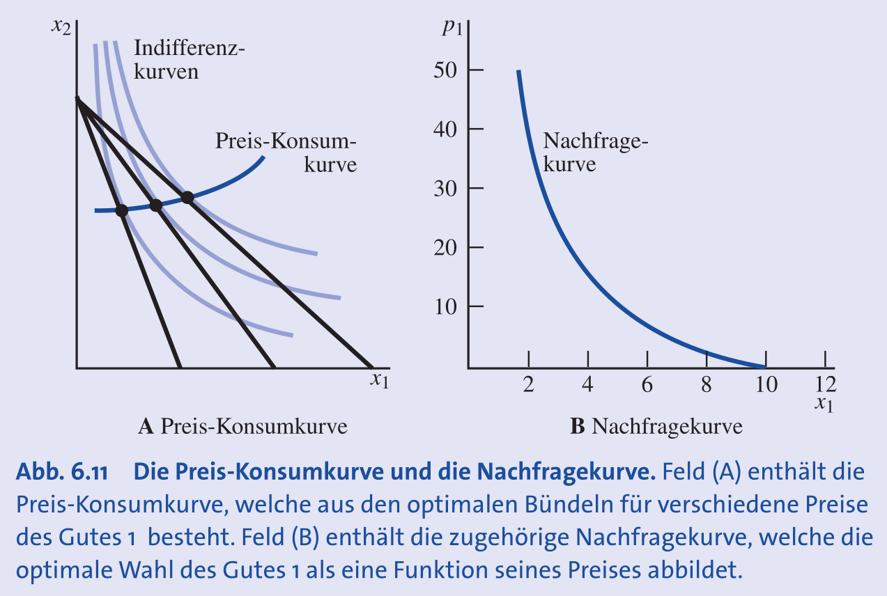
- **Giffen-Güter**: **Ausnahme** vom Gesetz der Nachfrage.
    - Preis **steigt** $\rightarrow$ Nachfrage **steigt**.
    - Muss ein **stark inferiores Gut** sein, bei dem der Einkommenseffekt den Substitutionseffekt überwiegt.
    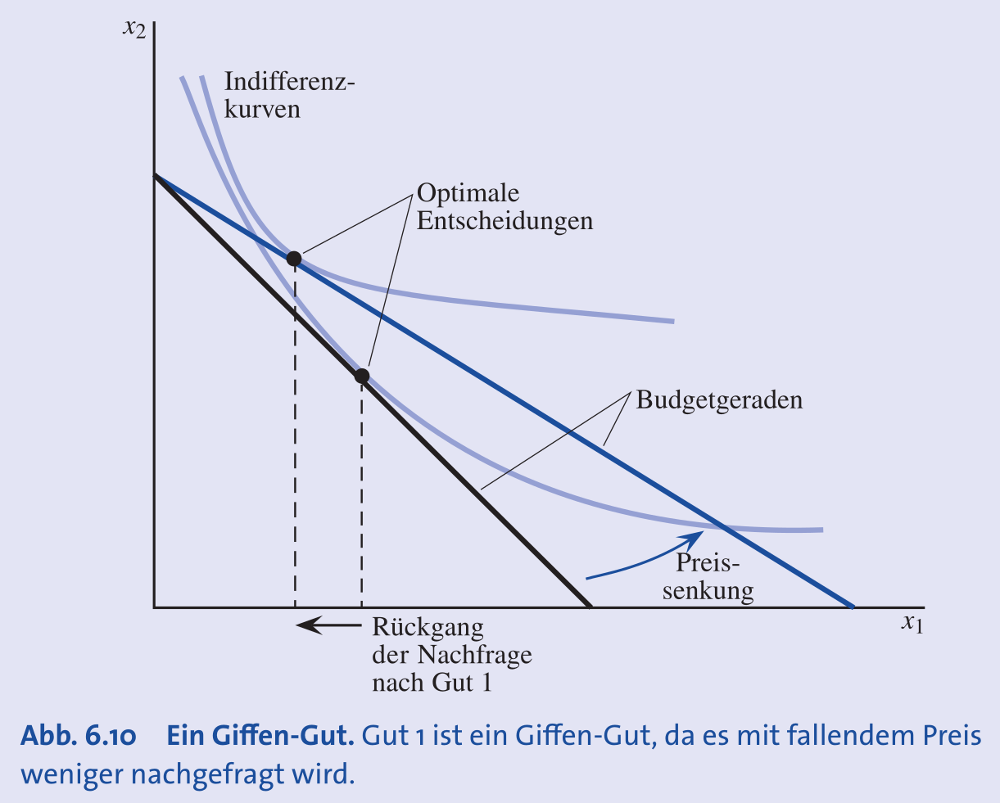
- **Preiselastizität der Nachfrage** ($\eta$): Misst die prozentuale Reaktion der Menge auf eine prozentuale Preisänderung.
    - Formel: $\eta = \frac{\%\Delta x_1}{\%\Delta p_1} = \frac{\Delta x_1 / x_1}{\Delta p_1 / p_1}$.
    - **Elastische Nachfrage**: $|\eta| > 1$ (überproportionale Mengenreaktion).
    - **Unelastische Nachfrage**: $|\eta| < 1$ (unterproportionale Mengenreaktion).
    - **Beispiel Benzin**: Gesamtnachfrage eher **unelastisch**, Nachfrage bei einzelner Tankstelle **sehr elastisch**.

## Nachfragereaktion auf Preisänderungen anderer Güter

- Preisänderung von Gut 2 $\rightarrow$ **Verschiebung der Nachfragekurve** von Gut 1.

### Güterklassifikation nach Kreuzpreiseffekten

- **Substitute**: Ersetzen sich gegenseitig (z.B. Butter, Margarine).
    - Preis von Substitut ($p_2$) **steigt** $\rightarrow$ Nachfrage nach Gut 1 **steigt** ($\frac{\Delta x_1}{\Delta p_2} > 0$).
    - Nachfragekurve von Gut 1 verschiebt sich nach **rechts**.
    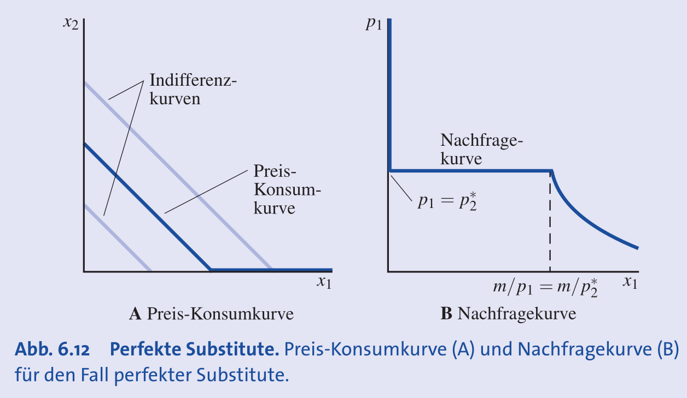
- **Komplemente**: Werden gemeinsam konsumiert (z.B. Auto, Reifen).
    - Preis von Komplement ($p_2$) **steigt** $\rightarrow$ Nachfrage nach Gut 1 **sinkt** ($\frac{\Delta x_1}{\Delta p_2} < 0$).
    - Nachfragekurve von Gut 1 verschiebt sich nach **links**.
    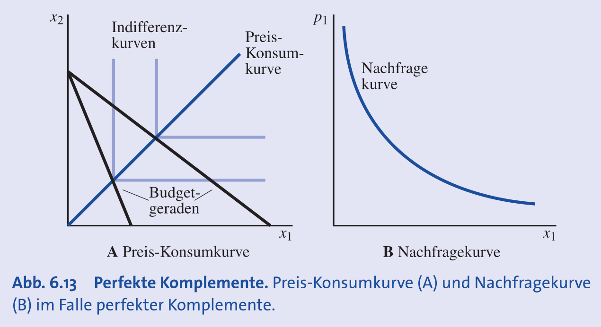
- **Kreuzpreiselastizität**: Misst diese Beziehung quantitativ.

## Nachfragekonzepte

- **Vorbehaltspreis** (Reservationspreis, $r$):
    - **Maximale Zahlungsbereitschaft** für eine zusätzliche Einheit.
    - Entspricht dem individuellen **Grenznutzen** (inverse Nachfragekurve = Grenznutzenkurve).
    - Bei konvexen Präferenzen: fallend für weitere Einheiten ($r_1 > r_2 > r_3 > ...$).
- **Vergleich: Individuelle vs. Marktnachfrage**:
    - Marktnachfrage: **Horizontale Summe** aller individuellen Nachfragen.
    - Marktnachfrage / Anzahl Konsumenten = Nachfrage einer **hypothetischen Durchschnittsperson** (bei unteilbaren Gütern Kaufwahrscheinlichkeiten).
