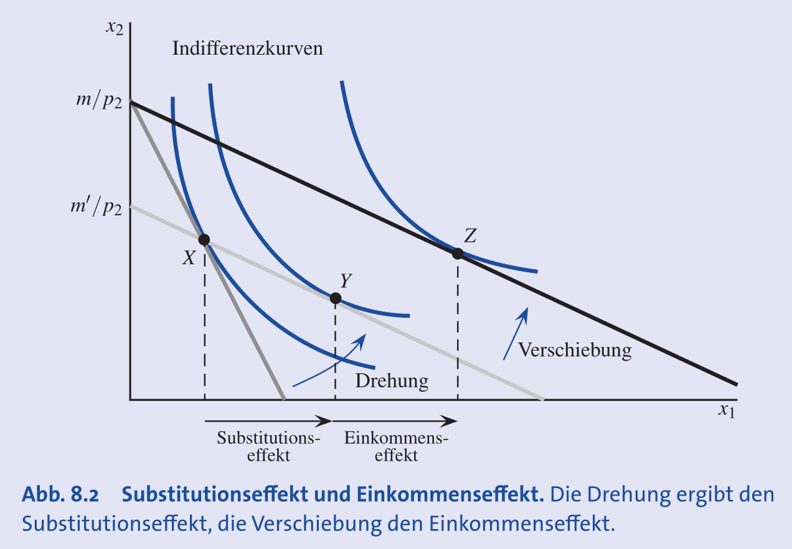
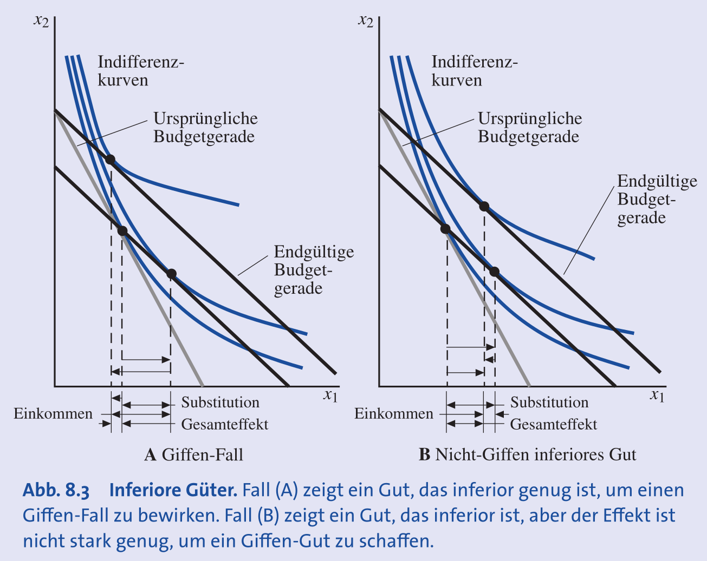
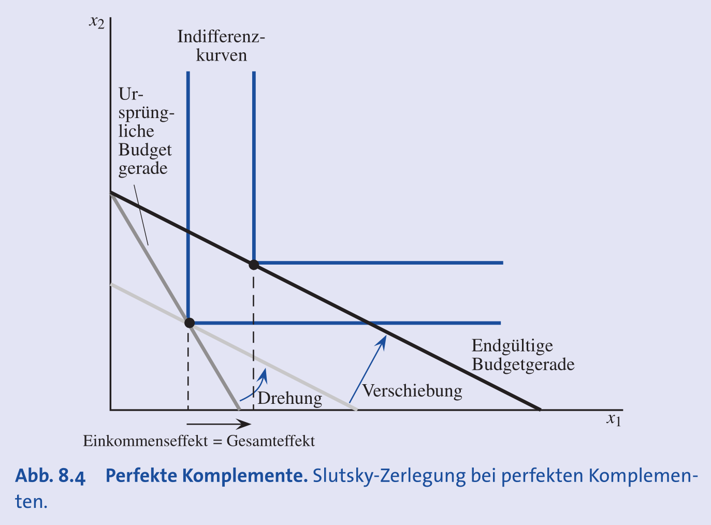
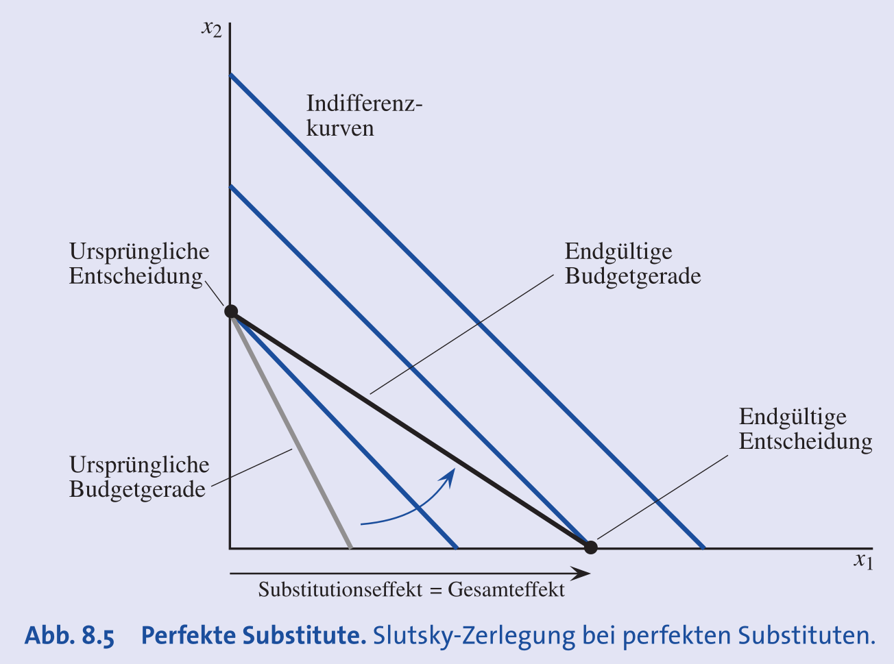
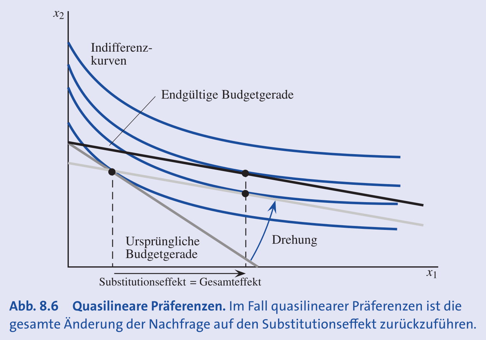
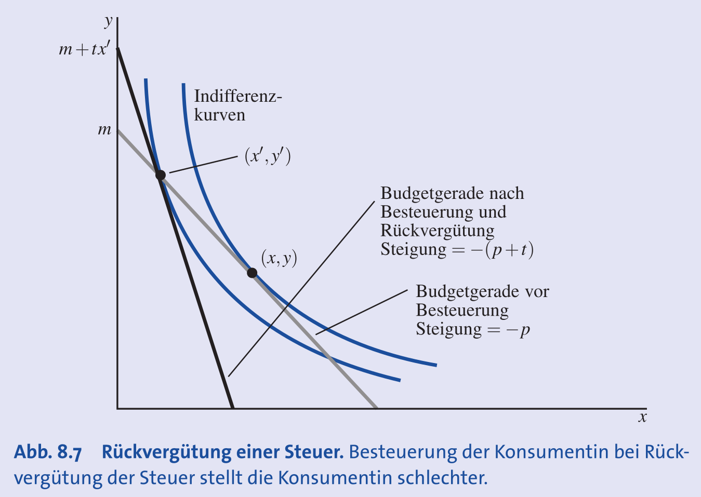

## Grundlagen der Slutsky-Zerlegung

- **Ziel**: **Gesamteffekt** einer Preisänderung in zwei Komponenten aufteilen.
- **Analytisches Werkzeug** zur Ursachenforschung von Verhaltensänderungen (keine reale Unterscheidung durch Konsumenten).
- Zwei Komponenten:
    - **Substitutionseffekt**: Reaktion auf geänderte **relative Preise** (Tauschverhältnis).
    - **Einkommenseffekt**: Reaktion auf geänderte **Kaufkraft** (reales Einkommen).
- **Motivation**: Erklärt **Lenkungswirkung** einer **CO₂-Steuer trotz Rückvergütung**.

## Der Substitutionseffekt (SE)

- Nachfrageänderung **nur** durch geändertes **Tauschverhältnis**.
- Kaufkraft wird dabei künstlich konstant gehalten.
- **Slutsky-Methode**: Kaufkraft ist konstant, wenn das Einkommen so angepasst wird, dass das **ursprüngliche Güterbündel** leistbar bleibt.
    - Grafisch: **Drehung der Budgetgeraden** um das ursprüngliche Konsumbündel.
- **Wichtigste Eigenschaft**: Der **Substitutionseffekt ist immer negativ**, d.h. er wirkt der Preisänderung **immer entgegengesetzt**.
    - Preis sinkt $\rightarrow$ SE führt zu höherer Nachfrage.
    - Preis steigt $\rightarrow$ SE führt zu tieferer Nachfrage.

## Der Einkommenseffekt (EE)

- Nachfrageänderung **nur** durch geänderte **Kaufkraft** (bei neuen, konstanten Preisen).
- **Beispiel**: Preissenkung $\rightarrow$ reale Kaufkraft steigt.
- Grafisch: **Parallelverschiebung** der (gedrehten) Budgetgeraden auf das finale Einkommensniveau.
- Richtung des Effekts hängt von der **Güterart** ab.

## Die Slutsky-Gleichung und Berechnung

- **Slutsky-Gleichung**: Gesamte Nachfrageänderung = Summe aus SE und EE.
    - **Gesamteffekt** ($\Delta x_1$) = **Substitutionseffekt** ($\Delta x_1^s$) + **Einkommenseffekt** ($\Delta x_1^n$)
- **Berechnungsschritte** bei Preisänderung von $p_1$ auf $p_1'$:
    1. **Ursprüngliche Nachfrage** $x_1(p_1, m)$ berechnen.
    2. **Notwendige Einkommensanpassung** $\Delta m$ berechnen:
        - $\Delta m = x_1 \cdot \Delta p_1 = x_1 \cdot (p_1' - p_1)$
        - Angepasstes Budget: $m' = m + \Delta m$.
    3. **Substitutionseffekt** berechnen:
        - Hypothetische Nachfrage $x_1(p_1', m')$ berechnen.
        - $\Delta x_1^s = x_1(p_1', m') - x_1(p_1, m)$
    4. **Einkommenseffekt** berechnen:
        - Finale Nachfrage $x_1(p_1', m)$ berechnen.
        - $\Delta x_1^n = x_1(p_1', m) - x_1(p_1', m')$

## Analyse nach Güterarten

- **Normale Güter**:
    - **EE** verstärkt **SE** (gleiche Richtung).
    - Preissenkung $\rightarrow$ negativer EE (Nachfrage steigt).
    - **Gesetz der Nachfrage** (fallende Nachfragekurve) gilt zwingend.
- **Inferiore Güter**:
    - **EE** wirkt **SE entgegen**.
    - Preissenkung $\rightarrow$ Kaufkraft steigt $\rightarrow$ Nachfrage sinkt (positiver EE).
    - Wenn SE > EE, gilt das **Gesetz der Nachfrage** weiterhin.
- **Giffen-Güter**:
    - **Sonderfall** der inferioren Güter.
    - Starker positiver **EE überkompensiert** negativen **SE**.
    - **Folge**: Preissenkung $\rightarrow$ Gesamtnachfrage sinkt.
    - Nachfragekurve hat **positive Steigung**; Gesetz der Nachfrage wird verletzt.
    - **Wichtig**: Ein **Giffen-Gut muss immer ein inferiores Gut sein**, aber nicht jedes inferiore Gut ist ein Giffen-Gut.

## Spezialfälle bei unterschiedlichen Präferenzen

- **Perfekte Komplemente** (L-förmige Indifferenzkurven):
    - **Kein Substitutionseffekt** ($\Delta x_1^s = 0$); Güter werden nicht substituiert.
    - Gesamteffekt = **reiner Einkommenseffekt**.
    
- **Perfekte Substitute** (lineare Indifferenzkurven):
    - Preisänderung führt meist zu Randlösung (nur Konsum des günstigeren Guts).
    - Gesamteffekt = **Substitutionseffekt**; **Einkommenseffekt = 0** ($\Delta x_1^n = 0$).
    
- **Quasilineare Präferenzen**:
    - **EE** für das nicht-linear im Nutzen stehende Gut = **0**.
    - Gesamte Nachfrageänderung = **SE**.
    

## Anwendung: Steuer mit Rückvergütung

- **Szenario**: Steuer auf ein Gut (z.B. Benzin) + pauschale Rückverteilung der Einnahmen.
- **Falsches Argument**: "Rückvergütung macht Steuer wirkungslos, Konsum bleibt gleich."
- **Ökonomische Analyse**:
    - Steuer verändert **relative Preise** (besteuertes Gut teurer).
    - Löst **SE** aus (Ausweichen auf Alternativen).
    - Trotz Kompensation des EE durch Rückvergütung bleibt SE bestehen $\rightarrow$ **Verhaltensänderung** (z.B. Benzinkonsum sinkt).
    - Neues Optimum auf **niedrigerer Indifferenzkurve** $\rightarrow$ Konsument ist **schlechter gestellt**.

