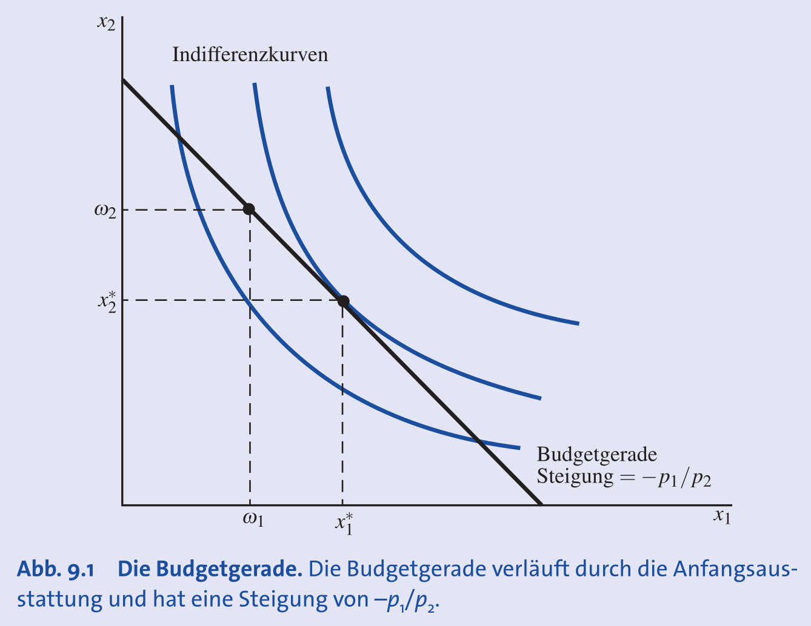
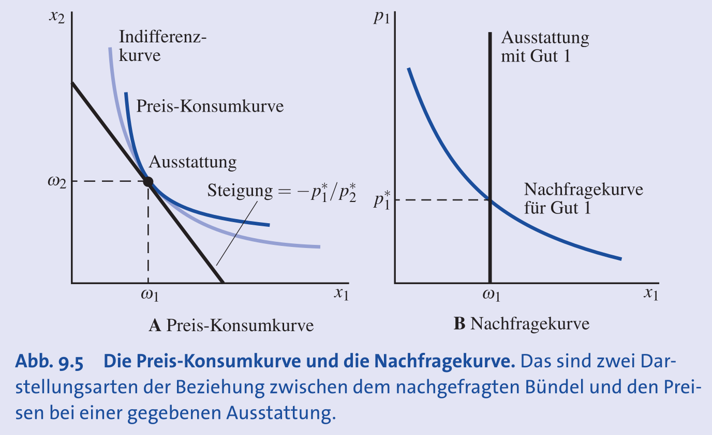
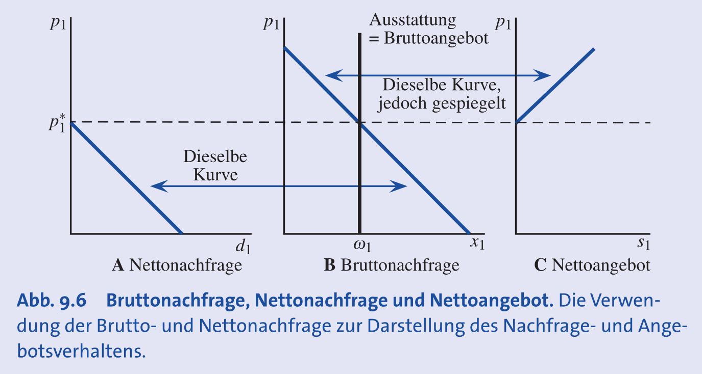
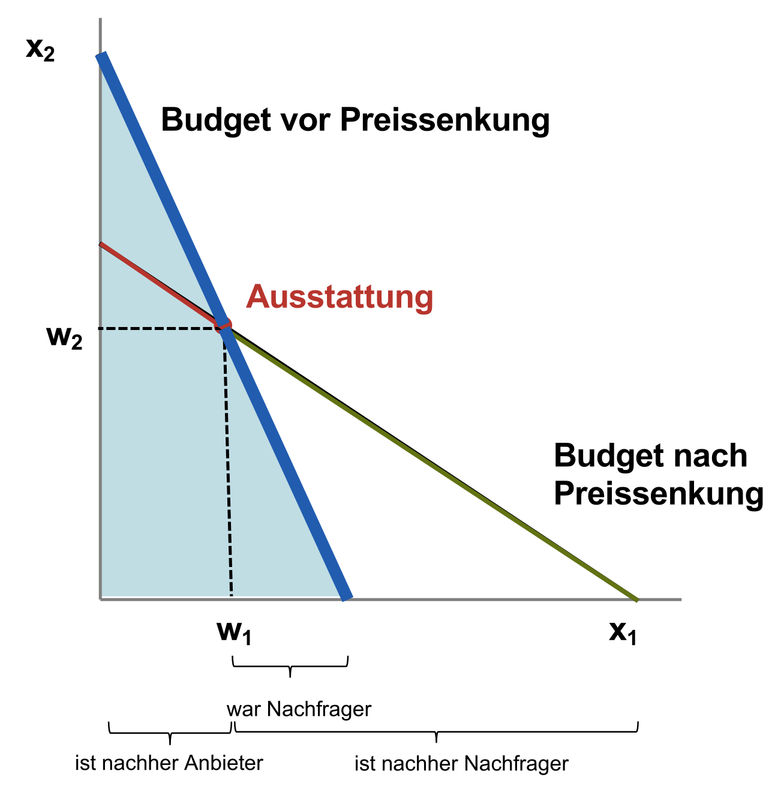
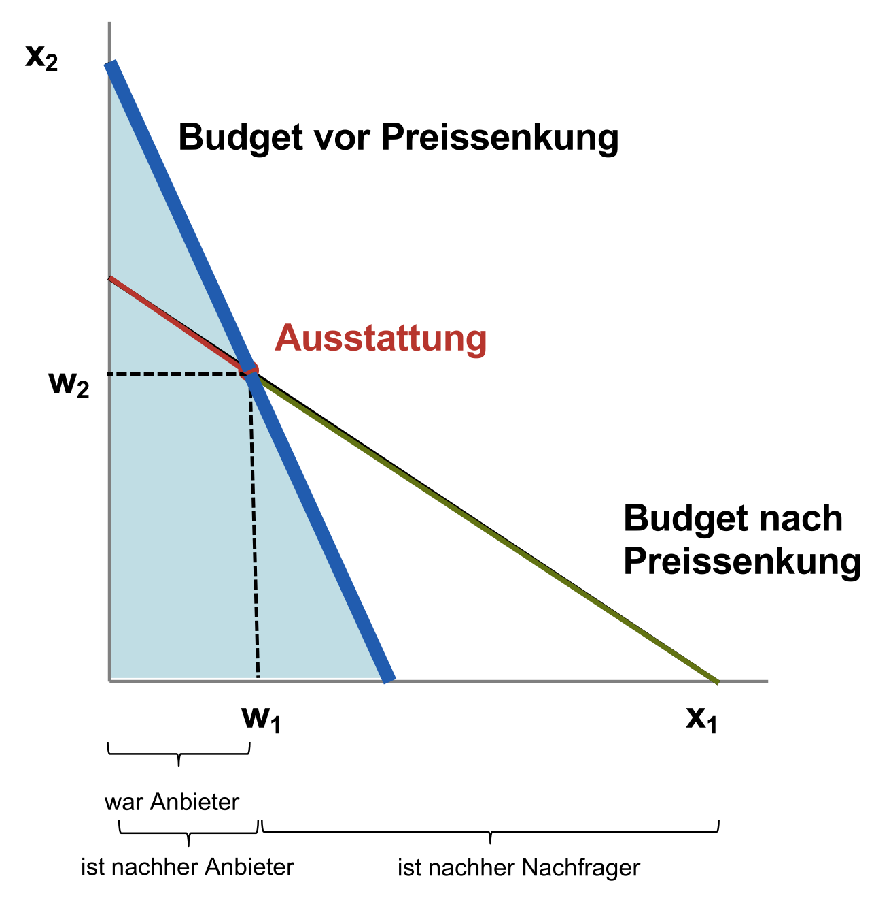
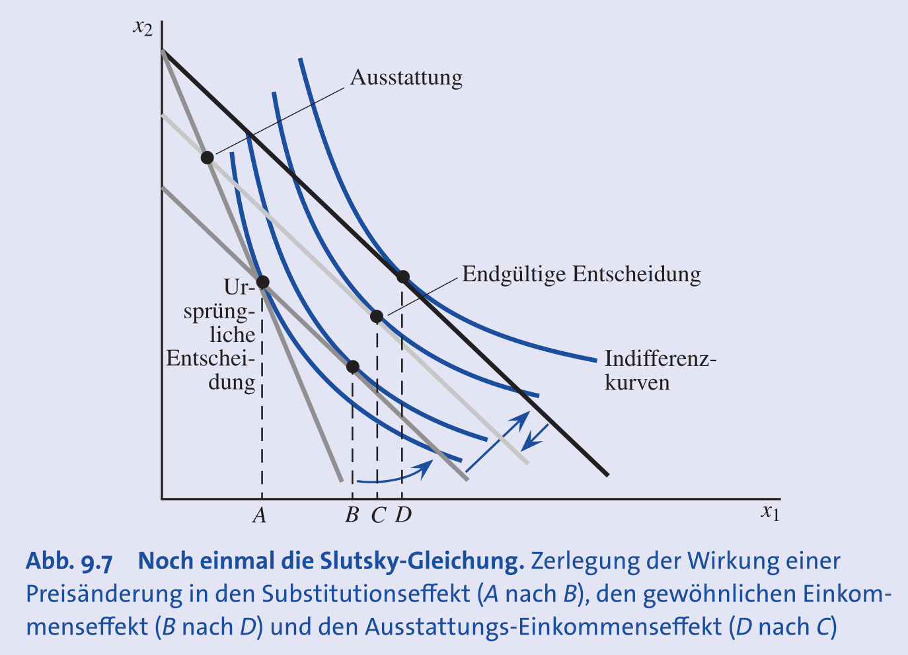
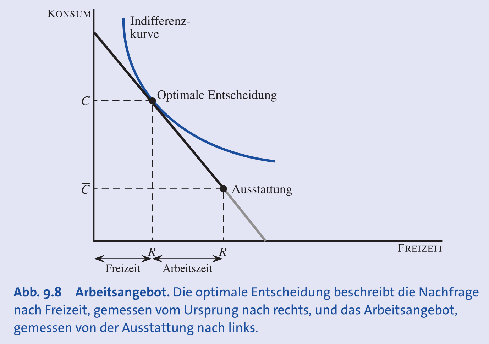
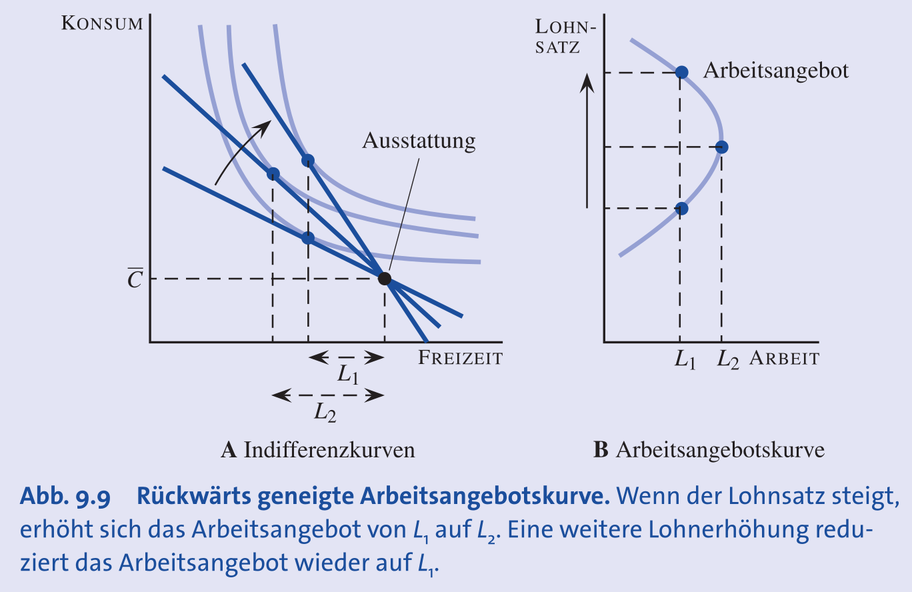
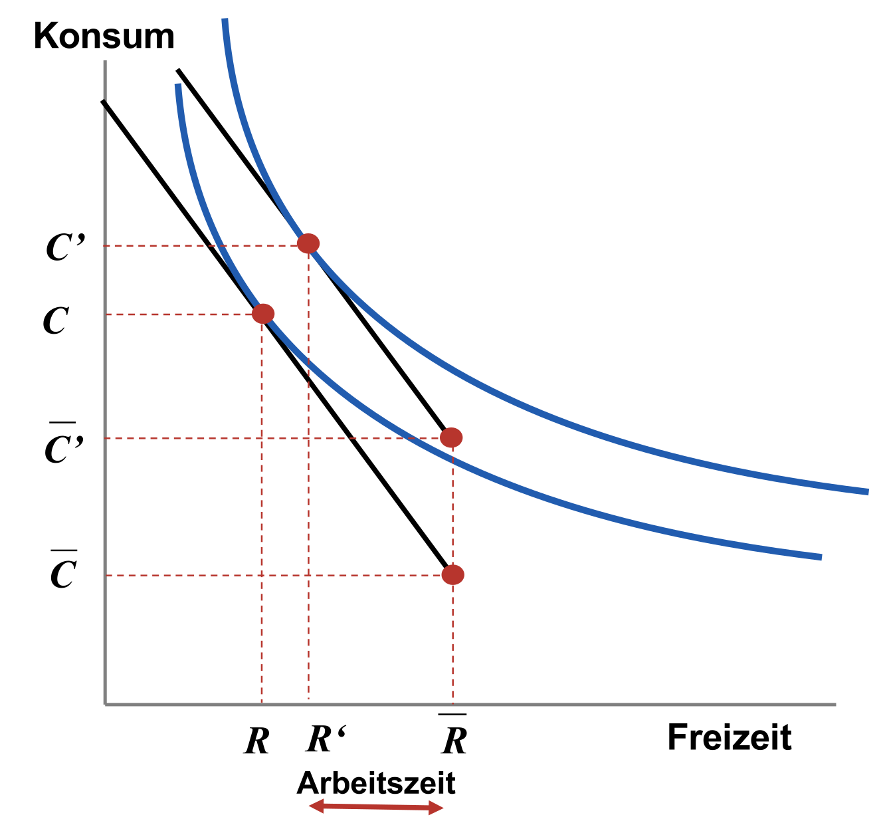
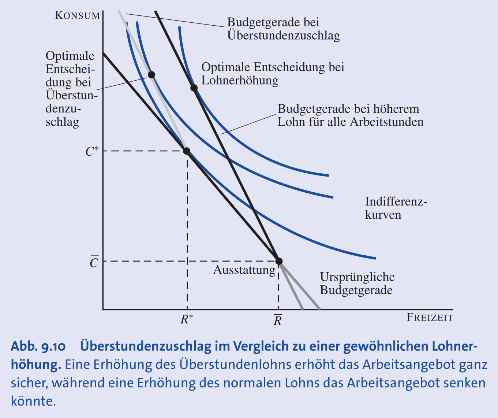

## Einkommen und Budget aus Anfangsausstattung

- **Grundmodell**: Einkommen ist nicht mehr fix ($m$), sondern ergibt sich aus dem Wert einer **Anfangsausstattung** ($\omega$).
- **Anfangsausstattung** ($\omega$): Gütermenge ($w = (\omega_1, \omega_2)$), die ein Konsument **vor dem Markteintritt besitzt**.
- **Budget**: Ergibt sich aus dem Marktwert der Ausstattung $\rightarrow$ **$m = p_1\omega_1 + p_2\omega_2$**.
    - Eine Preisänderung bei einem Gut der Ausstattung ändert somit direkt das verfügbare Budget.
- **Budgetgerade**: $p_1x_1 + p_2x_2 = p_1\omega_1 + p_2\omega_2$.
    - **Eigenschaft**: Die **Anfangsausstattung** ($\omega$) liegt **immer auf der Budgetgeraden**.
    - **Preisänderungen**: Führen zu einer **Drehung der Budgetgeraden um den Ausstattungspunkt ($\omega$)**.

- **Preis-Konsumkurve**: Verbindet alle optimalen Bündel bei variierenden Preisen und verläuft durch den Ausstattungspunkt.
  

## Brutto- und Nettonachfrage

- **Bruttonachfrage** ($x_1, x_2$): Gütermenge, die nach dem Tausch **tatsächlich konsumiert** wird (nutzenrelevant).
- **Nettonachfrage** ($x_i - \omega_i$): Gekaufte oder verkaufte Menge eines Gutes.
    - **Positiv ($x_i > \omega_i$)**: Konsument ist **Nettokäufer** / Nettonachfrager.
    - **Negativ ($x_i < \omega_i$)**: Konsument ist **Nettoverkäufer** / Nettoanbieter.
- Der Gesamtwert der Nettonachfragen ist immer null: $p_1(x_1 - \omega_1) + p_2(x_2 - \omega_2) = 0$.

## Analyse von Preiseffekten

### Qualitative Analyse der Wohlfahrt

- Die Nutzenänderung (**Wohlfahrt**) bei einer Preisänderung hängt von der Marktposition (Käufer/Verkäufer) ab.
- Bei einer **Preissenkung** von Gut 1:
    - **Nettokäufer**: Der Nutzen **steigt zwingend** (muss Käufer bleiben, erreicht höhere Indifferenzkurve).
      
    - **Nettoverkäufer**:
        - Bleibt Verkäufer $\rightarrow$ Nutzen **sinkt**, da der Wert der Ausstattung sinkt.
        - Wird zum Käufer $\rightarrow$ Nutzenänderung ist **unklar**.
        

### Die erweiterte Slutsky-Gleichung

- Die Gesamtreaktion auf eine Preisänderung wird in **drei Effekte** zerlegt:
    1. **Substitutionseffekt (SE)**: Reaktion auf geänderte **relative Preise**. Ist **immer negativ** (entgegengesetzt zur Preisänderung).
    2. **Gewöhnlicher Einkommenseffekt (EE)**: Reaktion auf geänderte **Kaufkraft** (Geld "übrig" bei Preissenkung).
    3. **Ausstattungseinkommenseffekt**: Reaktion auf die Änderung des **Wertes der Anfangsausstattung**.
- **Finale Slutsky-Formel** (fasst beide Einkommenseffekte zusammen):
    $\frac{\Delta x_1}{\Delta p_1} = \frac{\Delta x_1^S}{\Delta p_1} + (\omega_1 - x_1) \frac{\Delta x_1^m}{\Delta m}$
    - $\frac{\Delta x_1^S}{\Delta p_1}$: **Reiner Substitutionseffekt**, Nachfrageänderung bei angepasstem Einkommen.
    - $\frac{\Delta x_1^m}{\Delta m}$: **Reine Einkommensreaktion**, Nachfrageänderung bei Einkommensänderung (positiv für normale Güter).
    - $(\omega_1 - x_1)$: **Nettonachfrage**.

### Berechnung der Effekte

- Vorgehen bei einer Preisänderung von $p_1$ auf $p_1'$:
    1. **Ausgangslage**: Budget $m=p_1\omega_1+p_2\omega_2$ und Nachfrage $x_1(p_1,m)$ berechnen.
    2. **Einkommensanpassung für SE**: $\Delta m = x_1 \cdot (p_1' - p_1)$. Angepasstes Budget $m' = m + \Delta m$.
    3. **Substitutionseffekt**: $\Delta x_1^s = x_1(p_1', m') - x_1(p_1, m)$.
    4. **Neues Budget nach Preisänderung**: $m'' = p_1'\omega_1 + p_2\omega_2$.
    5. **Gesamter Einkommenseffekt**: $\Delta x_1^n = x_1(p_1', m'') - x_1(p_1', m')$.

### Analyse der Nachfrage (Preissteigerung $p_1 \uparrow$)

- **SE** wirkt immer negativ ($\downarrow$), **EE** für normale Güter wirkt positiv ($\uparrow$).
- **Nettonachfrager** ($x_1 > \omega_1$):
    - Der gesamte Einkommenseffekt ist negativ ($\downarrow$).
    - SE und EE wirken in die gleiche Richtung $\rightarrow$ die Nachfrage **sinkt eindeutig**.
- **Nettoanbieter** ($x_1 < \omega_1$):
    - Der gesamte Einkommenseffekt ist positiv ($\uparrow$).
    - SE ($\downarrow$) und EE ($\uparrow$) wirken gegeneinander $\rightarrow$ der **Gesamteffekt ist unklar**.

## Anwendung: Arbeitsangebot

- Übertragung des Modells auf die **Arbeits-Freizeit-Entscheidung**.
- **Güter**: **Konsum (C)** mit Preis $p$ und **Freizeit (R)**.
- **Anfangsausstattung**: Verfügbare Zeit ($\bar{L}$, z.B. 24h) und **Nicht-Arbeitseinkommen ($M=p\bar{C}$)**.
- Der "Preis" der Freizeit sind die **Opportunitätskosten**: der entgangene **Lohnsatz (w)**.
- **Budgetbeschränkung**: $pC + wR = p\bar{C} + w\bar{L}$.
- Die Steigung der Budgetgeraden im (R, C)-Diagramm ist der **Reallohn** ($-w/p$).

### Analyse von Lohnänderungen

- **Effekt einer Lohnsteigerung ($w \uparrow$)**:
    - **Substitutionseffekt**: Freizeit wird teurer $\rightarrow$ Arbeitsangebot **steigt**.
    - **Einkommenseffekt**: Man ist reicher (höherer Wert der Zeitausstattung) $\rightarrow$ Arbeitsangebot **sinkt** (da Freizeit ein normales Gut ist).
- **Rückwärtsgeneigte Arbeitsangebotskurve**:
    - Bei **niedrigem Lohn**: SE dominiert $\rightarrow$ mehr Arbeit bei Lohnerhöhung.
    - Bei **hohem Lohn**: EE kann dominieren $\rightarrow$ weniger Arbeit bei Lohnerhöhung.
    
- **Bedingungsloses Grundeinkommen (BGE)**:
    - Reiner Einkommenseffekt $\rightarrow$ erhöht Freizeit, senkt das Arbeitsangebot.
    
- **Überstundenzuschlag**:
    - Führt zu einem **Knick in der Budgetgeraden**.
    - Verstärkt den SE an der Marge, weshalb das Arbeitsangebot **eher zunimmt**.
    
