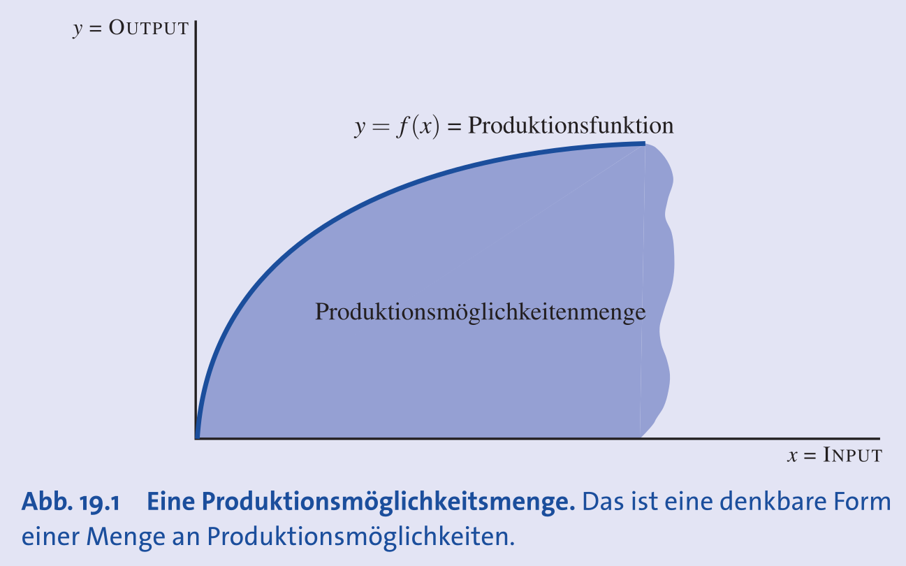
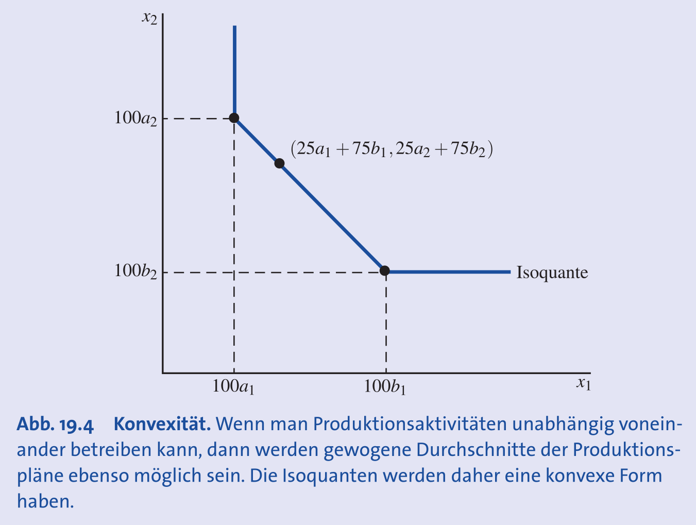
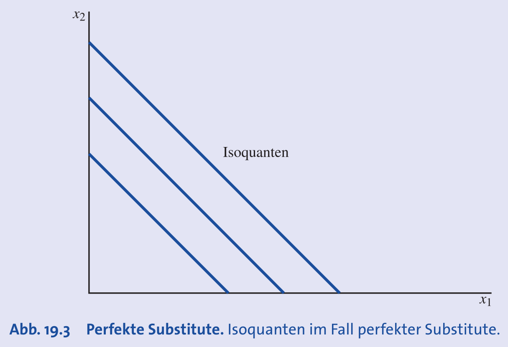
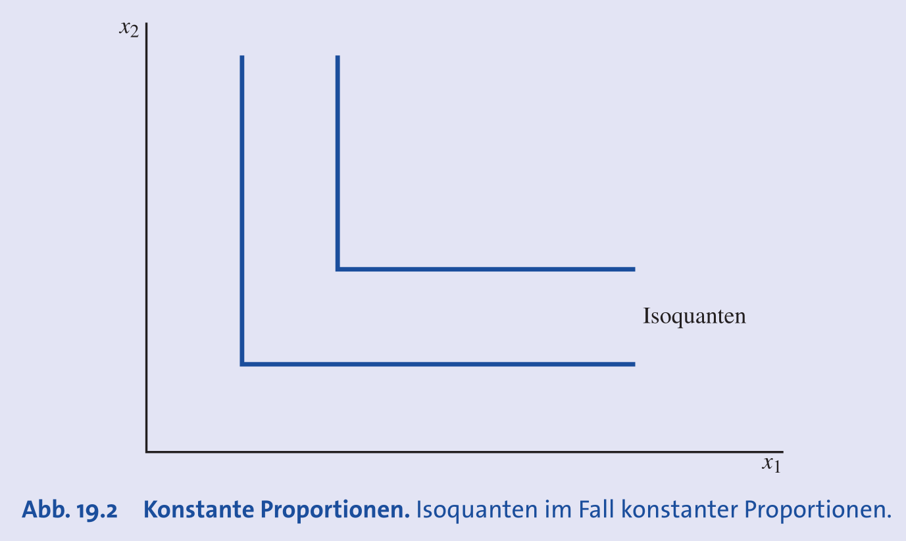
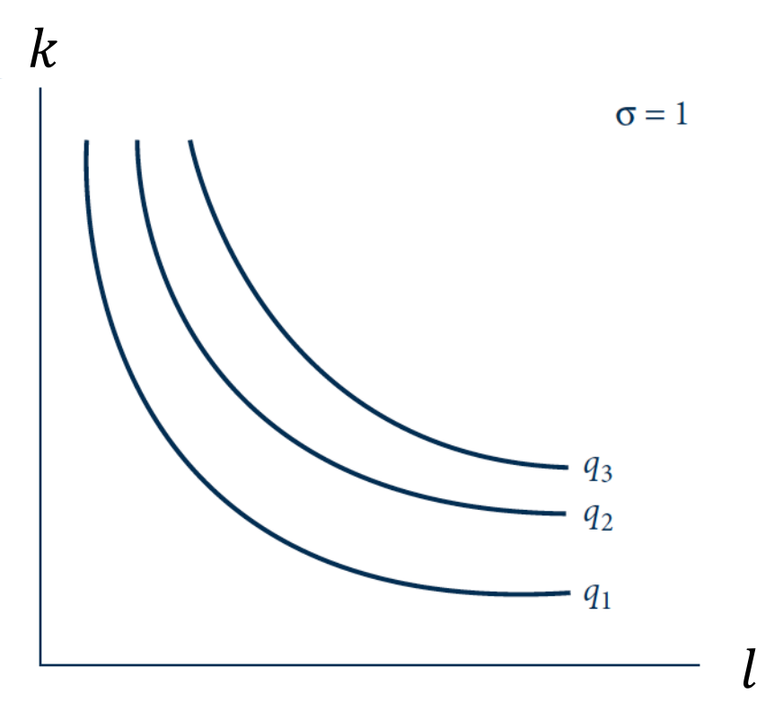
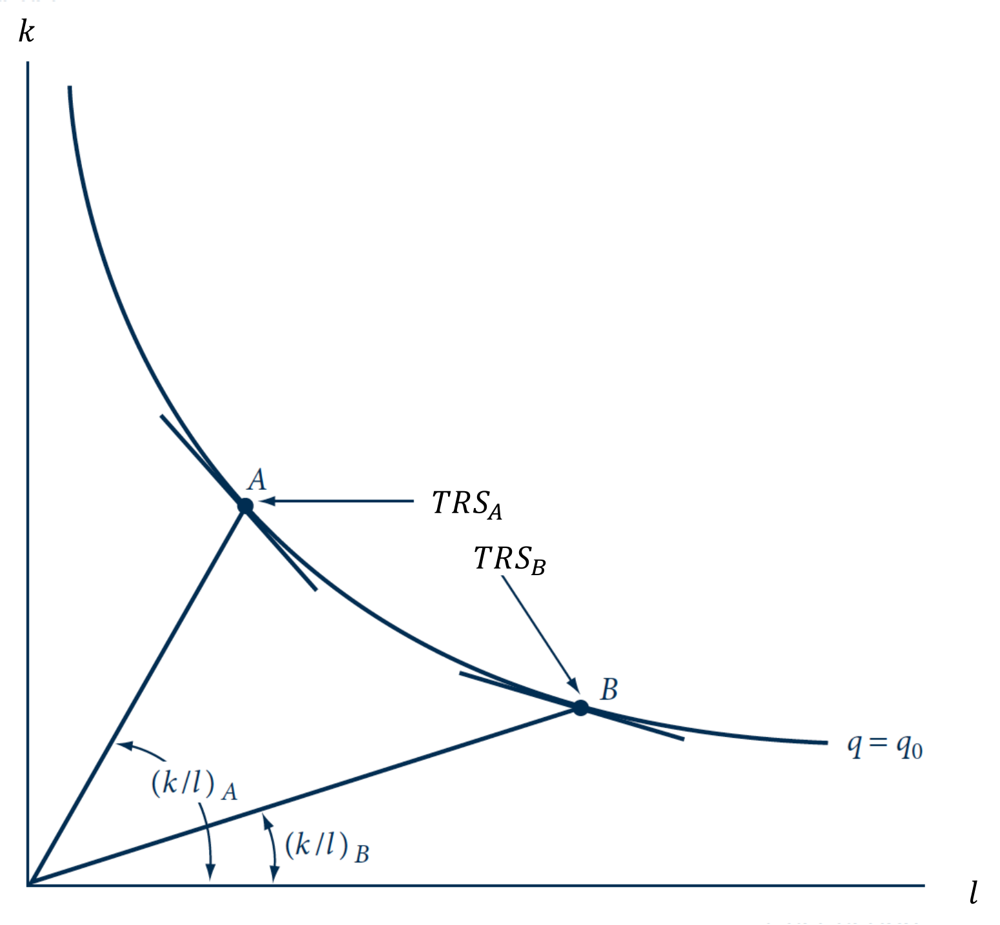

## Grundlagen der Produktionstheorie

- **Ziel**: Analyse des Unternehmensverhaltens, ausgehend von technologischen Beschränkungen.
- **Inputs (Produktionsfaktoren)**: Ressourcen im Produktionsprozess.
    - Kategorien: Arbeit, Grund und Boden, Rohstoffe, **Kapital**.
    - **Physisches Kapital (Kapitalgüter)**: Produzierte Güter als Inputs (z.B. Maschinen, Gebäude). Zu unterscheiden von **Finanzkapital**.
    - Betrachtung als **Stromgrössen** (z.B. Arbeitsstunden/Woche).
- **Output**: Ergebnis des Produktionsprozesses.
- **Technologische Beschränkungen**: Gegeben durch Naturgesetze; welche Input-Kombinationen erzeugen welchen Output.

## Die Produktionsfunktion

- **Produktionsmöglichkeitenmenge**: Menge aller technologisch machbaren Input-Output-Kombinationen.
- **Produktionsfunktion**: Gibt den **maximal möglichen Output** für gegebene Inputs an.
    - Notation: $q = f(k, l)$ für Kapital $k$ und Arbeit $l$.

- **Isoquante**: Alle Input-Kombinationen, die ein **fixes Outputniveau** erzeugen.
    - **Analogie**: Höhenlinien auf einer Landkarte.
    - Äquivalent zu **Indifferenzkurven** der Konsumtheorie.
    - Das Outputniveau ist objektiv, im Gegensatz zum subjektiven Nutzen.
- **Annahmen (Eigenschaften von Technologien)**:
    - **Monotonie (freie Verfügbarkeit)**: Mehr Input $\implies$ mindestens gleicher Output.
    - **Konvexität**: Mischungen von Inputbündeln sind mindestens so gut wie die Extreme $\implies$ konvexe Isoquanten.
      
- **Produktivität**: Mass für die Effizienz; wie viel Output pro Input generiert wird.
    - **Arbeitsproduktivität**: Durchschnittlicher Output pro Arbeitseinheit ($AP_l = q/l$).

## Typen von Produktionsfunktionen

- **Lineare Produktionsfunktion**:
    - Formel: $q = ak + bl$.
    - **Parameter**: $a$ und $b$ beschreiben die Produktivität der Inputs.
    - **Eigenschaften**:
        - Inputs sind **perfekte Substitute**.
        - Isoquanten: **Parallele Geraden**.
        - **Substitutionselastizität**: $\sigma = \infty$.
    
- **Leontief-Produktionsfunktion (Konstante Proportionen)**:
    - Formel: $q = \min\{ak, bl\}$.
    - **Parameter**: $a$ und $b$ definieren das feste Einsatzverhältnis der Inputs.
    - **Eigenschaften**:
        - Inputs sind **perfekte Komplemente**.
        - Isoquanten: **L-förmig**.
        - **Substitutionselastizität**: $\sigma = 0$.
	
- **Cobb-Douglas-Produktionsfunktion**:
    - Formel: $q = Ak^\alpha l^\beta$.
    - **Parameter**:
        - $A$: Technologie-/Effizienzniveau.
        - $\alpha, \beta$: Produktionselastizitäten der Inputs (Output-Änderung in % bei 1% Input-Erhöhung).
    - **Eigenschaften**:
        - Mischform mit konvexen Isoquanten.
        - **Substitutionselastizität**: $\sigma = 1$.
    
- **CES-Produktionsfunktion (Constant Elasticity of Substitution)**:
    - Formel: $q = (\alpha k^\rho + (1-\alpha)l^\rho)^{\gamma/\rho}$.
    - **Wichtigste und flexibelste Funktion**, enthält die anderen als Spezialfälle.
    - **Parameter**:
        - $\alpha$: Verteilungsparameter (Gewichtung der Inputs).
        - $\rho$: Substitutionsparameter, bestimmt die Elastizität ($\sigma = \frac{1}{1-\rho}$).
        - $\gamma$: Skalenparameter, bestimmt die Skalenerträge.
    - **Spezialfälle**:
        - $\rho \to 1 \implies$ Lineare Funktion ($\sigma \to \infty$)
        - $\rho \to 0 \implies$ Cobb-Douglas-Funktion ($\sigma = 1$)
        - $\rho \to -\infty \implies$ Leontief-Funktion ($\sigma = 0$)

## Grenzprodukt und Technische Rate der Substitution

- **Grenzprodukt (Marginal Product, MP)**:
    - **Definition**: Zusätzlicher Output durch eine weitere Einheit *eines* Inputs (ceteris paribus).
    - **Berechnung**: **Erste partielle Ableitung** der Produktionsfunktion.
        - $MP_k = \frac{\partial q}{\partial k}$ und $MP_l = \frac{\partial q}{\partial l}$.
- **Gesetz des abnehmenden Grenzprodukts**:
    - **Annahme**: Der zusätzliche Output (Grenzertrag) durch Mehr-Einsatz *eines* Faktors nimmt irgendwann ab.
    - **Mathematisch**: Die zweite partielle Ableitung ist negativ (z.B. $\frac{\partial^2 q}{\partial k^2} < 0$).
- **Technische Rate der Substitution (TRS)**:
    - **Definition**: Austauschrate zwischen zwei Inputs bei **konstantem Output**.
    - Ist die **Steigung der Isoquante**.
    - **Berechnung**: Negatives Verhältnis der Grenzprodukte: $TRS = \frac{MP_l}{MP_k}$.
    - **Analogie**: Entspricht der **Grenzrate der Substitution (GRS)**.

## Substitutionselastizität ($\sigma$)

- **Definition**: Einheitenfreies Mass der prozentualen Änderung des Inputverhältnisses ($k/l$) pro prozentualer Änderung der TRS.
- **Berechnung**: $\sigma = \frac{\%\Delta(k/l)}{\%\Delta(TRS)} = \frac{d\ln(k/l)}{d\ln(TRS)}$.
- **Interpretation**: Gibt an, wie **leicht Inputs substituierbar** sind (invers zur Krümmung der Isoquante).
    - **Hohes $\sigma$**: Leichte Substitution (flache Isoquante).
    - **Niedriges $\sigma$**: Schwere Substitution (stark gekrümmte Isoquante).
- **Werte für die Produktionsfunktionen**:
    - **Lineare Produktion**: $\sigma = \infty$.
    - **Leontief-Produktion**: $\sigma = 0$.
    - **Cobb-Douglas-Produktion**: $\sigma = 1$.
    - **CES-Produktion**: $\sigma = \frac{1}{1-\rho}$, kann also beliebig konstant sein.

## Skalenerträge

- **Grundfrage**: Wie ändert sich der Output, wenn **alle Inputs** proportional (Faktor $t > 1$) erhöht werden?
- **Arten**:
    - **Konstante Skalenerträge (CRS)**: Output steigt um Faktor $t$.
        - $f(tk, tl) = t \cdot f(k, l)$.
        - Intuition: Replikation des Prozesses (z.B. zweite identische Fabrik).
    - **Zunehmende Skalenerträge (IRS)**: Output steigt um mehr als Faktor $t$.
        - $f(tk, tl) > t \cdot f(k, l)$.
        - Gründe: Spezialisierung, bessere Maschinenauslastung.
    - **Abnehmende Skalenerträge (DRS)**: Output steigt um weniger als Faktor $t$.
        - $f(tk, tl) < t \cdot f(k, l)$.
        - Gründe: Koordinations-, Management-Ineffizienzen.
- **Bestimmung bei den Produktionsfunktionen**:
    - **Cobb-Douglas**: Hängt von der Summe der Exponenten ab:
        - $\alpha + \beta = 1 \implies$ CRS
        - $\alpha + \beta > 1 \implies$ IRS
        - $\alpha + \beta < 1 \implies$ DRS
    - **CES**: Hängt vom Parameter $\gamma$ ab:
        - $\gamma = 1 \implies$ CRS
        - $\gamma > 1 \implies$ IRS
        - $\gamma < 1 \implies$ DRS
- **Wichtige Unterscheidung**:
    - **Grenzprodukt**: Effekt einer Änderung *eines* Inputs.
    - **Skalenerträge**: Effekt einer proportionalen Änderung *aller* Inputs.
    - Eine Funktion kann **abnehmende Grenzprodukte** und gleichzeitig **zunehmende Skalenerträge** haben.

## Zeitliche Aspekte der Produktion

- **Kurze Frist**: Mindestens ein Produktionsfaktor ist **fix**.
- **Lange Frist**: Alle Produktionsfaktoren sind **variabel**.
- Die genaue Dauer ist branchen- und faktorspezifisch.
