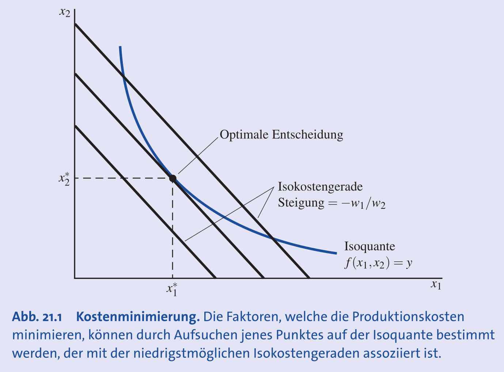
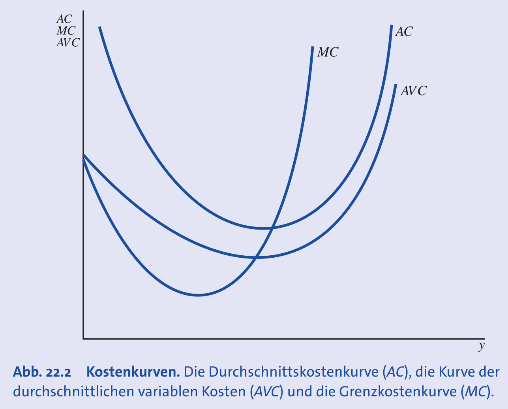
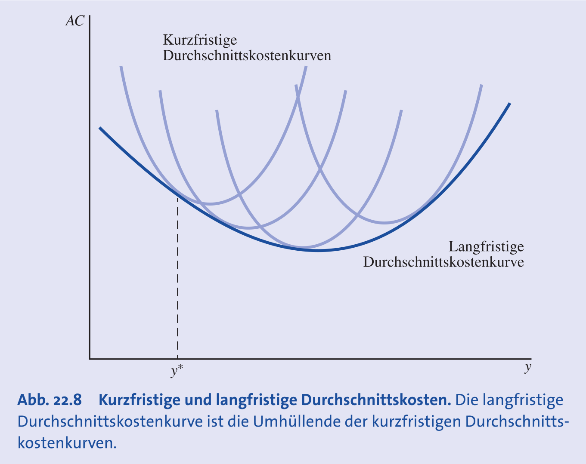

## Einführung & Kostenbegriffe

- **Ziel**: Minimierung der Kosten für ein gegebenes Outputniveau als notwendige Vorstufe zur Gewinnmaximierung.
- **Gesamtkosten ($C$)**: Summe der Ausgaben für Produktionsfaktoren.
    - Formel: $C = w \cdot l + v \cdot k$
    - $w$: **Lohnsatz** (Preis für Arbeit $l$).
    - $v$: **Zins** / Mietpreis des Kapitals (Preis für Kapital $k$).
- **Isokostengerade**: Geometrischer Ort aller Inputkombinationen, die die gleichen Gesamtkosten verursachen.
    - Steigung: $-w/v$ (negatives Preisverhältnis).
    - Je weiter vom Ursprung entfernt, desto höher die Kosten.

## Kostenminimierung

- **Problemstellung**: Wähle Inputs $k$ und $l$ so, dass Kosten $C$ minimiert werden, unter der Nebenbedingung, dass Output $q_0$ produziert wird.
- **Optimalitätsbedingung**:
    - Im Optimum muss die **Technische Rate der Substitution ($TRS$)** dem Verhältnis der Faktorpreise entsprechen.
    - Formel: $TRS = \frac{MP_l}{MP_k} = \frac{w}{v}$.
    - **Intuition**: Der letzte Franken, der in Arbeit investiert wird, muss denselben zusätzlichen Output bringen wie der letzte Franken in Kapital.
- **Grafische Lösung**:
    - Der Punkt, an dem die **Isoquante** (Technologie) die niedrigstmögliche **Isokostengerade** (Preise) **tangiert**.
    - Steigung Isoquante ($TRS$) = Steigung Isokostengerade ($-w/v$).

## Expansionspfad & Faktornachfrage

- **Expansionspfad**:
    - Verbindungslinie aller kostenminimierenden Tangentialpunkte bei Variation des Outputs (bei konstanten Preisen).
- **Bedingte Faktornachfrage ($x(w,v,q)$)**:
    - Gibt die kostenminimale Menge eines Inputs für einen *fix vorgegebenen* Output an.
    - **Berechnung**: Lösen des Gleichungssystems aus zwei Bedingungen:
        1. Tangentialbedingung: $\frac{MP_l}{MP_k} = \frac{w}{v}$
        2. Nebenbedingung: $q = f(k,l)$
- **Input-Kategorien (Reaktion auf Outputsteigerung)**:
    - **Normale Inputs**: Nachfrage steigt bei höherem Output (Regelfall).
        - *Beispiel*: Mehr Mehl für mehr Brot.
    - **Inferiore Inputs**: Nachfrage sinkt bei höherem Output.
        - *Beispiel*: Manuelle Handarbeit wird bei Massenproduktion durch Maschinen ersetzt.
    - **Superiore Inputs**: Nachfrage steigt überproportional zum Output.
        - *Beispiel*: Spezialisiertes Management bei Konzernstrukturen.

## Spezifische Funktionsformen (Kostenminimierung)

### Cobb-Douglas ($q = A k^\alpha l^\beta$)

- **Optimales Inputverhältnis**: Hängt nur von den Exponenten ($\alpha, \beta$) und Preisen ab ($\frac{k}{l} = \frac{\alpha}{\beta} \frac{w}{v}$).
- **Eigenschaft**: Die Ausgabenanteile für die Faktoren bleiben konstant.

### Leontief ($q = \min\{\alpha k, \beta l\}$)

- **Keine Substitution**: Optimum liegt immer im **Eckpunkt** (Knick), wo $\alpha k = \beta l$.
- **Unabhängigkeit**: Preisänderungen ändern nichts am optimalen Mengenverhältnis, nur an den Gesamtkosten.

### Allgemeine Eigenschaften von Kostenfunktionen

- Nicht abnehmend in $q, v, w$.
- **Konkav** in den Inputpreisen.
- **Homogen vom Grad 1** in den Inputpreisen (Verdopplung aller Preise $\to$ Verdopplung der Kosten).

## Kostenkurven (Kurzfristig)

- **Durchschnittskosten ($AC$)**: $C(q)/q$.
- **Durchschnittliche variable Kosten ($AVC$):** $AC$ minus die Fixkosten.
- **Grenzkosten ($MC$)**: $\partial C / \partial q$ (Kosten der nächsten Einheit).
- **Zusammenhang**:
    - $MC < AC \implies AC$ sinkt.
    - $MC > AC \implies AC$ steigt.
    - $MC = AC$ im **Minimum der AC**.
- **Beispiel Software**: Hohe Fixkosten, $MC \approx 0$ $\to$ $AC$ sinken fast immer (**Skaleneffekte**).

## Kostenelastizität

- **Kostenelastizität ($E$)**: Prozentuale Kostenänderung bei prozentualer Outputänderung ($E = \frac{MC}{AC}$).
- **Interpretation**:
    - $E < 1$: **Economies of Scale** ($AC$ sinken).
    - $E > 1$: Diseconomies of Scale ($AC$ steigen).
- **Verbindung zur Gewinnmaximierung**:
    - Ein Preisnehmer setzt im Optimum $P = MC$.
    - Der Gewinn ($\pi$) lässt sich umschreiben als: $\pi = (P - AC)q = (MC - AC)q$.
    - **Implikation**: Bei $E < 1$ (natürliches Monopol) ist $MC < AC$. Setzt man $P=MC$, macht die Firma Verlust (da $P < AC$).

## Kurze vs. Lange Frist

- **Kurze Frist**: z.B. Kapital $\bar{k}$ fix.
    - Kosten höher oder gleich wie langfristig.
- **Lange Frist**: z.B. Kapital variabel ($k$ wird optimiert).
- **Envelope Theorem**:
    - Die langfristige Kostenkurve ist die "untere Umhüllende" aller kurzfristigen Kurven.
    - Kurzfristige schneidet sich mit langfristige im optimalen Punkt.
- **Beispiel Café**:
    - Kurzfristig (mehr Kunden): Mehr Personal in enger Küche $\to$ $MC$ steigen steil an.
    - Langfristig: Umbau/Erweiterung $\to$ effizientere Prozesse $\to$ tiefere Kosten.
- **Langfristige Durchschnittskosten ($LAC$)**:
    - **Sinken durch**: Sinkende Inputpreise, "Learning by doing", Fixkostendegression (Software).
    - **Steigen durch**: Bürokratie, Koordinationsprobleme, interne Konflikte (z.B. Kulturclash bei Fusionen).

## Empirische Anwendung & Kapitalanpassung

- **Problem**: Firmen sind oft nicht im langfristigen Optimum (Kapitalstock passt nicht perfekt).
- **Messung**: Elastizitätsformel $E = \frac{\Phi_Q^{VC}}{1 - \Phi_K^{VC}}$.
    - $\Phi^{VC}$: **Elastizitäten der variablen Kosten** (reagieren variable Kosten auf Output- oder Kapitaländerung?).
    - Diese Werte werden mittels **ökonometrischer Regressionen** aus historischen Firmendaten geschätzt.
- **Beispiel Airlines (Gillen et al.)**:
    - $E \approx 0.8 < 1 \to$ Starke Skaleneffekte.
    - Kleine Airlines operieren zu teuer $\to$ Fusionswelle (z.B. Air Canada) ökonomisch rational.

## Marktanwendungen

- **Natürliche Monopole**: Hohe Fixkosten ($E < 1$). Ein Anbieter ist effizienter als Wettbewerb (z.B. Schienennetz).
- **Fusionen**: Ziel ist Kostensenkung durch Skaleneffekte (Air France & KLM).
    - Trade-off für Regulierer: Effizienz vs. Wettbewerbsreduktion.
- **Produktdifferenzierung**: Trade-off zwischen Kosten (Standardisierung) und Umsatz (Vielfalt).
    - **Ford Model T**: Extreme Standardisierung ("nur schwarz") für maximale Kosteneffizienz.

## Exkurs: Die Lagrange-Methode (Allgemein)

- **Zweck**: Optimierung einer Zielfunktion $f(x, y)$ unter Einhaltung einer strikten Nebenbedingung $g(x, y) = 0$.
- **Vorgehen ("Kochrezept")**:
    1. **Lagrange-Funktion aufstellen**: $\mathcal{L} = \text{Zielfunktion} + \lambda \cdot (\text{Nebenbedingung})$.
        - *Wichtig*: Die Nebenbedingung muss als "... = 0" umgeformt sein (z.B. $q_0 - f(k,l) = 0$).
    2. **Ableiten**: Bilde die partiellen Ableitungen nach allen Variablen ($x, y$) und dem Multiplikator ($\lambda$).
    3. **Nullsetzen**: Setze alle Ableitungen gleich 0 (Bedingungen erster Ordnung).
    4. **Lösen**: Löse das entstandene Gleichungssystem nach $x, y$ und $\lambda$ auf.
- **Interpretation von $\lambda$ (Schattenpreis)**: Gibt an, wie stark sich der optimale Wert der Zielfunktion verbessert, wenn die Nebenbedingung um eine Einheit gelockert wird (z.B. 1 Einheit weniger Output gefordert).
