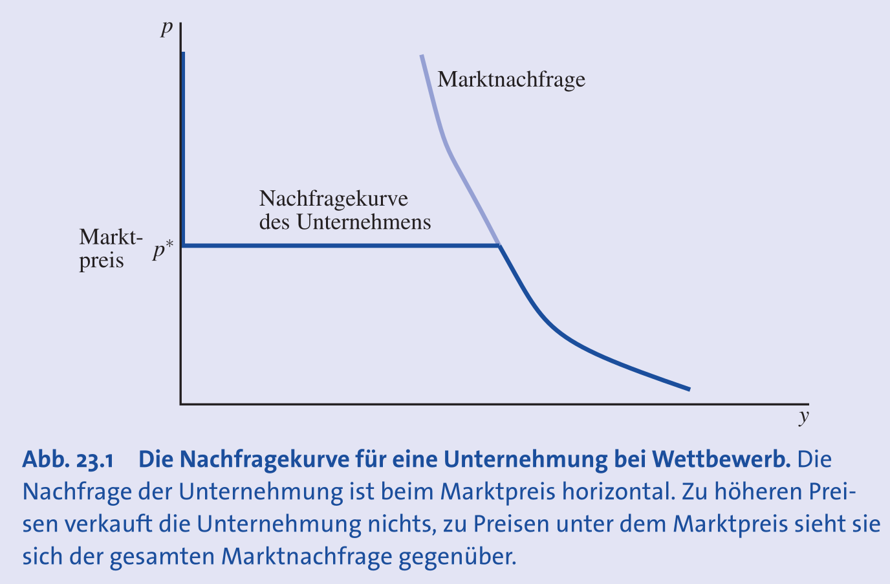
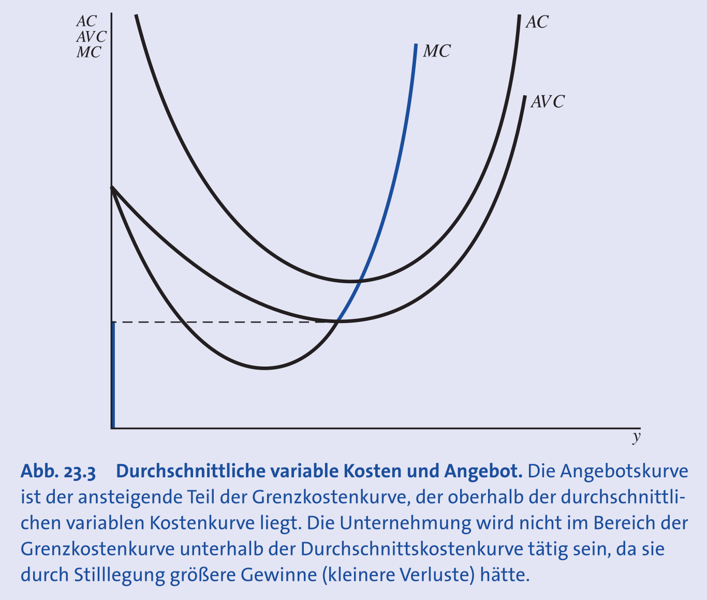
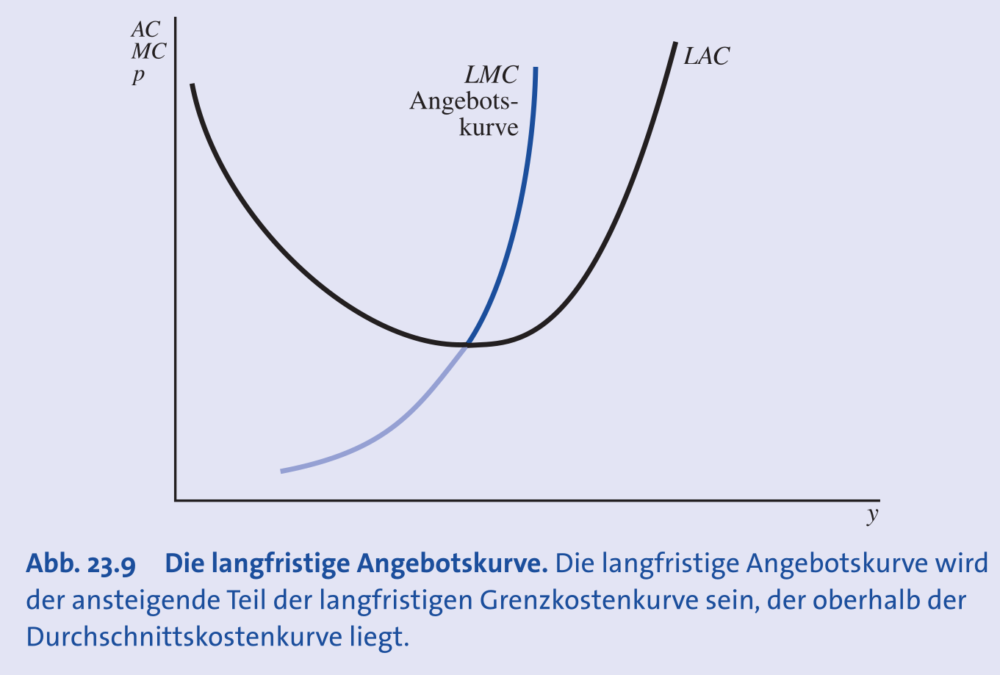
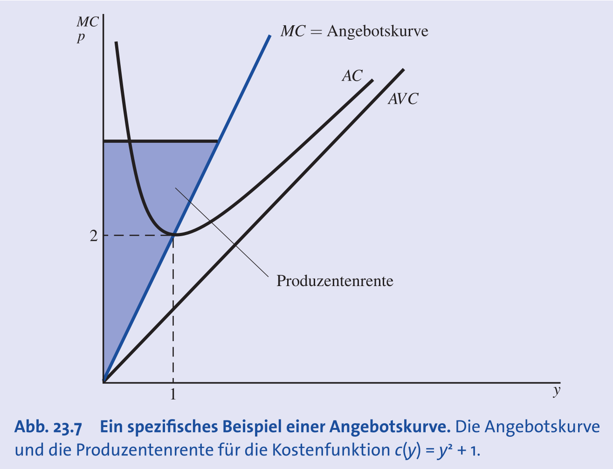

## Grundlagen der Gewinnmaximierung

- **Ökonomischer Gewinn ($\pi$)**: Differenz aus Erlösen ($R$) und **ökonomischen Kosten** ($C$).
    - $\pi(q) = R(q) - C(q)$.
    - Berücksichtigt **Opportunitätskosten** (z.B. Eigenkapitalzinsen, entgangener Lohn), nicht nur buchhalterische Ausgaben.
- **Notwendige Bedingung (FOC)**: Erste Ableitung nach Output $q$ gleich Null.
    - Ableitungsformel: $\frac{d\pi}{dq} = \frac{dR}{dq} - \frac{dC}{dq} = 0 \implies \frac{dR}{dq} = \frac{dC}{dq}$.
    - Bedingung: **Grenzerlös ($MR$)** = **Grenzkosten ($MC$)**.
    - *Intuition*: Produktion lohnend, solange Erlös einer zusätzlichen Einheit > deren Kosten.
- **Hinreichende Bedingung (SOC)**: Zweite Ableitung negativ ($\pi''(q) < 0$).
    - Gewinnkurve muss **konkav** sein (Maximum).
    - $MC$ muss steiler ansteigen als $MR$ (bei Preisnehmern: $MC$ steigend).

## Grenzerlös, Elastizität & Marktmacht

- **Grenzerlös ($MR$)**: Abhängig von **Nachfrageelastizität** ($e_{q,p}$).
    - Formel: $MR = p \cdot (1 + \frac{1}{e_{q,p}})$.
    - **Vollkommene Konkurrenz**: Nachfrage unendlich elastisch ($e_{q,p} \to -\infty$) $\to$ $MR = p$.
      
- **Lerner-Index**: Mass für **Marktmacht** (Markup über Grenzkosten).
    - Formel: $\frac{p - MC}{p} = -\frac{1}{e_{q,p}}$.
    - **Interpretation**: Je unelastischer die Nachfrage ($e_{q,p}$ nah bei 0), desto höher der mögliche Preisaufschlag.
- **Beispiel Pharmaindustrie**:
    - **Unelastische Nachfrage** bei lebenswichtigen Medikamenten ohne Substitute (z.B. *Daraprim*).
    - Ermöglicht extreme Preisaufschläge (hoher Lerner-Index, Fall *Martin Shkreli*).

## Methoden der Gewinnmaximierung

Zwei äquivalente Wege zum **selben Ergebnis**:

### Ansatz 1: Zweistufig (Kostenminimierung zuerst)

1. **Kostenminimierung**: Günstigste Inputkombination für Output $q$ finden $\to$ Kostenfunktion $C(q, w, v)$.
    - **Shephard's Lemma**: Die Ableitung der Kostenfunktion nach einem Faktorpreis ergibt die bedingte Nachfrage nach diesem Faktor ($\frac{\partial C}{\partial w} = l^c$).
2. **Gewinnmaximierung**: Wahl von $q$ durch $\max_q (p \cdot q - C(q))$.

### Ansatz 2: Direkte Maximierung

- Direkte Wahl der Inputs Arbeit ($l$) und Kapital ($k$).
- Zielfunktion: $\max_{k,l} (p \cdot f(k,l) - w \cdot l - v \cdot k)$.
- **Bedingung erster Ordnung (FOCs)**: Wertgrenzprodukt = Faktorpreis.
    - $p \cdot MP_k = v$ (Kapital) und $p \cdot MP_l = w$ (Arbeit).
    - *Logik*: Input erhöhen, bis Ertrag der letzten Einheit genau den Kosten entspricht.

## Angebotsfunktion am Beispiel Cobb-Douglas

- **Produktionsfunktion**: $q = k^\alpha l^\beta$ (Abnehmende Skalenerträge $\alpha + \beta < 1$).
- **Reaktion des Angebots**:
    - $p \uparrow \implies$ Angebot steigt (Positive Korrelation).
    - $w, v \uparrow \implies$ Angebot sinkt (Negative Korrelation).
- **Gewinnfunktion**:
    - **Konvex** in Preisen.
    - Optimum: $\pi = (1 - \alpha - \beta) p q$.

## Kurzfristiges Angebot (Preisnehmer)

- **Kurze Frist**: Mindestens ein Faktor fix (meist Kapital $\bar{k}$).
    - Kosten enthalten Fixkosten ($F = v\bar{k}$).
- **Angebotsentscheidung**:
    - Grundregel: $p = MC(q, \bar{k})$.
    - Anpassung bei Preisänderung nur über variablen Faktor (Arbeit) $\to$ steilere MC-Kurve.
- **Stilllegungsbedingung (Shut-down)**:
    - Produktion nur, wenn Preis **variable Durchschnittskosten** deckt ($p \geq AVC$).
    - Falls $p < AVC$: Verlust > Fixkosten $\to$ Produktion einstellen ($q=0$).
    - **Angebotskurve**: Teil der $MC$-Kurve oberhalb der $AVC$.
    

## Langfristiges Angebot & Skalenerträge

- **Lange Frist**: Alle Faktoren variabel.
- **Angebotskurve**: $LMC$-Kurve oberhalb der langfristigen Durchschnittskosten ($LAC$); elastischer (flacher) als kurzfristig.
- **Konstante Skalenerträge (CRS)**:
    - **Bedingung**: Output steigt proportional zu Inputs ($f(tx) = tf(x)$), z.B. $\alpha + \beta = 1$.
    - **Implikation**: Langfristige Durchschnittskosten sind konstant ($AC = MC = c_{min}$).
    - **Nullgewinnbedingung**:
        - Da $AC$ konstant, führt jeder Preis $p > c_{min}$ zu unendlichem Angebot/Markteintritt.
        - Preis $p < c_{min}$ führt zu Marktaustritt.
        - **Gleichgewicht**: Marktpreis entspricht $c_{min} \to$ **Ökonomischer Nullgewinn**. Angebotskurve ist horizontal.

## Faktornachfrage & Effekte

- **Inverse Faktornachfrage**: $w = p \cdot MP_l(l)$ (Zahlungsbereitschaft für Faktor).
- **Effekte einer Faktorpreiserhöhung ($w \uparrow$)**:
    1. **Substitutionseffekt**: Arbeit relativ teurer $\to$ Ersatz durch Kapital (bei konstantem Output) $\to$ Arbeitsnachfrage $\downarrow$.
    2. **Outputeffekt**: Grenzkosten steigen $\to$ optimaler Output sinkt $\to$ weniger Bedarf an Faktoren $\to$ Arbeitsnachfrage $\downarrow$.
    - **Fazit**: Beide Effekte negativ $\to$ Faktornachfragekurve zwingend fallend.

## Produzentenrente

- **Definition**: Vorteil der Produzenten aus Verkauf zum Marktpreis (analog Konsumentenrente).
- **Berechnung**:
    - Grafisch: Fläche zwischen Marktpreis $p$ und Angebotskurve ($MC$).
    - Rechnerisch: **Umsatz minus variable Kosten** ($R - VC$).
- **Unterschied zum Gewinn**:
    - Gewinn berücksichtigt *alle* Kosten ($\pi = R - VC - F$).
    - Zusammenhang: $Produzentenrente = \pi + Fixkosten$.
    - Langfristig (wenn $F=0$) gilt: Produzentenrente = Gewinn.

