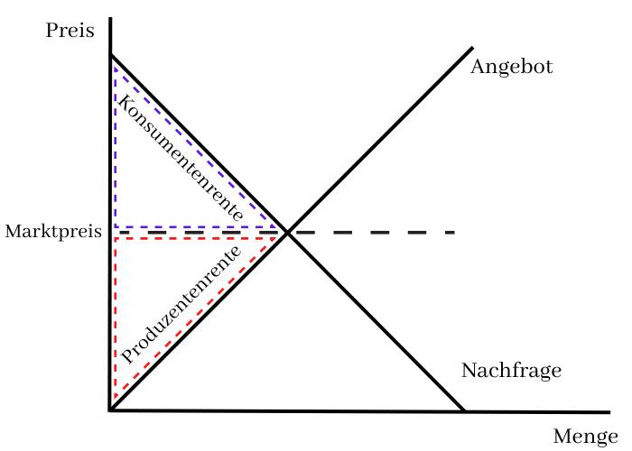
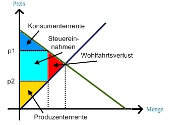
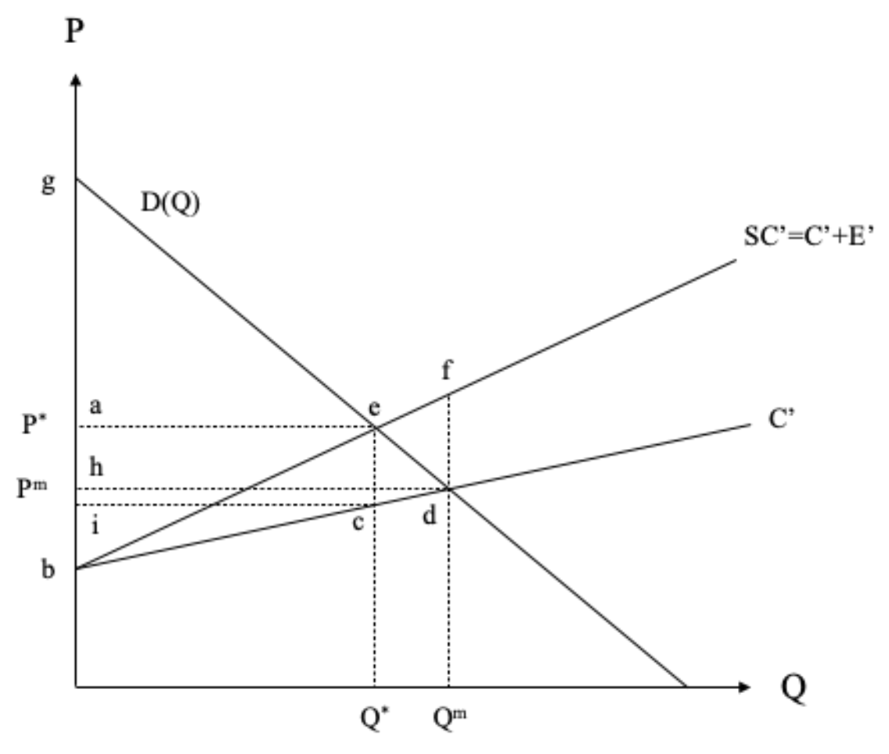

## Einführung & Marktaggregation

- **Dezentrale Koordination**: Märkte koordinieren Angebot und Nachfrage ohne zentralen Planer ("ungeplante Ordnung").
    - Jeder Akteur optimiert für sich, Preis wirkt als Signal.
- **Marktnachfrage**: **Horizontale Summe** aller individuellen Nachfragekurven.
    - Formel: $D(p) = \sum_{i=1}^{n} x_i(p)$.
    - Geometrisch: Bei jedem Preis werden die Mengen aller Konsumenten addiert.
- **Marktangebot (Kurze Frist)**:
    - **Annahme**: Anzahl der Unternehmen ($n$) ist fix.
    - Entspricht der horizontalen Summe der individuellen Grenzkostenkurven (oberhalb der durchschnittlichen variablen Kosten $AVC$).
    - $S(p) = \sum_{i=1}^{n} S_i(p)$.
- **Marktgleichgewicht**: Schnittpunkt von Marktnachfrage und Marktangebot ($Q_D = Q_S$).
    - Kein Überschuss, kein Mangel $\rightarrow$ Pläne von Käufern und Verkäufern gehen auf.

## Elastizitäten & Wohlfahrtsanalyse

- **Preiselastizität**: Prozentuale Mengenreaktion auf eine prozentuale Preisänderung.
    - **Nachfrageelastizität ($e_D$)**: $e_D = \frac{\partial Q_D}{\partial P} \cdot \frac{P}{Q_D}$ (Normalerweise $\le 0$).
    - **Angebotselastizität ($e_S$)**: $e_S = \frac{\partial Q_S}{\partial P} \cdot \frac{P}{Q_S}$ (Normalerweise $\ge 0$).
- **Produzentenrente (PS)**:
    - Vorteil der Produzenten aus Verkauf zum Marktpreis (Umsatz minus variable Kosten).
    - Grafisch: Fläche unter dem Preis und über der Angebotskurve.
    - $PS = \int_{0}^{Q^*} (P^* - MC(q)) dq$.
- **Konsumentenrente (CS)**:
    - Vorteil der Konsumenten (Zahlungsbereitschaft minus Preis).
    - Grafisch: Fläche unter der Nachfragekurve und über dem Preis.
- **Wohlfahrt**: Summe aus $CS + PS$.

## Steuern & Steuerinzidenz

- **Steuerkeil**: Mengensteuer ($t$) treibt Keil zwischen Konsumentenpreis ($P_D$) und Produzentenpreis ($P_S$).
    - $P_D - P_S = t$.
- **Wohlfahrtsverlust**: Steuer reduziert gehandelte Menge unter effizientes Niveau $\rightarrow$ **Deadweight Loss**.
- **Steuerinzidenz (Wer zahlt?)**:
    - Gesetzliche Last ökonomisch irrelevant.
    - Ökonomische Last durch Verhältnis der Elastizitäten bestimmt.
    - **Formel**: $-\frac{dP_S/dt}{dP_D/dt} = -\frac{e_D}{e_S}$.
    - **Regel**: Seite mit **geringerer Elastizität** (unelastischer) trägt Grossteil der Last (kann schlechter ausweichen).
    - *Extremfälle*:
        - $e_D = 0$ (völlig unelastisch) $\rightarrow$ Konsumenten zahlen alles ($dP_D = dt$).
        - $e_D = -\infty$ (völlig elastisch) $\rightarrow$ Produzenten zahlen alles ($dP_S = -dt$).
- **Beispiel Zigaretten**:
    - **Kurzfristig**: Nachfrage unelastisch (Sucht) $\rightarrow$ Konsumenten tragen Last, Preise steigen.
    - **Langfristig**: Nachfrage elastischer (Rauchen aufhören) $\rightarrow$ Produzenten tragen Last.

## Langfristiges Marktangebot

- **Definition Lange Frist**: Anzahl Unternehmen **variabel** (Markteintritt/-austritt möglich).
- **Annahme Kostenstruktur**: U-förmige Durchschnittskosten ($AC$).
    - Wichtig: Kostenelastizität muss ab gewisser Menge $> 1$ sein (Diseconomies of Scale).
    - Falls Kostenelastizität immer $< 1$: **Natürliches Monopol** (Modell des perfekten Wettbewerbs bricht zusammen, eine riesige Firma wäre effizienter).
- **Markteintritts-Mechanismus**:
    - Solange $P > AC$ (Gewinn > 0), treten neue Firmen ein.
    - Marktangebot verschiebt sich nach rechts $\rightarrow$ Preis sinkt.
- **Langfristiges Gleichgewicht**:
    - **Nullgewinnbedingung**: Preis fällt auf Minimum der Durchschnittskosten ($P = \min AC$).
    - Kein Anreiz mehr für Ein-/Austritt.
    - Firmen operieren im effizientesten Punkt ($P = MC = AC$).
- **Langfristige Angebotskurve**:
    - Bei identischen Kostenstrukturen: **Horizontale Linie** bei $P = \min AC$.
    - *Ausnahme (Steigend)*: Knappe Inputs (z.B. Land) lassen Kosten bei Expansion steigen.
- **Ökonomische Rente bei fixen Faktoren**:
    - Bei beschränktem Zutritt (z.B. begrenzte Lizenzen, Land) sinken Gewinne nicht auf Null.
    - **Rente**: Der "Überschuss" fliesst an den Besitzer des fixen Faktors (z.B. steigt Pachtpreis für Land oder Kaufpreis der Lizenz).
    - Effekt: Operativer Gewinn der Firma (nach Abzug der Rente/Pacht) ist wieder **Null**.

## Externe Effekte (Marktversagen)

- **Definition**: Auswirkung auf unbeteiligte Dritte ohne Preiskompensation.
- **Kostenbegriffe**:
    - **Private Kosten ($C$)**: Kosten des Produzenten.
    - **Externe Kosten ($E$)**: Kosten für Dritte (z.B. Umwelt).
    - **Soziale Kosten ($SC$)**: $SC = C + E$.
- **Ineffizienz**:
    - Marktgleichgewicht: $P = MC_{privat}$.
    - Soziales Optimum: $P = MC_{sozial} = MC_{privat} + MC_{extern}$.
    - Problem: Negative Externalität $\rightarrow$ **Überproduktion** (externe Kosten ignoriert).

## Pigou-Steuer

- **Ziel**: Internalisierung der externen Kosten zur Wiederherstellung der Effizienz (Soziales Optimum).
- **Planerproblem**: Maximiere Wohlfahrt ($CS + PS - E$).
- **Funktionsweise**:
    - Staat setzt Steuer $\tau$ pro Einheit.
    - Neue Gewinnfunktion der Firma: $\pi = P \cdot Q - C(Q) - \tau \cdot Q$.
    - Firmenoptimierung: $P = MC_{privat} + \tau$.
- **Optimale Höhe**:
    - Steuer muss den **Grenz-externen Kosten** im Optimum entsprechen.
    - $\tau = E'(Q^*)$.
- **Wohlfahrtsgewinn**:
    - Differenz zwischen vermiedenen externen Schäden und Verlust an Konsumenten-/Produzentenrente.
      $$ \Delta W = \underbrace{\int_{Q^*}^{Q^m} E'(q) \, dq}_{\text{Vermiedener Schaden}} - \underbrace{\int_{Q^*}^{Q^m} (D(q) - C'(q)) \, dq}_{\text{Verlust an privater Rente}} $$
    - Steuereinnahmen ($GR$) sind Teil der Wohlfahrt (Transferzahlung).
- **Rolle der Steuereinnahmen**:
    - **Allokationseffizienz**: Verwendung irrelevant. Steuer dient rein als **Preissignal** zur Mengensteuerung ($Q \rightarrow Q^*$).
    - **Kostendeckung**: Einnahmen ($\tau \cdot Q^*$) müssen nicht zwingend totale externe Kosten decken. Kein Einfluss auf Lenkungswirkung.

