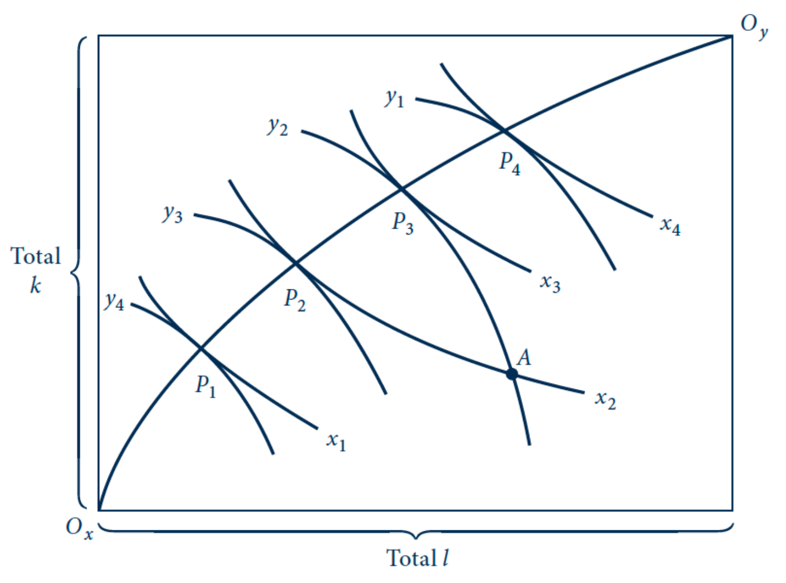
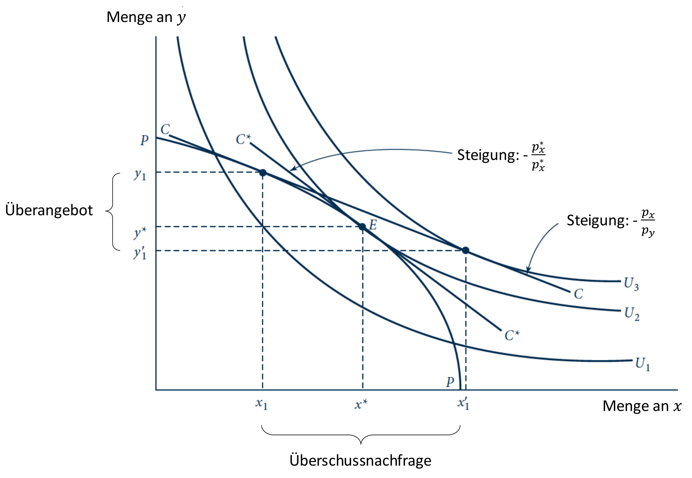
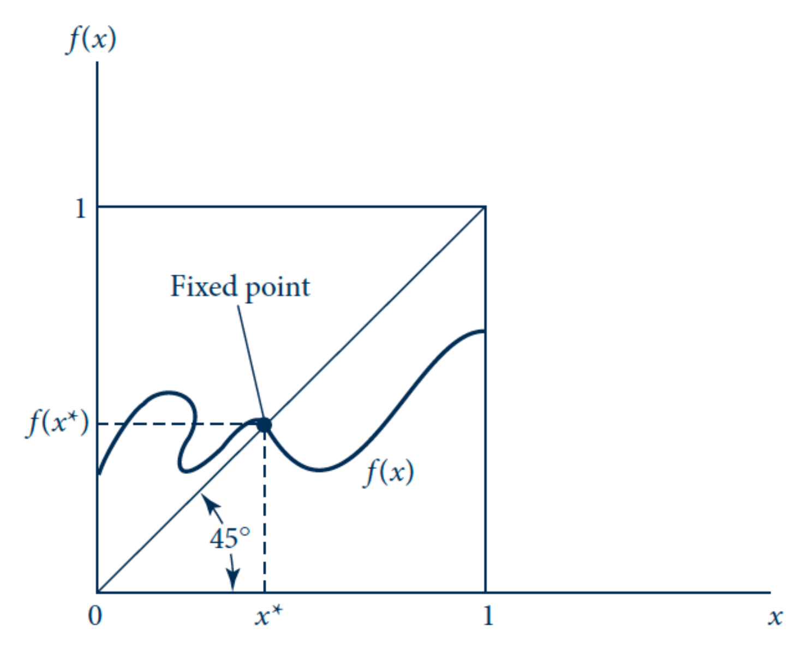

## Allgemeines Gleichgewicht (General Equilibrium)

- **Definition**: Simultane Analyse der Interaktion **aller Märkte** einer Volkswirtschaft.
    - Gegensatz: **Partialanalyse** (isoliert, ceteris paribus).
    - Fokus: **Rückkopplungseffekte** (Spillover) zwischen Märkten.
- **Interdependenzen (Beispiele)**:
    - **Crowding Out**: Fachkräftenachfrage Sektor A $\uparrow$ $\to$ Ressourcenabzug Sektor B $\to$ Produktivität B $\downarrow$.
    - **Landwirtschaft**: Löhne $\uparrow$ $\to$ Lebensmittelpreise $\uparrow$ $\to$ Nachfrageveränderung bei Industriegütern.
- **Ziel**: Ermittlung eines Preisvektors für simultanes **Market Clearing**.

## Tauschwirtschaft & Edgeworth-Box

- **Szenario**: Reine **Tauschwirtschaft** (2 Konsumenten, 2 Güter, fixe Gesamtmenge, keine Produktion).
- **Edgeworth-Box**: Grafische Analyse der Allokation.
    - **Dimensionen**: Breite/Höhe = Gesamtmenge Gut 1/2.
    - **Ursprünge**: $O_A$ (unten links), $O_B$ (oben rechts).
    - Punkt in Box = **vollständige Allokation**.
- **Tauschlogik**:
    - Start bei **Anfangsausstattung** ($\omega$).
    - Tausch bei **Pareto-Verbesserung** (mind. einer besser, keiner schlechter).
    - Ende bei Tangente der **Indifferenzkurven**.
- **Pareto-Effizienz im Tausch**:
    - Zustand ohne weitere mögliche Tauschgewinne.
    - Bedingung: Identische **Grenzrate der Substitution (MRS)**.
    - $MRS_A = MRS_B$.
- **Kontraktkurve**: Verbindungslinie aller Pareto-effizienten Punkte.

## Produktion im allgemeinen Gleichgewicht

- **Transformationskurve / Production Possibility Frontier (PPF)**:
    - **Maximaler Output** zweier Güter ($x, y$) bei gegebenen Ressourcen ($K, L$).
    - Geometrisch: Verbindung effizienter Input-Allokationen.
    - Verlauf: **Konkav** (abnehmende Grenzerträge).
- **Grenzrate der Transformation (MRT)**:
    - Steigung der PPF ($-dy/dx$).
    - Mass für **Opportunitätskosten** (Verzicht auf Gut $y$ für Gut $x$).
    - $MRT = MC_x/MC_y$.
- **Simultanes Gleichgewicht**:
    - Unternehmen: $p = MC \to MRT = p_x/p_y$.
    - Konsumenten: $MRS = p_x/p_y$.
    - **Gesamtgleichgewicht**: Produktionsstruktur entspricht Konsumwünschen.
    - Bedingung: $MRT = MRS = p_x/p_y$.
    - Grafisch: Steigung PPF = Steigung Indifferenzkurve.

## Mathematische Existenz des Gleichgewichts

- **Überschussnachfrage ($z(p)$)**:
    - Gesamtnachfrage minus Gesamtangebot (Ausstattung).
    - $z(p) = D(p) - S(p)$.
    - Gleichgewicht: $z(p^*) = 0$.
    - 
- **Walras' Gesetz**:
    - **Wert** der aggregierten Überschussnachfrage ist bei **jedem** Preissystem **Null**.
    - $p \cdot z(p) = 0$.
    - Grund: Budgetrestriktion (Ausgaben = Einnahmen).
    - Implikation: $n-1$ Märkte im Gleichgewicht $\to$ $n$-ter Markt im Gleichgewicht.
- **Existenzbeweis (Brouwer)**:
    - Nutzung stetiger Preisanpassungsfunktion.
    - Jede stetige Abbildung einer kompakten, konvexen Menge auf sich selbst hat einen **Fixpunkt**.
    - Fixpunkt = Gleichgewichtspreisvektor.
    - 

## Wohlfahrtstheoreme

### Erstes Wohlfahrtstheorem

- **Aussage**: Jedes **Walrasianische Gleichgewicht** ist **Pareto-effizient**.
- **Implikation**: Marktmechanismus führt unter idealen Bedingungen zu effizienter Allokation ("Unsichtbare Hand").
- **Voraussetzungen**:
    - Vollständiger Wettbewerb (**Preisnehmer**).
    - **Keine Externalitäten**.
    - Keine Informationsasymmetrien oder Marktmacht.
- **Funktion**: Preise als **Informationsträger** für Knappheit.

### Zweites Wohlfahrtstheorem

- **Aussage**: Jede **Pareto-effiziente Allokation** als Marktgleichgewicht realisierbar durch Anpassung der **Anfangsausstattungen**.
- **Implikation**: Trennung von **Effizienz** (Markt) und **Verteilung** (Politik).
- **Instrument**: **Pauschaltransfers** (Lump-Sum).
    - **Erbschaftssteuer**: Umverteilung von Vermögen bei Generationswechsel (bevor Marktteilnahme).
    - **Besteuerung der Ausstattung**: Z.B. auf unvermehrbaren Boden oder Fähigkeiten (theoretisch).
    - **Kopfprämie/Kopfsteuer**: Fixer Transfer unabhängig von Verhalten.
- **Problem**: Informationsdefizite erschweren verhaltensneutrale Umsetzung.

### Institutionelle Voraussetzungen

- Notwendig für funktionierende Märkte:
    - Klare **Eigentumsrechte**.
    - Vertragsfreiheit und Durchsetzung.
- **Empirie**: Positive Korrelation zwischen wirtschaftlicher Freiheit und Wohlstand (BIP/Kopf).
